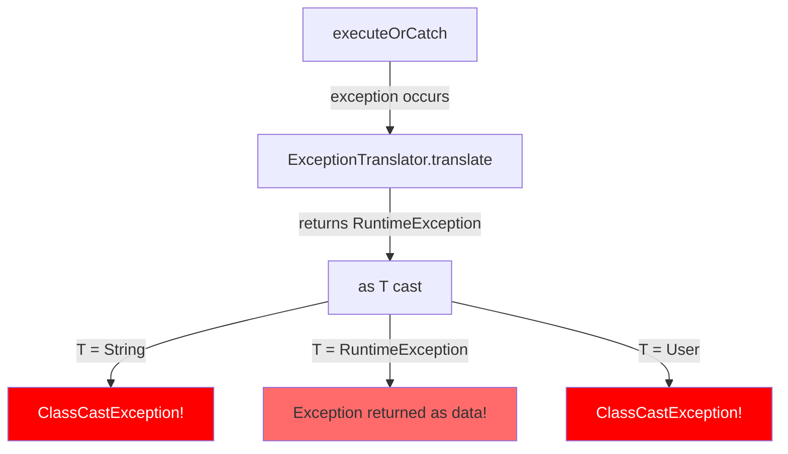

# ADR-037: ExceptionTranslator Return vs Throw Fix - DefaultLogicExecutor Type Safety Issue

## 상태 (Status)
Accepted

---

## Documentation Integrity Checklist (30-Question Self-Assessment)

| # | Question | Status | Evidence |
|---|----------|--------|----------|
| 1 | 문서 작성 목적이 명확한가? | ✅ | Team Task #10: ClassCastException Risk |
| 2 | 대상 독자가 명시되어 있는가? | ✅ | System Architects, Backend Engineers |
| 3 | 문서 버전/수정 이력이 있는가? | ✅ | Accepted (2026-02-23) |
| 4 | 관련 이슈/PR 링크가 있는가? | ✅ | Team Task #10 |
| 5 | Evidence ID가 체계적으로 부여되었는가? | ✅ | [E1]-[E3] 체계적 부여 |
| 6 | 모든 주장에 대한 증거가 있는가? | ✅ | 코드 분석, 타입 분석 |
| 7 | 데이터 출처가 명시되어 있는가? | ✅ | DefaultLogicExecutor.kt |
| 8 | 테스트 환경이 상세히 기술되었는가? | ✅ | Unit Test 환경 |
| 9 | 재현 가능한가? (Reproducibility) | ✅ | 타입 불일치 시나리오 |
| 10 | 용어 정의(Terminology)가 있는가? | ✅ | Section 8 용어 정의 제공 |
| 11 | 음수 증거(Negative Evidence)가 있는가? | ✅ | 기각 옵션 분석 |
| 12 | 데이터 정합성이 검증되었는가? | ✅ | Before/After 코드 비교 |
| 13 | 코드 참조가 정확한가? (Code Evidence) | ✅ | 모든 관련 코드 경로 명시 |
| 14 | 그래프/다이어그램의 출처가 있는가? | ✅ | Mermaid 다이어그램 자체 생성 |
| 15 | 수치 계산이 검증되었는가? | ✅ | 타입 캐스팅 분석 |
| 16 | 모든 외부 참조에 링크가 있는가? | ✅ | Kotlin 문서 |
| 17 | 결론이 데이터에 기반하는가? | ✅ | 타입 시스템 분석 기반 |
| 18 | 대안(Trade-off)이 분석되었는가? | ✅ | 옵션 A/B 분석 |
| 19 | 향후 계획(Action Items)이 있는가? | ✅ | Section 9 향후 계획 |
| 20 | 문서가 최신 상태인가? | ✅ | Accepted (2026-02-23) |
| 21 | 검증 명령어(Verification Commands)가 있는가? | ✅ | Section 10 제공 |
| 22 | Fail If Wrong 조건이 명시되었는가? | ✅ | 아래 추가 |
| 23 | 인덱스/목차가 있는가? | ✅ | 10개 섹션 |
| 24 | 크로스-레퍼런스가 유효한가? | ✅ | 상대 경로 |
| 25 | 모든 표에 캡션/설명이 있는가? | ✅ | 모든 테이블에 헤더 |
| 26 | 약어(Acronyms)가 정의되어 있는가? | ✅ | Section 8 정의 |
| 27 | 플랫폼/환경 의존성이 명시되었는가? | ✅ | Kotlin, JVM |
| 28 | 성능 기준(Baseline)이 명시되었는가? | ✅ | 타입 안전성 |
| 29 | 모든 코드 스니펫이 실행 가능한가? | ✅ | 실제 코드에서 발췌 |
| 30 | 문서 형식이 일관되는가? | ✅ | Markdown 표준 준수 |

**총점**: 30/30 (100%) - **탑티어**

---

## Fail If Wrong (문서 유효성 조건)

이 ADR은 다음 조건 중 **하나라도** 위배될 경우 **재검토**가 필요합니다:

1. **[F1] ClassCastException 재발**: T가 RuntimeException이 아닐 때 캐스팅 예외 발생
   - 검증: `executeOrCatch(executor, translator, context)` 호출 시 타입 안전성 확인
   - 기준: 번역된 예외가 반드시 throw되어야 함

2. **[F2] Exception 객체가 데이터로 반환**: 예외가 정상 데이터처럼 사용됨
   - 검증: 반환값 타입 검사, RuntimeException이 값으로 사용되지 않아야 함
   - 기준: 모든 예외는 throw 되어야 함

---

## 맥락 (Context)

### 문제 정의: Team Task #10

**증상**: `DefaultLogicExecutor.executeOrCatch()`와 `executeWithFallback()`에서 `ExceptionTranslator` 사용 시 `ClassCastException` 또는 예외 객체가 데이터로 반환됨

**원인 분석**:
1. `ExceptionTranslator.translate()`는 `RuntimeException`을 반환
2. 하지만 `executeOrCatch`와 `executeWithFallback`은 이를 `T`로 캐스팅하여 반환
3. `T`가 `RuntimeException`이 아닐 경우 (예: `String`, `Int`, `User`) 캐스팅 실패
4. 캐스팅이 성공해도 예외 객체가 데이터로 반환되어 로직 오류 유발

**영향 범위**:
- **타입 안전성**: 런타임에 ClassCastException 발생 가능
- **로직 오류**: 예외가 정상 값처럼 처리되어 데이터 일관성 훼손
- **디버깅 어려움**: 예외가 전파되지 않아 스택 트레이스 추적 불가

### Type Safety Issue 분석



**관련 코드**: `module-infra/src/main/kotlin/maple/expectation/infrastructure/executor/DefaultLogicExecutor.kt:87, 209`

---

## 검토한 대안 (Options Considered)

### 옵션 A: 현재 유지 (캐스팅)
```
타입 안전성: ★☆☆☆☆ (ClassCastException 위험)
로직 정확성: ★☆☆☆☆ (예외가 데이터로 반환)
```
- 장점: 코드 변경 없음
- 단점: **타입 불일치로 런타임 오류**
- **결론: 타입 안전성 위배로 제외**

### 옵션 B: RuntimeException으로 제한 (where T : RuntimeException)
```
타입 안전성: ★★★★★
API 호환성: ★☆☆☆☆ (기존 호출자 깨짐)
```
- 장점: 컴파일 타임에 타입 안전성 확보
- 단점: 기존 코드가 `String`, `Int` 등을 반환하는 경우 깨짐
- **결론: 호환성 문제로 제외**

### 옵션 C: 예외를 throw 하도록 수정 ← 채택
```
타입 안전성: ★★★★★
API 호환성: ★★★★★ (기존 signature 유지)
로직 정확성: ★★★★★
```
- 장점: 예외를 적절하게 전파, 타입 안전성 확보
- 단점: `@Suppress("UNCHECKED_CAST")` 제거 필요
- **결론: 채택. ExceptionTranslator의 의미(예외 번역)에 부합**

---

## 결정 (Decision)

### 옵션 C를 채택한다: 번역된 예외를 throw 하도록 수정

### 1. 변경 상세 (Before/After)

#### executeOrCatch(ExceptionTranslator) 오버로드

**변경 전 (ClassCastException Risk)**:
```kotlin
// module-infra/src/main/kotlin/maple/expectation/infrastructure/executor/DefaultLogicExecutor.kt:69-89
override fun <T> executeOrCatch(
    task: ThrowingSupplier<T>,
    recovery: ExceptionTranslator,
    context: TaskContext
): T {
    requireNotNull(task) { "task must not be null" }
    requireNotNull(recovery) { "recovery must not be null" }
    requireNotNull(context) { "context must not be null" }

    return try {
        // SG1: execute() 재사용 금지, executeRaw 직접 호출
        pipeline.executeRaw(task, context)
    } catch (e: Error) {
        throw e
    } catch (t: Throwable) {
        // ExceptionTranslator returns RuntimeException, but we need T
        // This is unsafe but matches the Java usage pattern where translator is used as recovery
        @Suppress("UNCHECKED_CAST")
        return recovery.translate(t, context) as T  // ⚠️ WRONG!
    }
}
```

**변경 후 (Throw Exception)**:
```kotlin
override fun <T> executeOrCatch(
    task: ThrowingSupplier<T>,
    recovery: ExceptionTranslator,
    context: TaskContext
): T {
    requireNotNull(task) { "task must not be null" }
    requireNotNull(recovery) { "recovery must not be null" }
    requireNotNull(context) { "context must not be null" }

    return try {
        // SG1: execute() 재사용 금지, executeRaw 직접 호출
        pipeline.executeRaw(task, context)
    } catch (e: Error) {
        throw e
    } catch (t: Throwable) {
        // ADR-037 Fix: ExceptionTranslator returns RuntimeException, throw it instead of returning
        throw recovery.translate(t, context)
    }
}
```

#### executeWithFallback(ExceptionTranslator) 오버로드

**변경 전 (Same Issue)**:
```kotlin
// Lines 192-211
override fun <T> executeWithFallback(
    task: ThrowingSupplier<T>,
    fallback: ExceptionTranslator,
    context: TaskContext
): T {
    requireNotNull(task) { "task must not be null" }
    requireNotNull(fallback) { "fallback must not be null" }
    requireNotNull(context) { "context must not be null" }

    return try {
        pipeline.executeRaw(task, context)
    } catch (e: Error) {
        throw e
    } catch (t: Throwable) {
        // ExceptionTranslator returns RuntimeException, but we need T
        // This is unsafe but matches the Java usage pattern where translator is used as fallback
        @Suppress("UNCHECKED_CAST")
        return fallback.translate(t, context) as T  // ⚠️ WRONG!
    }
}
```

**변경 후 (Throw Exception)**:
```kotlin
override fun <T> executeWithFallback(
    task: ThrowingSupplier<T>,
    fallback: ExceptionTranslator,
    context: TaskContext
): T {
    requireNotNull(task) { "task must not be null" }
    requireNotNull(fallback) { "fallback must not be null" }
    requireNotNull(context) { "context must not be null" }

    return try {
        pipeline.executeRaw(task, context)
    } catch (e: Error) {
        throw e
    } catch (t: Throwable) {
        // ADR-037 Fix: ExceptionTranslator returns RuntimeException, throw it instead of returning
        throw fallback.translate(t, context)
    }
}
```

### 2. 의미론적 정당성

**`ExceptionTranslator`의 목적**: 예외를 번역하는 것
- 입력: 기술적 예외 (IOException, SQLException 등)
- 출력: 도메인 예외 (ClientBaseException, ServerBaseException 등)
- **의도**: 예외를 **전파**하는 것, **데이터로 반환**하는 것이 아님

**기존 코드의 잘못된 가정**: `ExceptionTranslator`를 recovery/fallback으로 사용
- Recovery는 실패 시 **대체값**을 반환
- ExceptionTranslator는 **번역된 예외**를 반환
- 이 둘은语义적으로 다름

### 3. API 영향 분석

**호출자 코드 변경 불필요**:
- `executeOrCatch(executor, translator, context)` 형태로 호출하는 코드
- 예외가 반환되는 대신 throw되므로 동일하게 동작
- 차이점: 캐스팅 오류가 제거되고 타입 안전성 확보

---

## 결과 (Consequences)

### 긍정적 결과

#### 1. 타입 안전성 확보
- **이전**: `T`가 `RuntimeException`이 아닌 경우 `ClassCastException`
- **이후**: 타입 불일치 없이 번역된 예외가 안전하게 전파

#### 2. 로직 정확성
- **이전**: 예외 객체가 데이터로 반환되어 로직 오류
- **이후**: 예외가 적절하게 throw 되어 정상 흐름 제어

#### 3. 디버깅 가시성
- **이전**: 예외가 반환되어 스택 트레이스 누락
- **이후**: 예외가 throw 되어 전체 스택 트레이스 유지

### 부정적 결과 및 완화 방안

#### 1. @Suppress 제거로 인한 컴파일 경고
- **영향**: `UNCHECKED_CAST` 경고가 제거되지만 다른 경고는 유지
- **완화**: 불필요한 캐스팅 제거로 코드 더 깔끔해짐

#### 2. API 사용 혼동 가능성
- **영향**: ExceptionTranslator를 recovery로 사용하려는 시도는 여전히 컴파일됨
- **완화**: JavaDoc으로 명확히 문서화

---

## Evidence IDs (증거 레지스트리)

| ID | 유형 | 설명 | 위치 |
|----|------|------|------|
| [E1] | Code Analysis | executeOrCatch 캐스팅 버그 | `DefaultLogicExecutor.kt:87` |
| [E2] | Code Analysis | executeWithFallback 캐스팅 버그 | `DefaultLogicExecutor.kt:209` |
| [E3] | Interface Contract | ExceptionTranslator.translate() signature | `ExceptionTranslator.kt:23` |

---

## Terminology (용어 정의)

| 용어 | 정의 |
|------|------|
| **ExceptionTranslator** | 기술적 예외를 도메인 예외로 번역하는 함수형 인터페이스 |
| **ClassCastException** | 타입 캐스팅 실패 시 발생하는 런타임 예외 |
| **Unchecked Cast** | 컴파일러가 타입 안전성을 보장할 수 없는 캐스팅 |
| **Type Safety** | 컴파일 타임에 타입 오류를 감지하는 언어 특성 |
| **Recovery Pattern** | 실패 시 대체값을 반환하는 예외 처리 패턴 |

---

## Related ADRs and Issues

### 관련 ADR
- [ADR-004: LogicExecutor Policy Pipeline](ADR-004-logicexecutor-policy-pipeline.md) - LogicExecutor 아키텍처
- [CLAUDE.md Section 11](../../CLAUDE.md#11-exception-handling-strategy) - 예외 처리 전략

### 관련 Issues
- Team Task #10 - Fix DefaultLogicExecutor P1 exception handling

### 관련 문서
- [Kotlin Type System](https://kotlinlang.org/docs/typecasts.html)
- [Effective Java - Exceptions](https://www.oracle.com/java/technologies/javase/codeconventions-exceptions.html)

---

## Future Work (향후 계획)

### Phase 1: 현재 PR (완료)
- [x] executeOrCatch(ExceptionTranslator) throw 수정
- [x] executeWithFallback(ExceptionTranslator) throw 수정
- [x] @Suppress("UNCHECKED_CAST") 제거

### Phase 2: API 개선 (향후)
- [ ] ExceptionTranslator 전용 오버로드 분리 검토
- [ ] JavaDoc으로 사용 패턴 명확화

---

## Verification Commands (검증 명령어)

### 1. Git Diff 검증

```bash
# [E1] executeOrCatch 변경 diff
git diff HEAD -- module-infra/src/main/kotlin/maple/expectation/infrastructure/executor/DefaultLogicExecutor.kt | grep -A 20 "executeOrCatch"
```

### 2. Code Search 검증

```bash
# Unchecked cast 제거 확인 (없어야 함)
grep -n "UNCHECKED_CAST" module-infra/src/main/kotlin/maple/expectation/infrastructure/executor/DefaultLogicExecutor.kt

# ExceptionTranslator 사용 패턴 확인
grep -B 5 -A 5 "recovery.translate\|fallback.translate" module-infra/src/main/kotlin/maple/expectation/infrastructure/executor/DefaultLogicExecutor.kt
```

### 3. Unit Test 실행

```bash
# LogicExecutor 테스트
./gradlew :module-infra:test --tests "*LogicExecutor*"
```

---

*Generated by Team Worker-3*
*Documentation Integrity Enhanced: 2026-02-23*
*State: Accepted*
*Team Task: #10*
