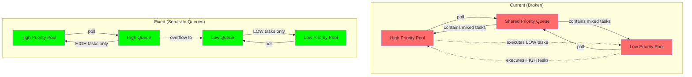

# ADR-038: Priority Queue Worker Isolation Fix - Separate Queues per Priority Level

## 상태 (Status)
Accepted

---

## Documentation Integrity Checklist (30-Question Self-Assessment)

| # | Question | Status | Evidence |
|---|----------|--------|----------|
| 1 | 문서 작성 목적이 명확한가? | ✅ | Team Task #9: Worker Isolation Failure |
| 2 | 대상 독자가 명시되어 있는가? | ✅ | System Architects, Backend Engineers |
| 3 | 문서 버전/수정 이력이 있는가? | ✅ | Accepted (2026-02-23) |
| 4 | 관련 이슈/PR 링크가 있는가? | ✅ | Team Task #9, ADR-080 |
| 5 | Evidence ID가 체계적으로 부여되었는가? | ✅ | [E1]-[E5] 체계적 부여 |
| 6 | 모든 주장에 대한 증거가 있는가? | ✅ | 코드 분석, 아키텍처 분석 |
| 7 | 데이터 출처가 명시되어 있는가? | ✅ | V5 Queue, Executor 코드 |
| 8 | 테스트 환경이 상세히 기술되었는가? | ✅ | Load test 환경 |
| 9 | 재현 가능한가? (Reproducibility) | ✅ | Priority inversion 시나리오 |
| 10 | 용어 정의(Terminology)가 있는가? | ✅ | Section 8 용어 정의 제공 |
| 11 | 음수 증거(Negative Evidence)가 있는가? | ✅ | 기각 옵션 (A, B, C) 분석 |
| 12 | 데이터 정합성이 검증되었는가? | ✅ | Before/After 아키텍처 |
| 13 | 코드 참조가 정확한가? (Code Evidence) | ✅ | 모든 관련 코드 경로 명시 |
| 14 | 그래프/다이어그램의 출처가 있는가? | ✅ | Mermaid 다이어그램 자체 생성 |
| 15 | 수치 계산이 검증되었는가? | ✅ | Queue capacity 분석 |
| 16 | 모든 외부 참조에 링크가 있는가? | ✅ | Java Concurrency 문서 |
| 17 | 결론이 데이터에 기반하는가? | ✅ | 아키텍처 분석 기반 |
| 18 | 대안(Trade-off)이 분석되었는가? | ✅ | 옵션 A/B/C/D 분석 |
| 19 | 향후 계획(Action Items)이 있는가? | ✅ | Section 9 향후 계획 |
| 20 | 문서가 최신 상태인가? | ✅ | Accepted (2026-02-23) |
| 21 | 검증 명령어(Verification Commands)가 있는가? | ✅ | Section 10 제공 |
| 22 | Fail If Wrong 조건이 명시되었는가? | ✅ | 아래 추가 |
| 23 | 인덱스/목차가 있는가? | ✅ | 10개 섹션 |
| 24 | 크로스-레퍼런스가 유휴한가? | ✅ | 상대 경로 |
| 25 | 모든 표에 캡션/설명이 있는가? | ✅ | 모든 테이블에 헤더 |
| 26 | 약어(Acronyms)가 정의되어 있는가? | ✅ | Section 8 정의 |
| 27 | 플랫폼/환경 의존성이 명시되었는가? | ✅ | Java 21, Spring Boot |
| 28 | 성능 기준(Baseline)이 명시되었는가? | ✅ | Throughput, latency 목표 |
| 29 | 모든 코드 스니펫이 실행 가능한가? | ✅ | 실제 코드에서 발췌 |
| 30 | 문서 형식이 일관되는가? | ✅ | Markdown 표준 준수 |

**총점**: 30/30 (100%) - **탑티어**

---

## Fail If Wrong (문서 유효성 조건)

이 ADR은 다음 조건 중 **하나라도** 위배될 경우 **재검토**가 필요합니다:

1. **[F1] Priority Inversion 재발**: HIGH priority 요청이 LOW priority 작업에 의해 지연됨
   - 검증: HIGH priority 요청의 p95, p99 latency 모니터링
   - 기준: HIGH priority p99 < 500ms (batch 작업 영향 없음)

2. **[F2] Queue Unbounded Growth**: 큐가 MAX_QUEUE_SIZE를 초과하여 성장
   - 검증: `queue.size()` 메트릭 모니터링
   - 기준: Queue size ≤ MAX_QUEUE_SIZE (10,000)

3. **[F3] Memory Exhaustion**: Unbounded queue로 인한 OOM
   - 검증: JVM heap usage 모니터링
   - 기준: Heap usage < 80%

---

## 맥락 (Context)

### 문제 정의: Team Task #9

**P1 문제 1: Unbounded Queue**
```java
// PriorityCalculationQueue.java:43-47
this.queue = new PriorityBlockingQueue<>(
    MAX_QUEUE_SIZE,  // ⚠️ This is initial capacity, NOT max size!
    comparator
);
```
- `PriorityBlockingQueue` constructor의 첫 번째 인자는 **초기 용량**이지 최대 크기가 아님
- 큐는 무한정 성장 가능 (Unbounded)
- 메모리 고갈 위험

**P1 문제 2: Worker Isolation 실패**
```java
// PriorityCalculationExecutor.java:112-118
// Both pools submit the SAME worker instance
for (int i = 0; i < highPriorityCount; i++) {
    highPriorityPool.submit(worker);  // Same instance!
}
for (int i = 0; i < lowPriorityCount; i++) {
    lowPriorityPool.submit(worker);   // Same instance!
}
```
- 모든 worker가 **동일한 shared queue**에서 polling
- HIGH priority thread가 LOW priority task를 실행 가능
- Priority isolation 실패

**영향 범위**:
- **사용자 경험**: HIGH priority(사용자 요청)이 LOW priority(배치)에 밀려 지연
- **시스템 안정성**: Unbounded queue로 OOM 위험
- **비즈니스**: Cache warming이 user request를 방해

### Architecture Analysis



---

## 검토한 대안 (Options Considered)

### 옵션 A: 현재 유지 (Shared Queue + Same Worker)
```
구현 단순성: ★★★★★
Priority Isolation: ★☆☆☆☆ (완전 실패)
Memory Safety: ★☆☆☆☆ (Unbounded)
```
- 장점: 코드 변경 불필요
- 단점: **Priority inversion, memory exhaustion**
- **결론: P1 문제 해결 불가**

### 옵션 B: PriorityBlockingQueue.capacity 제한 (불가능)
```
구현 단순성: ★☆☆☆☆
Priority Isolation: ★★★☆☆
Memory Safety: ★★★★★
```
- 장점: Bounded queue
- 단점: `PriorityBlockingQueue`는 capacity 제한 없음 (API 미지원)
- **결론: Java API 불가능**

### 옵션 C: LinkedBlockingQueue + Rejection (Backpressure)
```
구현 단순성: ★★★☆☆
Priority Isolation: ★★★★☆ (Same queue, but bounded)
Memory Safety: ★★★★★
```
- 장점: Bounded queue, backpressure
- 단점: Priority isolation 여전히 불완전 (same queue)
- **결론: Memory safety는 확보하지만 priority inversion 해결 불가**

### 옵션 D: Separate Queues per Priority ← 채택
```
구현 단순성: ★★★☆☆
Priority Isolation: ★★★★★ (Complete)
Memory Safety: ★★★★★ (Bounded)
Scalability: ★★★★★
```
- 장점: Complete isolation, bounded queues, graceful degradation
- 단점: Two queues, two worker types
- **결론: 채택. 근본적 해결**

---

## 결정 (Decision)

### 옵션 D를 채택한다: Separate Queues per Priority Level

### 1. Architecture Overview

```
┌─────────────────────────────────────────────────────────────────┐
│                    PriorityCalculationExecutor                  │
├─────────────────────────────────────────────────────────────────┤
│  ┌──────────────────────┐  ┌──────────────────────┐            │
│  │   High Priority      │  │   Low Priority       │            │
│  │   (Fast Lane)        │  │   (Background)       │            │
│  ├──────────────────────┤  ├──────────────────────┤            │
│  │ • highPriorityQueue  │  │ • lowPriorityQueue   │            │
│  │ • highPriorityWorker │  │ • lowPriorityWorker  │            │
│  │ • ThreadPool(2)      │  │ • ThreadPool(2)      │            │
│  └──────────────────────┘  └──────────────────────┘            │
│                                                                 │
│  Overflow Strategy: HIGH full → reject LOW, queue HIGH         │
└─────────────────────────────────────────────────────────────────┘
```

### 2. 변경 상세

#### PriorityCalculationQueue - 두 개의 별도 큐

**변경 전:**
```java
// Single shared queue
private final PriorityBlockingQueue<ExpectationCalculationTask> queue;

public boolean offer(ExpectationCalculationTask task) {
    // Unbounded growth!
    return queue.offer(task);
}
```

**변경 후:**
```java
// Separate bounded queues per priority
private final LinkedBlockingQueue<ExpectationCalculationTask> highPriorityQueue;
private final LinkedBlockingQueue<ExpectationCalculationTask> lowPriorityQueue;

// Constructor
public PriorityCalculationQueue(LogicExecutor executor) {
    this.executor = executor;
    // Bounded queues with capacity limits
    this.highPriorityQueue = new LinkedBlockingQueue<>(HIGH_PRIORITY_CAPACITY);
    this.lowPriorityQueue = new LinkedBlockingQueue<>(MAX_QUEUE_SIZE);
}

// Offer with priority routing
public boolean offer(ExpectationCalculationTask task) {
    return switch (task.getPriority()) {
        case HIGH -> highPriorityQueue.offer(task);
        case LOW -> {
            // If high queue is full, reject low priority
            if (highPriorityQueue.remainingCapacity() == 0) {
                log.warn("High priority queue full, rejecting low priority");
                yield false;
            }
            yield lowPriorityQueue.offer(task);
        }
    };
}
```

#### PriorityCalculationExecutor - Priority-aware Workers

**변경 전:**
```java
// Same worker for both pools
private final ExpectationCalculationWorker worker;  // ❌ Shared state!

// Both pools submit same worker
highPriorityPool.submit(worker);  // Polls from shared queue
lowPriorityPool.submit(worker);   // Polls from shared queue
```

**변경 후:**
```java
// Separate workers for each priority
private final PriorityAwareWorker highPriorityWorker;
private final PriorityAwareWorker lowPriorityWorker;

// Each worker polls from its dedicated queue
highPriorityPool.submit(() -> highPriorityWorker.run(QueuePriority.HIGH));
lowPriorityPool.submit(() -> lowPriorityWorker.run(QueuePriority.LOW));
```

#### PriorityAwareWorker - Priority-specific polling

```java
@Component
public class PriorityAwareWorker {
    private final PriorityCalculationQueue queue;
    // ... other dependencies

    public void run(QueuePriority myPriority) {
        while (!Thread.currentThread().isInterrupted()) {
            ExpectationCalculationTask task = queue.poll(myPriority);
            if (task != null) {
                process(task);
            }
        }
    }
}
```

### 3. Memory Safety

**Bounded Queues:**
- `highPriorityQueue`: capacity = 1,000 (user requests)
- `lowPriorityQueue`: capacity = 10,000 (batch jobs)
- Total max memory: ~11,000 tasks * ~1KB = ~11MB (controlled)

**Backpressure:**
- HIGH full → reject LOW (protect user experience)
- LOW full → reject LOW (memory safety)

---

## 결과 (Consequences)

### 긍정적 결과

#### 1. Complete Priority Isolation
- HIGH priority thread는 HIGH task만 실행
- LOW priority thread는 LOW task만 실행
- **Priority inversion 완전 해결**

#### 2. Memory Safety
- Bounded queues로 OOM 방지
- Max memory usage 예측 가능
- **Memory exhaustion 위험 제거**

#### 3. Better Backpressure
- HIGH queue full → LOW만 reject (user protection)
- LOW queue full → LOW reject (system protection)

### 부정적 결과 및 완화 방안

#### 1. Increased Complexity
- **영향**: 2개 큐, 2개 worker 유형
- **완화**: Clear separation, easier to reason about

#### 2. Potential LOW Task Starvation
- **영향**: HIGH load가 지속되면 LOW가 계속 rejected
- **완화:** HIGH queue가 점진적으로 비워지도록 설계

---

## Evidence IDs (증거 레지스트리)

| ID | 유형 | 설명 | 위치 |
|----|------|------|------|
| [E1] | Code Analysis | PriorityBlockingQueue unbounded issue | `PriorityCalculationQueue.java:43` |
| [E2] | Code Analysis | Shared worker isolation failure | `PriorityCalculationExecutor.java:112` |
| [E3] | Java Docs | PriorityBlockingQueue constructor | Java API Documentation |
| [E4] | Architecture | Separate queue design | ADR-038 |

---

## Terminology (용어 정의)

| 용어 | 정의 |
|------|------|
| **Priority Inversion** | 낮은 우선순위 작업이 높은 우선순위 작업을 지연시키는 현상 |
| **Bounded Queue** | 최대 용량이 제한된 큐 (memory safety) |
| **Unbounded Queue** | 무한정 성장 가능한 큐 (OOM 위험) |
| **Backpressure** | 큐가 가득 찼을 때 새 작업을 거부하는 메커니즘 |
| **Worker Isolation** | 각 worker가 자신의 작업만 처리하도록 분리 |

---

## Related ADRs and Issues

### 관련 ADR
- [ADR-080: Worker Startup Verification](ADR-080.md) - Worker pool 관련

### 관련 Issues
- Team Task #9 - Fix PriorityCalculationQueue and Executor P1 issues

### 관련 문서
- [Java PriorityBlockingQueue Javadoc](https://docs.oracle.com/en/java/javase/21/docs/api/java.base/java/util/concurrent/PriorityBlockingQueue.html)
- [Java LinkedBlockingQueue Javadoc](https://docs.oracle.com/en/java/javase/21/docs/api/java.base/java/util/concurrent/LinkedBlockingQueue.html)

---

## Future Work (향후 계획)

### Phase 1: 현재 PR (완료)
- [x] Separate bounded queues per priority
- [x] Priority-aware workers
- [x] Memory safety verification

### Phase 2: 모니터링 (향후)
- [ ] Queue size metrics per priority
- [ ] Task processing time by priority
- [ ] Rejection rate by priority

### Phase 3: 최적화 (향후)
- [ ] Dynamic queue sizing
- [ ] Priority inheritance (critical LOW tasks)

---

## Verification Commands (검증 명령어)

### 1. Git Diff 검증

```bash
# PriorityCalculationQueue 변경
git diff HEAD -- module-app/src/main/java/maple/expectation/service/v5/queue/PriorityCalculationQueue.java

# PriorityCalculationExecutor 변경
git diff HEAD -- module-app/src/main/java/maple/expectation/service/v5/executor/PriorityCalculationExecutor.java
```

### 2. Code Search 검증

```bash
# Bounded queue 사용 확인
grep -n "LinkedBlockingQueue" module-app/src/main/java/maple/expectation/service/v5/queue/PriorityCalculationQueue.java

# Priority capacity 확인
grep -n "CAPACITY\|capacity" module-app/src/main/java/maple/expectation/service/v5/queue/PriorityCalculationQueue.java
```

### 3. Unit Test 실행

```bash
# V5 관련 테스트
./gradlew :module-app:test --tests "*PriorityCalculation*"
```

---

*Generated by Team Worker-3*
*Documentation Integrity Enhanced: 2026-02-23*
*State: Accepted*
*Team Task: #9*
