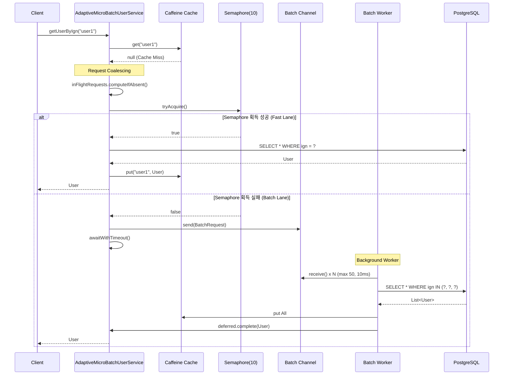

# ADR-338: 적응형 마이크로 배칭(Adaptive Micro-Batching) 조회 로직

## 메타데이터

| 항목 | 값 |
|------|-----|
| 상태 | 수락됨 (Accepted) |
| 결정일 | 2026-03-11 |
| 결정자 | probabilistic-valuation-engine Team |
| 검토자 | Architecture Review Board |
| 관련 이슈 | #588 |
| 선행 ADR | ADR-004 Collect/Compute/Serve, ADR-005 SingleFlight Hot Key |

---

## 1. 배경 (Context)

### 문제 상황

PostgreSQL 단일 DB 아키텍처로 전환 후, Cache Stampede 상황에서 DB 커넥션 고갈 위험 존재:

```
┌─────────────────────────────────────────────────────────────────┐
│                    Cache Stampede 시나리오                       │
│  ┌────────┐  ┌────────┐  ┌────────┐       ┌──────────────────┐ │
│  │ Req 1  │  │ Req 2  │  │ Req N  │  ──>  │   DB Connection  │ │
│  │(Cache  │  │(Cache  │  │(Cache  │       │     Pool (10)    │ │
│  │ Miss)  │  │ Miss)  │  │ Miss)  │       │                  │ │
│  └────────┘  └────────┘  └────────┘       │  ⚠️ POOL EXHAUST │ │
│       │           │           │           └──────────────────┘ │
│       ▼           ▼           ▼                                  │
│  ┌─────────────────────────────────┐                             │
│  │   1000 RPS × N Duplicate Keys   │                             │
│  │   = DB Overload & Timeout       │                             │
│  └─────────────────────────────────┘                             │
└─────────────────────────────────────────────────────────────────┘
```

### 기존 SingleFlightExecutor 한계

| 항목 | 한계 |
|------|------|
| **동시성 제어** | Semaphore 없음 - 무제한 DB 동시 쿼리 |
| **처리량 방어** | Batch Lane 없음 - 모든 요청이 단건 쿼리 |
| **DB 부하** | 1000 RPS 시 최대 1000개 동시 쿼리 가능 |

### 트래픽 패턴 분석

| 시나리오 | QPS | 요구사항 |
|----------|-----|----------|
| **Low Traffic** | < 100 | 초저지연 단건 조회 (Fast Lane) |
| **High Traffic** | > 500 | 처리량 방어 (Batch Lane) |
| **Cache Stampede** | 1000+ | DB 커넥션 보호 |

---

## 2. 결정 (Decision)

**적응형 라우팅(Adaptive Routing) 메커니즘을 도입하여 Fast Lane과 Batch Lane으로 분기한다.**

### 핵심 설계 원칙

1. **이중 레벨 Request Coalescing**
   - Level 1: 동일 `ign` 요청 → `CompletableDeferred`로 병합
   - Level 2: Semaphore 초과 요청 → Batch Channel로 라우팅

2. **Semaphore 기반 적응형 분기**
   ```
   tryAcquire() 성공 → Fast Lane (단건 쿼리, 즉시 응답)
   tryAcquire() 실패 → Batch Lane (Channel 적재, 워커 처리)
   ```

3. **코루틴 기반 논블로킹 배칭**
   - `Channel<BatchRequest>`: 배치 큐
   - `CompletableDeferred<User?>`: 결과 Promise
   - 백그라운드 워커: 10ms 대기 또는 50개 도달 시 배치 실행

---

## 3. 대안 (Alternatives)

### A. 현상 유지 (SingleFlightExecutor만 사용)

**장점:**
- 변경 비용 없음

**단점:**
- DB 커넥션 무제한 사용
- Cache Stampede 시 장애

**평가:** ❌ 단일 DB 아키텍처에서 위험

### B. 적응형 마이크로 배칭 (선택됨)

**장점:**
- 평시 초저지연 보장 (Fast Lane)
- 트래픽 폭주 시 처리량 방어 (Batch Lane)
- DB 커넥션 보호

**단점:**
- 구현 복잡도 증가
- Batch Lane에서 추가 지연 (최대 10ms)

**평가:** ✅ 단일 DB 아키텍처에 최적

### C. 전량 배칭 (모든 요청을 배치로 처리)

**장점:**
- 구현 단순

**단점:**
- 평시에도 지연 발생 (최소 10ms 대기)
- Low Traffic 시 불필요한 오버헤드

**평가:** ⚠️ 과도한 접근

---

## 4. 기술적 구현 (Implementation)

### 아키텍처 다이어그램

```
┌─────────────────────────────────────────────────────────────────────────────┐
│                      AdaptiveMicroBatchUserService                          │
│                                                                             │
│  ┌──────────────────────────────────────────────────────────────────────┐  │
│  │                        Request Coalescing (L1)                        │  │
│  │  ┌─────────┐     ┌──────────────────────────────────────────────┐    │  │
│  │  │ Caffeine│     │    inFlightRequests: Map<IGN, Deferred>      │    │  │
│  │  │  Cache  │────> │    (동일 IGN 요청 병합)                      │    │  │
│  │  └─────────┘     └──────────────────────────────────────────────┘    │  │
│  └──────────────────────────────────────────────────────────────────────┘  │
│                                      │                                      │
│                                      │ Cache Miss                           │
│                                      ▼                                      │
│  ┌──────────────────────────────────────────────────────────────────────┐  │
│  │                     Adaptive Routing (Semaphore)                      │  │
│  │                                                                       │  │
│  │   semaphore.tryAcquire() ─────┬─────────────────────────────────┐    │  │
│  │                               │                                  │    │  │
│  │        ┌──────────────────────┴──────────────┐                  │    │  │
│  │        ▼                                     ▼                  │    │  │
│  │   ┌─────────────┐                    ┌─────────────────┐        │    │  │
│  │   │  Fast Lane  │                    │   Batch Lane    │        │    │  │
│  │   │ (Immediate) │                    │   (Channel)     │        │    │  │
│  │   │             │                    │                 │        │    │  │
│  │   │ SELECT *    │                    │ Channel<Req>    │        │    │  │
│  │   │ WHERE ign=? │                    │ CompletableDef  │        │    │  │
│  │   └─────────────┘                    └─────────────────┘        │    │  │
│  └──────────────────────────────────────────────────────────────────────┘  │
│                                        │                                   │
│                                        ▼                                   │
│  ┌──────────────────────────────────────────────────────────────────────┐  │
│  │                    Background Micro-Batch Worker                      │  │
│  │                                                                       │  │
│  │   ┌─────────────────────────────────────────────────────────────┐   │  │
│  │   │  Batch Condition: maxWait=10ms OR batchSize=50              │   │  │
│  │   │  Chunk Limit: max 100 IGNs per IN query                     │   │  │
│  │   └─────────────────────────────────────────────────────────────┘   │  │
│  │                                   │                                  │  │
│  │                                   ▼                                  │  │
│  │   SELECT * FROM users WHERE ign IN (?, ?, ..., ?)                   │  │
│  │                                   │                                  │  │
│  │                                   ▼                                  │  │
│  │   ┌─────────────────────────────────────────────────────────────┐   │  │
│  │   │  foreach deferred.complete(user)                            │   │  │
│  │   │  + Caffeine Cache 갱신                                      │   │  │
│  │   └─────────────────────────────────────────────────────────────┘   │  │
│  └──────────────────────────────────────────────────────────────────────┘  │
└─────────────────────────────────────────────────────────────────────────────┘
```

### 핵심 컴포넌트

#### 1. AdaptiveMicroBatchProperties (설정)

```kotlin
// module-infra/src/main/kotlin/.../config/AdaptiveMicroBatchProperties.kt
@Validated
@ConfigurationProperties(prefix = "adaptive-micro-batch")
data class AdaptiveMicroBatchProperties(
    /** Semaphore permits (Fast Lane 동시 실행 수) */
    @Min(1) @Max(100)
    val semaphorePermits: Int = 10,

    /** 배치 최대 대기 시간 (ms) */
    @Min(1) @Max(100)
    val batchMaxWaitMs: Long = 10,

    /** 배치 최대 크기 */
    @Min(10) @Max(100)
    val batchMaxSize: Int = 50,

    /** IN 쿼리 최대 파라미터 수 */
    @Min(10) @Max(100)
    val chunkSize: Int = 100,

    /** 요청 타임아웃 (ms) */
    @Min(100) @Max(5000)
    val requestTimeoutMs: Long = 500,
)
```

#### 2. BatchRequest (요청 모델)

```kotlin
// module-infra/src/main/kotlin/.../batch/BatchRequest.kt
data class BatchRequest(
    val ign: String,
    val deferred: CompletableDeferred<User?>,
    val requestedAt: Instant = Instant.now(),
)
```

#### 3. AdaptiveMicroBatchUserService (핵심 서비스)

```kotlin
// module-infra/src/main/kotlin/.../batch/AdaptiveMicroBatchUserService.kt
@Service
class AdaptiveMicroBatchUserService(
    private val userRepository: UserRepository,
    private val caffeineCache: Cache,
    private val properties: AdaptiveMicroBatchProperties,
    private val logicExecutor: LogicExecutor,
    private val meterRegistry: MeterRegistry,
) {
    private val semaphore = Semaphore(properties.semaphorePermits)
    private val batchChannel = Channel<BatchRequest>(Channel.UNLIMITED)
    private val inFlightRequests = ConcurrentHashMap<String, CompletableDeferred<User?>>()

    @PostConstruct
    fun startBatchWorker() {
        CoroutineScope(Dispatchers.IO).launch {
            batchWorkerLoop()
        }
    }

    suspend fun getUserByIgn(ign: String): User? {
        // Step 1: L1 Cache 확인
        val cached = caffeineCache.get(ign, User::class.java)
        if (cached != null) {
            meterRegistry.counter("adaptive_batch.cache_hit").increment()
            return cached
        }

        // Step 2: Request Coalescing (동일 IGN 병합)
        val deferred = inFlightRequests.computeIfAbsent(ign) {
            CompletableDeferred<User?>()
        }

        // 이미 진행 중인 요청이 있으면 대기
        if (inFlightRequests.size > 1) {
            return deferred.awaitWithTimeout()
        }

        // Step 3: Adaptive Routing
        return routeRequest(ign, deferred)
    }

    private suspend fun routeRequest(ign: String, deferred: CompletableDeferred<User?>): User? {
        return if (semaphore.tryAcquire()) {
            try {
                executeFastLane(ign, deferred)
            } finally {
                semaphore.release()
                inFlightRequests.remove(ign)
            }
        } else {
            executeBatchLane(ign, deferred)
        }
    }

    private suspend fun executeFastLane(ign: String, deferred: CompletableDeferred<User?>): User? {
        meterRegistry.counter("adaptive_batch.fast_lane").increment()
        val user = logicExecutor.execute(
            { userRepository.findByIgn(ign) },
            TaskContext.of("AdaptiveBatch", "FastLane", ign)
        )
        if (user != null) {
            caffeineCache.put(ign, user)
        }
        deferred.complete(user)
        return user
    }

    private suspend fun executeBatchLane(ign: String, deferred: CompletableDeferred<User?>): User? {
        meterRegistry.counter("adaptive_batch.batch_lane").increment()
        batchChannel.send(BatchRequest(ign, deferred))
        return deferred.awaitWithTimeout()
    }

    private suspend fun batchWorkerLoop() {
        val batch = mutableListOf<BatchRequest>()

        while (true) {
            batch.clear()

            // 첫 요청 대기
            val first = batchChannel.receive()
            batch.add(first)

            // 배치 수집 (10ms 대기 또는 50개 도달)
            val deadline = TimeSource.Monotonic.markNow() + properties.batchMaxWaitMs.milliseconds
            while (batch.size < properties.batchMaxSize) {
                val remaining = deadline.elapsedNow().absoluteValue.inWholeMilliseconds
                if (remaining <= 0) break

                val request = withTimeoutOrNull(remaining.milliseconds) {
                    batchChannel.tryReceive().getOrNull()
                } ?: break

                if (request != null) {
                    batch.add(request)
                }
            }

            // 배치 실행
            executeBatch(batch)
        }
    }

    private suspend fun executeBatch(batch: List<BatchRequest>) {
        val igns = batch.map { it.ign }.distinct()
        meterRegistry.counter("adaptive_batch.batch_size").increment(igns.size.toDouble())

        igns.chunked(properties.chunkSize).forEach { chunk ->
            logicExecutor.executeVoid(
                { processChunk(chunk, batch) },
                TaskContext.of("AdaptiveBatch", "ExecuteBatch", "${chunk.size}")
            )
        }
    }

    private fun processChunk(igns: List<String>, batch: List<BatchRequest>) {
        val users = userRepository.findAllByIgnIn(igns)
        val userMap = users.associateBy { it.ign }

        batch.forEach { request ->
            val user = userMap[request.ign]
            if (user != null) {
                caffeineCache.put(request.ign, user)
            }
            request.deferred.complete(user)
            inFlightRequests.remove(request.ign)
        }
    }

    private suspend fun <T> CompletableDeferred<T>.awaitWithTimeout(): T {
        return withTimeoutOrNull(properties.requestTimeoutMs.milliseconds) {
            await()
        } ?: throw TimeoutException("Request timeout after ${properties.requestTimeoutMs}ms")
    }
}
```

### YAML 설정

```yaml
# application.yml
adaptive-micro-batch:
  semaphore-permits: 10      # Fast Lane 동시 실행 수
  batch-max-wait-ms: 10      # 배치 최대 대기 시간
  batch-max-size: 50         # 배치 최대 크기
  chunk-size: 100            # IN 쿼리 최대 파라미터
  request-timeout-ms: 500    # 요청 타임아웃
```

---

## 5. 시퀀스 다이어그램



---

## 6. 트레이드오프 (Trade-offs)

### 장점

| 항목 | 설명 |
|------|------|
| **평시 초저지연** | Fast Lane으로 즉시 단건 쿼리 |
| **트래픽 폭주 방어** | Batch Lane으로 처리량 제어 |
| **DB 커넥션 보호** | Semaphore로 동시 쿼리 제한 |
| **요청 병합** | 동일 IGN 요청 중복 제거 |

### 단점 및 완화 방안

| 항목 | 완화 방안 |
|------|----------|
| **Batch Lane 지연** | 최대 10ms, 타임아웃 500ms |
| **구현 복잡도** | 코루틴 표준 패턴 사용, 단위 테스트 강화 |
| **메모리 사용** | Channel UNLIMITED + inFlightMap 정리 로직 |

---

## 7. 성능 목표

| 지표 | 목표 |
|------|------|
| **Fast Lane 응답 시간** | < 50ms (p99) |
| **Batch Lane 응답 시간** | < 100ms (p99) |
| **DB 동시 쿼리** | ≤ 10 (Semaphore permits) |
| **Batch 효율** | 평균 20+ IGNs/batch |

---

## 8. 마이그레이션 계획

### Phase 1: 인프라 구현

- [ ] `AdaptiveMicroBatchProperties` 구현
- [ ] `BatchRequest` 모델 구현
- [ ] `AdaptiveMicroBatchUserService` 구현

### Phase 2: 테스트

- [ ] 단위 테스트 (동시성 검증)
- [ ] 통합 테스트 (실제 DB 연동)
- [ ] 부하 테스트 (1000 RPS)

### Phase 3: 적용

- [ ] 기능 플래그로 활성화
- [ ] 점진적 트래픽 이관
- [ ] 모니터링 대시보드 구축

---

## 9. 롤백 전략

### 롤백 트리거

| 조건 | 조치 |
|------|------|
| Batch Lane 비율 > 50% | Semaphore permits 증가 |
| 타임아웃 발생 > 1% | request-timeout-ms 증가 |
| DB 부하 지속 | batch-max-size 감소 |

### 롤백 절차

1. 기능 플래그로 AdaptiveMicroBatch 비활성화
2. 기존 SingleFlightExecutor로 복원
3. 로그 분석 후 재조정

---

## 10. 모니터링 & 검증

### 메트릭

| 메트릭 | 용도 |
|--------|------|
| `adaptive_batch.cache_hit` | L1 캐시 적중률 |
| `adaptive_batch.fast_lane` | Fast Lane 진입 수 |
| `adaptive_batch.batch_lane` | Batch Lane 진입 수 |
| `adaptive_batch.batch_size` | 평균 배치 크기 |

### 로그

```kotlin
log.info("[AdaptiveBatch] Batch executed: size={}, durationMs={}", batchSize, durationMs)
log.warn("[AdaptiveBatch] Request timeout: ign={}", ign)
log.error("[AdaptiveBatch] Batch failed: error={}", error.message)
```

---

## 11. 참고 자료

- [ADR-004 Collect/Compute/Serve 파이프라인](004-collect-compute-serve-pipeline.md)
- [ADR-005 SingleFlight Hot Key](005-single-flight-hot-key.md)
- [Kotlin Coroutines Channel](https://kotlinlang.org/docs/channels.html)
- [Kotlin Coroutines Semaphore](https://kotlinlang.org/api/kotlinx.coroutines/kotlinx-coroutines-core/kotlinx.coroutines.sync/-semaphore/)

---

## 12. 변경 이력

| 날짜 | 변경 내용 | 작성자 |
|------|----------|--------|
| 2026-03-11 | ADR 초안 작성 | probabilistic-valuation-engine Team |
