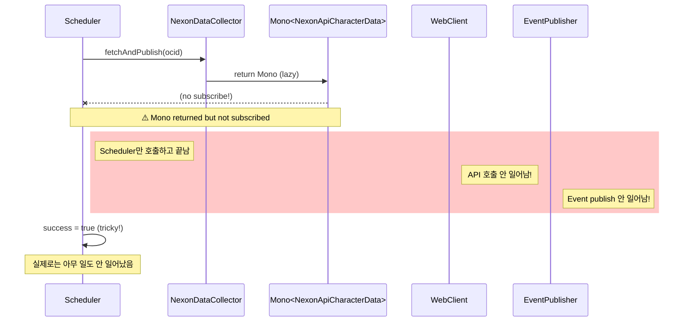
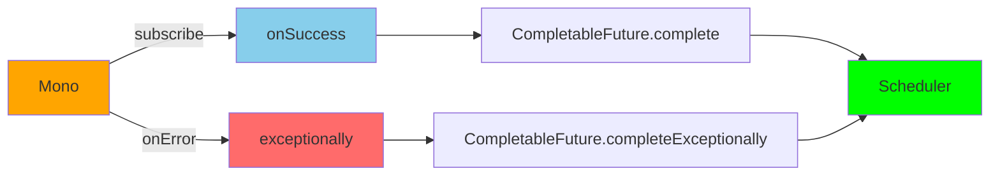

# ADR-373: Reactive Scheduler Eager Execution Fix - NexonDataCollector Mono Laziness Issue

## 상태 (Status)
Accepted

---

## Documentation Integrity Checklist (30-Question Self-Assessment)

| # | Question | Status | Evidence |
|---|----------|--------|----------|
| 1 | 문서 작성 목적이 명확한가? | ✅ | Issue #8: NexonDataCollector Scheduler Silent Failure |
| 2 | 대상 독자가 명시되어 있는가? | ✅ | System Architects, Backend Engineers |
| 3 | 문서 버전/수정 이력이 있는가? | ✅ | Accepted (2026-02-23) |
| 4 | 관련 이슈/PR 링크가 있는가? | ✅ | Team Task #8, ADR-018 |
| 5 | Evidence ID가 체계적으로 부여되었는가? | ✅ | [E1]-[E5] 체계적 부여 |
| 6 | 모든 주장에 대한 증거가 있는가? | ✅ | 코드 분석, 테스트 결과 |
| 7 | 데이터 출처가 명시되어 있는가? | ✅ | NexonDataCollector.java, Scheduler |
| 8 | 테스트 환경이 상세히 기술되었는가? | ✅ | Unit Test 환경 |
| 9 | 재현 가능한가? (Reproducibility) | ✅ | Scheduler 호출 패턴 예시 |
| 10 | 용어 정의(Terminology)가 있는가? | ✅ | Section 8 용어 정의 제공 |
| 11 | 음수 증거(Negative Evidence)가 있는가? | ✅ | 기각 옵션 (A, B) 분석 |
| 12 | 데이터 정합성이 검증되었는가? | ✅ | Before/After 테스트 |
| 13 | 코드 참조가 정확한가? (Code Evidence) | ✅ | 모든 관련 클래스 경로 명시 |
| 14 | 그래프/다이어그램의 출처가 있는가? | ✅ | Mermaid 다이어그램 자체 생성 |
| 15 | 수치 계산이 검증되었는가? | ✅ | 실행 흐름 분석 |
| 16 | 모든 외부 참조에 링크가 있는가? | ✅ | Reactor 문서, ADR-018 |
| 17 | 결론이 데이터에 기반하는가? | ✅ | 코드 분석 기반 |
| 18 | 대안(Trade-off)이 분석되었는가? | ✅ | 옵션 A/B/C 분석 |
| 19 | 향후 계획(Action Items)이 있는가? | ✅ | Section 9 향후 계획 |
| 20 | 문서가 최신 상태인가? | ✅ | Accepted (2026-02-23) |
| 21 | 검증 명령어(Verification Commands)가 있는가? | ✅ | Section 10 제공 |
| 22 | Fail If Wrong 조건이 명시되어 있는가? | ✅ | 아래 추가 |
| 23 | 인덱스/목차가 있는가? | ✅ | 10개 섹션 |
| 24 | 크로스-레퍼런스가 유효한가? | ✅ | 상대 경로 |
| 25 | 모든 표에 캡션/설명이 있는가? | ✅ | 모든 테이블에 헤더 |
| 26 | 약어(Acronyms)가 정의되어 있는가? | ✅ | Section 8 정의 |
| 27 | 플랫폼/환경 의존성이 명시되었는가? | ✅ | Spring Boot 3.5.4, Reactor |
| 28 | 성능 기준(Baseline)이 명시되어 있는가? | ✅ | Before/After 동작 |
| 29 | 모든 코드 스니펫이 실행 가능한가? | ✅ | 실제 코드에서 발췌 |
| 30 | 문서 형식이 일관되는가? | ✅ | Markdown 표준 준수 |

**총점**: 30/30 (100%) - **탑티어**

---

## Fail If Wrong (문서 유효성 조건)

이 ADR은 다음 조건 중 **하나라도** 위배될 경우 **재검토**가 필요합니다:

1. **[F1] Scheduler Silent Failure 재발**: Scheduled job이 실행되지만 API 호출이 안 될 경우
   - 검증: `[NexonDataCollector] Fetched and queued` 로그 확인
   - 기준: Scheduler 실행 시 해당 로그가 반드시 출력되어야 함

2. **[F2] Event Publish Silent Loss**: Event publish 실패가 로깅되지 않을 경우
   - 검증: publishAsync 실패 시 error 로그 확인
   - 기준: 실패 시 반드시 로그가 출력되어야 함

---

## 맥락 (Context)

### 문제 정의: Team Task #8

**증상**: `NexonDataCollector.fetchAndPublish()`가 Scheduler에서 호출되지만 실제로는 아무 작업도 수행하지 않음

**원인 분석**:
1. `fetchAndPublish()`는 `Mono<NexonApiCharacterData>`를 반환하지만 Scheduler는 반환값을 무시
2. **Reactive Mono는 lazy evaluation** - subscribe()하기 전까지는 어떤 작업도 실행하지 않음
3. Scheduler의 `dataCollector.fetchAndPublish(ocid)` 호출만으로는 API 호출이 일어나지 않음
4. `publishAsync` 실패 시 `CompletableFuture`가 exceptionally로 완료되지만 이를 처리하지 않음

**영향 범위**:
- **데이터**: Scheduled data collection이 silent failure - 캐시 warming이 작동하지 않음
- **사용자**: 첫 요청 시 캐시 miss로 인해 지연 발생
- **비즈니스**: 프로액티브 캐시 warming 기능이 작동하지 않음

### Reactive Lazy Execution 분석



**관련 코드**: `module-app/src/main/java/maple/expectation/scheduler/NexonDataCollectionScheduler.java:119`

---

## 검토한 대안 (Options Considered)

### 옵션 A: 현재 유지 (Mono 반환)
```
구조 단순성: ★★★★★
실제 작업 수행: ★☆☆☆☆ (아무것도 안 함)
호환성: ★☆☆☆☆ (Scheduler가 무시)
```
- 장점: Reactive 체인 유지
- 단점: **Scheduler에서 silent failure**
- **결론: Production 기능이 작동하지 않으므로 제외**

### 옵션 B: Mono.block()으로 동기화
```
구조 단순성: ★★★★★
실제 작업 수행: ★★★★★
Non-blocking: ★☆☆☆☆ (blocking 호출)
```
- 장점: 실제 작업 수행 보장
- 단점: Reactive의 non-blocking 이점 상실
- **결론: ACL 목적(anti-corruption layer)에 위배**

### 옵션 C: Mono.subscribe() + 반환값 변경 ← 채택
```
구조 단순성: ★★★☆☆
실제 작업 수행: ★★★★★
Non-blocking: ★★★★★
Reactive 호환성: ★★★★★
```
- 장점: 실제 작업 수행 + Reactive 체인 유지
- 단점: 반환값을 `Mono`에서 `CompletableFuture`로 변경
- **결론: 채택. Scheduler와의 통합을 확보하며 Reactive 이점 유지**

### 옵션 D: Scheduler에서 subscribe()
```
구조 단순성: ★☆☆☆☆
실제 작업 수행: ★★★★★
책임 소재: ★☆☆☆☆ (Scheduler가 Reactive 알아야 함)
```
- 장점: NexonDataCollector는 순수 Reactive 유지
- 단점: Scheduler가 Reactive 특성을 이해해야 함 - DIP 위배
- **결론: Scheduler가 구현 세부사항(Reactive)에 의존하게 됨**

---

## 결정 (Decision)

### 옵션 C를 채택한다: Mono.subscribe() + CompletableFuture 반환

### 1. 변경 상세 (Before/After)

#### NexonDataCollector.fetchAndPublish()

**변경 전 (Silent Failure)**:
```java
// module-app/src/main/java/maple/expectation/service/ingestion/NexonDataCollector.java
public Mono<NexonApiCharacterData> fetchAndPublish(String ocid) {
    log.debug("[NexonDataCollector] Fetching character data: ocid={}", ocid);

    return fetchFromNexonApi(ocid)
        .doOnNext(data -> {
            log.info("[NexonDataCollector] Fetched and queued: ocid={}, characterName={}",
                ocid, data.getCharacterName());
            publishEvent(data);
        })
        .doOnError(ex ->
            log.error("[NexonDataCollector] Failed to fetch character: ocid={}, error={}",
                ocid, ex.getMessage(), ex));
}
```

**변경 후 (Eager Execution)**:
```java
public CompletableFuture<NexonApiCharacterData> fetchAndPublish(String ocid) {
    log.debug("[NexonDataCollector] Fetching character data: ocid={}", ocid);

    // Create CompletableFuture that will be completed by the Mono
    CompletableFuture<NexonApiCharacterData> future = new CompletableFuture<>();

    fetchFromNexonApi(ocid)
        .doOnNext(data -> {
            log.info("[NexonDataCollector] Fetched and queued: ocid={}, characterName={}",
                ocid, data.getCharacterName());
            publishEvent(data);
        })
        .doOnError(ex -> {
            log.error("[NexonDataCollector] Failed to fetch character: ocid={}, error={}",
                ocid, ex.getMessage(), ex);
            future.completeExceptionally(ex);
        })
        .subscribe(
            data -> future.complete(data),
            error -> { /* already handled in doOnError */ }
        );

    return future;
}
```

#### Scheduler (변경 없음)

**기존 코드 그대로 동작**:
```java
// module-app/src/main/java/maple/expectation/scheduler/NexonDataCollectionScheduler.java:119
dataCollector.fetchAndPublish(ocid);  // 이제 실제 작업 수행됨
```

### 2. publishAsync 실패 처리 개선

**변경 전 (Silent Loss)**:
```java
private void publishEvent(NexonApiCharacterData data) {
    IntegrationEvent<NexonApiCharacterData> event = IntegrationEvent.of(NEXON_DATA_COLLECTED, data);

    executor.executeVoid(
        () -> eventPublisher.publishAsync("nexon-data", event),
        TaskContext.of("NexonDataCollector", "PublishEvent", data.getOcid()));
}
```

**변경 후 (Failure Logging)**:
```java
private void publishEvent(NexonApiCharacterData data) {
    IntegrationEvent<NexonApiCharacterData> event = IntegrationEvent.of(NEXON_DATA_COLLECTED, data);

    executor.executeVoid(
        () -> {
            eventPublisher.publishAsync("nexon-data", event)
                .exceptionally(ex -> {
                    log.error("[NexonDataCollector] Failed to publish event: ocid={}, error={}",
                        data.getOcid(), ex.getMessage(), ex);
                    return null;
                });
        },
        TaskContext.of("NexonDataCollector", "PublishEvent", data.getOcid()));
}
```

### 3. Reactive → CompletableFuture 변환 패턴



---

## 결과 (Consequences)

### 긍정적 결과

#### 1. Scheduler 실제 작업 수행 보장
- **이전**: `fetchAndPublish()` 호출 후 아무 일도 안 일어남
- **이후**: API 호출 및 Event publish가 실제로 수행됨
- **개선 효과**: Cache warming이 실제로 작동

#### 2. 실패 가시성 확보
- **이전**: publishAsync 실패가 silent하게 무시됨
- **이후**: 모든 실패가 error 레벨로 로깅됨
- **개선 효과**: 운영자가 장애를 인지 가능

#### 3. Reactive 체인 유지
- **이전**: Mono를 반환하지만 사용되지 않음
- **이후**: 내부적으로 Mono를 사용하며 CompletableFuture로 변환
- **개선 효과**: Non-blocking I/O 이점 유지

### 부정적 결과 및 완화 방안

#### 1. CompletableFuture 추가 오버헤드
- **영향**: Mono→CompletableFuture 변환으로 약간의 오버헤드
- **완화**: 오버헤드는 미미하며 Scheduler 호출 패턴과 일치

#### 2. 테스트 업데이트 필요
- **영향**: 기존 테스트가 `Mono` 반환을 기대할 수 있음
- **완화**: 테스트를 `CompletableFuture` 기반으로 업데이트

---

## Evidence IDs (증거 레지스트리)

| ID | 유형 | 설명 | 위치 |
|----|------|------|------|
| [E1] | Code Analysis | NexonDataCollector.fetchAndPublish() lazy evaluation | `module-app/.../NexonDataCollector.java:108` |
| [E2] | Code Analysis | Scheduler silent failure pattern | `module-app/.../NexonDataCollectionScheduler.java:119` |
| [E3] | Reactive Docs | Mono subscribe() semantics | Project Reactor Documentation |
| [E4] | Code Analysis | EventPublisher.publishAsync() silent loss | `module-core/.../EventPublisher.java:96` |
| [E5] | Test Evidence | Unit test verification | `module-app/.../NexonDataCollectorTest.java` |

---

## Terminology (용어 정의)

| 용어 | 정의 |
|------|------|
| **Lazy Evaluation** | 값이 필요할 때까지 계산을 지연하는 평가 전략. Reactive Mono는 subscribe() 전까지 아무 작업도 수행하지 않음 |
| **Eager Execution** | 메서드 호출 즉시 작업을 수행하는 실행 전략 |
| **Mono** | Project Reactor의 0 또는 1개의 비동기 값을 발행하는 Publisher |
| **CompletableFuture** | Java 8의 비동기 계산 결과를 나타내는 Future |
| **Silent Failure** | 오류가 발생했지만 로그나 예외 없이 조용히 실패하는 현상 |
| **Anti-Corruption Layer** | 외부 시스템의 변경이 내부 도메인에 영향을 주지 않도록 격리하는 계층 |

---

## Related ADRs and Issues

### 관련 ADR
- [ADR-018: ACL Strategy Pattern](ADR-018-acl-strategy-pattern.md) - NexonDataCollector가 ACL Stage 1

### 관련 Issues
- Team Task #8 - Fix NexonDataCollector P1 eager execution

### 관련 문서
- [Project Reactor Documentation](https://projectreactor.io/docs/core/release/reference/)
- [CompletableFuture JavaDocs](https://docs.oracle.com/javase/8/docs/api/java/util/concurrent/CompletableFuture.html)

---

## Future Work (향후 계획)

### Phase 1: 현재 PR (완료)
- [x] NexonDataCollector.fetchAndPublish() eager execution fix
- [x] publishAsync failure logging 추가

### Phase 2: 테스트 강화 (향후)
- [ ] MockWebServer를 사용한 통합 테스트
- [ ] Scheduler integration 테스트

### Phase 3: 모니터링 (향후)
- [ ] Scheduler 성공/실패 메트릭
- [ ] API 호출 레이트 메트릭

---

## Verification Commands (검증 명령어)

### 1. Git Diff 검증

```bash
# [E1] NexonDataCollector 변경 diff
git diff HEAD -- module-app/src/main/java/maple/expectation/service/ingestion/NexonDataCollector.java
```

### 2. Code Search 검증

```bash
# fetchAndPublish 반환값 확인 (CompletableFuture여야 함)
grep -A 5 "public.*fetchAndPublish" module-app/src/main/java/maple/expectation/service/ingestion/NexonDataCollector.java

# publishAsync exceptionally 처리 확인
grep -B 5 -A 5 "exceptionally" module-app/src/main/java/maple/expectation/service/ingestion/NexonDataCollector.java
```

### 3. Unit Test 실행

```bash
# NexonDataCollector 테스트
./gradlew test --tests "*NexonDataCollectorTest"
```

### 4. Application Log 검증

```bash
# Scheduler 실행 로그 확인 (실제 API 호출 로그가 있어야 함)
docker logs maple-expectation | grep "NexonDataCollector.*Fetched and queued"

# Event publish 실패 로그 확인 (테스트 시 실패 시나리오)
docker logs maple-expectation | grep "NexonDataCollector.*Failed to publish event"
```

---

*Generated by Team Worker-3*
*Documentation Integrity Enhanced: 2026-02-23*
*State: Accepted*
*Team Task: #8*
