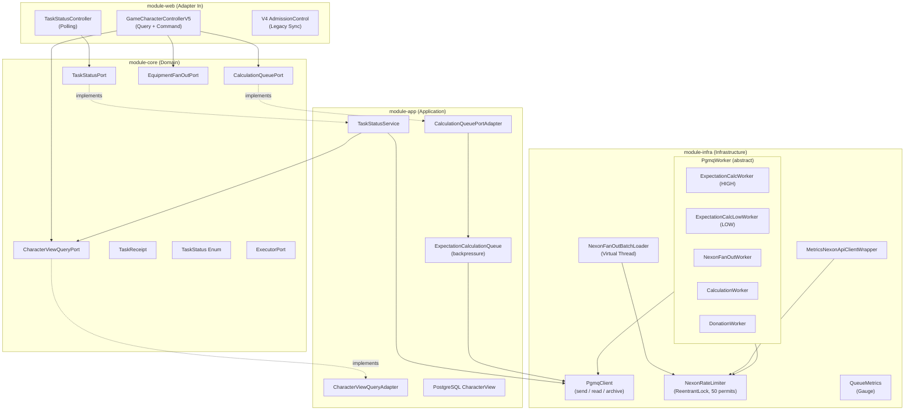
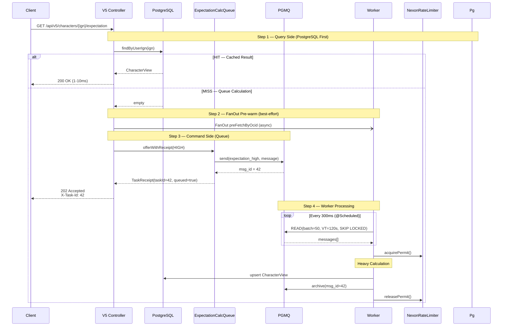
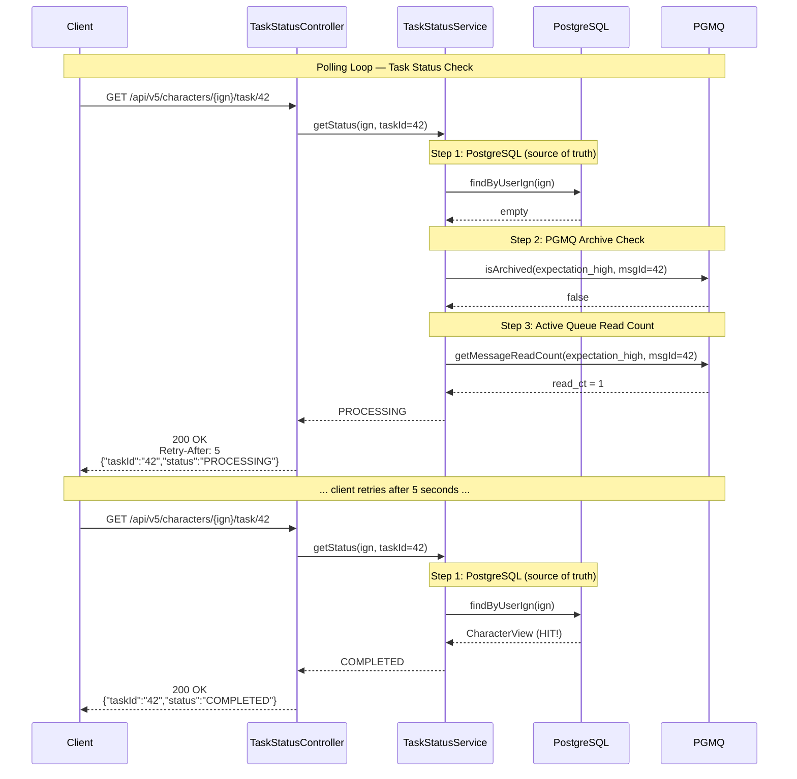
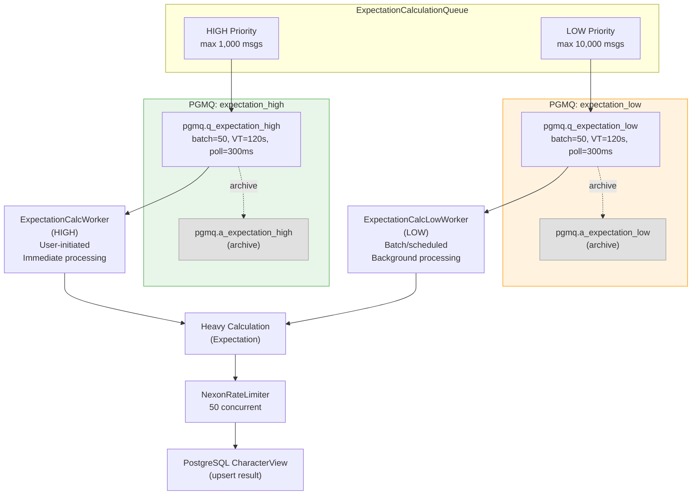
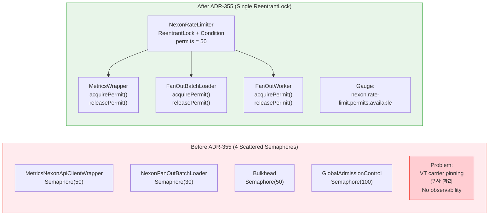
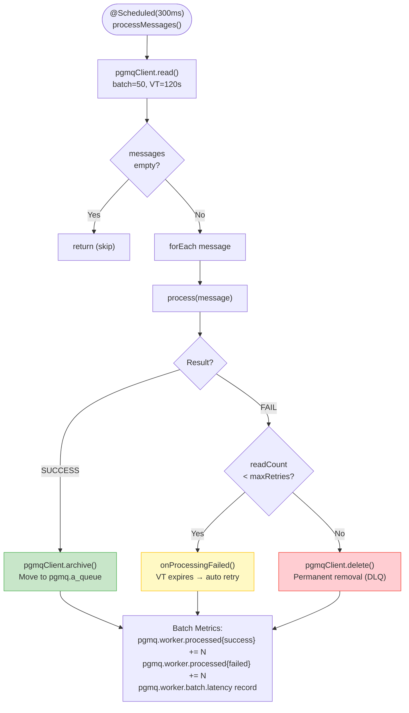
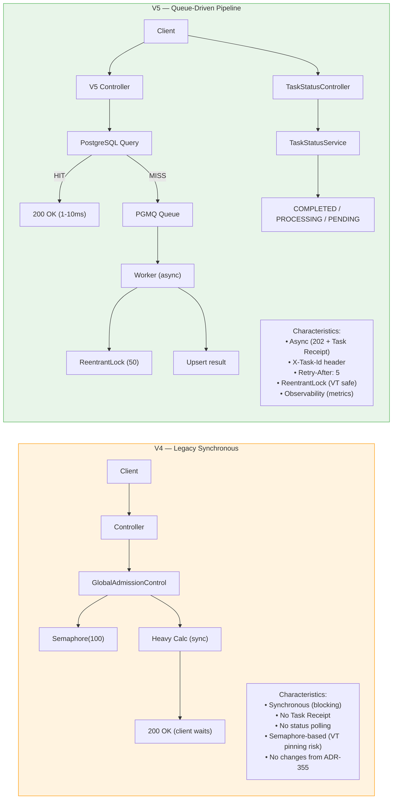
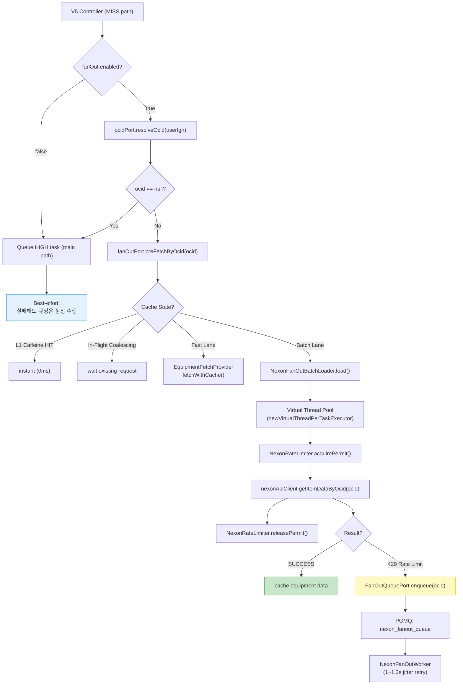
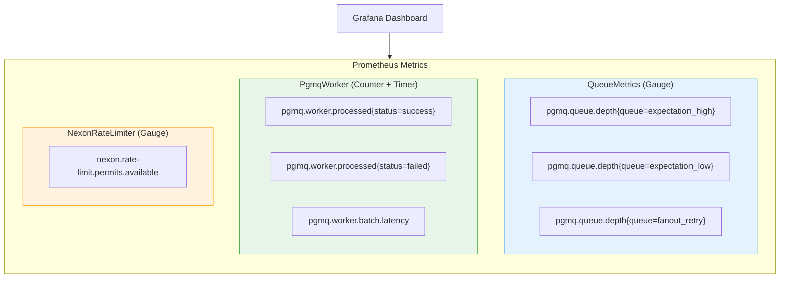

# ADR-355: Fan-Out Queue-Driven Pipeline — Architecture Diagram

## 1. Module Dependency (Hexagonal Architecture)



## 2. V5 Request Flow (Full Lifecycle)



## 3. Task Status Polling Flow



## 4. PGMQ Queue Architecture (Priority Strategy)



## 5. NexonRateLimiter — Before vs After



## 6. PGMQ Worker Lifecycle (Single Message)



## 7. V4 vs V5 Comparison



## 8. FanOut Pre-Warm Flow (Best-Effort)



## 9. Observability Stack



## 10. Data Flow Summary (Sequence Diagram)

```mermaid
sequenceDiagram
    participant C as Client
    participant Ctrl as V5 Controller
    participant Q as CalcQueue
    participant PGMQ as PGMQ
    participant W as Worker
    participant PG as PostgreSQL

    rect rgb(240, 248, 255)
        Note over C,PG: Query Side — Cache First
        C->>Ctrl: GET /characters/{ign}/expectation
        Ctrl->>PG: findByUserIgn(ign)
        alt HIT
            PG-->>Ctrl: CharacterView
            Ctrl-->>C: 200 OK (cached)
        else MISS
            PG-->>Ctrl: empty
    end

    rect rgb(255, 248, 240)
        Note over C,PGMQ: Command Side — Queue + Async Processing
        Ctrl->>Q: offerWithReceipt(HIGH)
        Q->>PGMQ: send(expectation_high, msg)
        PGMQ-->>Q: msgId = 42
        Q-->>Ctrl: TaskReceipt(taskId=42)
        Ctrl-->>C: 202 Accepted<br/>X-Task-Id: 42

        W->>PGMQ: READ (SKIP LOCKED, batch=50)
        PGMQ-->>W: messages[]
        W->>PG: calc + upsert CharacterView
        W->>PGMQ: ARCHIVE (msgId=42)
    end

    rect rgb(240, 255, 240)
        Note over C,PG: Polling — Task Status
        C->>Ctrl: GET /characters/{ign}/task/42
        Ctrl->>PG: getStatus(ign, 42)
        PG-->>Ctrl: CharacterView (HIT)
        Ctrl-->>C: 200 OK {"status":"COMPLETED"}
    end
```
