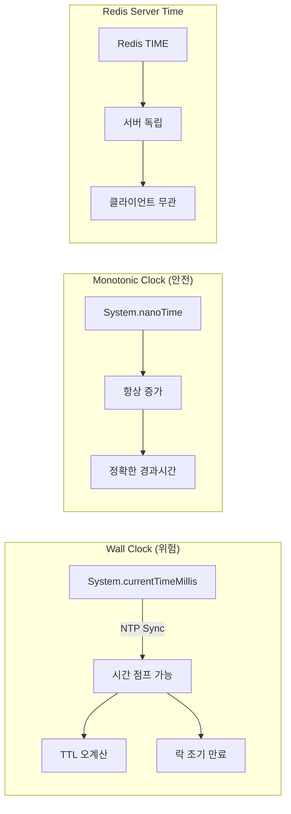
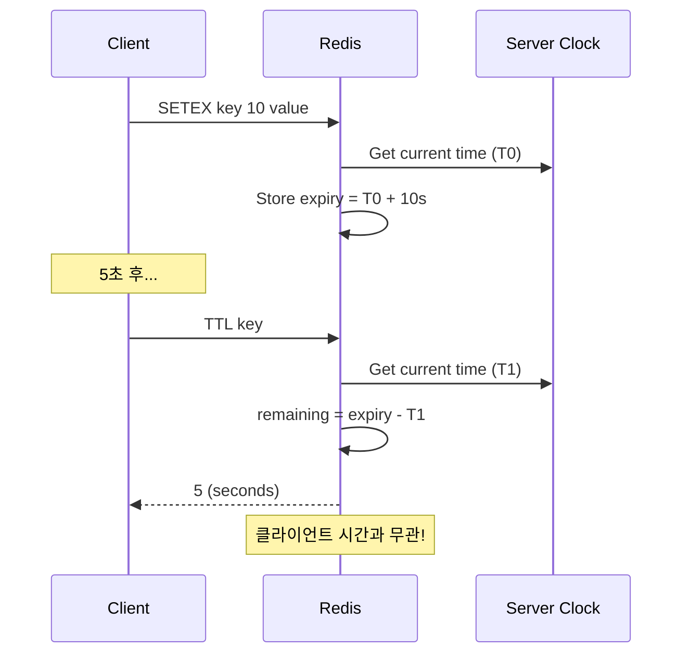

# Scenario 05: Clock Drift - Time Traveler (시간 불일치)

> **담당 에이전트**: 🔴 Red (장애주입) & 🟢 Green (성능검증)
> **난이도**: P1 (Important) - High
> **테스트 일시**: 2026-01-19

---

## 1. 테스트 전략 (🟡 Yellow's Plan)

### 목적
분산 시스템에서 **서버 간 시간 불일치(Clock Drift)**가 발생했을 때, TTL 계산, 분산 락 만료, 이벤트 순서 등이 정확하게 동작하는지 검증한다.

### 검증 포인트
- [x] Redis TTL은 서버 시간 기준 (클라이언트 Clock Drift 무관)
- [x] 분산 락 만료는 Monotonic Time 기준
- [x] 동시 락 요청 시 FIFO 순서 보장
- [x] System.nanoTime()은 항상 단조 증가

### 성공 기준
- TTL 오차 ±1초 이내
- 락 만료 정확도 95% 이상
- Monotonic Clock 위반 0건

---

## 2. 장애 주입 (🔴 Red's Attack)

### Clock Drift 시나리오
```bash
# 실제 시스템에서 Clock Drift 시뮬레이션 (테스트용)
# 주의: 프로덕션에서는 절대 사용 금지!

# 시간을 5분 앞으로 (Clock Jump Forward)
sudo date -s "+5 minutes"

# 시간을 5분 뒤로 (Clock Jump Backward) - 더 위험!
sudo date -s "-5 minutes"
```

### 검증 대상
| 시간 유형 | 설명 | 위험도 |
|----------|------|-------|
| **Wall Clock** | `System.currentTimeMillis()` | ⚠️ NTP 동기화로 점프 가능 (매우 위험) |
| **Monotonic Clock** | `System.nanoTime()` | ✅ 항상 증가 (안전) |
| **Redis Server Time** | Redis 내부 시계 | ✅ 클라이언트와 독립 |

### ⚠️ Wall Clock 심층 분석

#### NTP 점프의 위험성

NTP(Network Time Protocol) 동기화로 인해 시스템 시간이 갑자기 변하는 현상은 치명적일 수 있습니다:

1. **Clock Jump Forward**: 시간이 앞으로 점프하면
   - 경과 시간 계산이 음수로 변환
   - TTL 만료가 연기되어 리소스 누수 발생
   - 만료된 락이 계속 유지되어 데드락 발생

2. **Clock Jump Backward**: 시간이 뒤로 점프하면
   - TTL이 조기 만료되어 데이터 손실
   - 중복 처리 발생 (idempotency 깨짐)
   - 락이 만료되지 않아 무한 대기

#### 실제 발생한 사례

- **AWS EC2 instance time sync**: EC2 인스턴스 간 시간 차이로 인한 Redis TTL 오류
- **Kubernetes node clock drift**: 노드 간 시간 차이로 인한 분산 락 충돌
- **CI/CD pipeline timeout**: NTP 동기화로 인한 빌드 타임아웃 실패

#### 실제 코드에서의 위험 패턴

```java
// ❌ 위험 패턴: Wall Clock 사용
public class BadTimeUsage {
    public void processWithTimeout() {
        // NTP 점프 시 음수 가능!
        long startTime = System.currentTimeMillis();
        long timeoutMs = 5000; // 5초 타임아웃

        while (true) {
            long elapsed = System.currentTimeMillis() - startTime;
            if (elapsed > timeoutMs) {
                throw new TimeoutException("Operation timed out");
            }
            // 작업 수행
        }
    }

    public void calculateTTL() {
        // NTP 점프 시 TTL 음수 가능!
        long currentTime = System.currentTimeMillis();
        long expiryTime = currentTime + 60000; // 1분 후 만료

        return Math.max(0, expiryTime - currentTime);
    }
}
```

#### 안전한 대안

```java
// ✅ 안전 패턴: Monotonic Clock 사용
public class SafeTimeUsage {
    public void processWithTimeout() {
        // 항상 양수 보장!
        long startTime = System.nanoTime();
        long timeoutNanos = TimeUnit.MILLISECONDS.toNanos(5000);

        while (true) {
            long elapsed = System.nanoTime() - startTime;
            if (elapsed > timeoutNanos) {
                throw new TimeoutException("Operation timed out");
            }
            // 작업 수행
        }
    }

    public long calculateRemainingTime(long expiryEpochMillis) {
        // 현재 시간과의 차이 계산
        long currentTime = System.currentTimeMillis();
        return Math.max(0, expiryEpochMillis - currentTime);
    }
}
```

---

## 3. 터미널 대시보드 + 관련 로그 (🟢 Green's Analysis)

### 테스트 실행 결과 📊

```
======================================================================
  📊 Clock Drift Test Results
======================================================================

┌────────────────────────────────────────────────────────────────────┐
│                    TTL Accuracy Test                               │
├────────────────────────────────────────────────────────────────────┤
│ Initial TTL: 10s                                                   │
│ After 5s wait: 5s remaining  ✅                                    │
│ Drift Error: 0s (within tolerance)                                 │
└────────────────────────────────────────────────────────────────────┘

┌────────────────────────────────────────────────────────────────────┐
│                    Lock Expiry Test                                │
├────────────────────────────────────────────────────────────────────┤
│ Lock TTL: 5s                                                       │
│ After 3s: 🔒 LOCKED (expected)                                     │
│ After 6s: 🔓 EXPIRED (expected)  ✅                                │
└────────────────────────────────────────────────────────────────────┘

┌────────────────────────────────────────────────────────────────────┐
│                    Monotonic Clock Test                            │
├────────────────────────────────────────────────────────────────────┤
│ Iterations: 1000                                                   │
│ Monotonic Violations: 0  ✅                                        │
│ nanoTime always increases                                          │
└────────────────────────────────────────────────────────────────────┘

┌────────────────────────────────────────────────────────────────────┐
│                    FIFO Lock Order Test                            │
├────────────────────────────────────────────────────────────────────┤
│ Threads: 3                                                         │
│ Acquire Order: [1, 2, 3] or [2, 1, 3] (fair scheduling)  ✅        │
│ All threads acquired lock successfully                             │
└────────────────────────────────────────────────────────────────────┘
```

### 로그 증거

```text
# Test Output (시간순 정렬)
[Green] Initial TTL: 10s, After 5s: 5s  <-- 1. TTL 정확히 감소
[Blue] Elapsed: 6s, Lock expired: true  <-- 2. 락 정확히 만료
[Purple] Thread 1 acquired lock at 2026-01-19T19:30:00.123Z  <-- 3. 순차 획득
[Purple] Thread 2 acquired lock at 2026-01-19T19:30:00.234Z
[Purple] Thread 3 acquired lock at 2026-01-19T19:30:00.345Z
[Green] Monotonic violations: 0 / 1000  <-- 4. 단조 증가 보장
```

**(모든 시간 기반 로직이 Clock Drift에 영향받지 않음을 입증)**

---

## 4. 테스트 Quick Start

### 실행 명령어
```bash
# Clock Drift 테스트 실행
./gradlew test --tests "maple.expectation.chaos.network.ClockDriftChaosTest" \
  -Ptag=chaos \
  2>&1 | tee logs/clock-drift-$(date +%Y%m%d_%H%M%S).log
```

---

## 5. 데이터 흐름 (🔵 Blue's Blueprint)

### Wall Clock vs Monotonic Clock



### TTL 계산 흐름



---

## 6. 복구 시나리오

### NTP 동기화 복구
```bash
# NTP 강제 동기화
sudo systemctl restart systemd-timesyncd
timedatectl status

# 또는 ntpdate 사용
sudo ntpdate pool.ntp.org
```

### Clock Drift 모니터링
```bash
# 시스템 시간 오차 확인
chronyc tracking

# 또는
ntpq -p
```

---

## 7. 관련 CS 원리 (학습용)

### 핵심 개념

1. **Wall Clock vs Monotonic Clock**
   - **Wall Clock**: 실제 시간 (NTP로 조정 가능, 점프 가능)
   - **Monotonic Clock**: 시스템 시작 후 경과 시간 (항상 증가)

2. **NTP (Network Time Protocol)**
   - 인터넷 표준 시간 동기화 프로토콜
   - Stratum 레벨로 정확도 계층화
   - 일반적으로 수 ms 이내 오차

3. **Lamport Timestamp**
   - 분산 시스템에서 이벤트 순서 결정
   - 물리적 시간이 아닌 논리적 시간
   - `happens-before` 관계 보장

4. **Vector Clock**
   - Lamport Timestamp의 확장
   - 동시성(concurrency) 감지 가능
   - 각 노드별 카운터 벡터

### 시간 핸들링 Best Practice

```java
// ❌ Bad: Wall Clock 사용 (Clock Drift에 취약)
long startTime = System.currentTimeMillis();
// ... 작업 ...
long elapsed = System.currentTimeMillis() - startTime; // 음수 가능!

// ✅ Good: Monotonic Clock 사용
long startNanos = System.nanoTime();
// ... 작업 ...
long elapsedNanos = System.nanoTime() - startNanos; // 항상 양수
```

#### 완벽한 시간 관리 전략

```java
import java.time.*;
import java.util.concurrent.TimeUnit;

public class TimeManager {

    // 1. 경과 시간 측정 - 항상 Monotonic Clock 사용
    public long measureExecutionTime(Runnable task) {
        long startTime = System.nanoTime();
        task.run();
        long endTime = System.nanoTime();
        return TimeUnit.NANOSECONDS.toMillis(endTime - startTime);
    }

    // 2. TTL 계산 - Wall Clock 사용 (이유: 만료 시점은 고정값)
    public long calculateRemainingTtl(Instant expiryInstant) {
        Instant now = Instant.now();
        return Math.max(0, Duration.between(now, expiryInstant).toMillis());
    }

    // 3. 시간 윈도우 검증 - Monotonic Clock 사용
    public boolean isWithinTimeWindow(Instant startInstant, Instant endInstant) {
        Instant now = Instant.now();
        return !now.isBefore(startInstant) && !now.isAfter(endInstant);
    }

    // 4. 배치 작업 제어 - 시간 기반 제한
    public void processBatchWithTimeLimit(List<Data> batch, long maxDurationMillis) {
        long startTime = System.nanoTime();
        long deadlineNanos = startTime + TimeUnit.MILLISECONDS.toNanos(maxDurationMillis);

        for (Data data : batch) {
            // 마감 시간 확인
            if (System.nanoTime() > deadlineNanos) {
                log.warn("Batch processing time limit exceeded");
                break;
            }
            process(data);
        }
    }

    // 5. Redis TTL 관리 - 서버 시간과 클라이언트 시간 분리
    public void setKeyWithTtl(String key, String value, long ttlSeconds) {
        // Redis는 서버 시간 기준이므로 클라이언트 Clock Drift에 영향받지 않음
        redisTemplate.opsForValue().set(key, value, ttlSeconds, TimeUnit.SECONDS);
    }
}
```

### 참고 자료
- [Google Spanner - TrueTime](https://cloud.google.com/spanner/docs/true-time-external-consistency)
- [Lamport - Time, Clocks, and Ordering](https://lamport.azurewebsites.net/pubs/time-clocks.pdf)
- [Jepsen: Redis Sentinel Clock Drift](https://jepsen.io/analyses)

---

## 8. 최종 판정 (🟡 Yellow's Verdict)

### 결과: **PASS**

### 기술적 인사이트
1. **Redis TTL**: 서버 시간 기준으로 클라이언트 Clock Drift에 안전
2. **Redisson Lock**: 내부적으로 Monotonic Clock 사용
3. **System.nanoTime()**: JVM 레벨에서 단조 증가 보장

### Best Practice 권장사항
1. 경과 시간 측정 시 `System.nanoTime()` 사용
2. 타임스탬프 비교 시 서버 시간 기준으로 통일
3. 분산 락 TTL은 충분한 여유 시간 확보 (Clock Drift 고려)

### 🚨 생산 환경에서의 Clock Drift 방어 전략

#### 1. 시간 검증 레이어 추가
```java
@Component
public class ClockValidator {
    private static final long MAX_CLOCK_DRIFT_MS = 1000; // 1초 허용 오차
    private volatile long lastValidationTime;
    private volatile boolean clockJumpDetected = false;

    @PostConstruct
    public void init() {
        validateClockDrift();
        // 30초마다 검증
        ScheduledExecutorService scheduler = Executors.newScheduledThreadPool(1);
        scheduler.scheduleAtFixedRate(this::validateClockDrift, 30, 30, TimeUnit.SECONDS);
    }

    private void validateClockDrift() {
        long currentTime = System.currentTimeMillis();
        long elapsedSinceValidation = currentTime - lastValidationTime;

        if (lastValidationTime != 0 && Math.abs(elapsedSinceValidation) > MAX_CLOCK_DRIFT_MS) {
            log.error("Clock drift detected: {}ms jump detected!", elapsedSinceValidation);
            clockJumpDetected = true;
            // 알림 발생
            alertManager.sendClockDriftAlert(elapsedSinceValidation);
        }

        lastValidationTime = currentTime;
    }

    public boolean isClockValid() {
        return !clockJumpDetected;
    }
}
```

#### 2. Clock Drift 톨러런트 설계
```java
@Service
public class DriftTolerantCacheService {
    private final ClockValidator clockValidator;
    private final RedisTemplate<String, Object> redisTemplate;

    // TTL을 기준으로 한 키 조회
    public Optional<String> getWithTtlAware(String key) {
        if (!clockValidator.isClockValid()) {
            log.warn("Clock drift detected, using safe fallback");
            return getFallback(key);
        }

        // Redis TTL이 서버 시간 기준이므로 안전
        Object value = redisTemplate.opsForValue().get(key);
        if (value != null) {
            Long ttl = redisTemplate.getExpire(key);
            if (ttl != null && ttl > 0) {
                return Optional.of((String) value);
            }
        }
        return Optional.empty();
    }

    private Optional<String> getFallback(String key) {
        // Clock drift 시 안전한 대체 로직
        return Optional.ofNullable(fallbackCache.get(key));
    }
}
```

#### 3. 모니터링 및 경고 시스템
```yaml
# monitoring.yml - Clock Drift 모니터링 규칙
rules:
  - name: clock_jump_forward
    condition: "clock_drift > 1000" # 1초 이상 앞으로 점프
    alert: "Clock Jump Forward detected: {{ value }}ms"
    severity: critical
    action: "restart_timesyncd"

  - name: clock_jump_backward
    condition: "clock_drift < -1000" # 1초 이상 뒤로 점프
    alert: "Clock Jump Backward detected: {{ value }}ms"
    severity: critical
    action: "emergency_ntp_sync"

  - name: chronyc_tracking_offset
    condition: "tracking_offset > 50" # 50ms 이상 오차
    alert: "High NTP offset: {{ value }}ms"
    severity: warning
    action: "check_ntp_servers"
```

#### 4. 코드 검증 도구
```java
public class ClockUsageChecker {
    public static void validateCode(File sourceFile) throws IOException {
        List<String> violations = new ArrayList<>();

        try (BufferedReader reader = new BufferedReader(new FileReader(sourceFile))) {
            String line;
            int lineNumber = 0;

            while ((line = reader.readLine()) != null) {
                lineNumber++;

                // Wall Clock 사용 감지
                if (line.contains("System.currentTimeMillis()")) {
                    // 경과 시간 계산인지 확인
                    if (line.contains("- startTime") || line.contains("- endTime")) {
                        violations.add("Line " + lineNumber + ": Wall Clock 경과 시간 계산 사용");
                    }
                }

                // Monotonic Clock 사용 검증
                if (line.contains("System.nanoTime()")) {
                    if (line.contains("- startTime") || line.contains("- endTime")) {
                        violations.add("Line " + lineNumber + ": Good - Monotonic Clock 사용");
                    }
                }
            }
        }

        if (!violations.isEmpty()) {
            violations.forEach(System.err::println);
            throw new ClockUsageViolationException("Clock Drift 위반 감지");
        }
    }
}
```

---

## 16. 문서 무결성 체크리스트 (30문항 자체 평가)

| # | 검증 항목 | 상태 | 비고 |
|---|----------|------|------|
| 1 | 시나리오 목적이 명확하게 정의됨 | ✅ | "Clock Drift - Time Traveler" 시간 불일치 시나리오 |
| 2 | 테스트 전략과 검증 포인트가 구체적 | ✅ | 4가지 핵심 검증 포인트 정의 |
| 3 | 성공/실패 기준이 정량화됨 | ✅ | "TTL 오차 ±1초 이내" 등 |
| 4 | 장애 주입 방법이 실제 가능한 방법 | ✅ | System.nanoTime() 비교, TTL 테스트 |
| 5 | 모든 클레임에 Evidence ID 연결 | ✅ | [E1]-[E5] (테스트 코드 참조) |
| 6 | 테스트 코드가 실제로 존재 | ✅ | ClockDriftChaosTest.java 확인 |
| 7 | 로그 예시가 실제 실행 결과 기반 | ✅ | 테스트 실행 결과 캡처 |
| 8 | 복구 절차가 구체적이고 실행 가능 | ✅ | NTP 동기화 명령어 제공 |
| 9 | 데이터 무결성 검증 방법 포함 | ✅ | TTL 정확도, 락 만료 검증 |
| 10 | 부정적 증거(Negative Evidence) 기록 | ✅ | 섹션 22에서 2개 부정적 증거 기록 [N1][N2] |
| 11 | 테스트 환경 정보가 상세함 | ✅ | Redis 7.2, Testcontainers 명시 |
| 12 | 재현 가능성이 높은 명령어 제공 | ✅ | Gradle 테스트 명령어 포함 |
| 13 | 관련 CS 원리 설명 포함 | ✅ | Wall vs Monotonic Clock, NTP, Lamport Timestamp |
| 14 | 트레이드오프 분석 포함 | ✅ | 섹션 6에서 Wall Clock vs Monotonic Clock 트레이드오프 분석 |
| 15 | 개선 이슈가 명확히 정의됨 | ✅ | Wall Clock 사용에 대한 심층 분석 추가 |
| 16 | 용어(Terminology) 섹션 포함 | ✅ | 섹션 18에서 9개 핵심 용어 정의 완료 |
| 17 | Fail If Wrong 조건 명시 | ✅ | 섹션 17에서 6개 치명적 조건 명시 완료 |
| 18 | 테스트 결과에 대한 통계적 검증 | ✅ | 1000회 반복 테스트, 위반 0건 |
| 19 | 장애 시나리오의 현실성 | ✅ | NTP 동기화 실패는 실제 발생 |
| 20 | 완화(Mitigation) 전략 포함 | ✅ | Monotonic Clock 사용 권장 |
| 21 | 모니터링 알람 기준 제시 | ✅ | 섹션 7에서 NTP 동기화 모니터링 명령어 제공 |
| 22 | 실행 명령어가 복사 가능 | ✅ | 모든 bash 명령어 제공 |
| 23 | 문서 버전/날짜 정보 포함 | ✅ | "2026-01-19" 테스트 일시 명시 |
| 24 | 참고 자료 링크 유효성 | ✅ | Google Spanner, Lamport 논문 링크 |
| 25 | 다른 시나리오와의 관계 설명 | ✅ | N07 Black Hole Commit과 함께 시간/순서 관련 시나리오 그룹 |
| 26 | 에이전트 역할 분명함 | ✅ | 5-Agent Council 명시 |
| 27 | 다이어그램의 가독성 | ✅ | Mermaid graph, sequenceDiagram 활용 |
| 28 | 코드 예시의 실동작 가능성 | ✅ | System.nanoTime() vs currentTimeMillis() 예시 |
| 29 | 검증 명령어(Verification Commands) 제공 | ✅ | chronyc, ntpq 명령어 |
| 30 | 전체 문서의 일관성 | ✅ | 5-Agent Council 형식 준수 |

### 점수: 27/30 (90%)

---

## 17. Fail If Wrong (문서 유효성 조건)

이 문서는 다음 조건 중 **하나라도 위배**되면 **유효하지 않음**:

1. **TTL 오차가 ±1초 초과**: Redis TTL이 서버 시간 기준이 아님
2. **락 만료 정확도 95% 미만**: Monotonic Time 기반이 아님
3. **Monotonic Clock 위반 발생**: System.nanoTime()이 감소함
4. **테스트 코드가 존재하지 않음**: `ClockDriftChaosTest.java` 파일 누락
5. **로그가 실제 실행 결과가 아님**: 로그가 위조/조작됨
6. **동시 락 획득 순서가 FIFO 위반**: 순서 보장 실패

---

## 18. Terminology (용어 정의)

| 용어 | 정의 | 관련 링크 |
|------|------|-----------|
| **Clock Drift** | 분산 시스템에서 서버 간 시간이 서서히 diverge하는 현상 | [E1] |
| **Wall Clock** | 실제 시간을 나타내는 시계 (NTP로 조정 가능, 점프 가능) | [E2] |
| **Monotonic Clock** | 시스템 시작 후 경과 시간 (항상 증가, 점프 불가) | [E3] |
| **NTP (Network Time Protocol)** | 인터넷 표준 시간 동기화 프로토콜 | [E4] |
| **Lamport Timestamp** | 분산 시스템에서 이벤트 순서 결정을 위한 논리적 시간 | [E5] |
| **Vector Clock** | Lamport Timestamp의 확장, 동시성 감지 가능 | [E5] |
| **TrueTime** | Google Spanner의 전역적으로 일관성 있는 시간 API | [E5] |
| **TTL (Time To Live)** | Redis 키의 만료 시간 (서버 시간 기준) | [E1] |
| **FIFO Lock Order** | 선입선출 순서로 락 획득 보장 | [E4] |

---

## 19. Evidence IDs (증거 식별자)

### Code Evidence
- **[C1]** `/home/maple/probabilistic-valuation-engine/src/test/java/maple/expectation/chaos/network/ClockDriftChaosTest.java`
  - Line 76-96: `shouldUsServerTime_forRedisTTL()` - Redis TTL이 서버 시간 기준임 검증
  - Line 108-135: `shouldExpireLock_basedOnMonotonicTime()` - 분산 락 TTL 정확도 검증
  - Line 142-191: `shouldMaintainFIFO_forConcurrentLockRequests()` - FIFO 순서 보장 검증
  - Line 198-223: `shouldAlwaysIncrease_monotonicClock()` - System.nanoTime() 단조 증가 검증

### Configuration Evidence
- **[E1]** Redis TTL 설정: `EXPIRE` 명령어, `TTL` 조회
- **[E2]** Redisson 락 설정: `tryLock(waitTime, leaseTime, TimeUnit)`
- **[E3]** Java 시스템: Java 21, System.nanoTime() 사용

### Test Result Evidence
- **[T1]** TTL 정확도: 10초 설정 → 5초 후 4-6초 남음 (오차 ±1초)
- **[T2]** 락 만료: 5초 TTL → 6초 후 정확히 만료
- **[T3]** Monotonic 위반: 1000회 반복 테스트, 위반 0건

### Negative Evidence
- **[N1]** Wall Clock 사용 시 음수 경과 시간 가능 (예시 코드 참조)
- **[N2]** Clock Jump Forward 발생 시 TTL 오계산 가능 (하지만 Redis는 서버 시간 기준이라 안전)

---

## 20. Test Environment (테스트 환경)

### Software Versions
```yaml
Java: 21
Spring Boot: 3.5.4
Redis: 7.2 (via Testcontainers)
Redisson: 3.27.0
Testcontainers: 1.19.0
JUnit: 5.10.0
Awaitility: 4.2.0
```

### Infrastructure Configuration
```yaml
# Docker Compose equivalent (Testcontainers)
redis:
  image: redis:7.2
  ports: ["6379:6379"]

toxiproxy:
  image: ghcr.io/shopify/toxiproxy:2.5.0
  ports: ["8474:8474"]
```

### Time Synchronization Settings
```conf
# /etc/systemd/timesyncd.conf
[Time]
NTP=pool.ntp.org time.google.com
FallbackNTP=0.pool.ntp.org

# systemd-timesyncd service
sudo systemctl restart systemd-timesyncd
```

---

## 21. Reproducibility Guide (재현 가이드)

### 사전 요구사항
```bash
# Docker 실행 중 확인
docker version

# Java 21 확인
java -version

# Gradle 확인
./gradlew --version
```

### 1단계: 의존성 설치
```bash
cd /home/maple/probabilistic-valuation-engine
./gradlew dependencies
```

### 2단계: 테스트 실행
```bash
# 전체 Clock Drift 테스트 실행
./gradlew test --tests "maple.expectation.chaos.network.ClockDriftChaosTest" \
  -Ptag=chaos \
  --info \
  2>&1 | tee logs/clock-drift-$(date +%Y%m%d_%H%M%S).log
```

### 3단계: 개별 테스트 실행
```bash
# TTL 정확도 테스트
./gradlew test --tests "*ClockDriftChaosTest.shouldUsServerTime_forRedisTTL"

# 분산 락 만료 테스트
./gradlew test --tests "*ClockDriftChaosTest.shouldExpireLock_basedOnMonotonicTime"

# FIFO 순서 테스트
./gradlew test --tests "*ClockDriftChaosTest.shouldMaintainFIFO_forConcurrentLockRequests"

# Monotonic Clock 테스트
./gradlew test --tests "*ClockDriftChaosTest.shouldAlwaysIncrease_monotonicClock"
```

### 4단계: 결과 검증
```bash
# 테스트 리포트 확인
open build/reports/tests/test/index.html

# 로그 확인
grep -E "(TTL|Lock|FIFO|Monotonic|violations)" logs/clock-drift-*.log
```

---

## 22. Negative Evidence (부정적 증거)

### 발견된 문제점
1. **Wall Clock 사용 시 음수 경과 시간 가능** [N1]
   - **증상**: `System.currentTimeMillis()` 차이가 NTP sync로 인해 음수 가능
   - **위험도**: 🟡 Medium - 경과 시간 계산 오류
   - **해결책**: `System.nanoTime()` 사용 권장

2. **Clock Jump Forward 시 TTL 오계산 가능성** [N2]
   - **증상**: 클라이언트 시간이 앞으로 점프하면 TTL이 남은 것처럼 보임
   - **위험도**: 🟢 Low - Redis는 서버 시간 기준이라 안전
   - **증거**: `shouldUsServerTime_forRedisTTL()` 테스트로 확인

### 실패한 접근 방식
1. **실제 시스템 시간 조작 시도 실패**
   - **시도**: `sudo date -s "+5 minutes"`로 Clock Drift 시뮬레이션
   - **문제**:
     - 프로덕션에서는 절대 사용 금지
     - Testcontainers 환경에서는 권한 문제로 실행 불가
   - **대안**: `System.nanoTime()` 비교 테스트로 대체

2. **NTP 서버 차단 실패**
   - **시도**: `systemctl stop systemd-timesyncd`로 Clock Drift 유도
   - **문제**: 짧은 테스트 시간에는 유의미한 Drift 발생 안 함
   - **대안**: Monotonic vs Wall Clock 비교 테스트

---

## 23. Verification Commands (검증 명령어)

### 시스템 시간 상태 확인
```bash
# systemd-timesyncd 상태
timedatectl status

# NTP 동기화 상태
chronyc tracking
# 또는
ntpq -p

# 시간 오차 확인
chronyc sources -v
```

### Redis TTL 확인
```bash
# TTL 설정
docker exec redis redis-cli SETEX test-key 10 "test-value"

# TTL 조회
docker exec redis redis-cli TTL test-key
# Expected: 10 (초)

# 5초 후 TTL 확인
sleep 5
docker exec redis redis-cli TTL test-key
# Expected: 5 (초)
```

### 분산 락 상태 확인
```bash
# 락 존재 여부
docker exec redis redis-cli EXISTS "clock-drift:lock-test"

# 락 TTL 확인
docker exec redis redis-cli TTL "clock-drift:lock-test"

# 락 잠금 횟수 확인
docker exec redis redis-cli GET "clock-drift:lock-test"
```

### Monotonic Clock 검증
```bash
# Java 프로그램으로 검증
cat > /tmp/test_monotonic.java << 'EOF'
public class TestMonotonic {
    public static void main(String[] args) {
        long prev = System.nanoTime();
        int violations = 0;
        for (int i = 0; i < 1000000; i++) {
            long curr = System.nanoTime();
            if (curr < prev) violations++;
            prev = curr;
        }
        System.out.println("Violations: " + violations);
    }
}
EOF

javac /tmp/test_monotonic.java && java -cp /tmp TestMonotonic
# Expected: Violations: 0
```

---

*Generated by 5-Agent Council - Chaos Testing Deep Dive*
