# probabilistic-valuation-engine 종합 데이터 흐름 다이어그램

> **작성일:** 2026-03-10
> **분석 방식:** 실제 코드베이스 심층 분석 (4개 에이전트 병렬 분석)
> **버전:** 2.0.0
> **검증 상태:** 실제 코드 기반 검증 완료

---

## 1. 핵심 기술 스택 (실제 코드 기반)

### 1.1 언어 및 프레임워크
| 기술 | 버전 | 적용 위치 |
|------|------|----------|
| **Java 21** | Virtual Threads, Records | module-app, module-web |
| **Kotlin** | - | module-infra, module-core, module-common |
| **Spring Boot** | 3.5.4 | 전체 |
| **Spring Data JPA** | - | Repository 계층 |

### 1.2 인프라 (실제 구현 기반)
| 기술 | 구현체 | 용도 |
|------|--------|------|
| **L1 Cache** | Caffeine | 로컬 캐시 (TieredCache.l1) |
| **L2 Cache** | PostgreSQL / Redis (Redisson) | 분산 캐시 (TieredCache.l2) |
| **Lock** | PostgresAdvisoryLock, RedisLock | 분산 락 |
| **Resilience** | Resilience4j | Circuit Breaker, Retry |
| **Database** | PostgreSQL 16 + GZIP | 영구 저장소 (메인) |
| **Pub/Sub** | PostgreSQL LISTEN/NOTIFY | 캐시 무효화, 이벤트 전파 |

### 1.3 모듈 구조 (settings.gradle 기반)
```
probabilistic-valuation-engine/
├── module-core/       # 도메인 모델, Port 인터페이스
├── module-common/     # 예외, 유틸리티, 응답 타입
├── module-infra/      # 인프라 구현체 (Kotlin)
├── module-app/        # 애플리케이션 서비스 (Java)
├── module-web/        # 컨트롤러, 필터, DTO
└── module-chaos-test/ # 카오스 테스트
```

---

## 2. 시스템 전체 데이터 흐름도

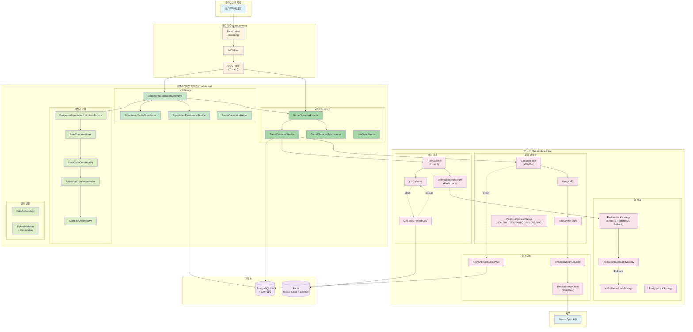

---

## 3. V4 기대값 계산 상세 시퀀스

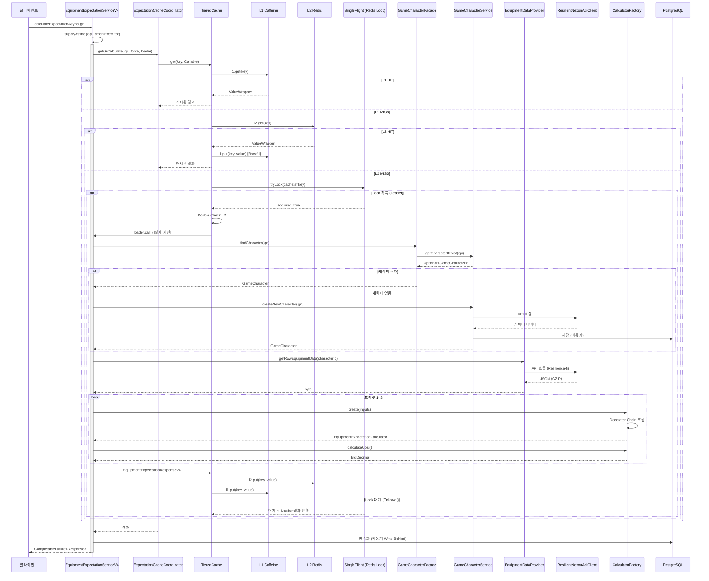

---

## 4. TieredCache 상세 흐름 (실제 코드 기반)

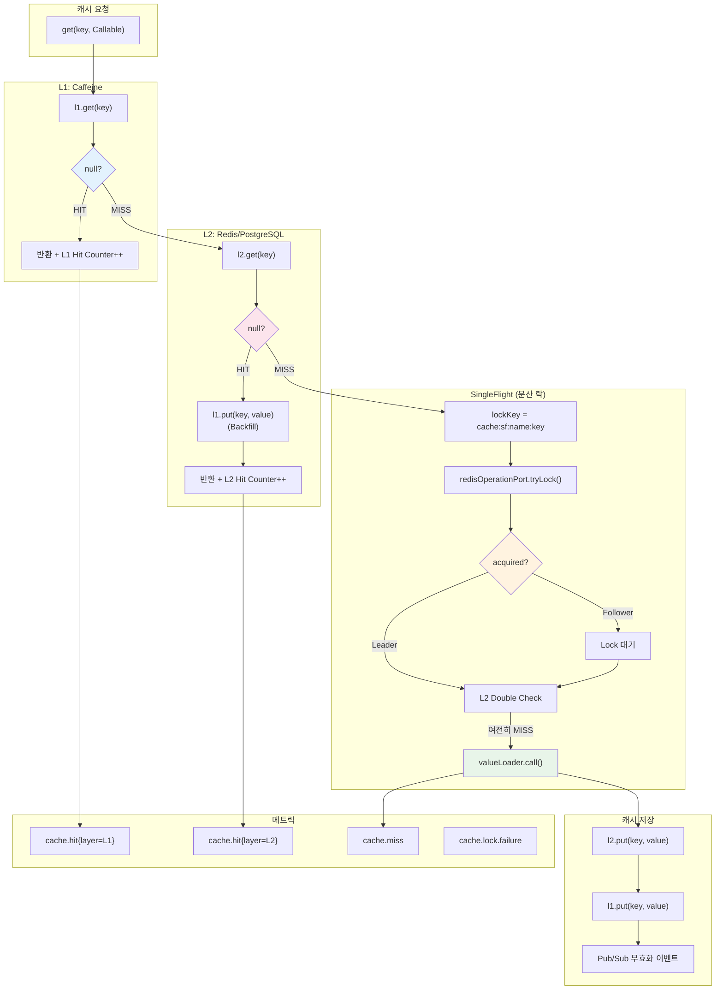

---

## 5. Lock Strategy 선택 다이어그램 (실제 구현 기반)

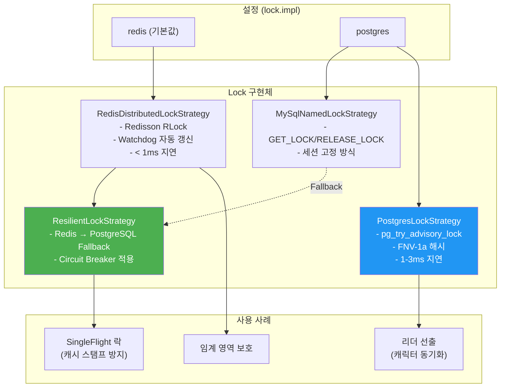

---

## 6. 회복 탄력성 (Resilience4j) 구조

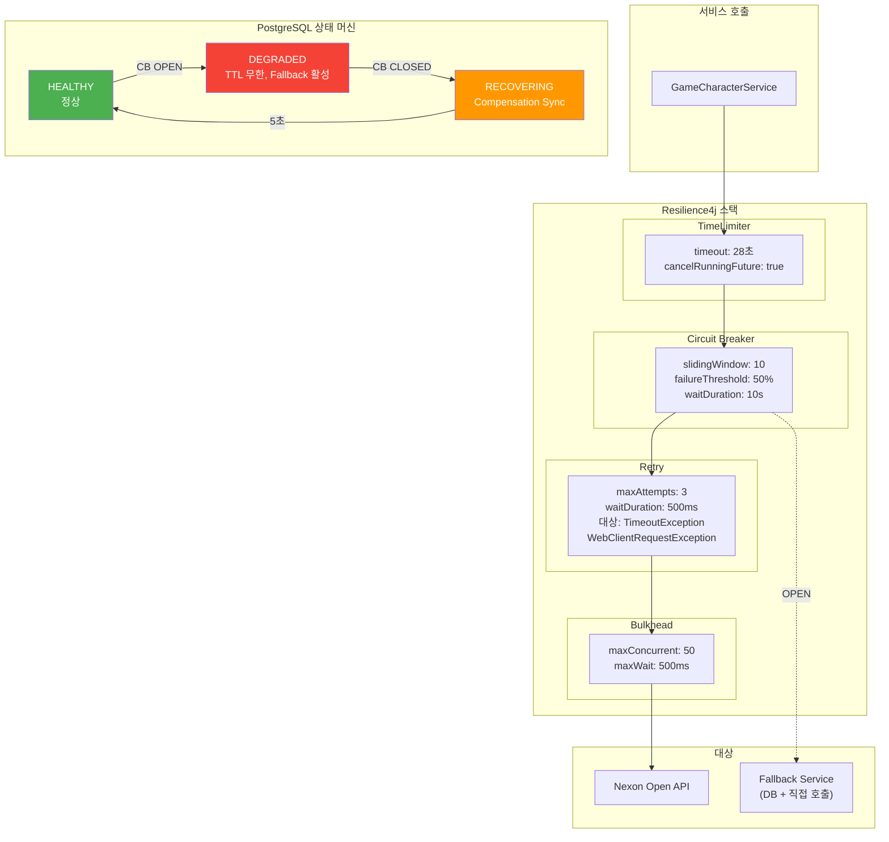

---

## 7. LogicExecutor 실행 패턴 (실제 코드 기반)

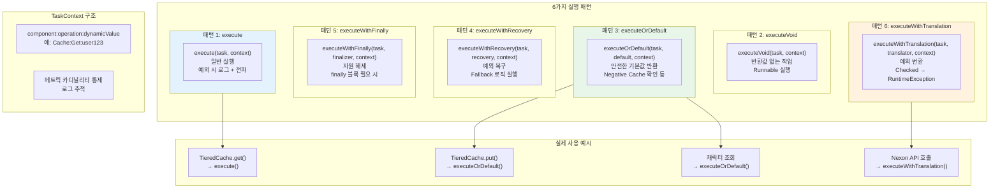

---

## 8. Decorator Chain (V4 계산기)

```mermaid
flowchart LR
    subgraph Factory["EquipmentExpectationCalculatorFactory"]
        Create["create(inputs)"]
    end

    subgraph Chain["Decorator Chain"]
        Base["BaseEquipmentItem<br/>cost = ZERO"]

        subgraph BlackCube["BlackCubeDecoratorV4"]
            BlackLogic["윗잠 블랙큐브<br/>기하분포 기대 시행<br/>Infinity → ZERO"]
        end

        subgraph AddCube["AdditionalCubeDecoratorV4"]
            AddLogic["아랫잠 에디셔널<br/>추가 잠재 옵션"]
        end

        subgraph Starforce["StarforceDecoratorV4"]
            StarLogic["스타포스 0~25성<br/>Lookup Table O(1)<br/>파괴 위험 포함"]
        end
    end

    subgraph Result["결과"]
        CostBreakdown["CostBreakdown<br/>- blackCubeCost<br/>- redCubeCost<br/>- additionalCubeCost<br/>- starforceCost"]
        TotalCost["totalExpectedCost<br/>(BigDecimal)"]
    end

    Create --> Base
    Base -->|"잠재 보유 시"| BlackCube
    BlackCube -->|"추가잠재 보유 시"| AddCube
    AddCube -->|"스타포스 보유 시"| Starforce
    Starforce --> CostBreakdown
    CostBreakdown --> TotalCost

    style Base fill:#e3f2fd
    style BlackCube fill:#1a1a1a,color:#fff
    style AddCube fill:#4caf50,color:#fff
    style Starforce fill:#ff9800,color:#fff
```

---

## 9. PostgreSQL 상태 머신 (Dynamic TTL)

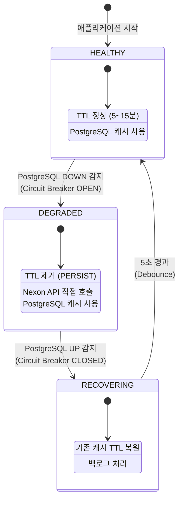

---

## 10. 모듈 의존성 그래프 (DIP 준수)

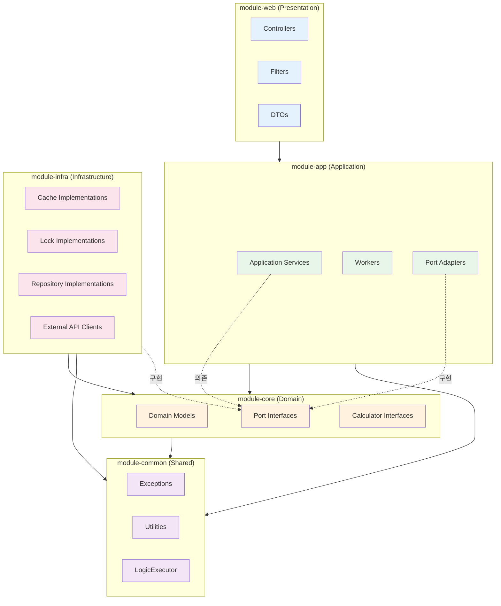

---

## 11. 예외 처리 계층 구조 (실제 구현 기반)

```mermaid
classDiagram
    class BaseException {
        <<abstract>>
        +ErrorCode errorCode
        +String dynamicMessage
    }

    class ClientBaseException {
        <<4xx>>
        +CircuitBreakerIgnoreMarker
    }

    class ServerBaseException {
        <<5xx>>
        +CircuitBreakerRecordMarker
    }

    %% Client Exceptions (4xx)
    class CharacterNotFoundException {
        +ErrorCode.CHARACTER_NOT_FOUND
    }
    class SelfLikeNotAllowedException {
        +ErrorCode.SELF_LIKE_NOT_ALLOWED
    }
    class DuplicateLikeException {
        +ErrorCode.DUPLICATE_LIKE
    }
    class InvalidApiKeyException {
        +ErrorCode.INVALID_API_KEY
    }

    %% Server Exceptions (5xx)
    class ExternalApiException {
        +ErrorCode.EXTERNAL_API_ERROR
    }
    class ApiTimeoutException {
        +ErrorCode.API_TIMEOUT
    }
    class CompressionException {
        +ErrorCode.COMPRESSION_ERROR
    }
    class DistributedLockException {
        +ErrorCode.DISTRIBUTED_LOCK_ERROR
    }

    BaseException <|-- ClientBaseException
    BaseException <|-- ServerBaseException

    ClientBaseException <|-- CharacterNotFoundException
    ClientBaseException <|-- SelfLikeNotAllowedException
    ClientBaseException <|-- DuplicateLikeException
    ClientBaseException <|-- InvalidApiKeyException

    ServerBaseException <|-- ExternalApiException
    ServerBaseException <|-- ApiTimeoutException
    ServerBaseException <|-- CompressionException
    ServerBaseException <|-- DistributedLockException

    note for ClientBaseException "Circuit Breaker가 무시\n(비즈니스 예외)"
    note for ServerBaseException "Circuit Breaker가 기록\n(시스템 장애)"
```

---

## 12. 캐시 무효화 (Pub/Sub)

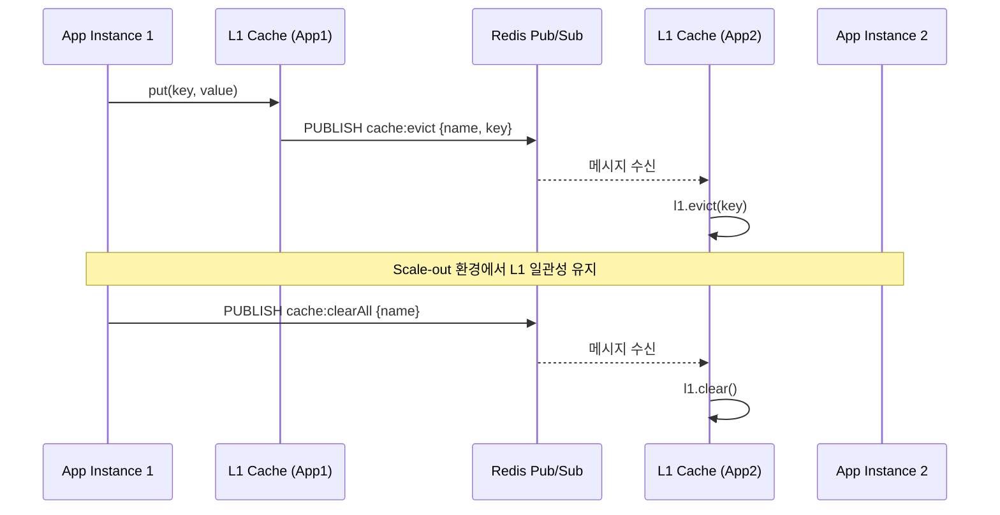

---

## 13. 핵심 설계 패턴 요약

| 패턴 | 적용 위치 | 실제 구현체 |
|------|-----------|-------------|
| **Facade** | V4 서비스 | `EquipmentExpectationServiceV4` |
| **Decorator** | 계산기 | `BaseEquipmentItem` → `BlackCube` → `Additional` → `Starforce` |
| **Strategy** | 락, 결제 | `LockStrategy`, `PaymentStrategy` |
| **Factory** | 계산기 생성 | `EquipmentExpectationCalculatorFactory` |
| **Template Method** | 실행 | `LogicExecutor` (6가지 패턴) |
| **SingleFlight** | 캐시 | `TieredCache` + Redis Lock |
| **Circuit Breaker** | 외부 API | `Resilience4j` + PostgreSQL 상태 머신 |
| **State Machine** | PostgreSQL 상태 | `HEALTHY` → `DEGRADED` → `RECOVERING` |
| **Port-Adapter** | 의존성 역전 | `Core Port` ↔ `Infra Adapter` |
| **Write-Behind** | 영속화 | `ExpectationPersistenceService` |
| **Pub/Sub** | 캐시 무효화 | `RedisCacheInvalidationPublisher/Subscriber` |

---

## 14. 검증 명령어

```bash
# 활성화된 Lock Strategy 확인
curl -s http://localhost:8080/actuator/loggers | jq '.loggers | keys | .[] | select(contains("Lock"))'

# TieredCache 메트릭 확인
curl -s http://localhost:8080/actuator/metrics/cache.hit | jq
curl -s http://localhost:8080/actuator/metrics/cache.miss | jq

# Circuit Breaker 상태 확인
curl -s http://localhost:8080/actuator/health | jq '.components.circuitBreakers'

# V4 서비스 타임아웃 테스트
wrk -t4 -c100 -d30s --latency http://localhost:8080/api/v4/character/test/expectation

# PostgreSQL 상태 확인 (DEGRADED 감지)
curl -s http://localhost:8080/actuator/health | jq '.components.postgresql'
```

---

## 15. 분석 참여 에이전트

| 에이전트 | 분석 영역 | 주요 발견 |
|----------|-----------|-----------|
| **structure-analyzer** | 모듈 구조 | 6개 모듈, DIP 준수 |
| **infra-analyzer** | 인프라 계층 | TieredCache, 4가지 Lock Strategy, PostgreSQL 상태 머신 |
| **business-analyzer** | 비즈니스 서비스 | V4 Facade 분해, LogicExecutor 6패턴, Decorator Chain |
| **api-analyzer** | 외부 API 연동 | Nexon API 4개 엔드포인트, Resilience4j 설정, Fallback |

---

*작성일: 2026-03-10*
*분석 방식: 4개 에이전트 병렬 분석 + 실제 코드 검증*
*다음 검토일: 2026-04-10*
