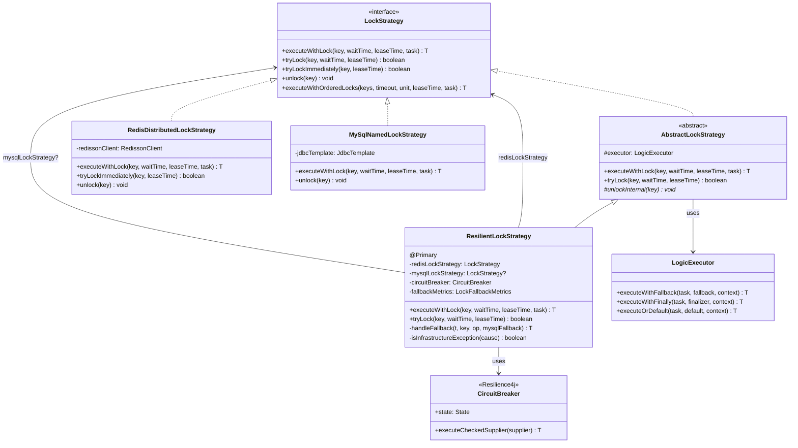
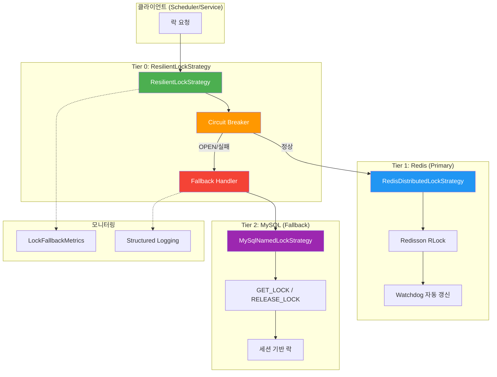
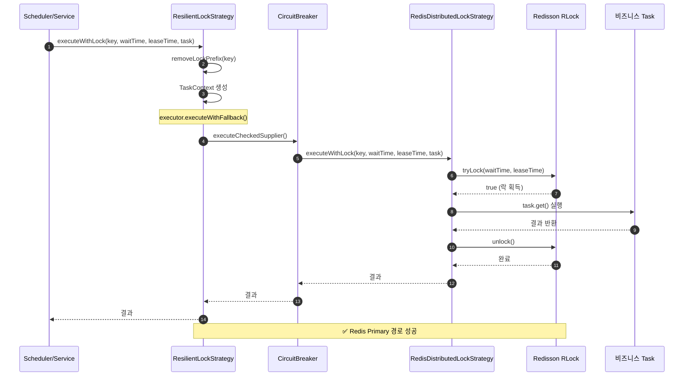
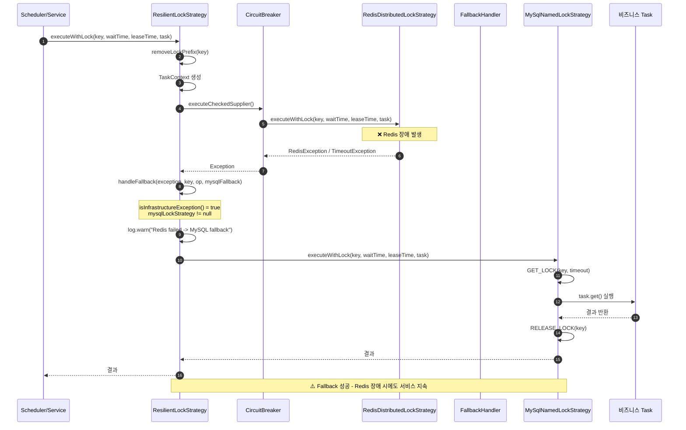
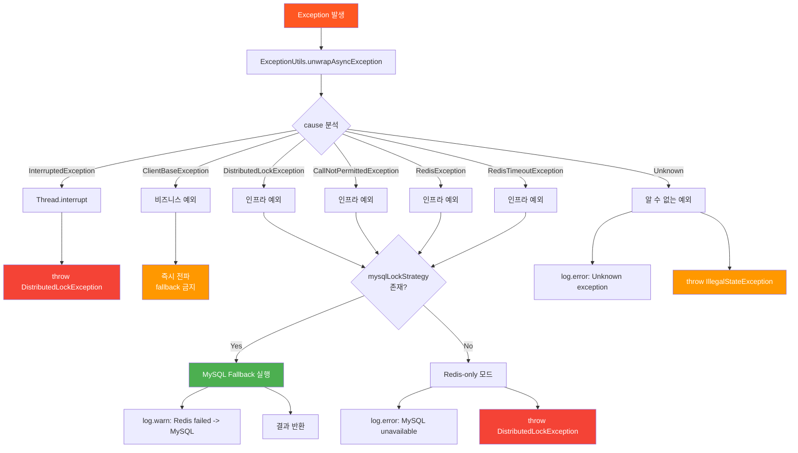
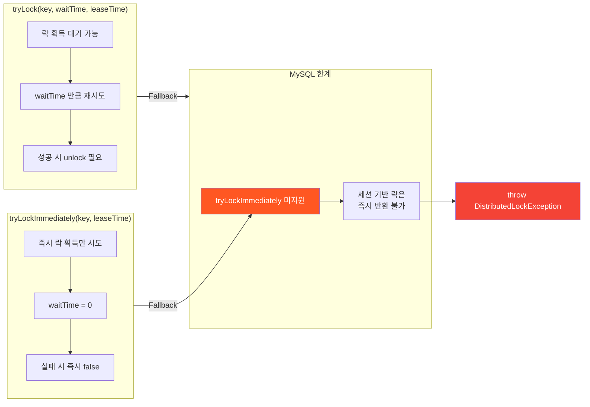
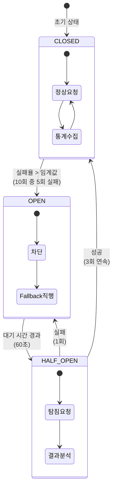
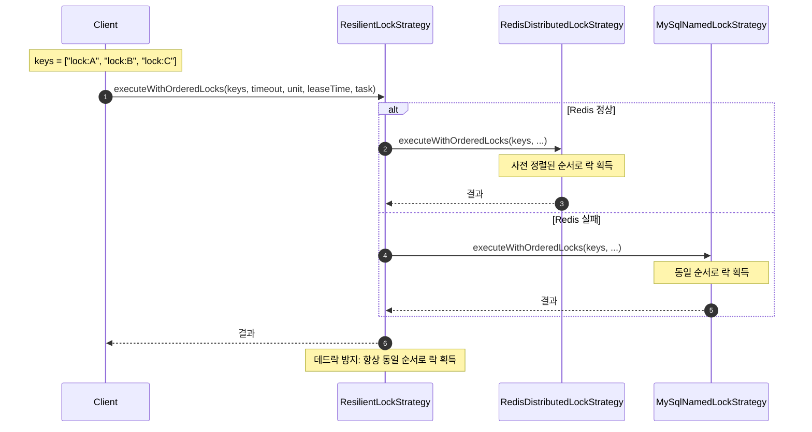
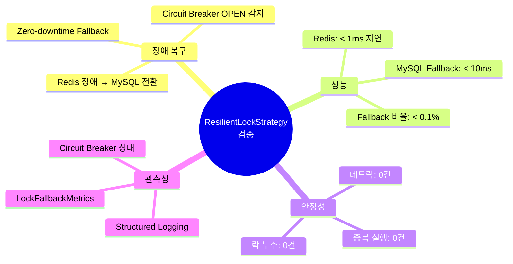

# ResilientLockStrategy 구조 및 흐름 다이어그램

> **작성일:** 2026-02-27
> **소스:** `module-infra/src/main/kotlin/maple/expectation/infrastructure/lock/ResilientLockStrategy.kt`

---

## 1. 아키텍처 개요도 (Class Diagram)

---

## 2. 3-Tier Lock Architecture

---

## 3. executeWithLock 시퀀스 다이어그램 (정상 흐름)

---

## 4. executeWithLock 시퀀스 다이어그램 (Fallback 흐름)

---

## 5. 예외 분기 처리 흐름도

---

## 6. tryLock vs tryLockImmediately 차이

---

## 7. Circuit Breaker 상태 전이

---

## 8. 다중 락 순서 보장 (executeWithOrderedLocks)

---

## 9. 핵심 코드 매핑

| 다이어그램 요소 | 소스 코드 위치 |
|----------------|---------------|
| `ResilientLockStrategy` | `ResilientLockStrategy.kt:29` |
| `executeWithLock` | `ResilientLockStrategy.kt:55-81` |
| `handleFallback` | `ResilientLockStrategy.kt:165-223` |
| `isInfrastructureException` | `ResilientLockStrategy.kt:150-155` |
| `tryLock` | `ResilientLockStrategy.kt:86-100` |
| `handleTryLockFallback` | `ResilientLockStrategy.kt:105-143` |
| `executeWithOrderedLocks` | `ResilientLockStrategy.kt:278-312` |
| `CircuitBreaker` | `Resilience4j CircuitBreakerRegistry` |
| `LogicExecutor` | `LogicExecutor.kt` |

---

## 10. 프로덕션 검증 포인트

---

## 참조 문서

- [Lock Strategy Guide](../03_Technical_Guides/lock-strategy.md)
- [ADR-006: Redis Lock Lease Timeout HA](../01_ADR/ADR-006-redis-lock (ARCHIVED: docs/_archive/redis-deprecated/).md)
- [ADR-310: Redis Lock Migration](../01_ADR/ADR-310-redis-lock-migration.md)
