# Scheduler Data Flow Diagrams

> 프로젝트 내 모든 스케줄러의 데이터플로우를 시각화한 문서

## 목차

1. [Scheduler Overview](#1-scheduler-overview)
2. [Data Collection Pipeline](#2-data-collection-pipeline)
3. [Cache & Warmup Pipeline](#3-cache--warmup-pipeline)
4. [Like Sync Pipeline](#4-like-sync-pipeline)
5. [Outbox Pattern Pipeline](#5-outbox-pattern-pipeline)
6. [Buffer Recovery Pipeline](#6-buffer-recovery-pipeline)
7. [Monitoring Pipeline](#7-monitoring-pipeline)
8. [Batch Recovery Pipeline](#8-batch-recovery-pipeline)
9. [Janitor & Lifecycle Pipeline](#9-janitor--lifecycle-pipeline)
10. [PGMQ Worker Pipeline](#10-pgmq-worker-pipeline)

---

## 1. Scheduler Overview

### 전체 스케줄러 목록

| 카테고리 | 스케줄러 | 주기 | 역할 |
|---------|---------|------|------|
| Data Collection | NexonApiCollectorScheduler | 5분 | Nexon API 데이터 수집 |
| Data Collection | NexonDataCollectionScheduler | 10분 | Nexon API 데이터 수집 (대체) |
| Data Collection | BatchWriter | 5초 | 큐 → DB 배치 저장 |
| Cache/Warmup | PopularCharacterWarmupScheduler | 매일 5시 + 초기 30초 | 인기 캐릭터 캐시 웜업 |
| Cache/Warmup | ExpectationCalculationScheduler | 1시간 | 전체 사용자 계산 태스크 생성 |
| Like Sync | LikeSyncScheduler.localFlush | 3초 | L1 → L2 Flush |
| Like Sync | LikeSyncScheduler.globalSyncCount | 5초 | L2 → L3 Count 동기화 |
| Like Sync | LikeSyncScheduler.globalSyncRelation | 10초 | L2 → L3 Relation 동기화 |
| Outbox | EventOutboxScheduler | 10초/60초/5분 | 이벤트 아웃박스 처리 |
| Outbox | NexonApiOutboxScheduler | 10초/5분 | Nexon API 아웃박스 처리 |
| Outbox | OutboxScheduler | 15초/60초/5분 | 일반 아웃박스 처리 |
| Buffer | BufferRecoveryScheduler | 10초/60초 | 버퍼 복구 |
| Buffer | ExpectationBatchWriteScheduler | 5초 | Expectation 버퍼 → DB |
| Monitoring | MonitoringCopilotScheduler | 15초 | 이상 징후 감지 |
| Batch | BatchJobRecoveryScheduler | 60초 | 실패 배치 재시도 |
| Janitor | StreamJanitorScheduler | 5분 | PEL Orphaned 메시지 정리 |
| Lifecycle | ExpectationBatchShutdownHandler | 종료 시 | 버퍼 Flush |
| PGMQ | PgmqWorker | 1초 | PGMQ 메시지 처리 |

### 전체 아키텍처 다이어그램


```mermaid
flowchart TB
    subgraph External["외부 시스템"]
        NexonAPI[Nexon Open API]
        Discord[Discord Webhook]
    end

    subgraph Schedulers["스케줄러 레이어"]
        subgraph Collection["데이터 수집"]
            NAC[NexonApiCollectorScheduler<br/>5분]
            NDC[NexonDataCollectionScheduler<br/>10분]
            BW[BatchWriter<br/>5초]
        end

        subgraph CacheWarmup["캐시/웜업"]
            PCW[PopularCharacterWarmupScheduler<br/>매일 5시]
            ECS[ExpectationCalculationScheduler<br/>1시간]
        end

        subgraph LikeSync["좋아요 동기화"]
            LSS[LikeSyncScheduler<br/>3s/5s/10s]
        end

        subgraph OutboxPattern["아웃박스 패턴"]
            EOS[EventOutboxScheduler<br/>10s/60s/5m]
            NAOS[NexonApiOutboxScheduler<br/>10s/5m]
            OS[OutboxScheduler<br/>15s/60s/5m]
        end

        subgraph BufferMgmt["버퍼 관리"]
            BRS[BufferRecoveryScheduler<br/>10s/60s]
            EBWS[ExpectationBatchWriteScheduler<br/>5s]
        end

        subgraph Monitoring["모니터링"]
            MCS[MonitoringCopilotScheduler<br/>15s]
        end

        subgraph Recovery["복구"]
            BJRS[BatchJobRecoveryScheduler<br/>60s]
            SJS[StreamJanitorScheduler<br/>5분]
        end
    end

    subgraph Storage["저장소"]
        Redis[(Redis)]
        MySQL[(MySQL)]
        PGMQ[(PGMQ Queue)]
    end

    NexonAPI --> NAC
    NexonAPI --> NDC
    NAC --> Redis
    NDC --> Redis
    BW --> MySQL
    Redis --> LSS
    LSS --> MySQL
    Redis --> BRS
    BRS --> Redis
    EOS --> MySQL
    NAOS --> MySQL
    OS --> MySQL
    EBWS --> MySQL
    MCS --> Discord
    BJRS --> MySQL
    SJS --> Redis
    PCW --> Redis
    ECS --> PGMQ
```

---

## 2. Data Collection Pipeline

### 2.1 NexonApiCollectorScheduler (5분)

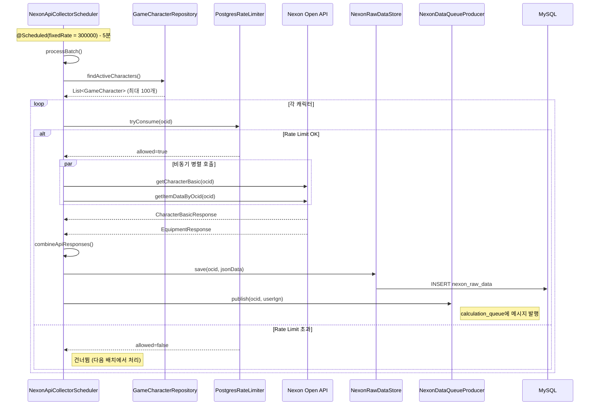
```mermaid
sequenceDiagram
    participant Scheduler as NexonApiCollectorScheduler
    participant GameCharRepo as GameCharacterRepository
    participant RateLimiter as PostgresRateLimiter
    participant NexonAPI as Nexon Open API
    participant RawDataStore as NexonRawDataStore
    participant QueueProducer as NexonDataQueueProducer
    participant DB as MySQL

    Note over Scheduler: @Scheduled(fixedRate = 300000) - 5분

    Scheduler->>Scheduler: processBatch()
    Scheduler->>GameCharRepo: findActiveCharacters()
    GameCharRepo-->>Scheduler: List<GameCharacter> (최대 100개)

    loop 각 캐릭터
        Scheduler->>RateLimiter: tryConsume(ocid)

        alt Rate Limit OK
            RateLimiter-->>Scheduler: allowed=true

            par 비동기 병렬 호출
                Scheduler->>NexonAPI: getCharacterBasic(ocid)
                Scheduler->>NexonAPI: getItemDataByOcid(ocid)
            end

            NexonAPI-->>Scheduler: CharacterBasicResponse
            NexonAPI-->>Scheduler: EquipmentResponse

            Scheduler->>Scheduler: combineApiResponses()
            Scheduler->>RawDataStore: save(ocid, jsonData)
            RawDataStore->>DB: INSERT nexon_raw_data

            Scheduler->>QueueProducer: publish(ocid, userIgn)
            Note right of QueueProducer: calculation_queue에 메시지 발행
        else Rate Limit 초과
            RateLimiter-->>Scheduler: allowed=false
            Note right of Scheduler: 건너뜀 (다음 배치에서 처리)
        end
    end
```

### 2.2 NexonDataCollectionScheduler (10분)

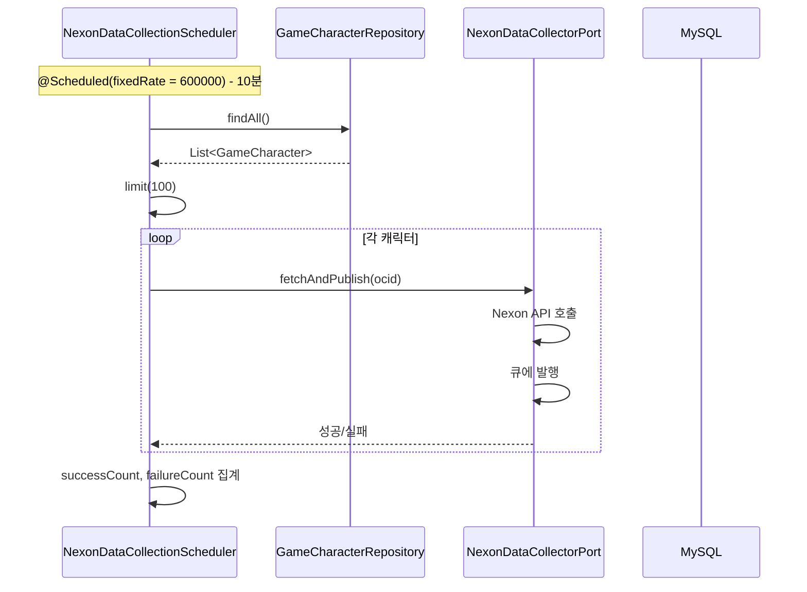
```mermaid
sequenceDiagram
    participant Scheduler as NexonDataCollectionScheduler
    participant GameCharRepo as GameCharacterRepository
    participant DataCollector as NexonDataCollectorPort
    participant DB as MySQL

    Note over Scheduler: @Scheduled(fixedRate = 600000) - 10분

    Scheduler->>GameCharRepo: findAll()
    GameCharRepo-->>Scheduler: List<GameCharacter>

    Scheduler->>Scheduler: limit(100)

    loop 각 캐릭터
        Scheduler->>DataCollector: fetchAndPublish(ocid)
        DataCollector->>DataCollector: Nexon API 호출
        DataCollector->>DataCollector: 큐에 발행
        DataCollector-->>Scheduler: 성공/실패
    end

    Scheduler->>Scheduler: successCount, failureCount 집계
```

### 2.3 BatchWriter (5초)

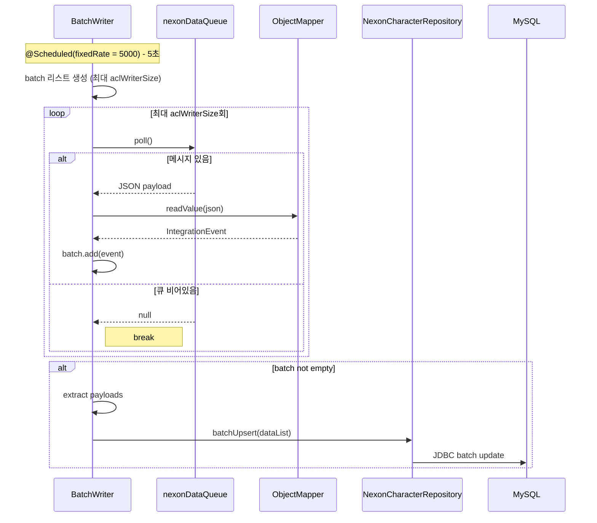
```mermaid
sequenceDiagram
    participant Scheduler as BatchWriter
    participant MessageQueue as nexonDataQueue
    participant ObjectMapper as ObjectMapper
    participant Repository as NexonCharacterRepository
    participant DB as MySQL

    Note over Scheduler: @Scheduled(fixedRate = 5000) - 5초

    Scheduler->>Scheduler: batch 리스트 생성 (최대 aclWriterSize)

    loop 최대 aclWriterSize회
        Scheduler->>MessageQueue: poll()
        alt 메시지 있음
            MessageQueue-->>Scheduler: JSON payload
            Scheduler->>ObjectMapper: readValue(json)
            ObjectMapper-->>Scheduler: IntegrationEvent
            Scheduler->>Scheduler: batch.add(event)
        else 큐 비어있음
            MessageQueue-->>Scheduler: null
            Note right of Scheduler: break
        end
    end

    alt batch not empty
        Scheduler->>Scheduler: extract payloads
        Scheduler->>Repository: batchUpsert(dataList)
        Repository->>DB: JDBC batch update
    end
```

---

## 3. Cache & Warmup Pipeline

### 3.1 PopularCharacterWarmupScheduler (매일 5시 + 초기 30초)

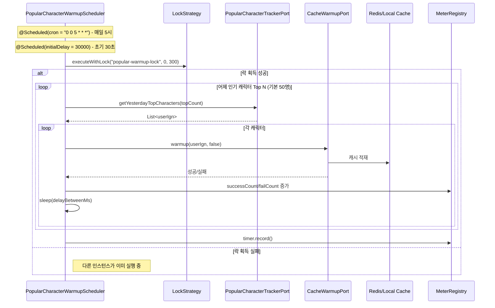
```mermaid
sequenceDiagram
    participant Scheduler as PopularCharacterWarmupScheduler
    participant LockStrategy as LockStrategy
    participant Tracker as PopularCharacterTrackerPort
    participant WarmupPort as CacheWarmupPort
    participant Cache as Redis/Local Cache
    participant Metrics as MeterRegistry

    Note over Scheduler: @Scheduled(cron = "0 0 5 * * *") - 매일 5시
    Note over Scheduler: @Scheduled(initialDelay = 30000) - 초기 30초

    Scheduler->>LockStrategy: executeWithLock("popular-warmup-lock", 0, 300)

    alt 락 획득 성공
        loop 어제 인기 캐릭터 Top N (기본 50명)
            Scheduler->>Tracker: getYesterdayTopCharacters(topCount)
            Tracker-->>Scheduler: List<userIgn>

            loop 각 캐릭터
                Scheduler->>WarmupPort: warmup(userIgn, false)
                WarmupPort->>Cache: 캐시 적재
                WarmupPort-->>Scheduler: 성공/실패
                Scheduler->>Metrics: successCount/failCount 증가
                Scheduler->>Scheduler: sleep(delayBetweenMs)
            end
        end

        Scheduler->>Metrics: timer.record()
    else 락 획득 실패
        Note right of Scheduler: 다른 인스턴스가 이미 실행 중
    end
```

### 3.2 ExpectationCalculationScheduler (1시간)

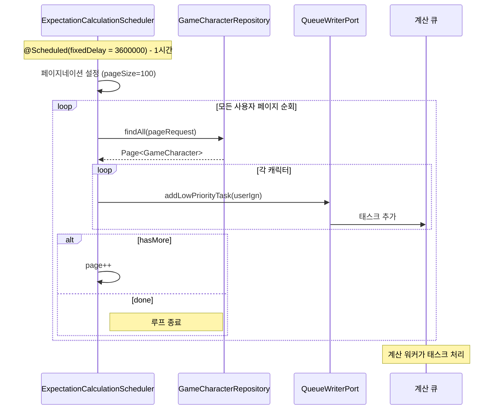
```mermaid
sequenceDiagram
    participant Scheduler as ExpectationCalculationScheduler
    participant GameCharRepo as GameCharacterRepository
    participant QueueWriter as QueueWriterPort
    participant Queue as 계산 큐

    Note over Scheduler: @Scheduled(fixedDelay = 3600000) - 1시간

    Scheduler->>Scheduler: 페이지네이션 설정 (pageSize=100)

    loop 모든 사용자 페이지 순회
        Scheduler->>GameCharRepo: findAll(pageRequest)
        GameCharRepo-->>Scheduler: Page<GameCharacter>

        loop 각 캐릭터
            Scheduler->>QueueWriter: addLowPriorityTask(userIgn)
            QueueWriter->>Queue: 태스크 추가
        end

        alt hasMore
            Scheduler->>Scheduler: page++
        else done
            Note right of Scheduler: 루프 종료
        end
    end

    Note over Queue: 계산 워커가 태스크 처리
```

---

## 4. Like Sync Pipeline

### 4.1 LikeSyncScheduler (3초/5초/10초)

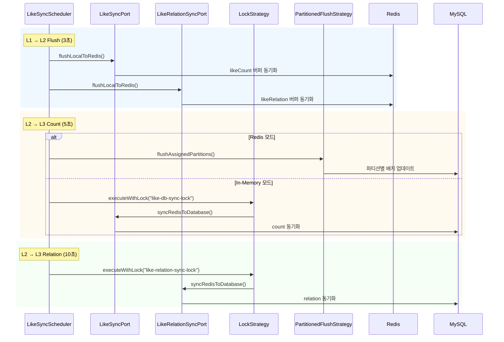
```mermaid
sequenceDiagram
    participant Scheduler as LikeSyncScheduler
    participant LikeSyncPort as LikeSyncPort
    participant LikeRelationPort as LikeRelationSyncPort
    participant LockStrategy as LockStrategy
    participant PartitionedFlush as PartitionedFlushStrategy
    participant Redis as Redis
    participant DB as MySQL

    rect rgb(240, 248, 255)
        Note over Scheduler: L1 → L2 Flush (3초)
        Scheduler->>LikeSyncPort: flushLocalToRedis()
        LikeSyncPort->>Redis: likeCount 버퍼 동기화

        Scheduler->>LikeRelationPort: flushLocalToRedis()
        LikeRelationPort->>Redis: likeRelation 버퍼 동기화
    end

    rect rgb(255, 250, 240)
        Note over Scheduler: L2 → L3 Count (5초)
        alt Redis 모드
            Scheduler->>PartitionedFlush: flushAssignedPartitions()
            PartitionedFlush->>DB: 파티션별 배치 업데이트
        else In-Memory 모드
            Scheduler->>LockStrategy: executeWithLock("like-db-sync-lock")
            LockStrategy->>LikeSyncPort: syncRedisToDatabase()
            LikeSyncPort->>DB: count 동기화
        end
    end

    rect rgb(245, 255, 245)
        Note over Scheduler: L2 → L3 Relation (10초)
        Scheduler->>LockStrategy: executeWithLock("like-relation-sync-lock")
        LockStrategy->>LikeRelationPort: syncRedisToDatabase()
        LikeRelationPort->>DB: relation 동기화
    end
```

### 4.2 Like Sync 계층 구조

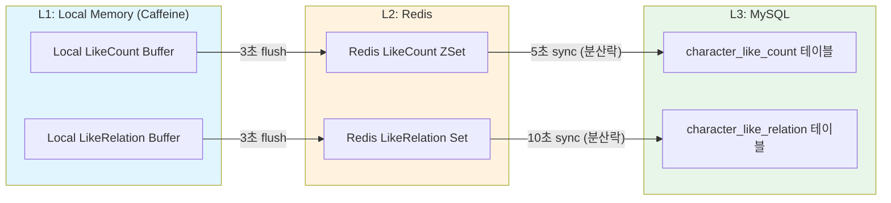
```mermaid
flowchart LR
    subgraph L1["L1: Local Memory (Caffeine)"]
        LC1[Local LikeCount Buffer]
        LR1[Local LikeRelation Buffer]
    end

    subgraph L2["L2: Redis"]
        LC2[Redis LikeCount ZSet]
        LR2[Redis LikeRelation Set]
    end

    subgraph L3["L3: MySQL"]
        LC3[character_like_count 테이블]
        LR3[character_like_relation 테이블]
    end

    LC1 -->|"3초 flush"| LC2
    LR1 -->|"3초 flush"| LR2

    LC2 -->|"5초 sync (분산락)"| LC3
    LR2 -->|"10초 sync (분산락)"| LR3

    style L1 fill:#e1f5fe
    style L2 fill:#fff3e0
    style L3 fill:#e8f5e9
```

---

## 5. Outbox Pattern Pipeline

### 5.1 EventOutboxScheduler (10초/60초/5분)

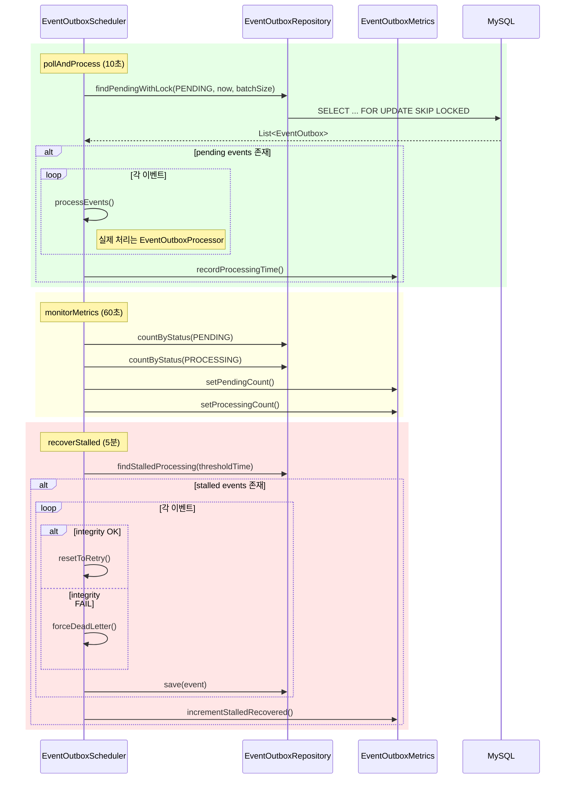
```mermaid
sequenceDiagram
    participant Scheduler as EventOutboxScheduler
    participant Repo as EventOutboxRepository
    participant Metrics as EventOutboxMetrics
    participant DB as MySQL

    rect rgb(230, 255, 230)
        Note over Scheduler: pollAndProcess (10초)
        Scheduler->>Repo: findPendingWithLock(PENDING, now, batchSize)
        Repo->>DB: SELECT ... FOR UPDATE SKIP LOCKED
        DB-->>Scheduler: List<EventOutbox>

        alt pending events 존재
            loop 각 이벤트
                Scheduler->>Scheduler: processEvents()
                Note right of Scheduler: 실제 처리는 EventOutboxProcessor
            end
            Scheduler->>Metrics: recordProcessingTime()
        end
    end

    rect rgb(255, 255, 230)
        Note over Scheduler: monitorMetrics (60초)
        Scheduler->>Repo: countByStatus(PENDING)
        Scheduler->>Repo: countByStatus(PROCESSING)
        Scheduler->>Metrics: setPendingCount()
        Scheduler->>Metrics: setProcessingCount()
    end

    rect rgb(255, 230, 230)
        Note over Scheduler: recoverStalled (5분)
        Scheduler->>Repo: findStalledProcessing(thresholdTime)

        alt stalled events 존재
            loop 각 이벤트
                alt integrity OK
                    Scheduler->>Scheduler: resetToRetry()
                else integrity FAIL
                    Scheduler->>Scheduler: forceDeadLetter()
                end
                Scheduler->>Repo: save(event)
            end
            Scheduler->>Metrics: incrementStalledRecovered()
        end
    end
```

### 5.2 NexonApiOutboxScheduler (10초/5분)

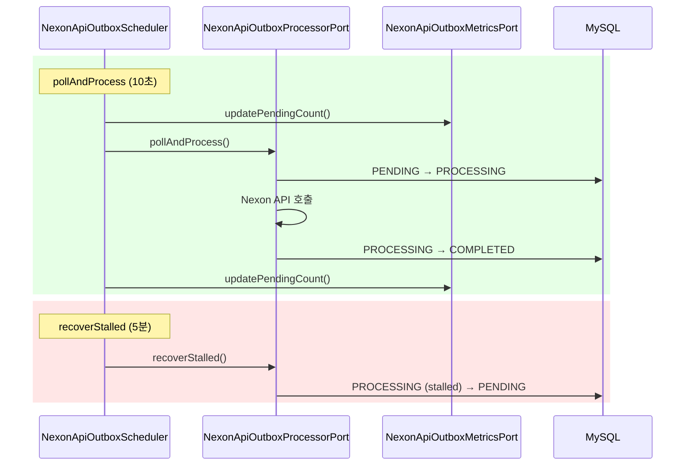
```mermaid
sequenceDiagram
    participant Scheduler as NexonApiOutboxScheduler
    participant Processor as NexonApiOutboxProcessorPort
    participant Metrics as NexonApiOutboxMetricsPort
    participant DB as MySQL

    rect rgb(230, 255, 230)
        Note over Scheduler: pollAndProcess (10초)
        Scheduler->>Metrics: updatePendingCount()
        Scheduler->>Processor: pollAndProcess()
        Processor->>DB: PENDING → PROCESSING
        Processor->>Processor: Nexon API 호출
        Processor->>DB: PROCESSING → COMPLETED
        Scheduler->>Metrics: updatePendingCount()
    end

    rect rgb(255, 230, 230)
        Note over Scheduler: recoverStalled (5분)
        Scheduler->>Processor: recoverStalled()
        Processor->>DB: PROCESSING (stalled) → PENDING
    end
```

### 5.3 OutboxScheduler (15초/60초/5분)

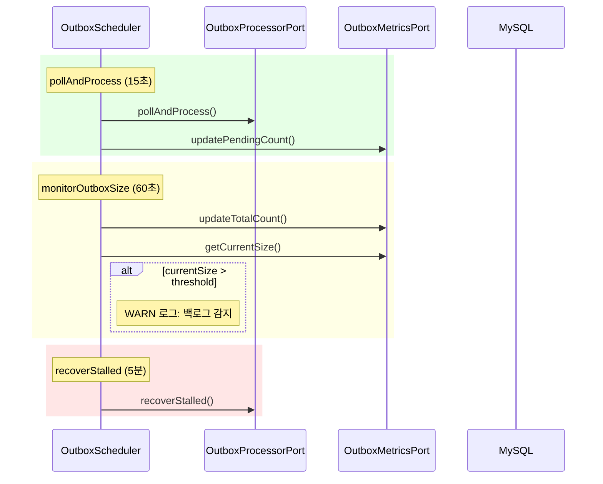
```mermaid
sequenceDiagram
    participant Scheduler as OutboxScheduler
    participant Processor as OutboxProcessorPort
    participant Metrics as OutboxMetricsPort
    participant DB as MySQL

    rect rgb(230, 255, 230)
        Note over Scheduler: pollAndProcess (15초)
        Scheduler->>Processor: pollAndProcess()
        Scheduler->>Metrics: updatePendingCount()
    end

    rect rgb(255, 255, 230)
        Note over Scheduler: monitorOutboxSize (60초)
        Scheduler->>Metrics: updateTotalCount()
        Scheduler->>Metrics: getCurrentSize()

        alt currentSize > threshold
            Note right of Scheduler: WARN 로그: 백로그 감지
        end
    end

    rect rgb(255, 230, 230)
        Note over Scheduler: recoverStalled (5분)
        Scheduler->>Processor: recoverStalled()
    end
```

---

## 6. Buffer Recovery Pipeline

### 6.1 BufferRecoveryScheduler (10초/60초)

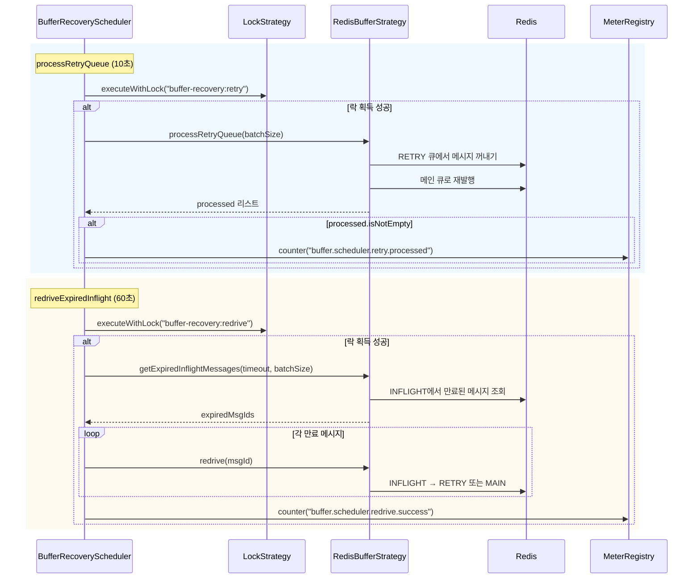
```mermaid
sequenceDiagram
    participant Scheduler as BufferRecoveryScheduler
    participant LockStrategy as LockStrategy
    participant BufferStrategy as RedisBufferStrategy
    participant Redis as Redis
    participant Metrics as MeterRegistry

    rect rgb(240, 248, 255)
        Note over Scheduler: processRetryQueue (10초)
        Scheduler->>LockStrategy: executeWithLock("buffer-recovery:retry")

        alt 락 획득 성공
            Scheduler->>BufferStrategy: processRetryQueue(batchSize)
            BufferStrategy->>Redis: RETRY 큐에서 메시지 꺼내기
            BufferStrategy->>Redis: 메인 큐로 재발행
            BufferStrategy-->>Scheduler: processed 리스트

            alt processed.isNotEmpty
                Scheduler->>Metrics: counter("buffer.scheduler.retry.processed")
            end
        end
    end

    rect rgb(255, 250, 240)
        Note over Scheduler: redriveExpiredInflight (60초)
        Scheduler->>LockStrategy: executeWithLock("buffer-recovery:redrive")

        alt 락 획득 성공
            Scheduler->>BufferStrategy: getExpiredInflightMessages(timeout, batchSize)
            BufferStrategy->>Redis: INFLIGHT에서 만료된 메시지 조회
            BufferStrategy-->>Scheduler: expiredMsgIds

            loop 각 만료 메시지
                Scheduler->>BufferStrategy: redrive(msgId)
                BufferStrategy->>Redis: INFLIGHT → RETRY 또는 MAIN
            end

            Scheduler->>Metrics: counter("buffer.scheduler.redrive.success")
        end
    end
```

### 6.2 Buffer 상태 전이도

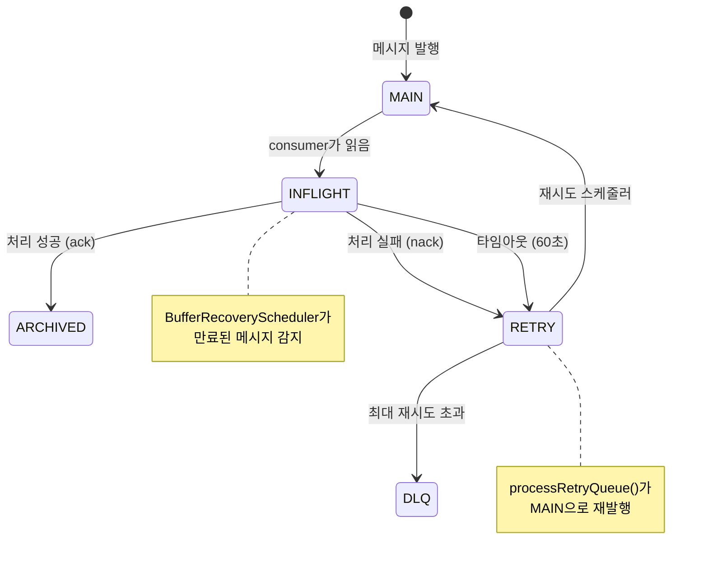
```mermaid
stateDiagram-v2
    [*] --> MAIN: 메시지 발행
    MAIN --> INFLIGHT: consumer가 읽음
    INFLIGHT --> ARCHIVED: 처리 성공 (ack)
    INFLIGHT --> RETRY: 처리 실패 (nack)
    INFLIGHT --> RETRY: 타임아웃 (60초)
    RETRY --> MAIN: 재시도 스케줄러
    RETRY --> DLQ: 최대 재시도 초과

    note right of INFLIGHT
        BufferRecoveryScheduler가
        만료된 메시지 감지
    end note

    note right of RETRY
        processRetryQueue()가
        MAIN으로 재발행
    end note
```

### 6.3 ExpectationBatchWriteScheduler (5초)

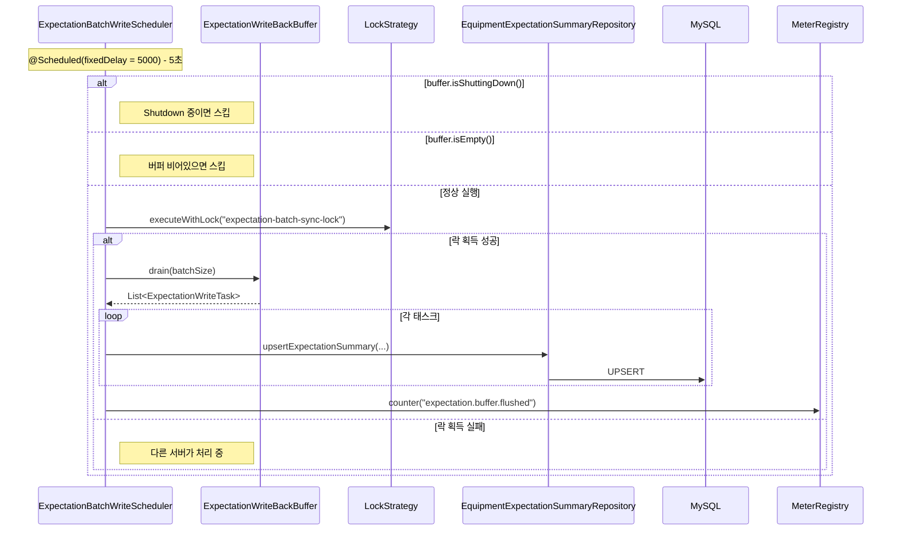
```mermaid
sequenceDiagram
    participant Scheduler as ExpectationBatchWriteScheduler
    participant Buffer as ExpectationWriteBackBuffer
    participant LockStrategy as LockStrategy
    participant Repository as EquipmentExpectationSummaryRepository
    participant DB as MySQL
    participant Metrics as MeterRegistry

    Note over Scheduler: @Scheduled(fixedDelay = 5000) - 5초

    alt buffer.isShuttingDown()
        Note right of Scheduler: Shutdown 중이면 스킵
    else buffer.isEmpty()
        Note right of Scheduler: 버퍼 비어있으면 스킵
    else 정상 실행
        Scheduler->>LockStrategy: executeWithLock("expectation-batch-sync-lock")

        alt 락 획득 성공
            Scheduler->>Buffer: drain(batchSize)
            Buffer-->>Scheduler: List<ExpectationWriteTask>

            loop 각 태스크
                Scheduler->>Repository: upsertExpectationSummary(...)
                Repository->>DB: UPSERT
            end

            Scheduler->>Metrics: counter("expectation.buffer.flushed")
        else 락 획득 실패
            Note right of Scheduler: 다른 서버가 처리 중
        end
    end
```

---

## 7. Monitoring Pipeline

### 7.1 MonitoringCopilotScheduler (15초)

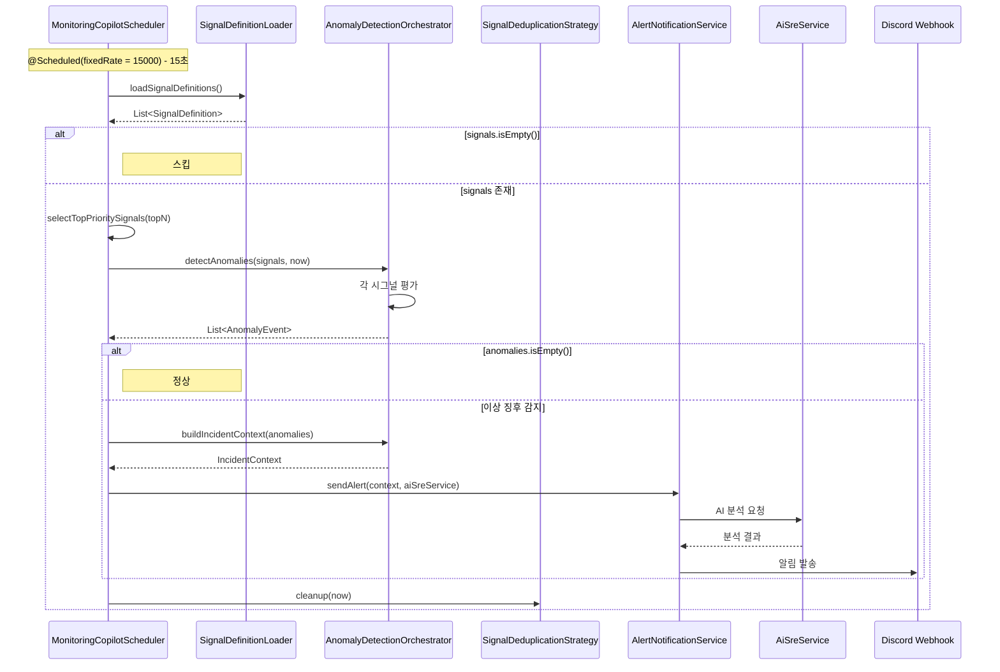
```mermaid
sequenceDiagram
    participant Scheduler as MonitoringCopilotScheduler
    participant SignalLoader as SignalDefinitionLoader
    participant Orchestrator as AnomalyDetectionOrchestrator
    participant DedupStrategy as SignalDeduplicationStrategy
    participant AlertService as AlertNotificationService
    participant AiSre as AiSreService
    participant Discord as Discord Webhook

    Note over Scheduler: @Scheduled(fixedRate = 15000) - 15초

    Scheduler->>SignalLoader: loadSignalDefinitions()
    SignalLoader-->>Scheduler: List<SignalDefinition>

    alt signals.isEmpty()
        Note right of Scheduler: 스킵
    else signals 존재
        Scheduler->>Scheduler: selectTopPrioritySignals(topN)

        Scheduler->>Orchestrator: detectAnomalies(signals, now)
        Orchestrator->>Orchestrator: 각 시그널 평가
        Orchestrator-->>Scheduler: List<AnomalyEvent>

        alt anomalies.isEmpty()
            Note right of Scheduler: 정상
        else 이상 징후 감지
            Scheduler->>Orchestrator: buildIncidentContext(anomalies)
            Orchestrator-->>Scheduler: IncidentContext

            Scheduler->>AlertService: sendAlert(context, aiSreService)
            AlertService->>AiSre: AI 분석 요청
            AiSre-->>AlertService: 분석 결과
            AlertService->>Discord: 알림 발송
        end

        Scheduler->>DedupStrategy: cleanup(now)
    end
```

---

## 8. Batch Recovery Pipeline

### 8.1 BatchJobRecoveryScheduler (60초)

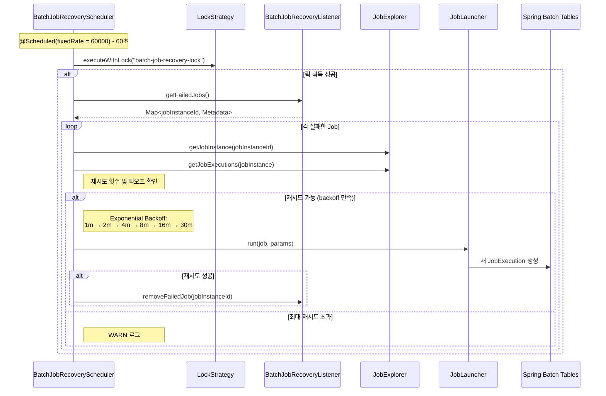
```mermaid
sequenceDiagram
    participant Scheduler as BatchJobRecoveryScheduler
    participant LockStrategy as LockStrategy
    participant RecoveryListener as BatchJobRecoveryListener
    participant JobExplorer as JobExplorer
    participant JobLauncher as JobLauncher
    participant DB as Spring Batch Tables

    Note over Scheduler: @Scheduled(fixedRate = 60000) - 60초

    Scheduler->>LockStrategy: executeWithLock("batch-job-recovery-lock")

    alt 락 획득 성공
        Scheduler->>RecoveryListener: getFailedJobs()
        RecoveryListener-->>Scheduler: Map<jobInstanceId, Metadata>

        loop 각 실패한 Job
            Scheduler->>JobExplorer: getJobInstance(jobInstanceId)
            Scheduler->>JobExplorer: getJobExecutions(jobInstance)

            Note right of Scheduler: 재시도 횟수 및 백오프 확인

            alt 재시도 가능 (backoff 만족)
                Note right of Scheduler: Exponential Backoff:<br/>1m → 2m → 4m → 8m → 16m → 30m

                Scheduler->>JobLauncher: run(job, params)
                JobLauncher->>DB: 새 JobExecution 생성

                alt 재시도 성공
                    Scheduler->>RecoveryListener: removeFailedJob(jobInstanceId)
                end
            else 최대 재시도 초과
                Note right of Scheduler: WARN 로그
            end
        end
    end
```

### 8.2 Exponential Backoff 전략

```mermaid
flowchart TD
    A[Job 실패 감지] --> B{실패 횟수 확인}
    B -->|failedCount >= 5| C[최대 재시도 초과<br/>스킵]
    B -->|failedCount < 5| D{Backoff 대기 확인}

    D -->|대기 시간 미충족| E[스킵<br/>다음 사이클에서 재확인]
    D -->|대기 시간 충족| F[Job 재시작]

    F --> G{재시작 결과}
    G -->|성공| H[RecoveryListener에서 제거]
    G -->|실패| I[실패 횟수 증가]

    I --> B

    subgraph Backoff_Calculation["Backoff 계산 (2^n 분)"]
        J1[Attempt 1: 1분]
        J2[Attempt 2: 2분]
        J3[Attempt 3: 4분]
        J4[Attempt 4: 8분]
        J5[Attempt 5: 16분]
        J6[After: 30분 (max)]
    end
```

---

## 9. Janitor & Lifecycle Pipeline

### 9.1 StreamJanitorScheduler (5분)

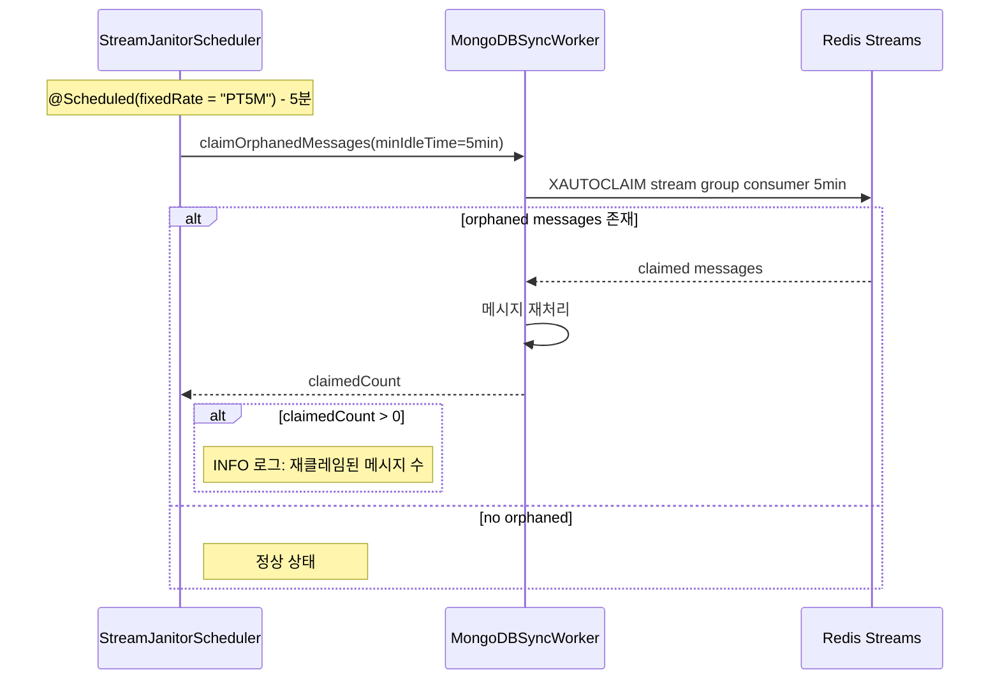
```mermaid
sequenceDiagram
    participant Scheduler as StreamJanitorScheduler
    participant Worker as MongoDBSyncWorker
    participant Redis as Redis Streams

    Note over Scheduler: @Scheduled(fixedRate = "PT5M") - 5분

    Scheduler->>Worker: claimOrphanedMessages(minIdleTime=5min)
    Worker->>Redis: XAUTOCLAIM stream group consumer 5min

    alt orphaned messages 존재
        Redis-->>Worker: claimed messages
        Worker->>Worker: 메시지 재처리
        Worker-->>Scheduler: claimedCount

        alt claimedCount > 0
            Note right of Scheduler: INFO 로그: 재클레임된 메시지 수
        end
    else no orphaned
        Note right of Scheduler: 정상 상태
    end
```

### 9.2 ExpectationBatchShutdownHandler (SmartLifecycle)

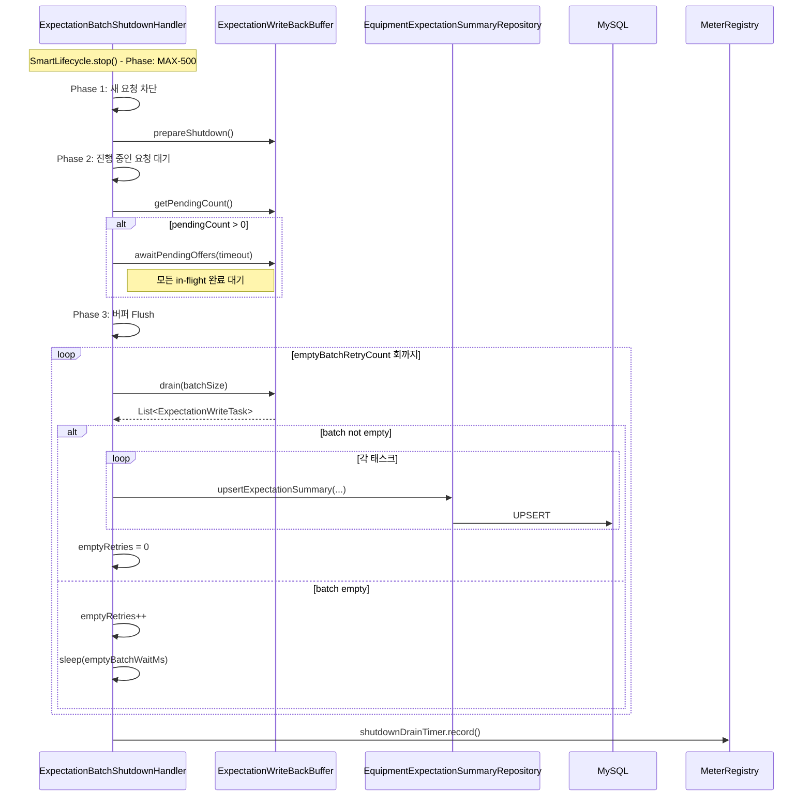
```mermaid
sequenceDiagram
    participant Handler as ExpectationBatchShutdownHandler
    participant Buffer as ExpectationWriteBackBuffer
    participant Repository as EquipmentExpectationSummaryRepository
    participant DB as MySQL
    participant Metrics as MeterRegistry

    Note over Handler: SmartLifecycle.stop() - Phase: MAX-500

    Handler->>Handler: Phase 1: 새 요청 차단
    Handler->>Buffer: prepareShutdown()

    Handler->>Handler: Phase 2: 진행 중인 요청 대기
    Handler->>Buffer: getPendingCount()

    alt pendingCount > 0
        Handler->>Buffer: awaitPendingOffers(timeout)
        Note right of Handler: 모든 in-flight 완료 대기
    end

    Handler->>Handler: Phase 3: 버퍼 Flush
    loop emptyBatchRetryCount 회까지
        Handler->>Buffer: drain(batchSize)
        Buffer-->>Handler: List<ExpectationWriteTask>

        alt batch not empty
            loop 각 태스크
                Handler->>Repository: upsertExpectationSummary(...)
                Repository->>DB: UPSERT
            end
            Handler->>Handler: emptyRetries = 0
        else batch empty
            Handler->>Handler: emptyRetries++
            Handler->>Handler: sleep(emptyBatchWaitMs)
        end
    end

    Handler->>Metrics: shutdownDrainTimer.record()
```

### 9.3 Shutdown 3-Phase 프로세스

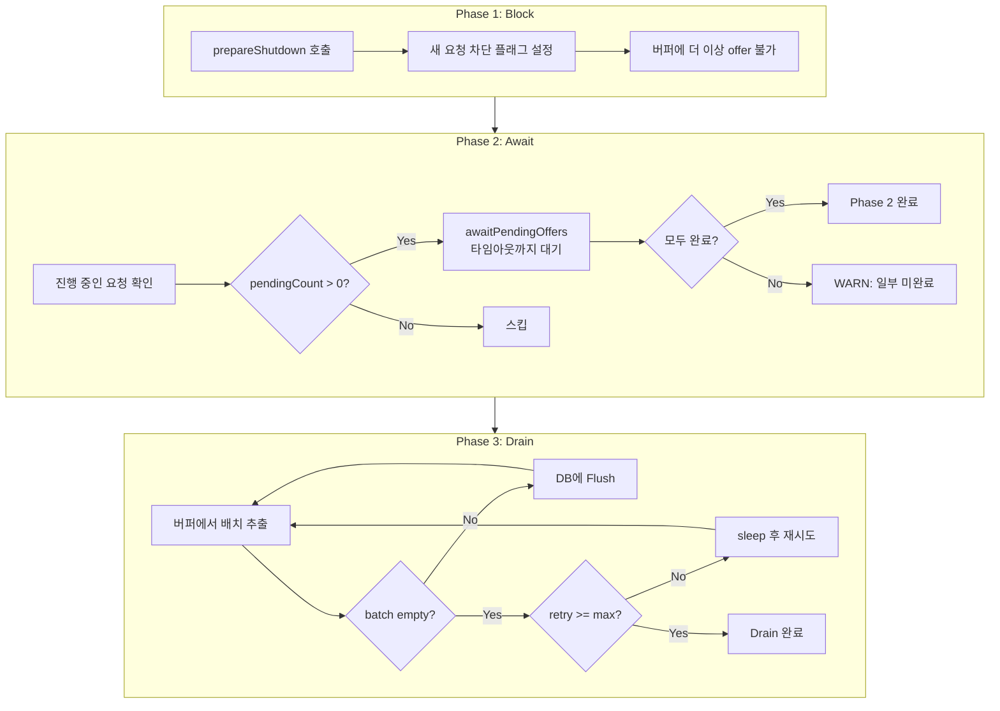
```mermaid
flowchart TD
    subgraph Phase1["Phase 1: Block"]
        A1[prepareShutdown 호출] --> A2[새 요청 차단 플래그 설정]
        A2 --> A3[버퍼에 더 이상 offer 불가]
    end

    subgraph Phase2["Phase 2: Await"]
        B1[진행 중인 요청 확인] --> B2{pendingCount > 0?}
        B2 -->|Yes| B3[awaitPendingOffers<br/>타임아웃까지 대기]
        B2 -->|No| B4[스킵]
        B3 --> B5{모두 완료?}
        B5 -->|Yes| B6[Phase 2 완료]
        B5 -->|No| B7[WARN: 일부 미완료]
    end

    subgraph Phase3["Phase 3: Drain"]
        C1[버퍼에서 배치 추출] --> C2{batch empty?}
        C2 -->|No| C3[DB에 Flush]
        C3 --> C1
        C2 -->|Yes| C4{retry >= max?}
        C4 -->|No| C5[sleep 후 재시도]
        C5 --> C1
        C4 -->|Yes| C6[Drain 완료]
    end

    Phase1 --> Phase2
    Phase2 --> Phase3
```

---

## 10. PGMQ Worker Pipeline

### 10.1 PgmqWorker (1초 폴링)

```mermaid
sequenceDiagram
    participant Worker as PgmqWorker<T>
    participant Client as PgmqClient
    participant PostgreSQL as PostgreSQL PGMQ
    participant Executor as LogicExecutor

    Note over Worker: @Scheduled(fixedDelay = 1000) - 1초

    alt !workerSettings.enabled
        Note right of Worker: 스킵
    else 활성화됨
        Worker->>Client: read(queueName, payloadClass, batchSize, vt)
        Client->>PostgreSQL: SELECT * FROM pgmq.read(...)
        PostgreSQL-->>Worker: List<PgmqMessage<T>>

        alt messages.isEmpty()
            Note right of Worker: 빈 큐
        else 메시지 존재
            loop 각 메시지
                Worker->>Executor: executeOrDefault(process(message))

                alt 처리 성공
                    Worker->>Client: archive(queueName, messageId)
                    Client->>PostgreSQL: SELECT pgmq.archive(...)
                    Note right of PostgreSQL: 메시지 보관 (성공)
                else 처리 실패 + 재시도 가능
                    Note right of Worker: readCount < maxRetries<br/>다음 poll에서 재처리
                else 처리 실패 + 재시도 불가
                    Worker->>Client: delete(queueName, messageId)
                    Client->>PostgreSQL: SELECT pgmq.delete(...)
                    Note right of PostgreSQL: DLQ로 이동 (삭제)
                end
            end
        end
    end
```

### 10.2 PGMQ 메시지 상태 전이

```mermaid
stateDiagram-v2
    [*] --> Queued: pgmq.send()
    Queued --> InFlight: pgmq.read()
    InFlight --> Archived: pgmq.archive()<br/>(처리 성공)
    InFlight --> Queued: visibility timeout 만료<br/>(자동 재시도)
    InFlight --> Deleted: pgmq.delete()<br/>(최대 재시도 초과)

    note right of Queued
        readCount 증가
        maxRetries 확인
    end note

    note right of InFlight
        Worker가 처리 중
        VT 동안 다른 consumer 접근 불가
    end note

    note right of Archived
        성공적으로 처리됨
        arch 테이블로 이동
    end note

    note right of Deleted
        최대 재시도 초과
        DLQ 역할
    end note
```

---

## 부록: 스케줄러별 설정 프로퍼티

### application.yml 예시

```yaml
# Data Collection
scheduler:
  nexon-api-collector:
    enabled: true
  nexon-data-collection:
    enabled: false
    rate: 600000
    initial-delay: 30000

# Cache/Warmup
  warmup:
    enabled: true
    top-count: 50
    delay-between-ms: 100
  expectation-calculation:
    enabled: true
    batch-size: 100
    fixed-delay-ms: 3600000

# Like Sync
  like-sync:
    enabled: true

# Outbox
  event-outbox:
    enabled: true
  nexon-api-outbox:
    enabled: true
  outbox:
    enabled: true

# Buffer
  buffer-recovery:
    enabled: true
    retry-rate: 10000
    redrive-rate: 60000
  expectation-sync:
    enabled: true

# Monitoring
monitoring:
  copilot:
    enabled: true
    top-signals: 10
  interval-seconds: 15

# PGMQ
pgmq:
  worker:
    common:
      polling-interval-ms: 1000
      batch-size: 10
      visibility-timeout-sec: 300
      max-retries: 5

# V5 (Legacy)
v5:
  enabled: false

# Event Outbox
event-outbox:
  polling-interval: 10s
  monitoring-interval: 60s
  stalled-recovery-interval: 5m

# Buffer
buffer:
  inflight:
    timeout-ms: 60000
  recovery:
    batch-size: 100
```

---

## 참고 문서

- [ADR-002: PGMQ Integration](../01_ADR/ADR-002-pgmq-integration.md)
- [ADR-005: Scheduler Migration](../01_ADR/ADR-005-scheduler-migration.md)
- [ADR-006: Nexon API Collector](../01_ADR/ADR-006-nexon-api-collector.md)
- [Outbox Pattern Sequence](outbox-sequence.md)
- [Nexon API Outbox Sequence](nexon-api-outbox-sequence.md)
- [Shutdown Sequence](shutdown-sequence.md)
