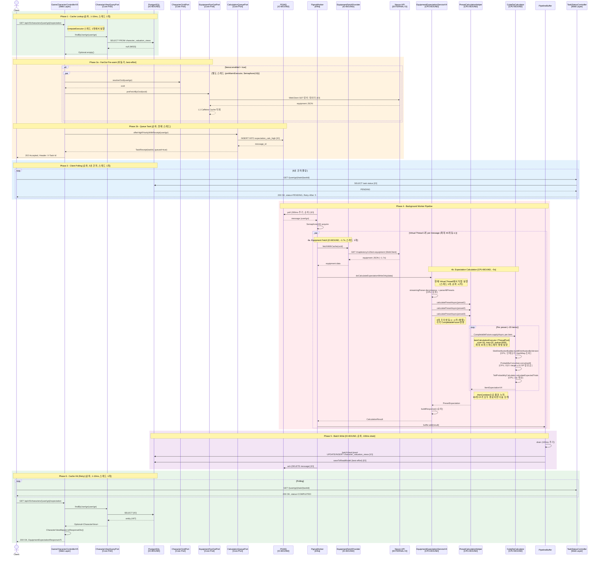

# V5 Endpoint Cache Miss Logic Flow

## 개요

V5 CQRS 아키텍처에서 클라이언트 요청 시 PostgreSQL 캐시 미스가 발생했을 때의 전체 데이터 플로우와 시퀀스를 정의.

---

## 클래스 및 메서드 역할 정의

### Web Layer (module-web)

| 클래스 | 메서드 | 역할 |
|--------|--------|------|
| `GameCharacterControllerV5` | `getExpectationV5()` | GET 요청 수신. `computeExecutor` 스레드에서 전체 흐름 실행 (비동기 반환) |
| `GameCharacterControllerV5` | `processPostgreSQLCacheFirstLookup()` | 핵심 흐름 제어: 1) PostgreSQL 조회 2) MISS 시 FanOut 프리페치 3) 큐잉 |
| `GameCharacterControllerV5` | `preWarmEquipmentCache()` | OCID 해석 → 장비 데이터 미리 조회하여 L1 캐시에 적재. 실패해도 무방 (best-effort) |
| `GameCharacterControllerV5` | `queueCalculationTask()` | PGMQ에 계산 작업 메시지 삽입. 성공 시 202, 큐 Full 시 503 반환 |
| `TaskStatusController` | `getTaskStatus()` | 클라이언트가 비동기 작업 완료 여부 폴링. PENDING이면 Retry-After: 5 헤더 |
| `CharacterViewMapper` | `toResponseDto()` | JPA Entity → V5 응답 DTO 변환 (필드 매핑) |

### Core Ports (module-core) — 인터페이스

| 포트 | 역할 |
|------|------|
| `CharacterViewQueryPort` | PostgreSQL에서 캐릭터 기대값 조회/삭제/업서트 |
| `CalculationQueuePort` | PGMQ에 계산 작업 큐잉 (우선순위 포함) |
| `ExecutorPort` | LogicExecutor 위임. 예외 처리, 로깅, 컨텍스트 전파 일원화 |
| `CharacterOcidPort` | 캐릭터 IGN → Nexon OCID 해석 |
| `EquipmentFanOutPort` | 장비 데이터 Micro-Batch 프리페치 |

### Infra Adapters (module-infra)

| 클래스 | 메서드 | 역할 |
|--------|--------|------|
| `CharacterViewQueryPortAdapter` | `findByUserIgn()` | PostgreSQL에서 `character_valuation_views` 조회. JPA Entity → CharacterView 인터페이스 어댑트 |
| `CharacterViewQueryPortAdapter` | `upsertFromCalculation()` | 계산 완료 결과를 PostgreSQL에 UPSERT |
| `PgmqWorker` | `poll()` | 300ms 주기로 PGMQ 큐에서 메시지 꺼내기. Semaphore(40)으로 최대 40개 메시지 동시 처리 |
| `PgmqWorker` | `processMessage()` | Virtual Thread 1개를 생성하여 메시지 1개 처리 전담 |
| `EquipmentFetchProvider` | `fetchWithCache()` | Nexon API에서 장비 데이터 조회. L1/L2 캐시 확인 후 미스 시 WebClient로 외부 API 호출 |
| `AbstractExpectationCalcWorker` | `batchViewUpsert()` | 계산 결과를 PostgreSQL에 벌크 UPSERT (현재 per-row JPA → #734에서 벌크 전환 예정) |
| `BlockingSubmitExecutor` | `execute()` | ThreadPool 큐 포화 시 submit을 블로킹 후 재시도. 태스크 드랍 방지 |
| `PipelineBuffer` | `drain()` | 100ms 주기로 누적된 계산 결과를 drain하여 batch write 실행 |

### Application Layer (module-app)

| 클래스 | 메서드 | 역할 |
|--------|--------|------|
| `EquipmentExpectationServiceV4` | `doCalculateExpectationWriteOnly()` | 전체 계산 오케스트레이션: 장비 데이터 압축해제 → 파싱 → 3개 프리셋 fan-out → 결과 빌드 |
| `EquipmentExpectationServiceV4` | `calculateAllPresets()` | 3개 프리셋에 대해 `calculatePresetAsync()` 병렬 호출. 각각 CompletableFuture 반환 |
| `PresetCalculationHelper` | `calculatePresetAsync()` | 1개 프리셋 내 ~20개 아이템을 CompletableFuture로 fan-out. thenCombine으로 결과 누적 |
| `PresetCalculationHelper` | `calculateSingleItem()` | 단일 아이템의 전체 기대값 계산: 블랙큐브 + 애드큐브 + 스타포스 + 불꽃 |
| `PresetCalculationHelper` | `buildInput()` | CubeCalculationInput → EquipmentCalculationInput 변환. 놀장 여부, 목표 스타포스 보정 |
| `CubeServiceImpl` | `calculateExpectedTrials()` | 큐브 기대 시도 횟수 계산. DP 모드면 CubeDpCalculator, 아니면 V1 순열 엔진 |
| `CubeDpCalculator` | `calculateWithCache()` | @Cacheable 적용. 슬롯별 PMF 생성 → DP 합성곱 → 꼬리 확률 → 기대 시도 횟수 |
| `SlotDistributionBuilder` | `buildDistributionByVersion()` | 확률 테이블(인메모리 HashMap)에서 슬롯별 SparsePmf 생성. 질량 검증 + 정규화 |
| `ProbabilityConvolver` | `convolveAll()` | 슬롯 SparsePmf들을 합성하여 총합 DensePmf 생성. O(slots × target × K) |
| `TailProbabilityCalculator` | `calculateExpectedTrials()` | P(X >= target) 꼬리 확률 → 1/p 기대 시도 횟수 |
| `EquipmentExpectationCalculatorFactory` | `createFullCalculator()` | 데코레이터 체인 생성: Base → BlackCube → Additional → Starforce |
| `FlameInputResolver` | `resolve()` | 장비 데이터에서 불꽃 계산 입력(추옵 여부, 직업별 가중치, 목표 환산치) 동적 추출 |

---

## Data Flow Diagram

```mermaid
graph TD
    subgraph Client
        CL[Client Browser/App]
    end

    subgraph "Web Layer (module-web)"
        V5["GameCharacterControllerV5<br/>GET /api/v5/characters/{userIgn}/expectation<br/>role: 요청 수신, 흐름 제어"]
        TS["TaskStatusController<br/>GET /{userIgn}/task/{taskId}<br/>role: 비동기 작업 상태 폴링"]
        MAP["CharacterViewMapper<br/>role: Entity → DTO 변환"]
    end

    subgraph "Core Ports (module-core)"
        QP["CharacterViewQueryPort<br/>role: PostgreSQL 조회 추상화"]
        CQ["CalculationQueuePort<br/>role: PGMQ 큐잉 추상화"]
        EP["ExecutorPort<br/>role: LogicExecutor 위임"]
        OP["CharacterOcidPort<br/>role: IGN → OCID 해석"]
        FO["EquipmentFanOutPort<br/>role: 장비 프리페치 추상화"]
    end

    subgraph "Infra Adapters (module-infra)"
        QPA["CharacterViewQueryPortAdapter<br/>role: JPA Entity → CharacterView 어댑트"]
        CQA["CalculationQueuePortAdapter<br/>role: PGMQ 메시지 삽입"]
        PGSQL[("PostgreSQL<br/>character_valuation_views")]
        PGMQ[("PGMQ<br/>expectation_calc_high")]
    end

    subgraph "Background Worker Pipeline"
        PW["PgmqWorker<br/>@Scheduled 300ms poll, Semaphore(40)<br/>role: 메시지 폴링, 작업 디스패치"]
        VT["Virtual Thread per message<br/>MAX: 40개 동시<br/>role: 메시지 1개 처리 전담"]
        EFP["EquipmentFetchProvider<br/>[IO-BOUND] Nexon API 호출<br/>role: 장비 데이터 조회 + 캐싱"]
        V4["EquipmentExpectationServiceV4<br/>[CPU-BOUND] fan-out orchestrate<br/>role: 파싱 → 3 프리셋 fan-out → 결과 빌드"]
        PCH["PresetCalculationHelper<br/>[CPU-BOUND] CompletableFuture x ~20<br/>role: 프리셋 내 아이템별 병렬 계산"]
        CDC["CubeDpCalculator<br/>[CPU-BOUND] DP Convolution<br/>role: 확률 합성곱으로 기대 시도 횟수 산출"]
        BUF["PipelineBuffer<br/>role: 결과 누적, 100ms drain"]
        BVU["batchViewUpsert<br/>[IO-BOUND] PostgreSQL UPSERT<br/>role: 계산 결과 영속화"]
    end

    subgraph "External"
        NEXON["Nexon API<br/>[EXTERNAL IO]<br/>role: 장비 데이터 제공"]
    end

    %% Cache Hit Path
    CL -->|GET /expectation| V5
    V5 -->|1. findByUserIgn| QP
    QP --> QPA
    QPA -->|SELECT| PGSQL
    PGSQL -->|HIT| QPA
    QPA -->|Optional<CharacterView>| V5
    V5 -->|200 OK| CL

    %% Cache Miss Path
    PGSQL -->|MISS: null| QPA
    V5 -->|"2a. preFetchByOcid (async)"| OP
    OP -->|resolveOcid| FO
    FO -.->|"async best-effort [IO]"| NEXON
    V5 -->|"2b. offerHighPriority (sync)"| CQ
    CQ --> CQA
    CQA -->|INSERT message| PGMQ
    V5 -->|202 Accepted + X-Task-Id| CL

    %% Polling Path
    CL -->|GET /task/{taskId}| TS
    TS -->|getStatus [IO]| PGSQL
    TS -->|200 PENDING/COMPLETED| CL

    %% Worker Pipeline
    PGMQ -->|"poll (순차, 300ms)"| PW
    PW -->|"Semaphore(40) acquire"| VT
    VT -->|"fetchEquipment [IO] ~1.7s"| EFP
    EFP -->|"WebClient"| NEXON
    VT -->|"calculate [CPU] ~5s"| V4
    V4 -->|"fan-out 3 presets (병렬)"| PCH
    PCH -->|"CompletableFuture x ~20 (병렬)"| CDC
    V4 -->|add result| BUF
    BUF -->|"drain 100ms (순차)"| BVU
    BVU -->|UPSERT [IO]| PGSQL
    PW -->|ack| PGMQ

    %% Second Request
    CL -.->|GET /expectation retry| V5
    V5 -.->|HIT| PGSQL
    V5 -.->|200 OK + data| CL

    style CL fill:#e1f5fe
    style PGSQL fill:#fff9c4
    style PGMQ fill:#fff9c4
    style NEXON fill:#ffcdd2
    style CDC fill:#c8e6c9
    style EFP fill:#ffe0b2
```

---

## Sequence Diagram: Cache Miss Full Flow



---

## Phase별 상세 설명

### Phase 1: Cache Lookup

| 항목 | 값 |
|------|-----|
| 실행 방식 | **순차** |
| 최대 스레드 | **1개** (computeExecutor) |
| IO/CPU | **IO** (PostgreSQL SELECT) |
| 소요 시간 | 1-10ms |

```
Client → V5Controller → CharacterViewQueryPort → PostgreSQL SELECT
```

- `character_valuation_views` 테이블에서 `user_ign`으로 조회
- HIT → 즉시 200 OK 반환
- MISS → Phase 2로 진행

### Phase 2a: FanOut Pre-warm

| 항목 | 값 |
|------|-----|
| 실행 방식 | **비동기** (별도 스레드) |
| 최대 스레드 | **10개** (preWarmExecutor + Semaphore(10)) |
| IO/CPU | **IO** (Nexon API WebClient) |
| 실패 시 | 무시 (best-effort) |

```
V5Controller → OCID resolve → FanOutPort.preFetchByOcid → Nexon API
```

- `fanout.enabled=true`일 때만 실행
- 목적: Worker가 나중에 장비 데이터 조회 시 L1 캐시 히트 유도
- Phase 2b 응답을 블로킹하지 않음 (fire-and-forget)

### Phase 2b: Queue Calculation Task

| 항목 | 값 |
|------|-----|
| 실행 방식 | **순차** |
| 최대 스레드 | **1개** (Phase 1의 computeExecutor 스레드) |
| IO/CPU | **IO** (PGMQ INSERT) |

```
V5Controller → CalculationQueuePort → PGMQ INSERT → 202 Accepted
```

- `offerHighPriorityWithReceipt(userIgn)` → PGMQ high priority 큐에 메시지 삽입
- 응답: 202 Accepted + `X-Task-Id` 헤더
- 큐 Full 시: 503 Service Unavailable

### Phase 3: Client Polling

| 항목 | 값 |
|------|-----|
| 실행 방식 | **순차** (클라이언트 주도) |
| 최대 스레드 | **1개** (Tomcat 스레드 per 요청) |
| IO/CPU | **IO** (PostgreSQL SELECT) |
| 폴링 간격 | 5초 (Retry-After 헤더) |

### Phase 4: Background Worker Pipeline

| 항목 | 값 |
|------|-----|
| 실행 방식 | **혼합** (IO 직렬 → CPU 병렬 → IO 직렬) |
| 최대 스레드 | PgmqWorker: **40 Virtual Thread** → itemCalculationExecutor: **32 Platform Thread** |

#### Phase 4a: Equipment Fetch

| 항목 | 값 |
|------|-----|
| 실행 방식 | **순차** (메시지당 1개 Virtual Thread) |
| 최대 스레드 | **40개** (Semaphore(40), Virtual Thread) |
| IO/CPU | **IO-BOUND** (Nexon API WebClient) |
| 소요 시간 | ~1.7s |

```
PgmqWorker → EquipmentFetchProvider → Nexon API → 캐시 적재
```

- 40개 메시지가 동시에 각각 Virtual Thread에서 Nexon API 호출
- NexonRateLimiter(maxConcurrent=200)가 API 호출 동시성 제어

#### Phase 4b: Expectation Calculation

| 항목 | 값 |
|------|-----|
| 실행 방식 | **병렬** (fan-out) |
| 최대 스레드 | **32개** (itemCalculationExecutor: core=16, max=32) |
| IO/CPU | **CPU-BOUND** (순수 수학 연산, DB 없음) |
| 소요 시간 | ~5s (컨텍스트 스위칭 포함) |

```
EquipmentExpectationServiceV4
  → parseAllPresets (순차)
  → calculatePresetAsync x 3 (병렬 시작)
    → CompletableFuture.supplyAsync x ~20 items (병렬)
      → CubeDpCalculator (CPU: DP convolution)
      → StarforceLookupPort (CPU: O(1) lookup table)
      → FlameInputResolver + FlameTrialsService (CPU: DP)
    → thenCombine으로 결과 누적 (60개 CF 완료 대기)
  → buildResponse (순차)
```

**병목 (ADR, #743 참조):**
- Burst: 40 msg x 3 preset x ~20 item = **2,400 CompletableFuture** 동시 submit
- 32 Platform Thread가 **2 vCPU**에서 CPU-bound 경합 → 컨텍스트 스위칭 오버헤드
- 해결: #743 (유니크 키 순차 compute) 또는 #736 (flat work queue)

### Phase 5: Batch Write

| 항목 | 값 |
|------|-----|
| 실행 방식 | **순차** (100ms drain 주기) |
| 최대 스레드 | **1개** (drain 스레드) |
| IO/CPU | **IO-BOUND** (PostgreSQL UPSERT) |

```
PipelineBuffer.drain(100ms) → batchViewUpsert → PostgreSQL UPSERT
```

- 현재: per-row JPA (SELECT + save per row) → #734에서 벌크 전환 예정
- Read model 개별 저장 (best-effort)
- 완료 후 PGMQ ack (메시지 삭제)

### Phase 6: Cache Hit (Retry)

| 항목 | 값 |
|------|-----|
| 실행 방식 | **순차** |
| 최대 스레드 | **1개** (computeExecutor) |
| IO/CPU | **IO** (PostgreSQL SELECT) |
| 소요 시간 | 1-10ms |

Phase 1과 동일하지만 이번에는 PostgreSQL HIT.

---

## 스레드 풀 요약

| 스레드 풀 | 종류 | 크기 | 목적 | IO/CPU |
|-----------|------|------|------|--------|
| computeExecutor | Platform | 설정값 | V5 컨트롤러 요청 처리 | IO (DB) |
| preWarmExecutor | Platform | 설정값 | FanOut 프리페치 (best-effort) | IO (Nexon API) |
| preWarmSemaphore | - | 10 | 프리페치 동시성 제한 | - |
| PgmqWorker | Virtual | 최대 40 (Semaphore) | 메시지별 처리 (전체 오케스트레이션) | IO → CPU → IO |
| itemCalculationExecutor | Platform | core=16, max=32, queue=5000 | 아이템별 CPU 연산 | **CPU** |
| BlockingSubmitExecutor | Wrapper | - | 큐 포화 시 submit 블로킹 후 재시도 | - |
| NexonRateLimiter | - | maxConcurrent=200 | Nexon API 호출 동시성 제어 | IO |

---

## 관련 문서

- ADR: [Pipeline Fan-Out 구조 리팩토링](../01_ADR/ADR-pipeline-fan-out-restructuring.md)
- 이슈: #732 (Epic), #743 (Compute Key 사전 연산), #736 (Flat work queue), #734 (Read Model 배치화)
