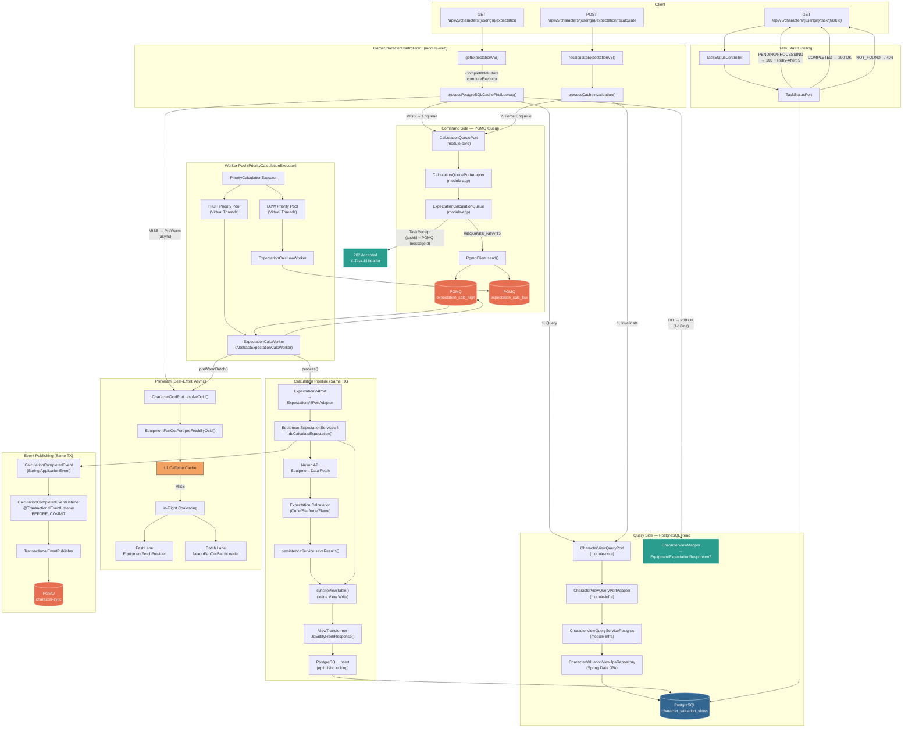
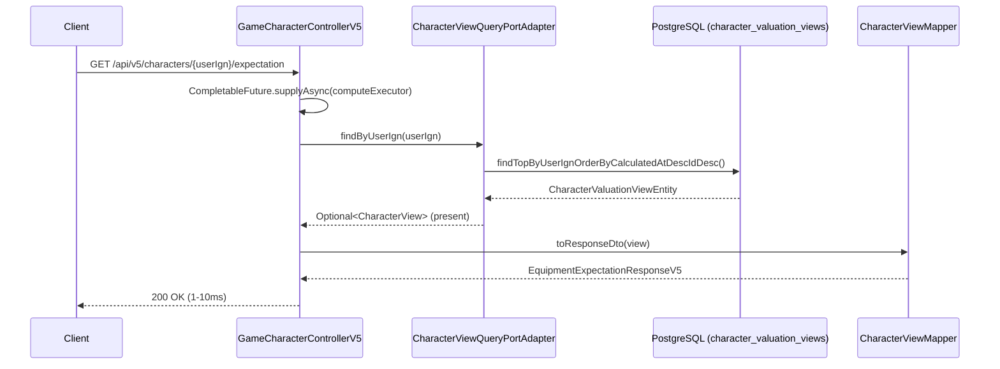
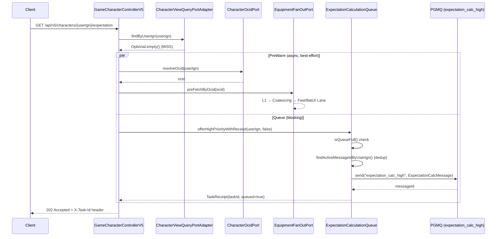
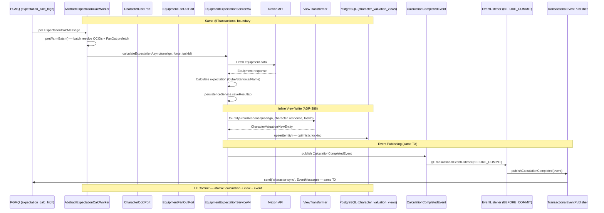
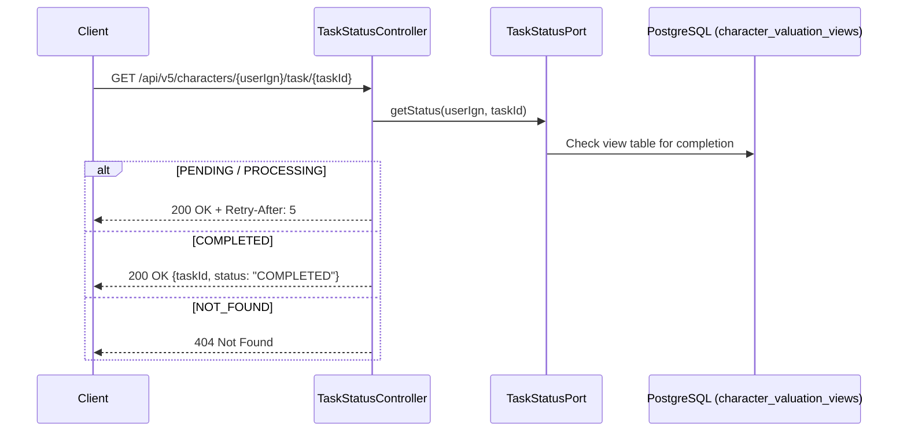

# V5 Endpoint Data Flow Architecture

> V5 CQRS + Async Materialized View 패턴의 전체 데이터 흐름 아키텍처 (ADR-388)

## Architecture Overview

## Query Path — Cache HIT Flow

## Query Path — Cache MISS Flow

## Worker Calculation Pipeline

## Task Status Polling Flow

## Endpoint Summary

| Endpoint | Method | Role | Response |
|---|---|---|---|
| `/api/v5/characters/{userIgn}/expectation` | GET | CQRS Query — PostgreSQL read first | 200 HIT / 202 MISS (queued) |
| `/api/v5/characters/{userIgn}/expectation/recalculate` | POST | Cache invalidation + force recalculate | 202 Accepted |
| `/api/v5/characters/{userIgn}/task/{taskId}` | GET | Async calculation completion polling | 200 + Retry-After / 404 |

## Component Map

| Layer | Component | Module | Responsibility |
|---|---|---|---|
| Web | `GameCharacterControllerV5` | module-web | HTTP endpoint, CompletableFuture dispatch |
| Web | `TaskStatusController` | module-web | Task polling endpoint |
| Core Port | `CharacterViewQueryPort` | module-core | PostgreSQL read abstraction |
| Core Port | `CalculationQueuePort` | module-core | Queue enqueue abstraction |
| Core Port | `ExpectationV4Port` | module-core | Calculation execution abstraction |
| Core Port | `TaskStatusPort` | module-core | Task status query abstraction |
| Core Port | `CharacterOcidPort` | module-core | IGN → OCID resolution |
| Core Port | `EquipmentFanOutPort` | module-core | Equipment prefetch abstraction |
| Adapter | `CharacterViewQueryPortAdapter` | module-infra | JPA Entity → CharacterView adapter |
| Adapter | `CalculationQueuePortAdapter` | module-app | Queue port → ExpectationCalculationQueue |
| Adapter | `ExpectationV4PortAdapter` | module-app | V4 port → EquipmentExpectationServiceV4 |
| Infra | `CharacterViewQueryServicePostgres` | module-infra | PostgreSQL upsert/query with optimistic locking |
| Infra | `ExpectationCalculationQueue` | module-app | PGMQ-backed priority queue with backpressure |
| Infra | `AbstractExpectationCalcWorker` | module-infra | PGMQ consumer + batch prewarm |
| Infra | `PriorityCalculationExecutor` | module-app | HIGH/LOW worker pool lifecycle |
| Service | `EquipmentExpectationServiceV4` | module-app | Core calculation + inline view write |
| Service | `ViewTransformer` | module-app | V4 DTO → ViewEntity transformation |
| Service | `TransactionalEventPublisher` | module-app | Same-TX PGMQ event publishing |

## Key Design Decisions

- **Inline View Write (ADR-388)**: Worker의 계산 트랜잭션 내에서 view 테이블에 직접 upsert. 별도 Consumer 불필요
- **Same TX Atomicity**: 계산 + view write + event publish가 한 트랜잭션에서 원자적 수행. 하나라도 실패하면 전체 롤백
- **PGMQ taskId**: PGMQ messageId를 taskId로 활용하여 클라이언트 폴링 가능
- **PreWarm Best-Effort**: FanOut prefetch는 실패해도 큐잉에 영향 없음
- **Priority Isolation**: HIGH/LOW 워커 풀이 완전 분리되어 starvation 방지
