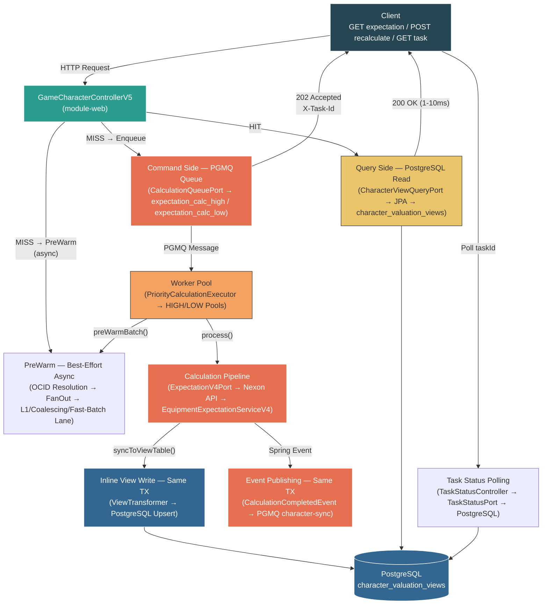

# V5 High-Level Architecture

> V5 엔드포인트의 서브시스템 간 데이터 흐름 (상세 다이어그램은 [v5-endpoint-data-flow-architecture.md](v5-endpoint-data-flow-architecture.md) 참조)

## Architecture Overview

## Flow Summary

| Path | Flow | Latency |
|---|---|---|
| **Cache HIT** | Client → Controller → Query Side → PostgreSQL → 200 OK | 1-10ms |
| **Cache MISS** | Client → Controller → PreWarm(async) + Command Side(PGMQ) → 202 Accepted | ~5ms |
| **Worker Processing** | PGMQ → Worker Pool → PreWarm → Calculation Pipeline → Inline View Write(same TX) + Event Publish(same TX) → PostgreSQL | 수초 |
| **Task Polling** | Client → Task Status Polling → PostgreSQL → 200 Retry-After / 200 COMPLETED / 404 | 1-5ms |
