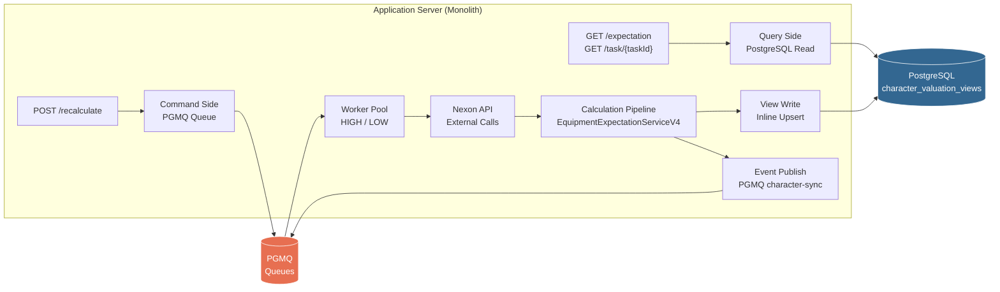
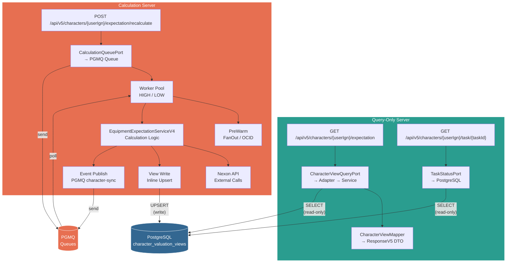

# V5 Query-Only Server 분리 아키텍처

> 현재 구조에서 Query-Only 서버만 분리할 경우의 아키텍처 (ADR-388 기준)

## 현재 구조 (Monolith)

## 분리 후 아키텍처

## Query-Only Server 구성 요소

| 컴포넌트 | 모듈 | 역할 |
|---|---|---|
| `GameCharacterControllerV5` (GET만) | module-web | HTTP endpoint |
| `TaskStatusController` | module-web | Task 폴링 endpoint |
| `CharacterViewQueryPort` | module-core | 읽기 포트 인터페이스 |
| `CharacterViewQueryPortAdapter` | module-infra | JPA → CharacterView 어댑트 |
| `CharacterViewQueryServicePostgres` | module-infra | PostgreSQL 조회 |
| `CharacterValuationViewJpaRepository` | module-infra | Spring Data JPA |
| `CharacterViewMapper` | module-web | Entity → V5 DTO 변환 |
| `EquipmentExpectationResponseV5` | module-web | 응답 DTO |
| `TaskStatusPort` + 구현체 | module-core → module-infra | Task 상태 조회 |
| `LogicExecutor` | module-infra | 예외 처리 |

## Calculation Server 구성 요소

| 컴포넌트 | 모듈 | 역할 |
|---|---|---|
| `GameCharacterControllerV5` (POST만) | module-web | Recalculate endpoint |
| `CalculationQueuePort` + Adapter | module-core → module-app | PGMQ 큐잉 |
| `ExpectationCalculationQueue` | module-app | PGMQ backed queue |
| `PriorityCalculationExecutor` | module-app | Worker pool lifecycle |
| `ExpectationCalcWorker` / `Low` | module-infra | PGMQ consumer |
| `EquipmentExpectationServiceV4` | module-app | 핵심 계산 + Nexon API |
| `ViewTransformer` | module-app | V4 DTO → ViewEntity |
| `CharacterViewQueryServicePostgres.upsert()` | module-infra | View 테이블 쓰기 |
| `TransactionalEventPublisher` | module-app | PGMQ 이벤트 발행 |
| `EquipmentFanOutPort` | module-core → module-infra | 장비 프리페치 |
| `CharacterOcidPort` | module-core → module-infra | OCID 해석 |

## 공유 인프라

| 인프라 | Query Server 접근 | Calculation Server 접근 |
|---|---|---|
| PostgreSQL `character_valuation_views` | **Read-only** (SELECT) | **Write** (UPSERT) |
| PGMQ `expectation_calc_high/low` | 접근 없음 | Send + Poll |
| PGMQ `character-sync` | 접근 없음 | Send |

## 분리 시 이점

| 항목 | Query Server | Calculation Server |
|---|---|---|
| **확장** | 수평 확장 용이 (stateless, read-only) | 독립 스케일링 |
| **장애 격리** | Nexon API 장애 영향 없음 | Query 서버 영향 없음 |
| **배포** | 독립 배포 가능 | 독립 배포 가능 |
| **리소스** | CPU/메모리 최소 (DB I/O만) | CPU 집약적 (계산 + 외부 API) |
| **의존성** | PostgreSQL만 | PostgreSQL + PGMQ + Nexon API |

## 분리 시 주의점

1. **PostgreSQL 연결 공유**: 같은 DB지만 connection pool은 각자 관리
2. **Entity/Port 인터페이스 공유**: `module-core`와 `module-infra`의 인터페이스는 양쪽에 필요 → 공통 모듈 그대로 사용
3. **CharacterViewQueryServicePostgres**: Query Server는 `findByUserIgn()`만, Calculation Server는 `upsert()` + `deleteByUserIgn()` 사용 → 메서드 단위 분리 필요 없이 같은 클래스 공유 가능
4. **배포 순서**: 스키마 변경 시 Calculation Server 먼저 배포 (write 담당)
