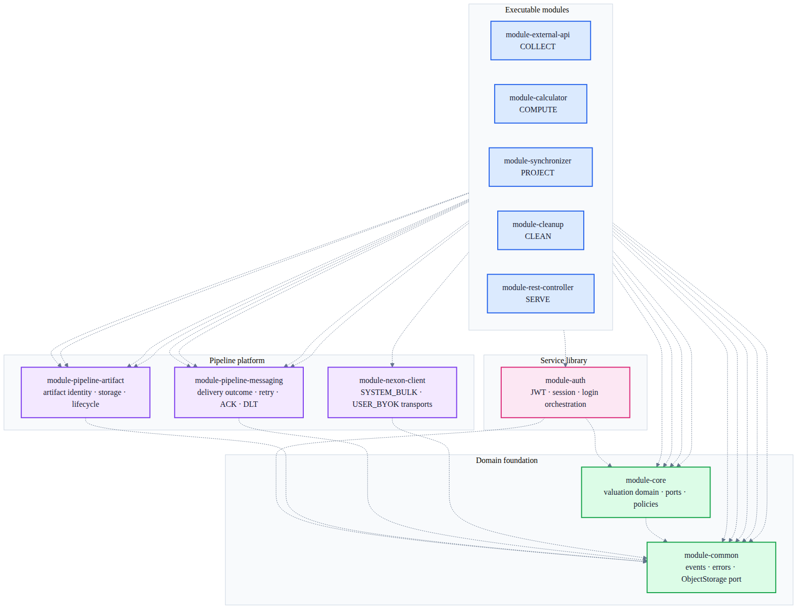

# Active Module Mermaid Diagrams

현재 Gradle 구성과 active ETL runtime을 기준으로 작성한 Mermaid 다이어그램 모음이다.

## Scope

포함하는 모듈:

- `module-common`
- `module-core`
- `module-pipeline-artifact`
- `module-pipeline-messaging`
- `module-nexon-client`
- `module-auth`
- `module-external-api`
- `module-calculator`
- `module-synchronizer`
- `module-cleanup`
- `module-rest-controller`

제외하는 모듈:

- `module-app`: legacy monolith composition root
- `module-web`: legacy v1/v4/v5 web layer
- `module-infra`: active ETL에서 제거된 legacy compatibility boundary
- `module-chaos-test`: test-only module

## Diagrams

| Diagram | Mermaid source | PNG | SVG |
| --- | --- | --- | --- |
| Active module dependency map | [source](active-module-overview.mmd) | [PNG](active-module-overview.png) | [SVG](active-module-overview.svg) |
| `module-external-api` | [source](module-external-api.mmd) | [PNG](module-external-api.png) | [SVG](module-external-api.svg) |
| `module-calculator` | [source](module-calculator.mmd) | [PNG](module-calculator.png) | [SVG](module-calculator.svg) |
| `module-synchronizer` | [source](module-synchronizer.mmd) | [PNG](module-synchronizer.png) | [SVG](module-synchronizer.svg) |
| `module-cleanup` | [source](module-cleanup.mmd) | [PNG](module-cleanup.png) | [SVG](module-cleanup.svg) |
| `module-rest-controller` | [source](module-rest-controller.mmd) | [PNG](module-rest-controller.png) | [SVG](module-rest-controller.svg) |
| `module-auth` | [source](module-auth.mmd) | [PNG](module-auth.png) | [SVG](module-auth.svg) |

## Overview

점선은 Gradle build dependency를 나타낸다. 실행 모듈별 그림의 실선은 runtime data/control flow를 나타낸다.

## Source of Truth

- `settings.gradle`
- 각 모듈의 `build.gradle`
- active module `application.yml`
- Kafka `PipelineSubscription` producer/consumer 구현
- ADR-745, ADR-746, ADR-748

Generated: 2026-08-26
