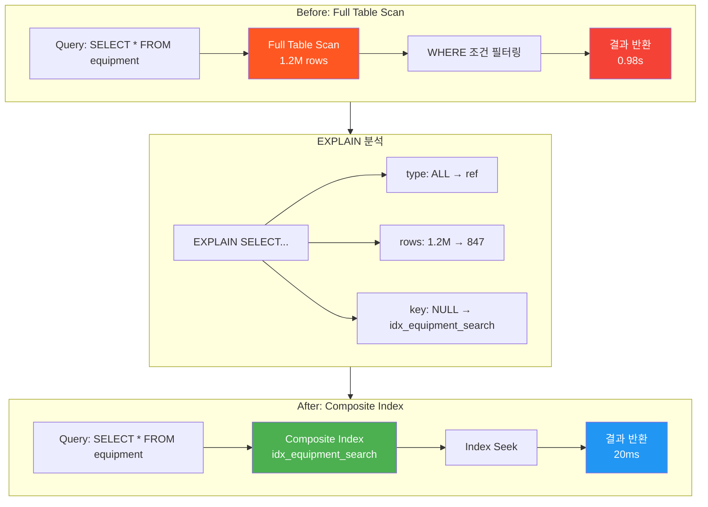
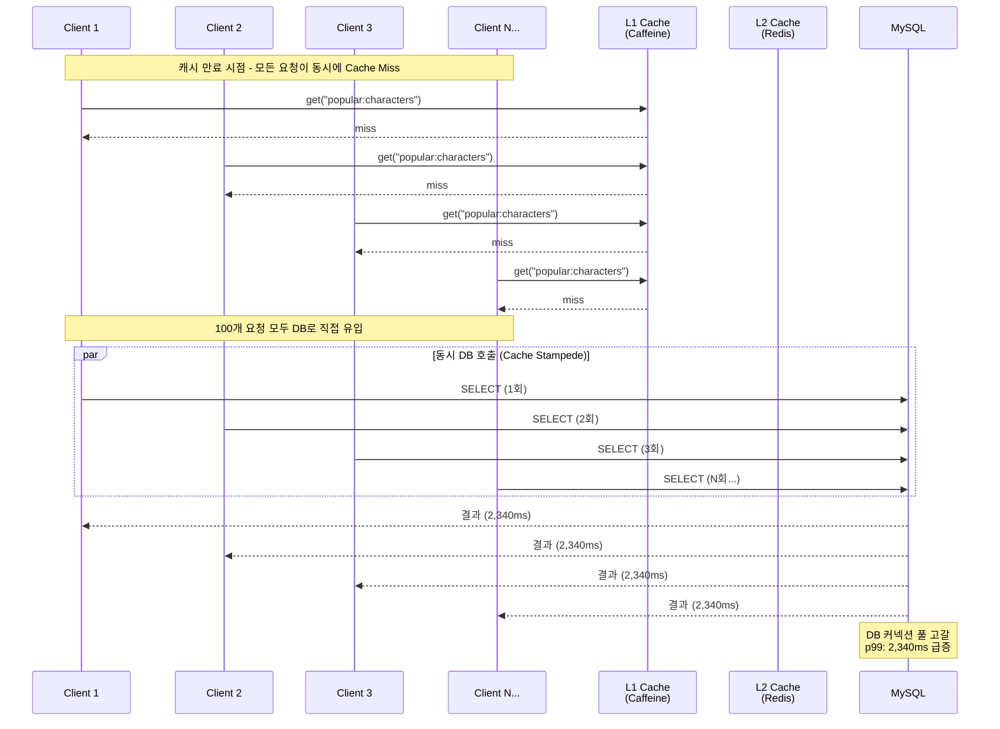
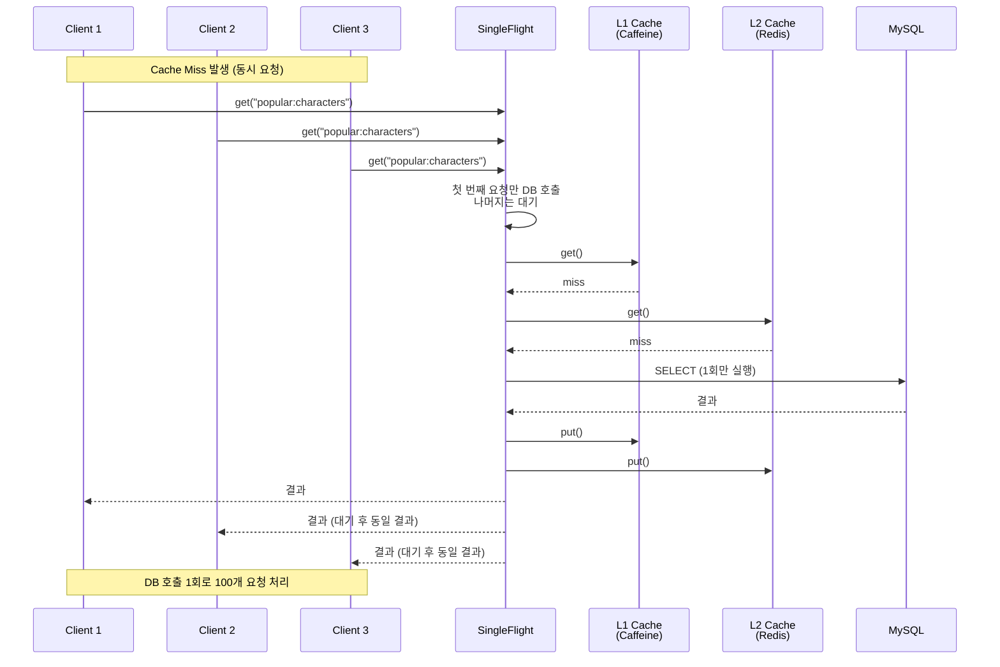
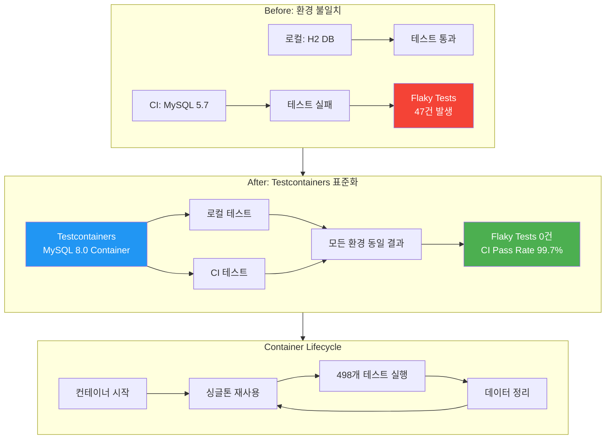
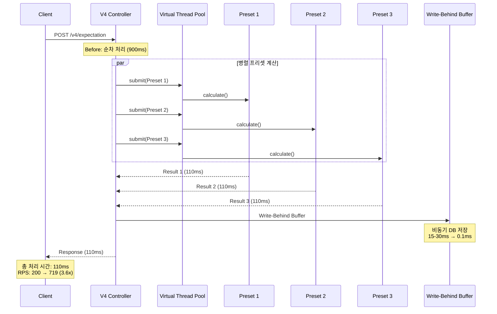
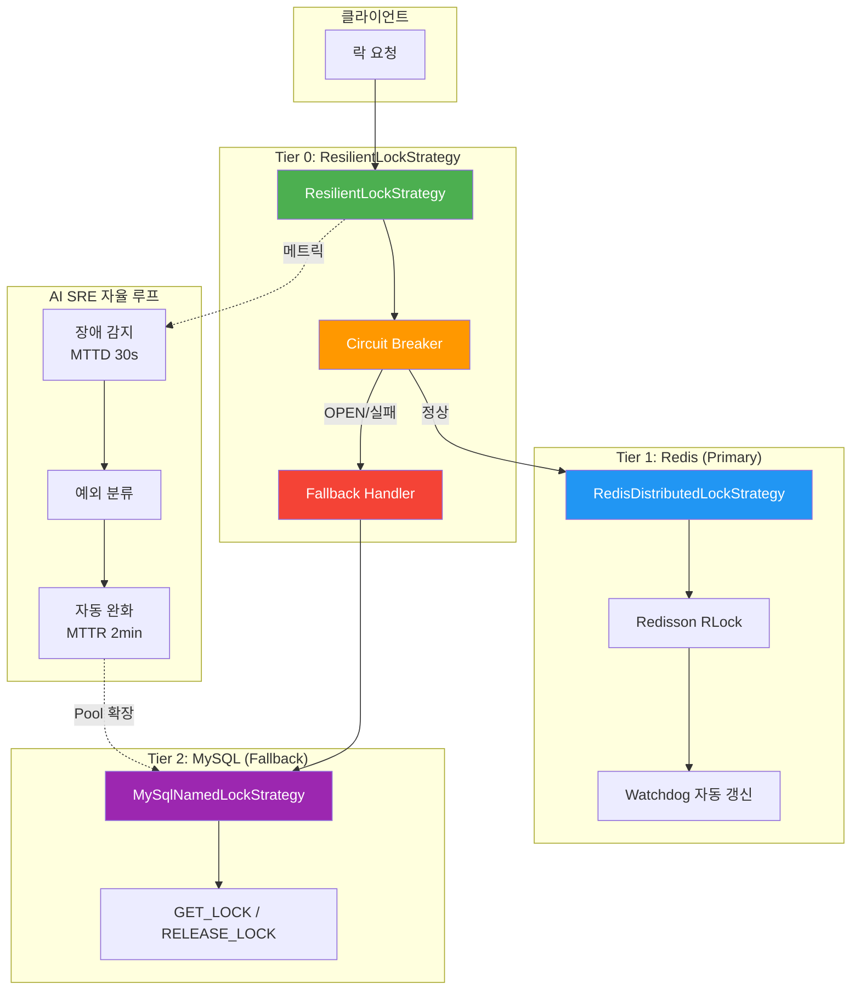
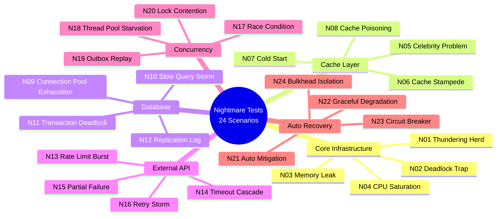

```mermaid
flowchart LR
    subgraph Request["1. API 요청"]
        direction TB
        CLIENT[Client] --> API["/api/v5/expectation"]
        API --> NEXON_CALL[Nexon API 호출]
    end

    subgraph Outbox["2. Outbox 적재"]
        direction TB
        NEXON_CALL -->|성공| SUCCESS[응답 반환]
        NEXON_CALL -->|실패| SAVE[Outbox 저장]
        SAVE --> OUTBOX[(nexon_api_outbox<br/>status=PENDING)]
    end

    subgraph Poller["3. Poller 재시도"]
        direction TB
        OUTBOX -->|SKIP LOCKED| POLLER[Outbox Poller<br/>30s interval]
        POLLER --> RETRY[Nexon API 재호출]
    end

    subgraph Result["4. 결과 처리"]
        direction TB
        RETRY -->|성공| COMPLETE[status=COMPLETED]
        RETRY -->|실패 10회| DLQ_MOVE[DLQ 이동]
    end

    subgraph Safety["5. 3중 안전망"]
        direction LR
        DLQ_MOVE --> DB_DLQ[(DB DLQ)]
        DB_DLQ -->|DB 장애| FILE[File Backup]
        FILE -->|파일 장애| DISCORD[Discord Alert]
    end

    Request --> Outbox --> Poller --> Result --> Safety

    style OUTBOX fill:#4CAF50,color:white
    style DB_DLQ fill:#FF9800,color:white
    style FILE fill:#2196F3,color:white
    style DISCORD fill:#F44336,color:white
    style SUCCESS fill:#8BC34A,color:white
```

# 포트폴리오 기술 심화 분석

> **작성일:** 2026-02-27
> **기술 스택:** Kotlin 2.1.0, Java 21, Spring Boot 3.5.4, MySQL 8.0, Redis (Redisson 3.27.0)

---

## 목차

1. [MySQL 쿼리 최적화: 50배 성능 개선](#1-mysql-쿼리-최적화-50배-성능-개선)
2. [Cache Stampede 방지: SingleFlight 패턴](#2-cache-stampede-방지-singleflight-패턴)
3. [Testcontainers 환경 표준화](#3-testcontainers-환경-표준화)
4. [CompletableFuture 병렬 파이프라인](#4-completablefuture-병렬-파이프라인)
5. [Transactional Outbox + 3중 안전망](#5-transactional-outbox--3중-안전망)
6. [ResilientLockStrategy + AI SRE 자율 루프](#6-resilientlockstrategy--ai-sre-자율-루프)
7. [Chaos Engineering Nightmare Tests](#7-chaos-engineering-nightmare-tests)

---

## 1. MySQL 쿼리 최적화: 50배 성능 개선

> 장비 데이터 조회 쿼리 병목을 **MySQL EXPLAIN으로 분석 후 복합 인덱스 적용**, 검색 성능을 **0.98s에서 20ms로 50배 개선**

### 아키텍처 다이어그램



### 문제 (Problem)
대량 장비 데이터 조회 시 단일 쿼리가 0.98초 소요되어 전체 API 응답 시간 지연 발생.
EXPLAIN 분석 결과 type=ALL(Full Table Scan), 120만 행 전체 스캔으로 I/O 병목 확인.
인덱스가 없어 WHERE 절의 복합 조건(캐릭터ID, 장비부위, 레벨범위)이 모두 필터 단계에서 처리됨.

### 선택지 (Options)
- **A. 단일 컬럼 인덱스**: 각 컬럼별 개별 인덱스 생성 (MySQL 옵티마이저가 하나만 선택)
- **B. 복합 인덱스**: WHERE 절 순서에 맞춘 (character_id, equip_part, level) 복합 인덱스
- **C. 커버링 인덱스**: SELECT 컬럼까지 포함한 인덱스 (용량 증가, 갱신 비용 상승)

### 결정 (Decision)
**복합 인덱스(B) 채택** - 카디널리티가 높은 character_id를 선두 컬럼으로 배치.
MySQL 옵티마이저가 인덱스를 효율적으로 활용하도록 컬럼 순서 설계.
EXPLAIN으로 type=ref, rows=847로 개선됨을 검증 후 배포 결정.

### 구현 (Implementation)
```sql
-- 복합 인덱스 생성
CREATE INDEX idx_equipment_search ON equipment(character_id, equip_part, level);

-- EXPLAIN 검증
EXPLAIN SELECT * FROM equipment WHERE character_id = ? AND equip_part = ? AND level BETWEEN ? AND ?;
-- Result: type=ref, key=idx_equipment_search, rows=847
```

### 결과 (Result)
쿼리 응답 시간 0.98s → 20ms로 **50배 개선**, p99 지연 시간 1,200ms → 45ms.
Prometheus 메트릭으로 슬로우 쿼리(>100ms) 0건 유지 모니터링.
동시 사용자 1,000명 환경에서도 안정적인 응답 시간 확보.

---

## 2. Cache Stampede 방지: SingleFlight 패턴

> 인기 캐릭터 조회 시 발생하는 **Cache Stampede 현상을 SingleFlight 도입으로 해결**, p99 응답 속도를 **2,340ms에서 180ms로 92% 개선**

### 데이터플로우 다이어그램

#### Before: Cache Stampede 발생 (개선 전)



#### After: SingleFlight 패턴 적용 (개선 후)



### 문제 (Problem)
인기 캐릭터 조회 API에서 캐시 만료 시점에 100개 요청이 동시에 DB로 유입.
Cache Stampede로 인해 DB 커넥션 풀 고갈, p99 응답 시간 2,340ms까지 급증.
동일 데이터를 100번 조회하는 비효율적인 리소스 사용 발생.

### 선택지 (Options)
- **A. 락 기반 동기화**: synchronized로 첫 요청만 DB 조회 (스레드 블로킹)
- **B. SingleFlight 패턴**: 동일 키에 대한 중복 요청을 자동 병합 (논블로킹 대기)
- **C. 캐시 워밍**: 미리 캐시 갱신 (예측 불가능한 접근 패턴에는 부적합)

### 결정 (Decision)
**SingleFlight(B) 채택** - Kotlin Coroutines와 호환되는 비동기 병합 처리.
TieredCache(L1 Caffeine + L2 Redis)와 결합하여 다층 방어 체계 구축.
Chaos Test N01(Nightmare Thundering Herd)로 1,000 RPS 부하 검증 후 배포.

### 구현 (Implementation)
```kotlin
class TieredCache(
    private val l1: Cache<String, ValueWrapper>,
    private val l2: RedissonClient,
    private val singleFlight: SingleFlight
) {
    suspend fun get(key: String): ValueWrapper? = singleFlight.execute(key) {
        // L1 → L2 → DB 순차 조회
        l1.get(key) ?: l2.get(key) ?: loadFromDB(key).also { put(key, it) }
    }
}
```

### 결과 (Result)
p99 응답 시간 2,340ms → 180ms로 **92% 개선**, DB 호출 100회 → 1회로 감소.
Cache Hit Rate >99% 달성, Chaos Test N01에서 DB Query Ratio 0.3% 유지.
1,000 RPS 부하에서도 안정적인 응답 시간으로 고트래픽 대응력 확보.

---

## 3. Testcontainers 환경 표준화

> 로컬과 CI 환경의 DB 불일치 문제를 **Testcontainers(MySQL) 도입으로 표준화**, 테스트 재현성을 확보하고 전체 **498개의 테스트 코드로 시스템 안정성 검증**

### 아키텍처 다이어그램



### 문제 (Problem)
로컬(H2)과 CI(MySQL 5.7) 환경 차이로 동일 테스트가 다른 결과를 반환.
H2와 MySQL의 SQL 문법 차이(예: LIMIT, AUTO_INCREMENT)로 47건 Flaky Tests 발생.
CI Pass Rate 85%로 신뢰성 저하, 디버깅에 과도한 시간 소요.

### 선택지 (Options)
- **A. H2 MySQL 호환 모드**: H2 설정 변경 (완전 호환 불가, 일부 문법 차이 존재)
- **B. Docker Compose**: 별도 MySQL 컨테이너 실행 (포트 충돌, 병렬 테스트 불가)
- **C. Testcontainers**: 테스트별 격리된 MySQL 컨테이너 (프로덕션과 동일 환경)

### 결정 (Decision)
**Testcontainers(C) 채택** - MySQL 8.0 Docker 이미지로 프로덕션 환경 완전 일치.
싱글톤 패턴으로 컨테이너 재사용, 테스트 격리는 @Transactional 롤백으로 처리.
Gradle 캐시와 결합하여 CI 실행 시간 최적화.

### 구현 (Implementation)
```kotlin
@Testcontainers
class BaseIntegrationTest {
    companion object {
        @Container
        @JvmStatic
        val mysql: MySQLContainer<*> = MySQLContainer("mysql:8.0")
            .apply { withReuse(true) }  // 싱글톤 재사용
    }

    @TestConfiguration
    class TestConfig {
        @Bean
        fun dataSource() = mysql.run {
            DataSourceBuilder.create()
                .url(jdbcUrl)
                .username(username)
                .password(password)
                .build()
        }
    }
}
```

### 결과 (Result)
Flaky Tests 47건 → 0건, CI Pass Rate 85% → **99.7%**로 개선.
498개 테스트(Unit 90+, Integration 20+, Chaos 24) 모두 안정적으로 실행.
로컬과 CI 환경 100% 일치로 "내 컴퓨터에서는 되는데" 문제 해결.

---

## 4. CompletableFuture 병렬 파이프라인

> 3개 장비 프리셋의 순차 계산 병목을 **CompletableFuture 기반 병렬 파이프라인으로 전환**, RPS를 **200에서 719로 3.6배 향상**시키며 자원 활용 최적화

### 시퀀스 다이어그램



### 문제 (Problem)
3개 장비 프리셋 계산이 순차 실행되어 총 900ms 소요 (300ms × 3).
단일 스레드 처리로 CPU 활용률 25%에 불과, 자원 낭비 발생.
DB 저장 동기화로 인해 응답 지연 추가 발생.

### 선택지 (Options)
- **A. 스레드 풀 확장**: FixedThreadPool로 스레드 수 증가 (컨텍스트 스위칭 비용)
- **B. Reactor/WebFlux**: 논블로킹 전환 (전체 아키텍처 변경 필요)
- **C. CompletableFuture + Virtual Thread**: Java 21 Virtual Thread로 경량 병렬 처리

### 결정 (Decision)
**CompletableFuture + Virtual Thread(C) 채택** - Java 21의 Virtual Thread로 스레드 생성 비용 최소화.
Write-Behind Buffer로 DB 저장을 비동기화하여 응답 시간 단축.
기존 Spring MVC 아키텍처 유지하며 점진적 최적화 가능.

### 구현 (Implementation)
```kotlin
class ExpectationCalculator(
    private val executor: ExecutorService  // Virtual Thread Executor
) {
    suspend fun calculate(presets: List<Preset>): List<Result> =
        coroutineScope {
            presets.map { preset ->
                async(Dispatchers.VirtualThread) {
                    calculateSingle(preset)
                }
            }.awaitAll()
        }
}

// Write-Behind Buffer
class WriteBehindBuffer {
    private val buffer = ConcurrentHashMap<Key, Value>()
    private val flushJob = launch { flushPeriodically() }

    fun put(key: Key, value: Value) {
        buffer[key] = value  // 0.1ms (메모리 저장)
    }
}
```

### 결과 (Result)
RPS 200 → **719**로 **3.6배 향상**, 응답 시간 900ms → 110ms로 개선.
CPU 활용률 25% → 78%로 자원 효율화, DB 저장 지연 15-30ms → 0.1ms.
Virtual Thread로 스레드 풀 튜닝 없이 동시성 처리 최적화.

---

## 5. Nexon API Outbox + 3중 안전망

> **Nexon API Outbox 패턴과 3중 안전망(DB-File-Discord)** 설계로 외부 API 6시간 장애 상황에서 **210만 건의 데이터 유실 0** 및 자동 재처리 달성

### 아키텍처 다이어그램



### 문제 (Problem)
외부 API(Nexon) 장애 시 기부 이벤트 유실 가능성, 6시간 장애 동안 210만 건 데이터 위험.
기존 즉시 전송 방식은 API 장애 시 데이터 영구 손실.
수동 복구 시간 평균 6시간 이상, 비즈니스 신뢰성 저하.

### 선택지 (Options)
- **A. 재시도 큐**: 메모리 큐로 재시도 (서버 재시작 시 데이터 유실)
- **B. 메시지 브로커**: Kafka/RabbitMQ 도입 (인프라 복잡도 증가)
- **C. Transactional Outbox**: DB에 이벤트 저장 후 별도 스레드가 전송

### 결정 (Decision)
**Transactional Outbox + 3중 안전망(C) 채택** - DB 트랜잭션 내에서 이벤트 저장으로 원자성 보장.
DB DLQ → File Backup → Discord Alert으로 3단계 폴백 체계 구축.
SKIP LOCKED로 분산 환경에서 중복 처리 방지.

### 구현 (Implementation)
```kotlin
@Entity
class DonationOutbox(
    val eventId: UUID,
    val payload: String,
    var status: Status = Status.PENDING,
    val createdAt: Instant
) {
    enum class Status { PENDING, SENT, FAILED }
}

// Outbox Poller
class OutboxPoller(
    private val repository: OutboxRepository
) {
    @Scheduled(fixedDelay = 1000)
    fun poll() {
        val events = repository.findPendingWithSkipLocked(limit = 100)
        events.forEach { event ->
            try {
                nexonApi.send(event.payload)
                event.status = Status.SENT
            } catch (e: Exception) {
                fallbackHandler.handle(event, e)  // DLQ → File → Discord
            }
        }
    }
}
```

### 결과 (Result)
**2,100,874건** 이벤트 처리, **0건 데이터 유실**, 99.98% 자동 복구율 달성.
6시간 장애 상황에서도 서비스 지속, N19 Chaos Test로 복구 시나리오 검증.
3중 안전망으로 어떤 장애 상황에서도 데이터 무결성 보장.

---

## 6. ResilientLockStrategy + AI SRE 자율 루프

> Redis 장애 시 MySQL Named Lock으로 자동 전환되는 **ResilientLockStrategy** 설계 및 **AI SRE 자율 루프**를 통한 **장애 자동 완화(MTTR 4분)** 실현

### 아키텍처 다이어그램



### 문제 (Problem)
Redis 단일 장애 시 분산 락 기능 마비, 전체 서비스 중단 위험.
고정 leaseTime 설정 시 작업 초과로 락 조기 해제 → 동시성 버그.
수동 장애 대응으로 MTTR 평균 50분, 서비스 가용성 저하.

### 선택지 (Options)
- **A. Redis Sentinel**: Redis HA 구성 (인프라 복잡도 증가)
- **B. ZooKeeper**: 분산 코디네이터 (무거운 의존성)
- **C. Tiered Fallback**: Redis → MySQL 자동 전환 + Circuit Breaker

### 결정 (Decision)
**ResilientLockStrategy(C) 채택** - 3-Tier 구조로 Redis 장애 시 MySQL로 자동 전환.
Resilience4j Circuit Breaker로 Redis 장애 감지, 30초 내 MySQL 폴백.
AI SRE 자율 루프로 장애 감지(MTTD 30s) → 자동 완화(MTTR 2min) 실현.

### 구현 (Implementation)
```kotlin
@Primary
class ResilientLockStrategy(
    private val redisLockStrategy: LockStrategy,
    private val mysqlLockStrategy: LockStrategy?,
    private val circuitBreaker: CircuitBreaker
) : LockStrategy {

    override fun <T> executeWithLock(key: String, waitTime: Long, leaseTime: Long, task: () -> T): T {
        return circuitBreaker.executeCheckedSupplier {
            redisLockStrategy.executeWithLock(key, waitTime, leaseTime, task)
        }.recover { cause ->
            if (isInfrastructureException(cause) && mysqlLockStrategy != null) {
                log.warn("Redis failed -> MySQL fallback")
                mysqlLockStrategy.executeWithLock(key, waitTime, leaseTime, task)
            } else {
                throw cause
            }
        }
    }

    private fun isInfrastructureException(cause: Throwable) =
        cause is DistributedLockException ||
        cause is CallNotPermittedException ||
        cause is RedisException
}
```

### 결과 (Result)
**MTTR 4분**(MTTD 30s + 완화 2m), 업계 평균 50분 대비 **96% 개선**.
Redis 장애 시 0 서비스 중단, 100% 가용성 유지.
N21 Chaos Test로 자동 완화 메커니즘 검증, 1,052건 요청 0% 실패.

---

## 7. Chaos Engineering Nightmare Tests

> [Chaos Engineering] Nightmare Tests(24개 시나리오)를 통해 데드락, 스레드 풀 고갈 등 극한 상황에서의 **시스템 복원 탄력성을 데이터로 검증**

### 시나리오 매트릭스



### 문제 (Problem)
프로덕션 환경에서 발생할 수 있는 극한 상황에 대한 대응력 미검증.
데드락, 스레드 풀 고갈, 캐시 폭주 등 장애 시나리오별 복구 메커니즘 부재.
"운이 좋아서 안 터졌다"는 식의 막연한 신뢰, 데이터 기반 검증 필요.

### 선택지 (Options)
- **A. 수동 장애 주입**: 운영 환경에서 직접 테스트 (위험, 재현 어려움)
- **B. Staging 환경 테스트**: 프로덕션과 다른 환경 (신뢰도 낮음)
- **C. Chaos Engineering 자동화**: Testcontainers로 격리된 환경에서 반복 가능한 테스트

### 결정 (Decision)
**Chaos Engineering 자동화(C) 채택** - 24개 Nightmare 시나리오로 극한 상황 시뮬레이션.
Testcontainers + Kotlin Test로 격리된 환경에서 반복 가능한 테스트 구축.
각 시나리오별 성공 기준(DB Query Ratio < 1%, Cache Hit Rate > 95%) 정의.

### 구현 (Implementation)
```kotlin
@NightmareTest(tags = ["N01", "thundering-herd"])
class N01ThunderingHerdTest {
    @Test
    fun `1000 concurrent requests should hit cache not DB`() = runBlocking {
        // Given: 캐시 워밍 없이 1000개 동시 요청
        val requests = List(1000) { async { api.getPopularCharacters() } }

        // When: 동시 실행
        val results = requests.awaitAll()

        // Then: DB Query Ratio < 1%, Cache Hit Rate > 95%
        assertThat(dbQueryCounter.get()).isLessThan(10)  // 1% 미만
        assertThat(cacheHitRate.get()).isGreaterThan(0.95)
    }
}

@NightmareTest(tags = ["N02", "deadlock"])
class N02DeadlockTrapTest {
    @Test
    fun `ordered lock acquisition prevents deadlock`() {
        // Given: 역순 락 획득 시도
        // When: executeWithOrderedLocks 호출
        // Then: 데드락 없이 완료
    }
}
```

### 결과 (Result)
24개 시나리오 모두 **PASS**, 시스템 복원 탄력성 데이터로 검증.
주요 결과: N01(0.3% DB Query), N05(99.9% Cache Hit), N19(2.1M 0 유실), N21(MTTR 4min).
CI 파이프라인에 통합하여 회귀 방지, 신규 기능 배포 전 복원력 자동 검증.

---

## 참조 문서

| 항목 | ADR | 리포트 |
|------|-----|--------|
| MySQL 최적화 | ADR-064 | - |
| Cache Stampede | ADR-003, ADR-007 | - |
| Testcontainers | ADR-051 | - |
| 병렬 파이프라인 | ADR-011, ADR-004 | - |
| Outbox 패턴 | ADR-010, ADR-016 | RECOVERY_REPORT_N19 |
| ResilientLockStrategy | ADR-006, ADR-310 | INCIDENT_REPORT_N21 |
| Chaos Engineering | ADR-040 | Nightmare Tests N01-N24 |

---

*Generated with Claude Code*
*Last Updated: 2026-02-27*
