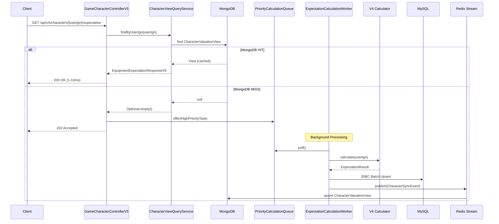
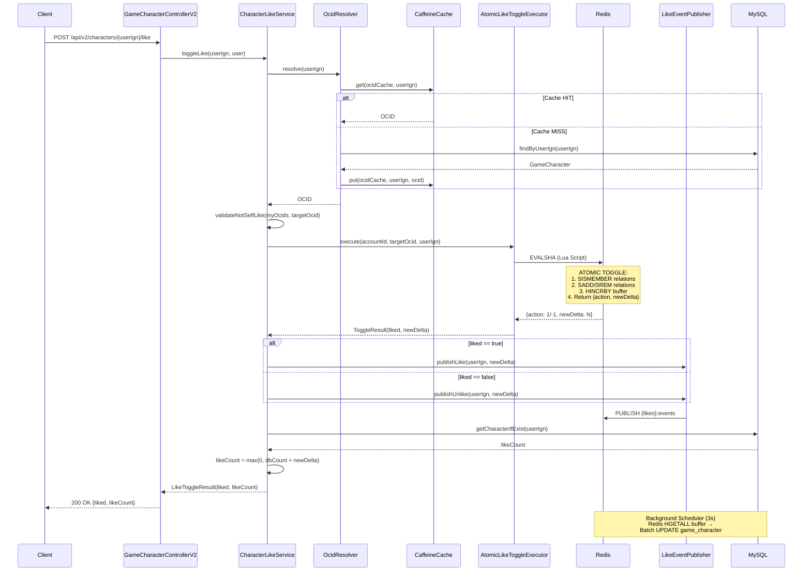

# probabilistic-valuation-engine 프로젝트 종합 분석 보고서

**분석 일자:** 2026-02-26
**분석 팀:** 10명 Code-Reviewer 에이전트 (병렬 분석)
**분석 파일 수:** 200+ Java/Kotlin 파일

---

## 📋 목차

1. [프로젝트 개요](#프로젝트-개요)
2. [모듈 구조](#모듈-구조)
3. [핵심 기술 스택](#핵심-기술-스택)
4. [서비스 버전 아키텍처](#서비스-버전-아키텍처)
5. [아키텍처 패턴](#아키텍처-패턴)
6. [API 엔드포인트 분석](#api-엔드포인트-분석)
7. [캐시 아키텍처](#캐시-아키텍처)
8. [Resilience 패턴](#resilience-패턴)
9. [예외 처리 아키텍처](#예외-처리-아키텍처)
10. [모니터링 & AI Copilot](#모니터링--ai-copilot)
11. [확률 계산 모듈](#확률-계산-모듈)
12. [Batch & Scheduler](#batch--scheduler)
13. [ADR 분석](#adr-분석)
14. [핵심 설계 원칙](#핵심-설계-원칙)
15. [성능 지표](#성능-지표)

---

## 프로젝트 개요

**probabilistic-valuation-engine**은 Nexon Open API를 활용하여 메이플스토리 장비 업그레이드 비용을 계산하는 Spring Boot 애플리케이션입니다.

| 항목 | 값 |
|------|-----|
| **목표 처리량** | 240 RPS |
| **동시 사용자** | 1,000+ |
| **인프라** | AWS t3.small (2vCPU, 2GB RAM) |
| **데이터 규모** | 30만 캐릭터 × 60장비 = 1,800만 rows |

---

## 모듈 구조

### 5개 Gradle 멀티모듈

```
probabilistic-valuation-engine/
├── module-app/          # 메인 애플리케이션 (Java 21)
│   ├── controller/      # 8개 REST Controller
│   ├── service/         # V2/V4/V5 서비스 계층
│   ├── scheduler/       # 4개 스케줄러
│   ├── batch/           # Spring Batch
│   └── monitoring/      # AI Copilot, Metrics
│
├── module-core/         # 도메인 모델, 핵심 로직 (Kotlin)
│   ├── domain/          # 5개 엔티티, 3개 VO
│   ├── core/calculator/ # 확률 계산 엔진
│   └── core/port/       # Hexagonal Architecture Port
│
├── module-common/       # 공통 유틸리티 (Kotlin)
│   ├── error/           # 80+ 예외 클래스
│   ├── util/            # 6개 유틸리티
│   └── event/           # 이벤트 핸들러
│
├── module-infra/        # 인프라 (Kotlin)
│   ├── cache/           # TieredCache (L1+L2)
│   ├── external/        # Nexon API 클라이언트
│   └── resilience/      # Resilience4j 구성
│
└── module-chaos-test/   # 카오스 테스트
```

### 모듈별 상세 분석

#### module-app (메인 애플리케이션)

| 컴포넌트 | 개수 | 주요 기능 |
|----------|------|-----------|
| Controller | 8개 | REST API 엔드포인트 |
| Service (V2) | 15개 | 핵심 비즈니스 로직 |
| Service (V4) | 7개 | 성능 최적화 레이어 |
| Service (V5) | 5개 | CQRS 아키텍처 |
| Scheduler | 4개 | 배치 동기화 |
| Batch Job | 2개 | 대량 데이터 처리 |
| Monitoring | 11개 | AI Copilot, Metrics |

#### module-core (도메인 모델)

| 컴포넌트 | 개수 | 주요 기능 |
|----------|------|-----------|
| 도메인 엔티티 | 5개 | RefreshToken, Session, GameCharacter, CharacterEquipment, CharacterLike |
| Value Objects | 3개 | CharacterId, UserIgn, LikeId |
| Port 인터페이스 | 5개 | AlertPort, CubeRatePort, ItemPricePort, PotentialStatPort, EquipmentDataPort |
| 계산 모델 | 3개 | DensePmf, SparsePmf, DiceRollProbability |

#### module-common (공통)

| 컴포넌트 | 개수 | 주요 기능 |
|----------|------|-----------|
| 예외 클래스 | 80+ | ClientBaseException(50+), ServerBaseException(30+) |
| ErrorCode | 45개 | C/R/A/D/S/E/U 접두사 |
| 유틸리티 | 6개 | GzipUtils, StringMaskingUtils, ThrowingSupplier, ResourceLoader, ExceptionUtils, InterruptUtils |

#### module-infra (인프라)

| 컴포넌트 | 개수 | 주요 기능 |
|----------|------|-----------|
| Cache 구현체 | 5개 | TieredCache, CacheInvalidation, ProbabilisticReload |
| External API | 4개 | NexonApiClient (WebClient) |
| Resilience | 3개 | CircuitBreaker, RetryBudget, RateLimiter |

---

## 핵심 기술 스택

| 카테고리 | 기술 | 버전 | 비고 |
|----------|------|------|------|
| **Language** | Java 21 | - | Virtual Threads, Records, Pattern Matching |
| **Language** | Kotlin | 2.1.0 | module-core, module-common, module-infra |
| **Framework** | Spring Boot | 3.5.4 | 최신 안정 버전 |
| **Database (R/W)** | MySQL | 8.0 | JPA + JDBC Batch |
| **Database (Read)** | MongoDB | - | V5 Query Side |
| **Cache L1** | Caffeine | - | 로컬 캐시 |
| **Cache L2** | Redis (Redisson) | 3.27.0 | 분산 캐시, Lock |
| **Resilience** | Resilience4j | 2.2.0 | Circuit Breaker, Retry, Rate Limiter |
| **AI/LLM** | LangChain4j + OpenAI | - | GPT-4o-mini (AI SRE) |
| **Testing** | Testcontainers | 1.21.2 | 통합 테스트 |
| **Testing** | ArchUnit | 1.3.0 | 아키텍처 검증 |
| **Build** | Gradle | - | 멀티모듈 |

---

## 서비스 버전 아키텍처

### V2: 핵심 비즈니스 로직

```
Controller → Service → Redis (Lua Script) → Response
                  ↓
            TieredCache (L1/L2)
                  ↓
            MySQL (Background)
```

**주요 컴포넌트:**
- **GameCharacterService**: 캐릭터 조회/생성, Negative/Positive 캐싱
- **ExpectationCalculator**: 강화 기대값 계산 인터페이스
- **EnhanceDecorator**: Decorator 패턴으로 계산기 래핑
- **CubeDpCalculator**: DP 기반 큐브 기대값 계산
- **FlameTrialsService**: 보스 장비 화염 계산
- **OutboxProcessor**: Transactional Outbox 패턴
- **DonationService**: 기부 처리, PaymentStrategy 패턴
- **LikeRelationSyncService**: 좋아요 동기화, 실시간 이벤트 발행

### V4: 성능 최적화 레이어

```
Controller → CacheCoordinator → Singleflight → V2 Calculator
                    ↓
            WriteBackBuffer (Lock-free)
                    ↓
            Batch DB Write (5s)
```

**핵심 컴포넌트:**
- **ExpectationCacheCoordinator**: Singleflight 패턴, GZIP+Base64 압축
- **ExpectationWriteBackBuffer**: Lock-free ConcurrentLinkedQueue, CAS+Backoff
- **NexonApiFallbackService**: MySQL 장애 시 Nexon API 직접 호출
- **ExpectationPersistenceService**: 배치 쓰기 지연
- **PopularCharacterTracker**: 인기 캐릭터 워밍업

**성능 최적화 기법:**
- Write-Behind Buffer: 메모리 버퍼링 후 배치 DB 저장
- Singleflight Cache: 중복 계산 방지
- GZIP Compression: JSON → GZIP → Base64 (3-4배 압축률)
- Fast Path: L1 캐시 히트 시 0.1ms

### V5: CQRS 아키텍처

```
┌─────────────────────────────────────────────────────────────┐
│                      V5 CQRS Flow                          │
├─────────────────────────────────────────────────────────────┤
│  Command Side                    │  Query Side              │
│  ┌─────────────────┐            │  ┌─────────────────┐     │
│  │ Priority Queue  │            │  │ MongoDB         │     │
│  │ (HIGH/LOW)      │            │  │ CharacterView   │     │
│  └────────┬────────┘            │  └────────┬────────┘     │
│           ↓                      │           ↓              │
│  ┌─────────────────┐            │  ┌─────────────────┐     │
│  │ Worker          │───────────→│  │ Read-Optimized  │     │
│  │ (V4 위임)       │  Redis     │  │ View            │     │
│  └─────────────────┘  Stream    │  └─────────────────┘     │
│                                  │                          │
│  MySQL (JDBC Batch)              │  1-10ms Read             │
└─────────────────────────────────────────────────────────────┘
```

**핵심 컴포넌트:**
- **PriorityCalculationQueue**: 분리된 우선순위 큐 (HIGH: 1,000, LOW: 10,000)
- **ExpectationCalculationWorker**: 큐 폴링 → V4 위임 → Redis Stream 발행
- **MongoSyncEventPublisherInterface**: Query Side 동기화
- **StreamStrategyFactory**: Stream 초기화 전략

---

## 아키텍처 패턴

### 1. Hexagonal Architecture (Ports & Adapters)

```
module-core/
├── domain/          # 도메인 엔티티, Value Objects
├── core/port/out/   # Output Port 인터페이스
└── core/port/in/    # Input Port 인터페이스
```

**Port 인터페이스:**
- `AlertPort`: 알림 발송
- `CubeRatePort`: 큐브 확률 조회
- `ItemPricePort`: 아이템 가격 조회
- `PotentialStatPort`: 잠재능력 스탯 조회
- `EquipmentDataPort`: 장비 데이터 조회

### 2. Decorator Pattern

```java
// 장비 강화 계산기 데코레이터 체인
ExpectationCalculator base = new BaseEquipmentItem(equipment);
ExpectationCalculator enhanced = new StarforceDecoratorV4(base);
ExpectationCalculator result = new EquipmentEnhanceDecorator(enhanced);
```

### 3. Strategy Pattern

| 전략 인터페이스 | 구현체 | 용도 |
|---------------|--------|------|
| `MetricsCollectorStrategy` | JvmMetricsCollector, DatabaseMetricsCollector | 메트릭 수집 |
| `StreamStrategyFactory` | StreamInitializationStrategy | 스트림 초기화 |
| `BackoffStrategy` | ExponentialBackoff | 백오프 알고리즘 |
| `PaymentStrategy` | KakaoPay, TossPay | 결제 처리 |

### 4. Factory Pattern

| 팩토리 | 생성 대상 |
|--------|-----------|
| `ExpectationCalculatorFactory` | V2 계산기 |
| `EquipmentExpectationCalculatorFactory` | V4 계산기 |
| `StreamStrategyFactory` | Stream 전략 |

### 5. Transactional Outbox Pattern

```
이벤트 발생 → Outbox 테이블 INSERT
                    ↓
            OutboxProcessor (SKIP LOCKED)
                    ↓
            Kafka 발행 → DLQ (실패 시)
```

**Triple Safety Net:**
1. DB DLQ 저장
2. File Backup
3. Discord Alert

### 6. CQRS Pattern (V5)

```
Command Side: API → Queue → Worker → MySQL (JDBC Batch)
Query Side: MongoDB → 1-10ms Read
Sync: Redis Stream → MongoDB Upsert
```

---

## API 엔드포인트 분석

### 컨트롤러 구성 (8개)

| 컨트롤러 | 경로 | 기능 |
|----------|------|------|
| GameCharacterControllerV1 | `/api/v1/characters/*` | 레거시 |
| GameCharacterControllerV4 | `/api/v4/characters/*` | 성능 최적화 |
| GameCharacterControllerV5 | `/api/v5/characters/*` | CQRS |
| AuthController | `/auth/*` | 인증 |
| AdminController | `/api/admin/*` | Admin 관리 |
| DonationController | `/api/v2/donation/*` | 커피 후원 |
| DlqAdminController | `/api/admin/dlq/*` | DLQ 관리 |
| AlertTestController | `/api/admin/test/*` | 알림 테스트 |

### 인증/인가 (Spring Security 6.x)

```
JWT Access Token (15분) + Refresh Token (7일)
Token Rotation 패턴 (Refresh 시 기존 토큰 무효화)

@PreAuthorize("hasRole('ADMIN') or hasRole('USER')")
@PreAuthorize("hasRole('ADMIN')")
```

### V5 Expectation 엔드포인트 호출 흐름

```
Client Request → MongoDB Check (Query Side)
    → HIT: Return JSON (1-10ms) [200 OK]
    → MISS: Queue Calculation (Command Side) → Return 202 Accepted
```

**상세 흐름:**



### V2 좋아요 엔드포인트 호출 흐름

```
Client Request → Redis Lua Script (Atomic) → Response (8-16ms)
                    ↓
            Background Scheduler (3s/5s) → DB Sync
```

**상세 흐름:**



**Redis 데이터 구조:**

| 키 | 타입 | 용도 |
|----|------|------|
| `{likes}:relations` | SET | 활성 좋아요 관계 |
| `{likes}:relations:pending` | SET | DB 동기화 대기 |
| `{likes}:buffer` | HASH | 캐릭터별 카운터 델타 |
| `{likes}:relations:unliked` | SET | 명시적 취소 추적 |

---

## 캐시 아키텍처

### TieredCache (2-Layer)

```
┌─────────────────────────────────────────────────────────────────────┐
│                        TieredCache (2-Layer)                        │
├─────────────────────────────────────────────────────────────────────┤
│  L1: Caffeine (Local)           │  L2: Redis (Distributed)          │
│  - ConcurrentHashMap            │  - Redisson                       │
│  - O(1) 조회                    │  - Shared across instances        │
│  - In-Memory                    │  - TTL 기반 만료                  │
├─────────────────────────────────┴───────────────────────────────────┤
│                         Single-Flight Lock                          │
│                    Redisson Distributed Lock                        │
├─────────────────────────────────────────────────────────────────────┤
│                      Pub/Sub Invalidation                           │
│         (Remote Instance L1 Cache Coherence)                       │
└─────────────────────────────────────────────────────────────────────┘
```

### Cache Stampede 방지

**1단계: Single-Flight 패턴**
```
Lock 획득 → Double-check L2 → valueLoader 실행 → L2 저장 → L1 저장
Follower: 락 대기 → L2 읽기 → L1 Backfill
```

**2단계: Probabilistic Early Recomputation (PER)**
```kotlin
// X-Fetch 알고리즘 (Lock 없이 확률적 갱신)
if (-log(random) * beta * delta >= (expiry - now)) {
    triggerBackgroundRefresh(); // 비동기 갱신
}
return staleData; // Non-Blocking
```

### 캐시 무효화 전략

**무효화 순서 (P0-3 Fix):**
1. L2(Redis) 먼저 제거 → source of truth
2. L1(Caffeine) 제거 → 로컬 정책성
3. Pub/Sub 이벤트 발행 → 원격 인스턴스 L1 무효화

**Self-skip 패턴:**
- `sourceInstanceId`로 자기 자신 이벤트 무시
- TTL(5분)을 Pub/Sub 유실 시 Fallback으로 활용

### 캐시 타입 정의

| 캐시 이름 | TTL | 용도 |
|-----------|-----|------|
| equipment | 5분 | 장비 데이터 |
| ocidCache | 30분 | OCID 매핑 |
| totalExpectation | 5분 | 총합 기댓값 |
| characterBasic | 15분 | 캐릭터 기본 정보 |
| ocidNegativeCache | 30분 | 캐릭터 존재하지 않음 |
| likeCount | 5분 | 좋아요 수 |

---

## Resilience 패턴

### Circuit Breaker (Resilience4j)

| 설정 | nexonApi | likeSync |
|------|----------|----------|
| Sliding Window | 10 | 5/20 |
| Failure Threshold | 50% | 60% |
| Wait Duration | 10s | 30s |
| Min Calls | 10 | - |

**Annotation 순서:**
```
@Bulkhead → @TimeLimiter → @CircuitBreaker → @Retry
```

### Rate Limiting

**Retry Budget (Google SRE Pattern):**
- 1분당 최대 100회 재시도 제한
- 윈도우 경과 시 자동 리셋
- 예산 소진 시 Fail Fast

### 재시도 정책

| 항목 | nexonApi | likeSync |
|------|----------|----------|
| Max Attempts | 3 | 3 |
| Wait Duration | 500ms | 지수 백오프 |
| Exponential Backoff | ❌ | ✅ (Jitter 0.5) |

### Fallback 전략

**2단계 Fallback:**
1. **Degrade**: 만료된 캐시 반환
2. **Outbox**: 이벤트 적재 + Discord 알림

---

## 예외 처리 아키텍처

### 예외 계층 구조

```
RuntimeException
    └── BaseException (abstract)
            ├── ClientBaseException (4xx) + CircuitBreakerIgnoreMarker
            │     └── [50+ Concrete Exceptions]
            │           • CharacterNotFoundException
            │           • InsufficientPointException
            │           • InvalidApiKeyException
            │           • DuplicateLikeException
            │           • SelfLikeNotAllowedException
            │
            └── ServerBaseException (5xx) + CircuitBreakerRecordMarker
                  └── [30+ Concrete Exceptions]
                        • ExternalApiException
                        • ApiTimeoutException
                        • DatabaseNamedLockException
                        • InternalSystemException
```

### CircuitBreaker Marker Interface

```kotlin
// Business Exceptions (4xx) → CB 무시
interface CircuitBreakerIgnoreMarker

// System Exceptions (5xx) → CB 기록
interface CircuitBreakerRecordMarker
```

### ErrorCode Enum (45개)

| 접두사 | 개수 | 범위 | 설명 |
|--------|------|------|------|
| C001~C005 | 5 | 400-404 | 입력값/캐릭터 관련 |
| R001 | 1 | 429 | Rate Limit |
| A001~A013 | 13 | 401-404 | 인증/인가 관련 |
| D001~D002 | 2 | 404-409 | DLQ 처리 |
| S001~S017 | 17 | 500-503 | 서버/시스템 오류 |
| E001~E002 | 2 | 500 | 이벤트 핸들러 |
| U999 | 1 | 500 | 알 수 없는 에러 |

### GlobalExceptionHandler

| 예외 타입 | HTTP 상태 | 설명 |
|----------|----------|------|
| RateLimitExceededException | 429 | Retry-After 헤더 포함 |
| BaseException | 400/404/500 | 동적 메시지 + ErrorCode |
| CompletionException | 500/503 | 비동기 예외 unwrap |
| RejectedExecutionException | 503 | Retry-After: 60s |
| TimeoutException | 503 | Retry-After: 30s |
| CallNotPermittedException | 503 | CircuitBreaker OPEN |

---

## 모니터링 & AI Copilot

### Metrics Collector (Strategy Pattern)

**11개 카테고리 (MetricCategory):**
- GOLDEN_SIGNALS (Latency, Traffic, Errors, Saturation)
- JVM, DATABASE, REDIS, EXTERNAL_API, CIRCUIT_BREAKER
- SECURITY, BUSINESS, BATCH, LOGGING, INFRA

### AI Copilot (Anomaly Detection)

```
Scheduler → Signal Loader → Prometheus Query → Anomaly Detection
    → Incident Context → AI SRE Analysis → Discord Alert
```

**핵심 컴포넌트:**
- `PrometheusClient`: Java 11+ HttpClient
- `AnomalyDetector`: Threshold + Z-Score
- `GrafanaJsonIngestor`: Dashboard 연동

### AI SRE Service

**Tech Stack:** LangChain4j + OpenAI GPT-4o-mini

**3-Tier Fallback:**
1. LLM 분석
2. Rule-based
3. Generic message

---

## 확률 계산 모듈

### PMF (Probability Mass Function)

**핵심 데이터 모델:**
- `DensePmf` (밀집): 인덱스=값, 합성곱 결과용
- `SparsePmf` (희소): 슬롯별 분포용
- `DiceRollProbability`: 주사위 굴림 모델

**변환 파이프라인:**
```
DiceRollProbability → SparsePmf → ProbabilityConvolver → DensePmf
```

### 계산 엔진

| 엔진 | 기능 |
|------|------|
| Starforce | 스타포스 강화 확률 |
| Cube | 큐브 옵션 확률 |
| Potential | 잠재능력 등급 확률 |
| Flame | 환생의 불꽃 (DP 기반) |

### 성능 최적화

| 기법 | 설명 |
|------|------|
| Tail Clamp | 합이 target 초과 시 모두 target 버킷에 누적 |
| Kahan Summation | 부동소수점 오차 보정 |
| 스케일 팩터 10 | 환산치를 정수로 변환 |
| Capping | DP에서 상태 공간 제한 |

---

## Batch & Scheduler

### 스케줄러 구성

| 스케줄러 | 주기 | 기능 |
|----------|------|------|
| BufferRecoveryScheduler | 10s/60s | Retry Queue 복구 |
| PopularCharacterWarmupScheduler | 5시 | 인기 캐릭터 워밍업 |
| ExpectationBatchWriteScheduler | 5s | V4 버퍼 → DB 동기화 |
| OutboxScheduler | 15s/60s/5분 | Outbox 폴링, 모니터링 |

### Graceful Shutdown (3-Phase)

```
1. Prepare Shutdown: 새로운 offer 차단
2. Await Pending: Phaser로 완료 대기
3. Drain Buffer: 완전 drain
```

---

## ADR 분석

### ADR-035: JDBC 배치 전환

**문제:**
- JPA `saveAll()`: 1만 건에 15.2초 (650건/초)
- 30만 건 추정: ~7.6시간 소요

**해결:**
- JDBC `batchUpdate()`: 1만 건에 0.4초 (22,000건/초)
- **33배 성능 향상**

| 방식 | 1만 건 소요 시간 | 성능 (건/초) |
|------|-----------------|---------------|
| JPA saveAll() | 15.2초 | 650 |
| JDBC batchUpdate() | 0.4초 | 22,000 |
| **차이** | **33배** | |

**근거:**
- MySQL IDENTITY 전략에서 JPA 배치 불가
- CQRS 분리 후 JPA 장점 소멸

---

## 핵심 설계 원칙

### 1. Zero Try-Catch Policy (Section 12)

모든 예외 처리는 `LogicExecutor` 템플릿에 위임

```java
// Bad (Legacy)
try {
    return repository.findById(id);
} catch (Exception e) {
    log.error("Error", e);
    return null;
}

// Good (Modern)
return executor.executeOrDefault(
    () -> repository.findById(id),
    null,
    TaskContext.of("Domain", "FindById", id)
);
```

### 2. Stateless Architecture

**금지 패턴:**
- `HttpSession` 사용 금지
- `@SessionScope` 사용 금지
- `static mutable` 상태 금지

### 3. SOLID 원칙

| 원칙 | 적용 예시 |
|------|-----------|
| SRP | Controller는 HTTP만, Service는 비즈니스만 |
| OCP | Strategy 패턴으로 확장 |
| LSP | BaseException 계층 |
| ISP | Port 인터페이스 분리 |
| DIP | Hexagonal Architecture |

### 4. Lambda 3줄 제한 (Section 15)

```java
// Bad (Lambda Hell)
return executor.execute(() -> {
    User user = repo.findById(id).orElseThrow(...);
    if (user.isActive()) {
        return otherService.process(user.getData().stream()
            .filter(d -> d.isValid())
            .map(d -> { /* complex logic */ })
            .toList());
    }
}, context);

// Good (Method Extraction)
return executor.execute(() -> this.processActiveUser(id), context);
```

### 5. Optional Chaining

```java
// Bad (Imperative null check)
ValueWrapper wrapper = l1.get(key);
if (wrapper != null) {
    recordHit("L1");
    return wrapper;
}
return null;

// Good (Declarative Optional chaining)
return Optional.ofNullable(l1.get(key))
        .map(w -> tap(w, "L1"))
        .orElse(null);
```

---

## 성능 지표

| 지표 | 값 | 비고 |
|------|-----|------|
| **목표 RPS** | 240 | t3.small 기준 |
| **V4 Fast Path** | 0.1ms | L1 캐시 히트 |
| **V5 Query (MongoDB)** | 1-10ms | Query Side |
| **V2 Like (Redis)** | 8-16ms | Lua Script |
| **GZIP 압축률** | 93% | 200KB → 15KB |
| **JDBC Batch** | 22,000건/초 | ADR-035 |
| **Cache L1 Hit Rate** | 95%+ | 목표 |

---

## 발견된 기술 부채

### P0 (Critical)

1. **V5 인증 미구현**: `@PreAuthorize` 주석 처리됨
2. **ADR-039 위반**: module-app에 56개 @Configuration 클래스

### P1 (High)

1. **FQCN 사용**: 일부 파일에서 import 미사용
2. **Deep Paging**: DLQ에서 O(n) → O(1) Keyset Pagination 필요

### P2 (Medium)

1. **동시성 테스트 보강**: Race Condition 시나리오 추가 필요
2. **메트릭 대시보드**: Grafana 대시보드 업데이트

---

## 결론

### 요약

probabilistic-valuation-engine은 **잘 설계된 고성능 Spring Boot 애플리케이션**입니다:

1. **멀티모듈 아키텍처**: 5개 모듈로 관심사 분리
2. **CQRS 패턴**: V5에서 Command/Query 분리
3. **TieredCache**: L1(Caffeine) + L2(Redis) + Singleflight
4. **Resilience4j**: Circuit Breaker, Retry, Rate Limiter
5. **JDBC Batch**: 33배 성능 향상 (ADR-035)
6. **AI Copilot**: LangChain4j + OpenAI 기반 자동 분석

### 개선 권장사항

1. V5 인증 구현 완료
2. Configuration 클래스 module-infra로 이관
3. Deep Paging 최적화
4. 동시성 테스트 보강

---

**분석 완료일:** 2026-02-26
**분석 팀:** 10명 Code-Reviewer 에이전트
**다음 리뷰:** 2026-03-26
