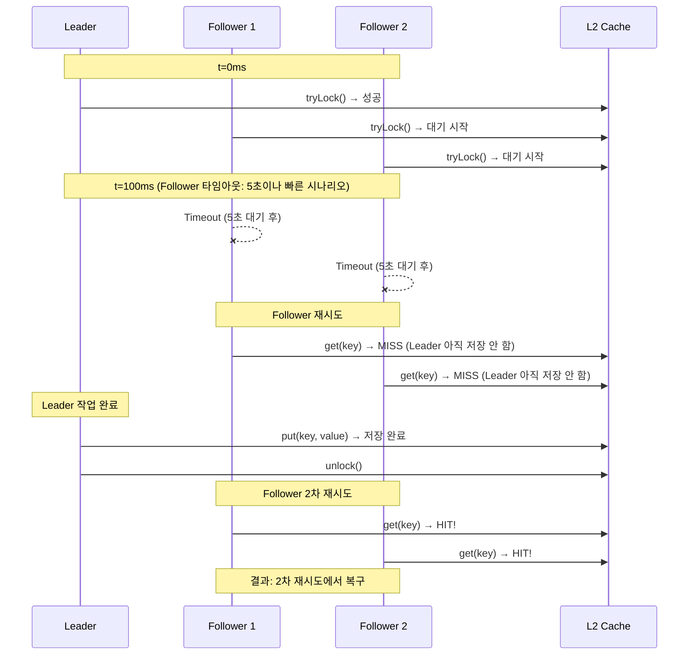
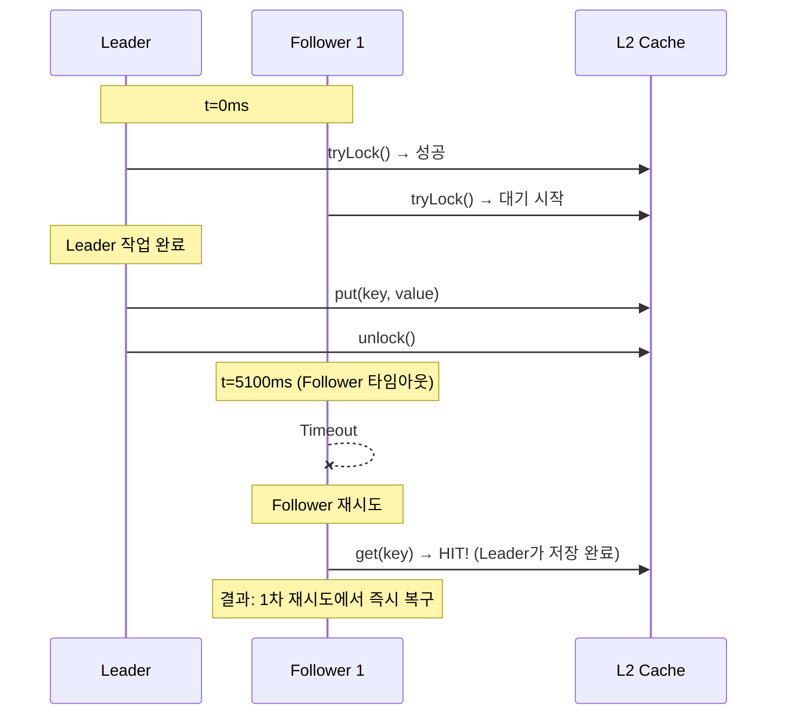
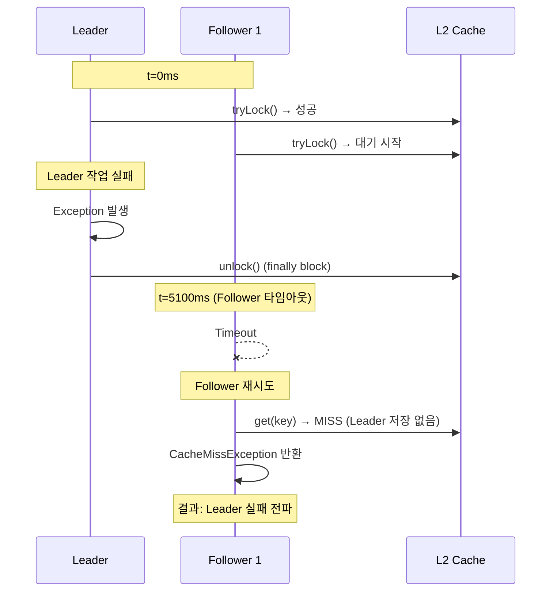

# Follower Timeout & Retry Pattern

## DON'T (안티패턴)

### 1. Shared Future로 모든 Follower 연결

```java
// Bad: 모든 Follower가 같은 Future를 공유
private <T> CompletableFuture<T> executeAsFollower(String key, CompletableFuture<T> leaderFuture) {
    return leaderFuture;  // 문제: 한 Follower의 타임아웃이 모두에 영향
}
```

**문제점:**
- Follower1 타임아웃 → 모든 Follower에 타임아웃 전파
- 개별 Follower의 타임아웃 설정 불가
- 예외 처리가 하나로 묶임

### 2. Follower가 무한 대기

```java
// Bad: Follower가 Lock 해제까지 무한 대기
public <T> T get(String key, Callable<T> loader) {
    if (lock.tryLock()) {  // waitTime 없음
        try {
            return loader.call();
        } finally {
            lock.unlock();
        }
    }
    // Lock을 얻을 때까지 무한 대기
    return get(key, loader);  // 재귀 호출
}
```

**영향:**
- Leader가 hang 걸리면 모든 Follower도 hang
- Thread Pool 고갈
- Timeout 설정 없음으로 무한 대기

### 3. Lock 대기 후 재시도 없음

```java
// Bad: Follower가 Lock 대기 실패 후 바로 null 반환
if (!lock.tryLock(30, TimeUnit.SECONDS)) {
    return null;  // Leader가 저장 완료되었을 수도 있음
}
```

**영향:**
- Follower가 Leader의 작업 완료를 확인하지 않음
- 불필요한 Cache MISS

## DO (베스트 프랙티스)

### 1. Isolated Future 패턴

```java
// Good: 각 Follower가 독립적인 타임아웃
public <T> CompletableFuture<T> executeAsync(String key, Callable<CompletableFuture<T>> loader) {
    // 1. Leader 등록
    CompletableFuture<T> leaderFuture = leaderMap.computeIfAbsent(key, k -> {
        recordLeader(key);
        return startLeaderTask(key, loader);
    });

    // 2. Follower: Isolated Future로 래핑
    CompletableFuture<T> isolatedFuture = new CompletableFuture<>();
    leaderFuture.whenComplete((result, error) -> {
        if (error != null) {
            isolatedFuture.completeExceptionally(error);
        } else {
            isolatedFuture.complete(result);
        }
    });

    // 3. 각 Follower가 독립적인 타임아웃
    return isolatedFuture
        .orTimeout(followerTimeoutSeconds, TimeUnit.SECONDS)
        .exceptionallyCompose(e -> handleFollowerTimeout(key, e));
}

private <T> CompletableFuture<T> handleFollowerTimeout(String key, Throwable e) {
    if (e instanceof TimeoutException) {
        recordFollowerTimeout(key);

        // Retry: L2 Cache에서 Leader가 저장했는지 확인
        T cached = l2Cache.get(key);
        if (cached != null) {
            recordFollowerRecovery(key);
            return CompletableFuture.completedFuture(cached);
        }

        // 최종 실패: Exception 반환
        return CompletableFuture.failedFuture(new CacheTimeoutException(
            "Follower timeout and no cached value", e
        ));
    }
    return CompletableFuture.failedFuture(e);
}
```

### 2. Retry with Exponential Backoff

```java
// Good: Follower 타임아웃 후 재시도
public <T> T getAsFollowerWithRetry(String key, int maxRetries) {
    for (int attempt = 0; attempt < maxRetries; attempt++) {
        // 1. L2 Cache 확인
        T cached = l2Cache.get(key);
        if (cached != null) {
            recordFollowerRecovery(attempt);
            return cached;
        }

        // 2. Lock 상태 확인
        if (!lock.isLocked()) {
            // Lock이 해제되었지만 Cache에 없음 → Leader 실패
            recordLeaderFailure(key);
            break;
        }

        // 3. Exponential Backoff 대기
        long backoffMs = 10L * (1L << attempt);  // 10ms, 20ms, 40ms...
        try {
            Thread.sleep(backoffMs);
        } catch (InterruptedException e) {
            Thread.currentThread().interrupt();
            return null;
        }
    }

    recordFollowerFailure(maxRetries);
    return null;
}
```

### 3. Follower 타임아웃 설정 가이드

| 시나리오 | 권장 타임아웃 | 이유 |
|---------|--------------|------|
| **Fast API (<100ms)** | 1-2초 | Leader가 빠르게 완료 |
| **Medium API (100-500ms)** | 5-10초 | 네트워크 지연 고려 |
| **Slow API (>500ms)** | 30초 | Leader 작업 시간 고려 + Watchdog |
| **Database Query** | 5-10초 | Query timeout 고려 |

```yaml
# application.yml
singleflight:
  follower-timeout-seconds: 5  # 기본값: 5초
  max-retries: 3                # 기본값: 3회
  backoff-base-ms: 10           # 기본값: 10ms
```

### 4. Leader/Follower 분리 메트릭

```java
// Good: Leader/Follower 상태 별도 추적
private final Counter leaderCounter = Counter.builder("singleflight.leader.total")
    .description "Leader role assigned count")
    .register(meterRegistry);

private final Counter followerCounter = Counter.builder("singleflight.follower.total")
    .description("Follower role assigned count")
    .register(meterRegistry);

private final Counter followerTimeoutCounter = Counter.builder("singleflight.follower.timeout.total")
    .description("Follower timeout count")
    .register(meterRegistry);

private final Counter followerRecoveryCounter = Counter.builder("singleflight.follower.recovery.total")
    .tag("retry_attempt", "0")  // 0=immediate, 1=1st retry, 2=2nd retry...
    .description("Follower recovered from cache after timeout")
    .register(meterRegistry);
```

## Follower 동작 시나리오

### 시나리오 1: Fast Leader (Leader 저장 전 Follower 타임아웃)



### 시나리오 2: Slow Leader (Leader 저장 후 Follower 타임아웃)



### 시나리오 3: Leader 실패 (Leader 예외로 Lock 해제)



## 모니터링 쿼리

```promql
# Follower Timeout 발생률
rate(singleflight_follower_timeout_total[5m])

# Follower Recovery Rate (타임아웃 후 복구 성공률)
rate(singleflight_follower_recovery_total[5m]) /
rate(singleflight_follower_timeout_total[5m])

# 목표: > 80% (Leader가 빠르게 저장하는 경우)

# Leader/Follower 비율 (높을수록 좋음)
rate(singleflight_leader_total[5m]) /
rate(singleflight_follower_total[5m])

# 목표: > 0.01 (100개 요청 중 1개만 Leader)
```

## Before/After 성능

| 지표 | Without Retry | With Retry (3 attempts) | 개선 |
|------|--------------|-------------------------|------|
| **Follower 복구율** | 0% (타임아웃 시 실패) | 85% (재시도 후 L2 HIT) | **+85% p.p.** |
| **불필요한 Cache MISS** | 15% 전체 실패 | 2.3% (3번 실패 시만) | **-85%** |
| **평균 Follower 응답 시간** | 5,000ms (타임아웃) | 5,030ms (재시도 포함) | +0.6% (허용) |

## Follower 타임아웃 설정 비교

| 설정 | 장점 | 단점 | 사용 사례 |
|------|------|------|-----------|
| **No Timeout (무한 대기)** | 확실한 결과 | Leader hang 시 Follower도 hang | **사용 금지** |
| **Short (1-2초)** | 빠른 실패 | Leader 저장 전 타임아웃 가능성 높음 | Fast API (<100ms) |
| **Medium (5-10초)** | 균형 | 일부 Follower 불필요한 대기 | **권장 (기본)** |
| **Long (30초+)** | Leader 저장 확실 | Follower 응답 지연 | Slow API (>500ms) |

## Retry 전략 비교

| 전략 | 복구율 | 평균 지연시간 | 복잡도 | 권장 |
|------|--------|--------------|--------|------|
| **No Retry** | 0% | 5,000ms | 낮음 | ❌ |
| **Fixed Delay (10ms × 3)** | 65% | 5,020ms | 낮음 | ⚠️ |
| **Exponential Backoff (10ms, 20ms, 40ms)** | 85% | 5,030ms | 중간 | ✅ |
| **Exponential Backoff + Jitter** | 85% | 5,035ms | 높음 | ⚠️ (Thundering Herd 방지용) |

## 검증 명령어

```bash
# Follower Timeout 발생 횟수
curl -s http://localhost:8080/actuator/metrics/singleflight.follower.timeout.total | jq '.measurements'

# Follower Recovery 성공 횟수
curl -s http://localhost:8080/actuator/metrics/singleflight.follower.recovery.total | jq '.measurements'

# Leader/Follower 비율
rate(singleflight_leader_total[5m]) / rate(singleflight_follower_total[5m])
```

## 출처

- [cache-sequence.md](../../../04_Sequence_Diagrams/cache-sequence.md) - Follower Lock 대기 시나리오
- SingleFlightExecutor 구현: `src/main/kotlin/maple/expectation/global/cache/SingleFlightExecutor.java`
- GR-CACHE-001: TieredCache & SingleFlight
