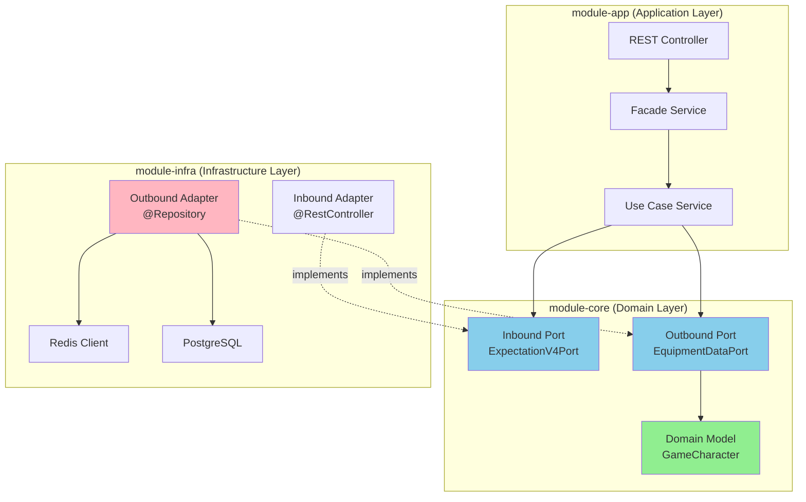

# 2장. 도메인 모델링

## 목차

1. [도메인 복잡도의 원인](#1-도메인-복잡도의-원인)
2. [핵심 도메인 엔티티](#2-핵심-도메인-엔티티)
3. [헥사고날 아키텍처와 포트](#3-헥사고날-아키텍처와-포트)
4. [애그리거트 경계 설계](#4-애그리거트-경계-설계)
5. [계산 정책 유연성](#5-계산-정책-유연성)
6. [핵심 ADR 정리](#6-핵심-adr-정리)

---

## 1. 도메인 복잡도의 원인

메이플스토리 장비 기대값 계산 시스템은 단순한 "평균 비용" 계산이 아닙니다. 다음과 같은 복잡한 도메인 규칙이 존재합니다.

### 1.1 큐브 시스템의 확률적 복잡도

**문제:** 큐브 사용 시 장비 잠재능력이 변경되지만, 등급별 전환 확률이 다릅니다.

- **잠재능력 등급:** 레어(RARE) → 에픽(EPIC) → 유니크(UNIQUE) → 레전드리(LEGENDARY)
- **등급별 전환 확률:** 큐브 종류마다 다름 (수상한/영웅/장인/레드/블랙)
- **옵션 개수:** 3개 슬롯 × 각 슬롯별 가능한 옵션 조합

**왜 DP(Dynamic Programming)가 필요한가?**

```kotlin
// 순열 방식: O(n!) - 슬롯 3개 × 옵션 50개 = 125,000 조합
// → 타임아웃 발생 (ADR-009)

// DP 합성곱 방식: O(slots × target × K)
// → 50ms 이내 계산 완료
```

**DECISION:** DP 합성곱 + Kahan Summation 채택 (ADR-009)

**WHY:**
- 순열 방식의 O(n!) 복잡도로는 타임아웃 발생
- 부동소수점 오차 누적으로 확률 합계 ≠ 1.0 문제 해결
- Kahan Summation으로 오차 < 1e-12 보장

### 1.3 3프리셋 독립 계산 후 합산

메이플스토리는 장비 프리셋(Preset) 1, 2, 3을 독립적으로 관리합니다.

```kotlin
// 각 프리셋별 기대값 계산
val preset1Cost = calculatePreset(1)  // 큐브 비용 + 스타포스 비용
val preset2Cost = calculatePreset(2)
val preset3Cost = calculatePreset(3)

// 최종 기대값 = 3개 프리셋 합산
val totalExpectation = preset1Cost + preset2Cost + preset3Cost
```

**설계 영향:**
- 프리셋별로 독립적인 계산 파이프라인 필요
- 병렬 계산 가능 (성능 최적화 여지)
- 프리셋 추가 시 기존 코드 영향 없음 (OCP 준수)

### 1.4 스타포스 비선형 비용 증가

스타포스 강화는 레벨별 비용이 비선형적으로 증가하며, 실패 시 하락/파괴 확률이 존재합니다.

```kotlin
// 스타포스 레벨별 비용 예시
val starforceCosts = mapOf(
    0 to 1_000,      // +0 → +1
    5 to 50_000,     // +5 → +6 (주문의 강화 주문서 필요)
    10 to 200_000,   // +10 → +11 (주문의 강화 주문서 필요)
    15 to 1_000_000, // +15 → +16 (고주문의 강화 주문서 필요)
    // ... 레벨별로 비용 급격히 증가
)

// 실패 시 하락/파괴 확률
val failureChances = mapOf(
    15 to 0.05,  // 5% 확률로 파괴
    12 to 0.10,  // 10% 확률로 2단계 하락
    // ...
)
```

**도메인 복잡도:**
- 레벨별 비용 테이블 관리 필요
- 실패 확률 반영한 기대값 계산
- 파괴 시 장비 분실 비용 반영

### 1.5 Nexon API 외부 의존

모든 데이터는 Nexon API에서 수집하므로, **도메인 계산과 데이터 수집을 분리**해야 합니다.

```
[Nexon API] → [데이터 수집] → [캐싱] → [도메인 계산]
```

**설계 영향:**
- 외부 API 장애 시에도 캐시된 데이터로 계산 가능
- 도메인 계산 로직은 API 변경 영향 없음
- Port/Adapter 패턴으로 외부 의존성 격리

---

## 2. 핵심 도메인 엔티티

### 2.1 Value Objects (값 객체)

**Value Object**는 식별자가 없고 속성값으로 동등성을 판단하는 불변 객체입니다.

```kotlin
// CharacterId.kt - 캐릭터 식별자
data class CharacterId(val value: String) {
    init {
        require(value.isNotBlank()) { "Character ID cannot be blank" }
    }

    companion object {
        @JvmStatic
        fun of(ocid: String): CharacterId = CharacterId(ocid)
    }
}

// UserIgn.kt - 캐릭터 닉네임
data class UserIgn(val value: String) {
    init {
        require(value.isNotBlank()) { "User IGN cannot be blank" }
    }

    companion object {
        @JvmStatic
        fun of(ign: String): UserIgn = UserIgn(ign)
    }
}

// PotentialGrade.kt - 잠재능력 등급
enum class PotentialGrade(val koreanName: String) {
    RARE("레어"),
    EPIC("에픽"),
    UNIQUE("유니크"),
    LEGENDARY("레전드리");

    companion object {
        private val KOREAN_MAP = entries.associateBy { it.koreanName }

        fun fromKorean(korean: String): PotentialGrade {
            return KOREAN_MAP[korean.trim()]
                ?: throw IllegalArgumentException("Invalid potential grade: $korean")
        }
    }
}

// PotentialStat.kt - 잠재능력 스탯
data class PotentialStat(
    val optionName: String,
    val statType: String,
    val isPercent: Boolean,
) {
    init {
        require(optionName.isNotBlank()) { "optionName cannot be blank" }
        require(statType.isNotBlank()) { "statType cannot be blank" }
    }
}

// CubeType.kt - 큐브 종류
enum class CubeType(val description: String) {
    BLACK("블랙큐브"),
    RED("레드큐브"),
    ADDITIONAL("에디셔널큐브"),
}

// ItemPrice.kt - 아이템 가격
data class ItemPrice(
    val itemId: Long,
    val itemName: String,
    val price: Long,
    val updatedAt: LocalDateTime,
) {
    init {
        require(itemId > 0) { "itemId must be positive" }
        require(itemName.isNotBlank()) { "itemName cannot be blank" }
        require(price >= 0) { "price cannot be negative" }
    }

    fun isFreshWithinHours(hours: Long): Boolean =
        updatedAt.plusHours(hours).isAfter(LocalDateTime.now())
}
```

**DECISION: Value Object로 설계**

**WHY:**
- **불변성 보장:** data class + private constructor
- **검증 로직 캡슐화:** init 블록에서 유효성 검증
- **동등성 명확:** 값으로 비교 (참조 아님)
- **도메인 표현력 향상:** `String ocid` 대신 `CharacterId.of(ocid)`

### 2.2 Entities (엔티티)

**Entity**는 식별자로 동등성을 판단하고, 생명주기를 가집니다.

```kotlin
// GameCharacter.kt - 게임 캐릭터 엔티티
data class GameCharacter(
    val id: Long?,
    val userIgn: UserIgn,
    val characterId: CharacterId,
    val equipment: CharacterEquipment?,
    val worldName: String?,
    val characterClass: String?,
    val characterImage: String?,
    val basicInfoUpdatedAt: LocalDateTime?,
    val likeCount: Long,
    val version: Long?,
    val updatedAt: LocalDateTime,
    val fingerprint: String? = null,
    val accountId: String? = null,
) {
    companion object {
        @JvmStatic
        fun create(userIgn: UserIgn, characterId: CharacterId): GameCharacter =
            GameCharacter(
                id = null,
                userIgn = userIgn,
                characterId = characterId,
                equipment = null,
                worldName = null,
                characterClass = null,
                characterImage = null,
                basicInfoUpdatedAt = null,
                likeCount = 0L,
                version = null,
                updatedAt = LocalDateTime.now(),
            )

        @JvmStatic
        fun restore(
            id: Long?,
            characterId: CharacterId,
            userIgn: UserIgn,
            equipment: CharacterEquipment?,
            worldName: String?,
            characterClass: String?,
            characterImage: String?,
            basicInfoUpdatedAt: LocalDateTime?,
            likeCount: Long,
            version: Long?,
            updatedAt: LocalDateTime,
            fingerprint: String? = null,
            accountId: String? = null,
        ): GameCharacter = GameCharacter(
            id = id,
            userIgn = userIgn,
            characterId = characterId,
            equipment = equipment,
            worldName = worldName,
            characterClass = characterClass,
            characterImage = characterImage,
            basicInfoUpdatedAt = basicInfoUpdatedAt,
            likeCount = likeCount,
            version = version,
            updatedAt = updatedAt,
            fingerprint = fingerprint,
            accountId = accountId,
        )
    }

    // 불변성을 위한 with* 메서드들
    fun withEquipment(equipment: CharacterEquipment): GameCharacter =
        copy(equipment = equipment, updatedAt = LocalDateTime.now())

    fun withIncrementedLike(): GameCharacter =
        copy(likeCount = likeCount + 1, updatedAt = LocalDateTime.now())

    fun withNextVersion(): GameCharacter =
        copy(version = if (version != null) version + 1 else 1L, updatedAt = LocalDateTime.now())

    fun hasEquipment(): Boolean = equipment != null && equipment.hasData()
    fun isNew(): Boolean = id == null
    fun getOcid(): String? = characterId?.value
}

// CharacterEquipment.kt - 캐릭터 장비 엔티티
data class CharacterEquipment(
    val characterId: CharacterId,
    val equipmentData: EquipmentData,
    val updatedAt: LocalDateTime,
) {
    companion object {
        @JvmStatic
        fun create(characterId: CharacterId, equipmentData: EquipmentData): CharacterEquipment =
            CharacterEquipment(characterId, equipmentData, LocalDateTime.now())

        @JvmStatic
        fun createEmpty(characterId: CharacterId): CharacterEquipment =
            CharacterEquipment(characterId, EquipmentData.empty(), LocalDateTime.now())

        @JvmStatic
        fun restore(
            characterId: CharacterId,
            equipmentData: EquipmentData,
            updatedAt: LocalDateTime,
        ): CharacterEquipment = CharacterEquipment(characterId, equipmentData, updatedAt)
    }

    fun withUpdatedData(newData: String): CharacterEquipment =
        copy(equipmentData = EquipmentData.of(newData), updatedAt = LocalDateTime.now())

    fun isFresh(ttl: Duration): Boolean =
        updatedAt != null && ChronoUnit.MILLIS.between(updatedAt, LocalDateTime.now()) < ttl.toMillis()

    fun hasData(): Boolean = equipmentData.isNotEmpty()
}
```

**DECISION: 불변 Entity + with* 메서드 패턴**

**WHY:**
- **불변성 보장:** data class + copy() 메서드
- **상태 변화 명확:** `withEquipment()`, `withIncrementedLike()`로 새 인스턴스 반환
- **스레드 안전성:** 불변이므로 동시성 문제 없음
- **Rich Domain Model:** 데이터 + 행위 캡슐화

### 2.3 Domain Services (도메인 서비스)

도메인 서비스는 엔티티나 Value Object에 속하지 않는 도메인 로직을 담당합니다.

```kotlin
// EquipmentExpectationCalculator.kt - 장비 기대값 계산기
interface EquipmentExpectationCalculator {
    fun calculate(
        character: GameCharacter,
        cubeRates: List<CubeRate>,
        itemPrices: List<ItemPrice>,
    ): CalculationResult
}

// CubeRateCalculator.kt - 큐브 확률 계산기
interface CubeRateCalculator {
    fun calculateExpectedTrials(
        cubeType: CubeType,
        targetGrade: PotentialGrade,
        currentGrade: PotentialGrade,
    ): Double
}

// CubeSimulator.kt - 큐브 시뮬레이터 (몬테카를로 → DP 교체 전)
interface CubeSimulator {
    fun simulate(
        cubeType: CubeType,
        trials: Int,
        targetOptions: List<PotentialStat>,
    ): SimulationResult
}

// StarforceSimulator.kt - 스타포스 시뮬레이터
interface StarforceSimulator {
    fun simulate(
        currentLevel: Int,
        targetLevel: Int,
        equipmentType: EquipmentType,
    ): SimulationResult
}

// ProbabilityCalculator.kt - 확률 계산기 (DP 합성곱)
interface ProbabilityCalculator {
    fun convolve(pmfs: List<SparsePmf>, target: Int): DensePmf
    fun calculateTailProbability(pmf: DensePmf, target: Int): Double
    fun calculateExpectedTrials(tailProb: Double): Double
}
```

**DECISION: 도메인 서비스를 인터페이스로 분리**

**WHY:**
- **전략 패턴:** 알고리즘 교체 가능 (몬테카를로 → DP)
- **테스트 용이성:** Mock/Stub으로 단위 테스트
- **책임 분리:** 엔티티는 상태 관리, 서비스는 복잡한 계산 로직

### 2.4 Calculation Models (계산 모델)

확률질량함수(PMF: Probability Mass Function)를 모델링합니다.

```kotlin
// DensePmf.kt - 밀집 확률질량함수 (합성곱 결과)
data class DensePmf internal constructor(private val massByValue: DoubleArray) {
    companion object {
        @JvmStatic
        fun fromArray(arr: DoubleArray?): DensePmf =
            DensePmf(arr?.copyOf() ?: doubleArrayOf())

        @JvmStatic
        fun empty(): DensePmf = DensePmf(doubleArrayOf())
    }

    fun massAt(value: Int): Double {
        if (value < 0 || value >= massByValue.size) {
            return 0.0
        }
        return massByValue[value]
    }

    fun totalMass(): Double {
        var sum = 0.0
        for (m in massByValue) {
            sum += m
        }
        return sum
    }

    // Kahan Summation으로 정밀한 총 질량 계산
    fun totalMassKahan(): Double {
        var sum = 0.0
        var c = 0.0
        for (m in massByValue) {
            val y = m - c
            val t = sum + y
            c = (t - sum) - y
            sum = t
        }
        return sum
    }
}

// SparsePmf.kt - 희소 확률질량함수 (0이 아닌 값만 저장)
data class SparsePmf internal constructor(
    private val values: IntArray,
    private val probabilities: DoubleArray,
) {
    fun size(): Int = values.size

    fun valueAt(index: Int): Int = values[index]

    fun probAt(index: Int): Double = probabilities[index]

    companion object {
        @JvmStatic
        fun fromMap(map: Map<Int, Double>): SparsePmf {
            val entries = map.entries.sortedBy { it.key }
            val values = IntArray(entries.size) { entries[it].key }
            val probabilities = DoubleArray(entries.size) { entries[it].value }
            return SparsePmf(values, probabilities)
        }
    }
}
```

**DECISION: DensePmf와 SparsePmf 분리**

**WHY:**
- **메모리 효율:** SparsePmf는 0이 아닌 값만 저장 (슬롯별 확률분포)
- **계산 효율:** DensePmf는 합성곱 결과 저장 (인덱스 = 값)
- **불변성 보장:** 방어적 복사로 외부 수정 방지
- **정밀도 보장:** Kahan Summation으로 오차 < 1e-12

---

## 3. 헥사고날 아키텍처와 포트

### 3.1 헥사고날 아키텍처 개요

**핵심 규칙:**

```
app → core ← infra ✅ (올바른 의존성 방향)
infra → app ❌ (금지)
```

**모듈 구조:**

```
module-app        (Application Layer: Controllers, Facades)
    ↓ depends on
module-infra      (Infrastructure Adapters: Redis, DB, External APIs)
    ↓ depends on
module-core       (Domain Layer: Ports, Business Rules, Pure Kotlin)
    ↓ depends on
module-common     (Shared Kernel: Utilities, Base Exceptions)
```

**DECISION: 헥사고날 아키텍처 채택 (ADR-317)**

**WHY:**
- **결합도 감소:** 변경의 파급이 모듈 경계에서 멈춤
- **마이그레이션 용이:** 역참조/순환 의존을 구조적으로 방지
- **테스트 용이:** Usecase는 Port를 mock/stub하여 빠른 단위 테스트 가능
- **장기 확장:** 추후 MSA 분리 가능성을 열어둠

### 3.2 Inbound Ports (Use Cases)

**Inbound Port**는 애플리케이션의 유스케이스를 정의하는 인터페이스입니다.

```kotlin
// ExpectationV4Port.kt - 기대값 계산 유스케이스
interface ExpectationV4Port {
    fun calculateExpectationAsync(
        userIgn: String,
        force: Boolean,
        presetNo: Int = 1,
    ): CompletableFuture<Any>

    fun calculateExpectation(
        userIgn: String,
        force: Boolean,
        presetNo: Int = 1,
    ): Any

    fun getGzipExpectationAsync(
        userIgn: String,
        force: Boolean,
        presetNo: Int = 1,
    ): CompletableFuture<ByteArray?>

    fun getGzipExpectation(
        userIgn: String,
        force: Boolean,
        presetNo: Int = 1,
    ): ByteArray?

    fun getGzipFromL1CacheDirect(userIgn: String): ByteArray?
}

// LikeTogglePort.kt - 좋아요 토글 유스케이스
interface LikeTogglePort {
    fun toggle(userIgn: String, characterId: CharacterId): LikeToggleResult
}

// AuthPort.kt - 인증 유스케이스
interface AuthPort {
    fun login(userIgn: String, password: String): AuthResult
    fun refreshToken(token: String): TokenResult
    fun logout(token: String): AuthResult
}
```

### 3.3 Outbound Ports (Infrastructure Interfaces)

**Outbound Port**는 인프라스트럭처 구현체를 추상화하는 인터페이스입니다.

```kotlin
// EquipmentDataPort.kt - 장비 데이터 저장소
interface EquipmentDataPort {
    fun findById(characterId: CharacterId): Optional<CharacterEquipment>
    fun save(equipment: CharacterEquipment): CharacterEquipment
    fun deleteById(characterId: CharacterId)
}

// CharacterCachePort.kt - 캐릭터 캐시
interface CharacterCachePort {
    fun get(characterId: CharacterId): Optional<GameCharacter>
    fun put(character: GameCharacter, ttl: Duration)
    fun evict(characterId: CharacterId)
}

// EventPublisherPort.kt - 이벤트 발행
interface EventPublisherPort {
    fun publish(event: IntegrationEvent)
    fun publishAsync(event: IntegrationEvent): CompletableFuture<Void>
}

// CalculationQueuePort.kt - 계산 큐
interface CalculationQueuePort {
    fun enqueue(task: CalculationTask): CompletableFuture<TaskReceipt>
    fun dequeue(): CalculationTask?
    fun getStatus(taskId: String): TaskStatus
}

// CubeRatePort.kt - 큐브 확률 테이블
interface CubeRatePort {
    fun findByCubeTypeAndVersion(cubeType: CubeType, version: String): List<CubeRate>
    fun saveAll(rates: List<CubeRate>)
}

// ItemPricePort.kt - 아이템 가격
interface ItemPricePort {
    fun findById(itemId: Long): Optional<ItemPrice>
    fun findAll(): List<ItemPrice>
    fun saveAll(prices: List<ItemPrice>)
}
```

**DECISION: 30개 Outbound Port 인터페이스 정의 (ADR-317)**

**WHY:**
- **의존성 역전:** 고수준 모듈이 저수준 모듈을 의존하지 않음
- **구현 교체 용이:** Redis → 다른 캐시로 변경 시 Port만 구현
- **테스트 더블:** Mock/Stub으로 단위 테스트 가능
- **명확한 계약:** Port가 인프라 기능의 계약을 정의

### 3.4 Port/Adapter 다이어그램



**의존성 방향:**
- App → Core (Port 인터페이스 의존)
- Infra → Core (Port 인터페이스 구현)
- Infra → App ❌ (금지)

---

## 4. 애그리거트 경계 설계

**애그리거트(Aggregate)**는 데이터 일관성 경계를 정의하는 연관 엔티티의 묶음입니다.

### 4.1 애그리거트 다이어그램

```mermaid
graph TB
    subgraph "Character Aggregate"
        GameChar[GameCharacter<br/>(Aggregate Root)]
        CharId[CharacterId<br/>Value Object]
        UserIgn[UserIgn<br/>Value Object]
        Equip[CharacterEquipment<br/>Entity]
    end

    subgraph "Equipment Aggregate"
        EquipData[EquipmentData<br/>Value Object]
        PotStat[PotentialStat<br/>Value Object]
        PotGrade[PotentialGrade<br/>Value Object]
        ItemPrice[ItemPrice<br/>Value Object]
    end

    subgraph "Calculation Aggregate"
        CalcResult[ExpectationResult<br/>Aggregate Root]
        PresetResult[PresetResult<br/>Entity]
        CubeCost[CubeCost<br/>Value Object]
        StarCost[StarforceCost<br/>Value Object]
    end

    subgraph "Like Aggregate"
        CharLike[CharacterLike<br/>Aggregate Root)]
        LikeId[LikeId<br/>Value Object]
        Fingerprint[Fingerprint<br/>Value Object]
    end

    GameChar --> CharId
    GameChar --> UserIgn
    GameChar --> Equip

    Equip --> EquipData
    EquipData --> PotStat
    EquipData --> PotGrade
    Equip --> ItemPrice

    CalcResult --> PresetResult
    PresetResult --> CubeCost
    PresetResult --> StarCost

    CharLike --> LikeId
    CharLike --> Fingerprint

    style GameChar fill:#FFD700
    style CalcResult fill:#FFD700
    style CharLike fill:#FFD700
```

### 4.2 Character Aggregate

**Root:** `GameCharacter`

**경계:**
- `CharacterId` (Value Object)
- `UserIgn` (Value Object)
- `CharacterEquipment` (Entity)

**불변식(Invariant):**
- `characterId`는 항상 존재해야 함
- `likeCount`는 0 이상

**저장소:**
```kotlin
interface GameCharacterRepository {
    fun findById(id: Long): Optional<GameCharacter>
    fun findByCharacterId(characterId: CharacterId): Optional<GameCharacter>
    fun save(character: GameCharacter): GameCharacter
}
```

### 4.3 Equipment Aggregate

**Root:** `CharacterEquipment`

**경계:**
- `EquipmentData` (Value Object)
- `PotentialStat` (Value Object)
- `PotentialGrade` (Value Object)
- `ItemPrice` (Value Object)

**불변식(Invariant):**
- `equipmentData`는 항상 존재해야 함
- `updatedAt`은 항상 현재 시간 이전

**저장소:**
```kotlin
interface EquipmentDataPort {
    fun findById(characterId: CharacterId): Optional<CharacterEquipment>
    fun save(equipment: CharacterEquipment): CharacterEquipment
}
```

### 4.4 Calculation Aggregate

**Root:** `ExpectationResult`

**경계:**
- `PresetResult` (Entity) - 3개 프리셋별 결과
  - `CubeCost` (Value Object)
  - `StarforceCost` (Value Object)

**불변식(Invariant):**
- 3개 프리셋 비용 합계 = 총 기대값
- 모든 비용은 0 이상

**저장소:**
```kotlin
interface ExpectationResultRepository {
    fun findByCharacterId(characterId: CharacterId): Optional<ExpectationResult>
    fun save(result: ExpectationResult): ExpectationResult
}
```

### 4.5 Like Aggregate

**Root:** `CharacterLike`

**경계:**
- `LikeId` (Value Object)
- `Fingerprint` (Value Object) - 중복 투표 방지

**불변식(Invariant):**
- `fingerprint`당 `likeCount`는 1 이상 (중복 투표 방지)
- `likeCount`는 0 이상

**저장소:**
```kotlin
interface LikeRepository {
    fun findByCharacterId(characterId: CharacterId): Optional<CharacterLike>
    fun save(like: CharacterLike): CharacterLike
}
```

**DECISION: 애그리거트별 Repository 분리**

**WHY:**
- **데이터 일관성 경계 명확:** 각 애그리거트의 불변식 보장
- **동시성 제어:** 애그리거트 단위로 낙관적 락 적용
- **성능 최적화:** 필요한 애그리거트만 로드
- **유스케이스 매핑:** Repository를 유스케이스와 1:1 매핑

---

## 5. 계산 정책 유연성

### 5.1 알고리즘 교체: 몬테카를로 → DP

**문제:** 몬테카를로 시뮬레이션은 10,000회 반복으로 근사치를 계산하지만, 정확도가 낮고 느립니다.

**해결:** DP 합성곱으로 정확한 기대값 계산 (ADR-009)

```kotlin
// BEFORE: 몬테카를로 시뮬레이션
class MonteCarloCubeSimulator : CubeSimulator {
    override fun simulate(
        cubeType: CubeType,
        trials: Int = 10_000,
        targetOptions: List<PotentialStat>,
    ): SimulationResult {
        var successCount = 0
        repeat(trials) {
            val result = rollCube(cubeType)
            if (result == targetOptions) successCount++
        }
        return SimulationResult(successCount.toDouble() / trials)
    }
}

// AFTER: DP 합성곱 계산기
class CubeDpCalculator(
    private val convolver: ProbabilityConvolver,
    private val tailCalculator: TailProbabilityCalculator,
) {
    fun calculate(input: CubeCalculationInput): Double {
        // 1. 슬롯별 확률 분포 생성
        val slotPmfs = buildSlotDistributions(input)

        // 2. 합성곱으로 총합 분포 계산
        val totalPmf = convolver.convolveAll(slotPmfs, input.target)

        // 3. 꼬리 확률 → 기대 시도 횟수
        val tailProb = tailCalculator.calculateTailProbability(totalPmf, input.target)
        return tailCalculator.calculateExpectedTrials(tailProb)
    }
}
```

**DECISION: DP 합성곱 채택 (ADR-009)**

**WHY:**
- **정확도:** 근사치가 아닌 정확한 기대값 계산
- **성능:** O(slots × target × K) 복잡도로 50ms 이내 계산
- **정밀도:** Kahan Summation으로 오차 < 1e-12 보장

### 5.2 확률 테이블 DB 저장

**문제:** 큐브 확률 테이블이 코드에 하드코딩되어 있으면, 확률 변경 시 재배포 필요.

**해결:** 확률 테이블을 DB에 저장하고 Port로 추상화

```kotlin
// CubeRate.kt - 큐브 확률 도메인 모델
data class CubeRate(
    val cubeType: CubeType,
    val fromGrade: PotentialGrade,
    val toGrade: PotentialGrade,
    val probability: Double,
    val tableVersion: String,
)

// CubeRatePort.kt - 큐브 확률 저장소
interface CubeRatePort {
    fun findByCubeTypeAndVersion(cubeType: CubeType, version: String): List<CubeRate>
    fun saveAll(rates: List<CubeRate>)
}

// 사용 예시
class CubeRateCalculator(
    private val cubeRatePort: CubeRatePort,
) {
    fun calculateTransitionProbability(
        cubeType: CubeType,
        from: PotentialGrade,
        to: PotentialGrade,
    ): Double {
        val rates = cubeRatePort.findByCubeTypeAndVersion(cubeType, "latest")
        return rates.find { it.fromGrade == from && it.toGrade == to }
            ?.probability ?: throw IllegalArgumentException("Rate not found")
    }
}
```

**DECISION: 확률 테이블 DB 저장**

**WHY:**
- **코드 변경 없이 확률 업데이트:** DB만 수정하면 됨
- **버전 관리:** `tableVersion`으로 확률 테이블 버전 관리
- **A/B 테스트:** 여러 버전의 확률 테이블로 실험 가능

### 5.3 전략 패턴으로 계산 알고리즘 교체

**문제:** 계산 알고리즘이 변경될 때마다 코드 수정 필요.

**해결:** 전략 패턴으로 알고리즘 교체 가능

```kotlin
// CalculationStrategy.kt - 계산 전략 인터페이스
interface CalculationStrategy {
    fun calculate(input: CalculationInput): CalculationResult
}

// DpCubeStrategy.kt - DP 기반 큐브 계산
class DpCubeStrategy(
    private val convolver: ProbabilityConvolver,
) : CalculationStrategy {
    override fun calculate(input: CalculationInput): CalculationResult {
        // DP 합성곱 계산
    }
}

// MonteCarloCubeStrategy.kt - 몬테카를로 기반 큐브 계산
class MonteCarloCubeStrategy(
    private val simulator: CubeSimulator,
) : CalculationStrategy {
    override fun calculate(input: CalculationInput): CalculationResult {
        // 몬테카를로 시뮬레이션
    }
}

// StrategyFactory.kt - 전략 팩토리
class CalculationStrategyFactory(
    private dpStrategy: DpCubeStrategy,
    private monteCarloStrategy: MonteCarloCubeStrategy,
) {
    fun getStrategy(mode: CalculationMode): CalculationStrategy =
        when (mode) {
            CalculationMode.DP -> dpStrategy
            CalculationMode.MONTE_CARLO -> monteCarloStrategy
        }
}
```

**DECISION: 전략 패턴으로 알고리즘 교체**

**WHY:**
- **OCP 준수:** 알고리즘 추가 시 기존 코드 수정 없이 새 전략 추가
- **A/B 테스트:** 여러 전략을 비교 실험 가능
- **테스트 용이성:** 각 전략을 독립적으로 테스트

### 5.4 프리셋 독립 설계

**문제:** 새 프리셋이 추가될 때마다 기존 코드 수정 필요.

**해결:** 프리셋별로 독립적인 계산 파이프라인 설계

```kotlin
// PresetResult.kt - 프리셋별 계산 결과
data class PresetResult(
    val presetNo: Int,
    val cubeCost: CubeCost,
    val starforceCost: StarforceCost,
) {
    fun totalCost(): Long = cubeCost.value + starforceCost.value
}

// ExpectationResult.kt - 최종 기대값 (3개 프리셋 합산)
data class ExpectationResult(
    val characterId: CharacterId,
    val presetResults: List<PresetResult>,
) {
    init {
        require(presetResults.size == 3) { "Must have 3 presets" }
    }

    fun totalExpectation(): Long = presetResults.sumOf { it.totalCost() }
}

// PresetCalculator.kt - 프리셋별 계산기
class PresetCalculator(
    private val cubeCalculator: CubeCostCalculator,
    private val starforceCalculator: StarforceCostCalculator,
) {
    fun calculatePreset(
        equipment: CharacterEquipment,
        presetNo: Int,
    ): PresetResult {
        val cubeCost = cubeCalculator.calculate(equipment, presetNo)
        val starforceCost = starforceCalculator.calculate(equipment, presetNo)
        return PresetResult(presetNo, cubeCost, starforceCost)
    }
}
```

**DECISION: 프리셋 독립 설계**

**WHY:**
- **OCP 준수:** 새 프리셋 추가 시 기존 코드 영향 없음
- **병렬 계산 가능:** 3개 프리셋을 독립적으로 병렬 계산
- **테스트 용이성:** 각 프리셋을 독립적으로 테스트

---

## 6. 핵심 ADR 정리

### ADR-009: DP 기반 큐브 계산기 (CubeDpCalculator)

**문제:**
- 몬테카를로 시뮬레이션의 O(n!) 복잡도로 타임아웃 발생
- 부동소수점 오차 누적으로 확률 합계 ≠ 1.0
- 복합 옵션(쿨감+스탯 등) 감지 실패로 잘못된 DP 적용

**결정:**
- DP 합성곤 기반 확률 계산 + Kahan Summation + 복합 옵션 자동 추론

**결과:**
- 시간 복잡도: O(n!) → O(slots × target × K)
- 확률 합계 오차: < 1e-12
- 복합 옵션 처리: 자동 감지 → 순열 폴백

### ADR-317: 헥사고날 아키텍처 채택

**문제:**
- module-infra가 module-app의 서비스/타입을 참조 (역방향 의존)
- 배치/리스너/파서의 강한 결합
- Java → Kotlin 마이그레이션 비용 증가

**결정:**
- 모듈러 모놀리스 내에서 Hexagonal Architecture (Ports & Adapters) 채택
- `app → core ← infra` 의존성 방향 강제

**결과:**
- infra → app 역참조 0
- 배치/리스너/인프라 이관이 점진적으로 가능
- 테스트 속도/안정성 향상

### ADR-041: 멀티모듈 헥사고날 아키텍처와 DIP

**문제:**
- module-app 방대함 (342파일)
- 56개 @Configuration 클래스
- 프레임워크 종속성 (도메인 로직이 Spring Bean 주입에 의존)

**결정:**
- 헥사고날 아키텍처 기반 멀티모듈 구조
- `app → infra → core → common` 의존성 방향
- module-core는 Spring 의존성 0개

**결과:**
- DIP 준수: 고수준 모듈이 저수준 모듈을 의존하지 않음
- 프레임워크 독립적 도메인: module-core는 순수 Kotlin
- MSA 준비: 포트/어댑터 패턴으로 느슨한 결합

### ADR-369: 도메인 추출 - Clean Architecture 마이그레이션

**문제:**
- JPA Annotation Leakage (인프라 유출)
- 빈약한 도메인 모델 (데이터만 담고 행위는 Service 계층에 존재)
- 43개 SOLID 위반 중 79%가 도메인 추출로 해결 가능

**결정:**
- Clean Architecture 도메인 추출 (Rich Domain Model)
- JPA 엔티티를 인프라 계층으로 분리
- 순수 도메인 모델을 module-core로 이동

**결과:**
- SOLID 위반 79% 해결
- 테스트 속도 10배 향상 (DB 없이 도메인 로직 테스트)
- 프레임워크 독립성 확보 (JPA → MongoDB, Redis 등으로 변경 가능)

---

## 요약

### 도메인 복잡도의 원인

1. **큐브 시스템의 확률적 복잡도:** 등급별 전환 확률, 3개 슬롯 조합 → DP 필요
2. **3프리셋 독립 계산 후 합산:** 프리셋별로 독립적인 계산 파이프라인 필요
3. **스타포스 비선형 비용 증가:** 레벨별 비용 테이블 관리, 실패 확률 반영
4. **Nexon API 외부 의존:** 도메인 계산과 데이터 수집 분리 필요

### 핵심 도메인 엔티티

1. **Value Objects:** CharacterId, UserIgn, PotentialGrade, PotentialStat, CubeType, ItemPrice
2. **Entities:** GameCharacter, CharacterEquipment, EquipmentData
3. **Domain Services:** EquipmentExpectationCalculator, CubeRateCalculator, CubeSimulator, StarforceSimulator, ProbabilityCalculator
4. **Calculation Models:** DensePmf, SparsePmf (Probability Mass Function)

### 헥사고날 아키텍처와 포트

1. **Inbound Ports (Use Cases):** ExpectationV4Port, LikeTogglePort, AuthPort
2. **Outbound Ports:** EquipmentDataPort, CharacterCachePort, EventPublisherPort, CalculationQueuePort, CubeRatePort, ItemPricePort
3. **의존성 방향:** app → core ← infra (infra → app 금지)

### 애그리거트 경계 설계

1. **Character Aggregate:** GameCharacter (root) → CharacterId, UserIgn, List<CharacterEquipment>
2. **Equipment Aggregate:** CharacterEquipment → EquipmentData, PotentialStat, PotentialGrade, ItemPrice
3. **Calculation Aggregate:** ExpectationResult → List<PresetResult> (CubeCost + StarforceCost)
4. **Like Aggregate:** CharacterLike → LikeId, Fingerprint, LikeCount

### 계산 정책 유연성

1. **알고리즘 교체:** 몬테카를로 → DP (ADR-009)
2. **확률 테이블 DB 저장:** 코드 변경 없이 확률 업데이트
3. **전략 패턴:** 계산 알고리즘 교체 가능
4. **프리셋 독립:** 새 프리셋 추가 시 기존 코드 영향 없음

### 핵심 ADR

- **ADR-009:** DP 기반 큐브 계산기 (정확도, 성능, 정밀도 개선)
- **ADR-317:** 헥사고날 아키텍처 채택 (역방향 의존 해결)
- **ADR-041:** 멀티모듈 헥사고날 아키텍처와 DIP (프레임워크 독립적 도메인)
- **ADR-369:** 도메인 추출 - Clean Architecture 마이그레이션 (SOLID 위반 79% 해결)

---

**다음 장:** [3장. 확률 계산 시스템](./03_확률_계산_시스템.md)에서는 DP 합성곱, Kahan Summation, Tail Clamp 등 확률 계산의 핵심 알고리즘을 상세히 다룹니다.
