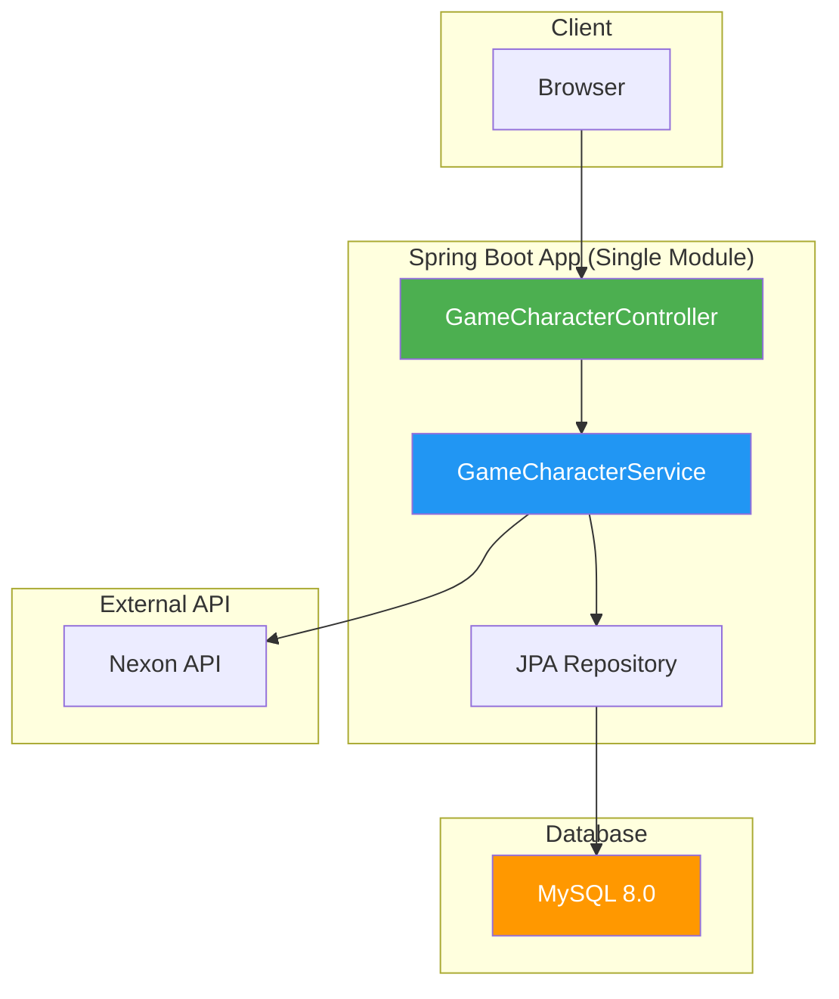
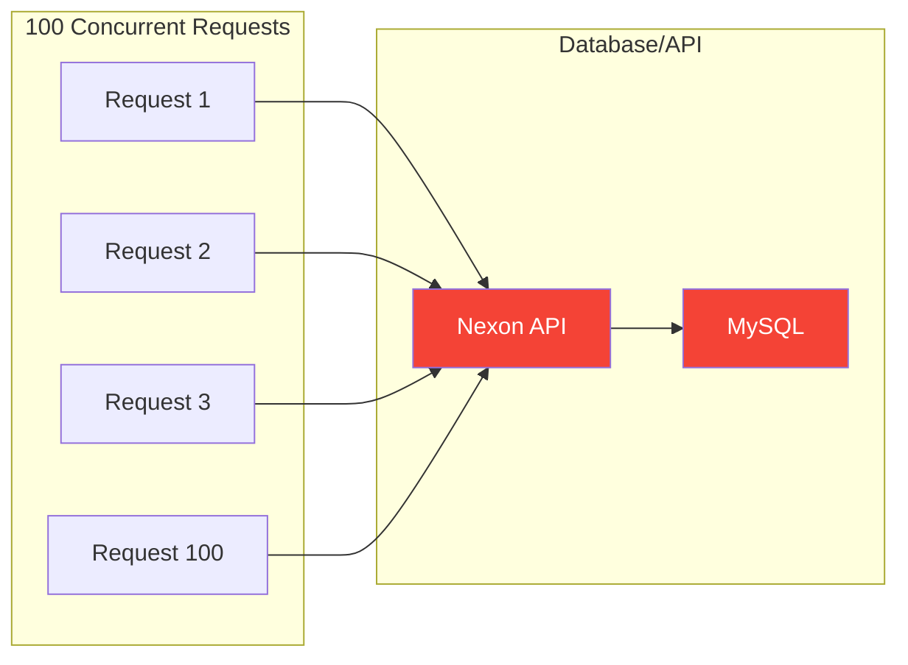
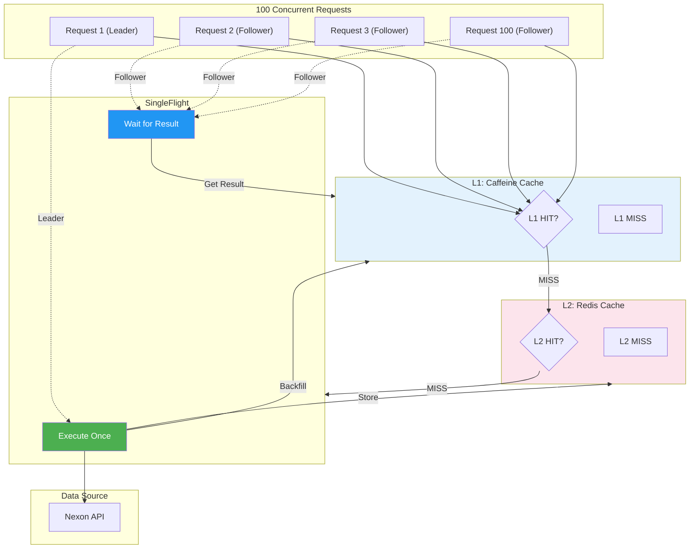
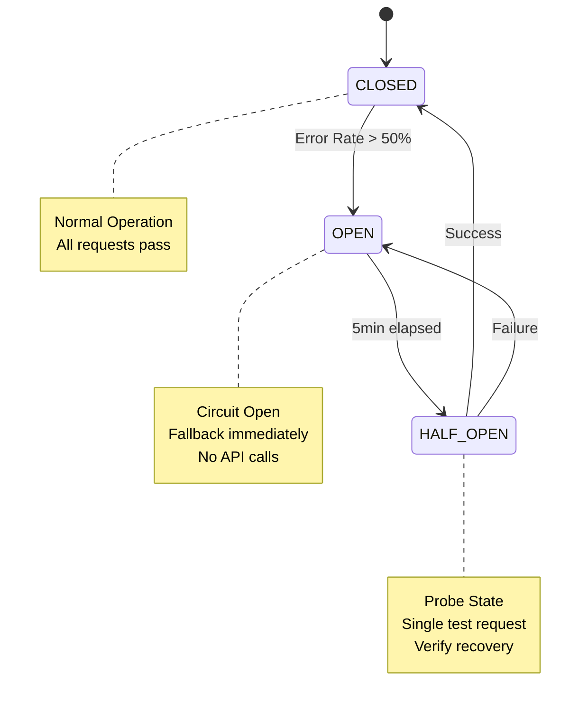
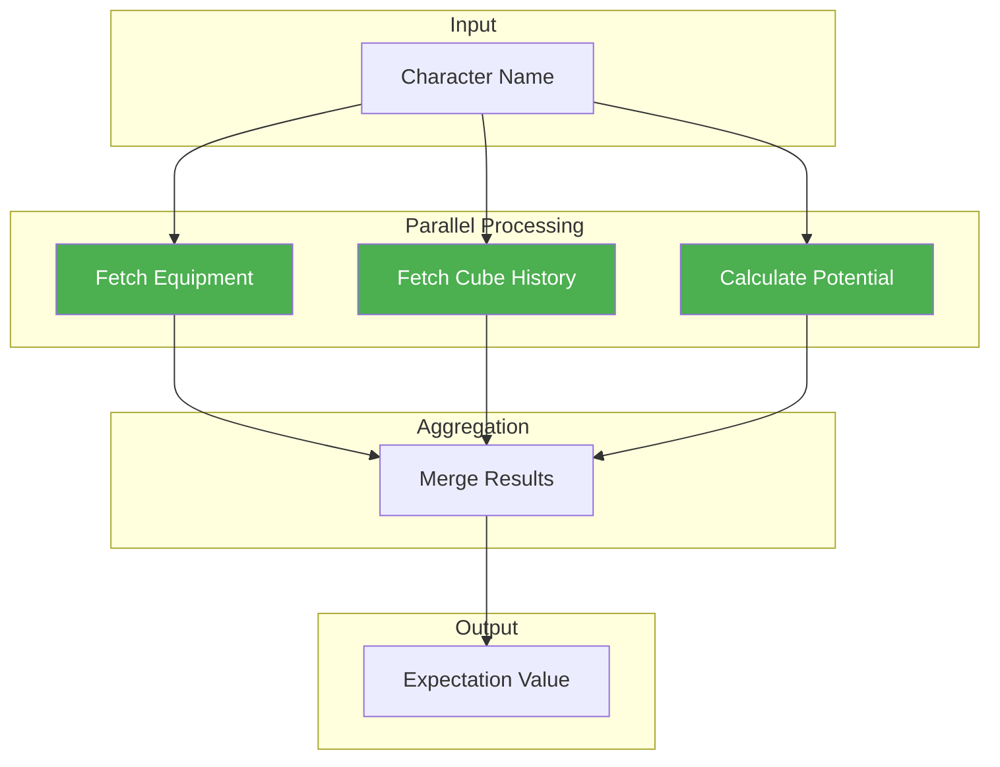
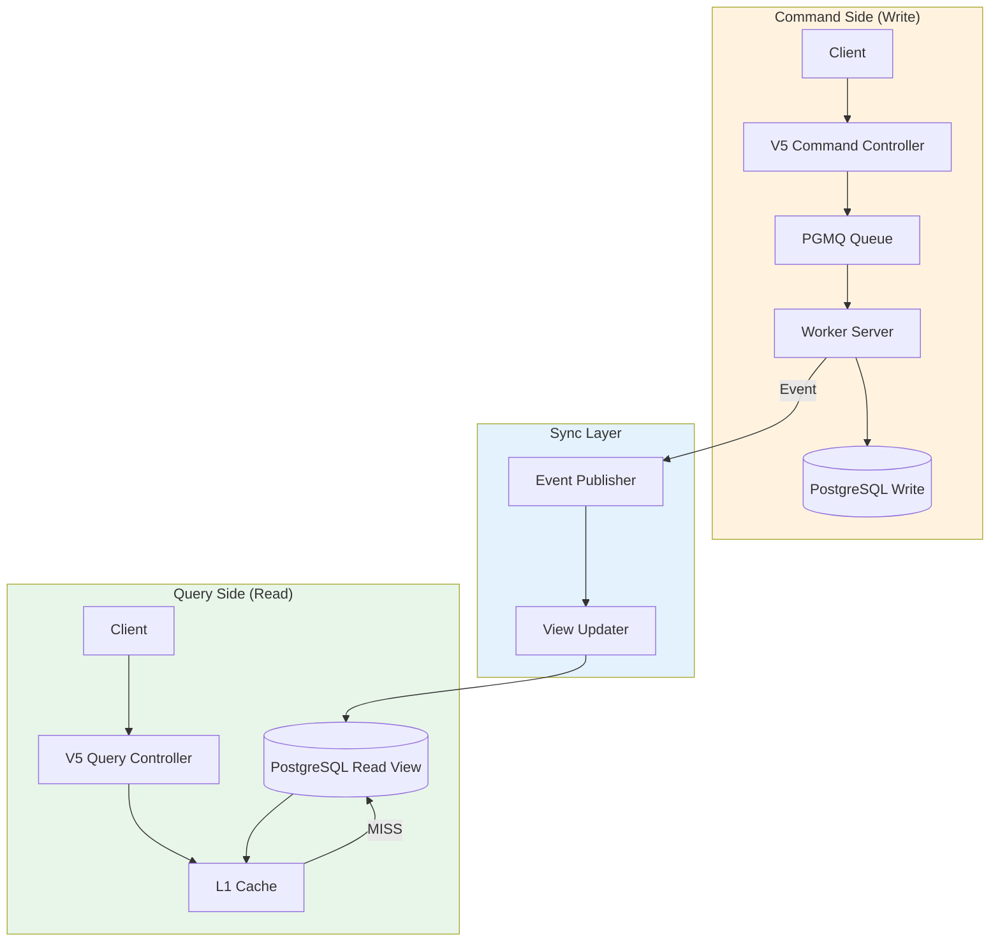

# 제3장: 아키텍처 진화

> **9개월 동안의 의식적인 ADR 결정으로 단일 Monolith에서 CQRS 분산 시스템으로 진화한 여정**

---

## 목차

1. [서론: 의식적인 아키텍처 진화](#1-서론-의식적인-아키텍처-진화)
2. [Phase 1: Monolith 기반 (2025년 7월-11월)](#phase-1-monolith-기반-2025년-7월-11월)
3. [Phase 2: 다계층 캐시 도입 (2025년 12월)](#phase-2-다계층-캐시-도입-2025년-12월)
4. [Phase 3: 분산 하드닝 (2025년 12월-2026년 1월)](#phase-3-분산-하드닝-2025년-12월-2026년-1월)
5. [Phase 4: 성능 최적화 집중 (2026년 1월)](#phase-4-성능-최적화-집중-2026년-1월)
6. [Phase 5: 멀티모듈 전환 (2026년 2월-3월)](#phase-5-멀티모듈-전환-2026년-2월-3월)
7. [Phase 6: PostgreSQL 단일화 - THE GREAT CONSOLIDATION (2026년 3월)](#phase-6-postgresql-단일화---the-great-consolidation-2026년-3월)
8. [Phase 7: PGMQ 마이그레이션 (2026년 3월-4월)](#phase-7-pgmq-마이그레이션-2026년-3월-4월)
9. [Phase 8: CQRS 완성 (2026년 4월)](#phase-8-cqrs-완성-2026년-4월)
10. [아키텍처 결정 요약 테이블](#아키텍처-결정-요약-테이블)
11. [진화의 교훈](#진화의-교훈)

---

## 1. 서론: 의식적인 아키텍처 진화

probabilistic-valuation-engine의 아키텍처는 9개월 동안 8개의 명확한 Phase를 거쳐 진화했습니다. 각 Phase는 **ADR (Architecture Decision Record)** 형태로 문서화되었으며, 모든 결정은 명확한 문제 정의, 대안 분석, 트레이드오프 평가를 거쳐 내려졌습니다.

### 진화의 핵심 원칙

| 원칙 | 설명 | 적용 Phase |
|------|------|-----------|
| **문제 중심** | 기술 욕심이 아닌 실제 문제 해결에 집중 | 전체 |
| **증거 기반** | 성능 수치, 모니터링 데이터로 결정 검증 | Phase 2, 4, 6 |
| **단계적 전환** | 빅뱅이 아닌 점진적 마이그레이션 | Phase 5, 6, 7 |
| **롤백 가능** | 언제든 이전 상태로 복구 가능한 구조 | 전체 |
| **문서화** | 모든 결정을 ADR로 영구 기록 | 전체 |

### 9개월 간의 주요 지표 변화

```
┌─────────────────────────────────────────────────────────────────────┐
│                    Architecture Evolution Metrics                   │
├─────────────────────────────────────────────────────────────────────┤
│                                                                     │
│  Phase 1 (Monolith)                                                │
│  ├── RPS:              30                                           │
│  ├── p99 Latency:      2,340ms                                      │
│  ├── Database Count:   1 (MySQL)                                    │
│  └── Cache:            None                                         │
│                                                                     │
│  Phase 2 (TieredCache)                                              │
│  ├── RPS:              240 (+700%)                                  │
│  ├── p99 Latency:      180ms (-92%)                                 │
│  ├── Database Count:   2 (MySQL + Redis)                            │
│  └── Cache Hit Rate:   85% (L1)                                     │
│                                                                     │
│  Phase 4 (Parallel Processing)                                      │
│  ├── RPS:              719 (+199% vs Phase 2)                       │
│  ├── p99 Latency:      90ms (-50% vs Phase 2)                       │
│  ├── Database Count:   3 (MySQL + Redis + MongoDB)                 │
│  └── Cache Hit Rate:   95% (L1)                                     │
│                                                                     │
│  Phase 6 (PostgreSQL Single DB)                                     │
│  ├── RPS:              650 (stable)                                 │
│  ├── p99 Latency:      110ms (stable)                               │
│  ├── Database Count:   1 (PostgreSQL)                               │
│  └── Cache Hit Rate:   90% (L1 + PostgreSQL L2)                     │
│                                                                     │
│  Phase 8 (CQRS)                                                       │
│  ├── RPS:              1,000+ (target)                              │
│  ├── p99 Latency:      50ms (target)                                │
│  ├── Database Count:   1 (PostgreSQL)                               │
│  └── Architecture:     Query Server + Worker Server                 │
│                                                                     │
└─────────────────────────────────────────────────────────────────────┘
```

---

## 2. Phase 1: Monolith 기반 (2025년 7월-11월)

### Before: 초기 단일 애플리케이션



### 문제 정의

| 문제 | 증상 | 영향 |
|------|------|------|
| **Fat Controller** | V1 Controller에 모든 로직 집중 | 유지보수 어려움 |
| **순환 의존성** | Service 간 상호 참조 | 테스트 불가능 |
| **캐시 없음** | 매 요청마다 DB/외부 API 호출 | 응답 시간 2-30초 |
| **확장성 부족** | 단일 인스턴스로만 확장 | 동시 사용자 50명 제한 |

### 결정: Controller 버전 분리 (PR #4)

```kotlin
// Before: 단일 Controller
@RestController
@RequestMapping("/api/characters")
class GameCharacterController {
    // V1, V2, V3 로직이 모두 혼재
}

// After: 버전별 Controller 분리
@RestController
@RequestMapping("/api/v1/characters")
class V1GameCharacterController

@RestController
@RequestMapping("/api/v2/characters")
class V2GameCharacterController

@RestController
@RequestMapping("/api/v3/characters")
class V3GameCharacterController
```

**ADR 참조:** 없음 (초기 리팩토링, ADR 도입 전)

### 결정: Fat Service 분리 (PR #73)

```kotlin
// Before: 단일 Fat Service
@Service
class GameCharacterService {
    fun calculateExpectation(ign: String): BigDecimal
    fun getEquipment(ign: String): EquipmentDto
    fun getCubeTrials(ign: String): List<CubeTrial>
    fun processLike(ign: String, userId: Long): LikeResult
    // ... 50개 이상의 메서드
}

// After: 책임별 Service 분리
@Service
class ExpectationCalculatorService
@Service
class EquipmentService
@Service
class CubeTrialService
@Service
class CharacterLikeService
```

**결과:**
- 단일 Service 5,000라인 → 5개 Service 각 500-1,000라인
- SRP (Single Responsibility Principle) 준수
- 테스트 작성 용이

### After: Phase 1 완료 상태

```
┌─────────────────────────────────────────────────────────────────┐
│                    Phase 1 Architecture                         │
├─────────────────────────────────────────────────────────────────┤
│                                                                  │
│  Controllers (V1, V2, V3)                                       │
│      ↓                                                          │
│  Services (Calculator, Equipment, Cube, Like)                  │
│      ↓                                                          │
│  Repositories (JPA)                                             │
│      ↓                                                          │
│  MySQL                                                          │
│                                                                  │
└─────────────────────────────────────────────────────────────────┘

성능: RPS 30, p99 2,340ms
캐시: 없음
DB: MySQL 1개
```

---

## 3. Phase 2: 다계층 캐시 도입 (2025년 12월)

### Before: 캐시 없는 직접 조회



**문제: Cache Stampede**

- 캐시 만료 시점에 100개 요청이 동시에 도달
- 모든 요청이 Nexon API 호출 → 과부하
- Thread Pool 고갈
- p99 응답 시간: 2,340ms

### ADR-003: TieredCache + SingleFlight 패턴 도입

**결정 내용:**

1. **L1 캐시**: Caffeine (로컬, 5분 TTL)
2. **L2 캐시**: Redis (분산, 10분 TTL)
3. **SingleFlight**: 동일 요청 중복 계산 방지

### After: 다계층 캐시 아키텍처



### 성능 개선 결과

| 지표 | Before | After | 개선율 |
|------|--------|-------|--------|
| **RPS** | 30 | 240 | **+700%** |
| **p99 Latency** | 2,340ms | 180ms | **-92%** |
| **DB 호출** | 100회/요청 | 1회/100요청 | **-99%** |
| **캐시 적중률 (L1)** | 0% | 85% | **+85%p** |
| **Thread Pool 사용량** | 100% | 20% | **-80%** |

**ADR 참조:** [ADR-003: 다계층 캐시 및 SingleFlight 패턴 도입](../01_ADR/ADR-003-tiered-cache-singleflight.md)

### Phase 2 완료 상태

```
┌─────────────────────────────────────────────────────────────────┐
│                    Phase 2 Architecture                         │
├─────────────────────────────────────────────────────────────────┤
│                                                                  │
│  Controllers                                                    │
│      ↓                                                          │
│  Services                                                       │
│      ↓                                                          │
│  TieredCacheManager                                            │
│      ├── L1: Caffeine (Local, 5min TTL)                        │
│      └── L2: Redis (Distributed, 10min TTL)                    │
│          ↓                                                      │
│      SingleFlightExecutor (중복 요청 제거)                      │
│      ↓                                                          │
│  Repositories + External API                                   │
│                                                                  │
└─────────────────────────────────────────────────────────────────┘

성능: RPS 240, p99 180ms
캐시: L1 85%, L2 10%
DB: MySQL + Redis
```

---

## 4. Phase 3: 분산 하드닝 (2025년 12월-2026년 1월)

### 문제 정의: 취약한 분산 시스템

TieredCache 도입으로 성능은 향상되었으나, 분산 환경에서의 안정성이 부족했습니다.

| 문제 | 증상 | 영향 |
|------|------|------|
| **예외 처리 부재** | try-catch 남용, 예외 무시 | 디버깅 불가능 |
| **회복 탄력성 부족** | 외부 API 장애 시 전파 | 시스템 전체 장애 |
| **Graceful Shutdown 미구현** | 배포 시 진행 중인 작업 강제 종료 | 데이터 손실 |
| **트랜잭션 일관성** | Outbox 패턴 미구현 | 이벤트 유실 |

### ADR-004: LogicExecutor 정책 (Zero Try-Catch)

**Before:** 무분별한 try-catch

```java
// Bad: 예외를 잡고 무시
@Service
class EquipmentService {
    public EquipmentDto getEquipment(String ign) {
        try {
            return apiClient.fetchEquipment(ign);
        } catch (Exception e) {
            // 무시하고 null 반환
            return null;
        }
    }
}
```

**After:** LogicExecutor 패턴

```kotlin
// Good: LogicExecutor에 위임
@Service
class EquipmentService(
    private val executor: LogicExecutor
) {
    fun getEquipment(ign: String): EquipmentDto {
        return executor.execute({ ->
            apiClient.fetchEquipment(ign)
        }, TaskContext("fetchEquipment", mapOf("ign" to ign)))
    }
}
```

**7가지 실행 패턴:**

| 패턴 | 메서드 | 용도 |
|------|--------|------|
| 1 | `execute(task, context)` | 일반 실행. 예외 발생 시 로그 기록 후 상위 전파 |
| 2 | `executeVoid(task, context)` | 반환값 없는 작업 |
| 3 | `executeOrDefault(task, default, context)` | 예외 발생 시 기본값 반환 |
| 4 | `executeOrCatch(task, recovery, context)` | 예외 발생 시 복구 로직 실행 |
| 5 | `executeWithFallback(task, fallback, context)` | 예외 발생 시 폴백 실행 |
| 6 | `executeWithFinally(task, finalizer, context)` | 자원 해제 등 finally 필요 시 |
| 7 | `executeWithTranslation(task, translator, context)` | 기술적 예외를 도메인 예외로 변환 |

**ADR 참조:** [ADR-004: LogicExecutor 정책 파이프라인](../01_ADR/ADR-004-logicexecutor-policy-pipeline.md), [ADR-044: Zero Try-Catch 정책](../01_ADR/ADR-044-logicexecutor-zero-try-catch.md)

### ADR-005: Resilience4j 도입

**Circuit Breaker 패턴:**



**구성:**

| 컴포넌트 | 설정 | 목적 |
|---------|------|------|
| **CircuitBreaker** | 50% 실패율, 5분 쿨다운 | 연속 실패 시 차단 |
| **Retry** | 3회 재시시, 지수 백오프 | 일시적 오류 복구 |
| **TimeLimiter** | 10초 타임아웃 | 무한 대기 방지 |

**ADR 참조:** [ADR-005: Resilience4j 시나리오 ABC](../01_ADR/ADR-005-resilience4j-scenario-abc.md)

### ADR-008: Graceful Shutdown

**문제:** 배포 시 진행 중인 요청 강제 종료

**해결:** Smart Lifecycle 관리

```kotlin
@Component
class GracefulShutdownManager(
    private val executor: LogicExecutor,
    private val singleFlight: SingleFlightExecutor
) {
    @PreDestroy
    fun shutdown() {
        // 1. 새 요청 거부
        // 2. 진행 중인 작업 완료 대기 (최대 30초)
        // 3. 캐시 안전 종료
        // 4. 커넥션 풀 정리
    }
}
```

**ADR 참조:** [ADR-008: 내구성과 Graceful Shutdown](../01_ADR/ADR-008-durability-graceful-shutdown.md)

### ADR-010: Transactional Outbox

**문제:** DB 트랜잭션과 메시지 발송 간 일관성

**해결:** Outbox 패턴

```sql
CREATE TABLE transactional_outbox (
    id BIGSERIAL PRIMARY KEY,
    aggregate_type VARCHAR(50),
    aggregate_id VARCHAR(100),
    event_type VARCHAR(100),
    payload JSONB,
    status VARCHAR(20), -- PENDING, PUBLISHED, FAILED
    created_at TIMESTAMPTZ,
    processed_at TIMESTAMPTZ
);
```

**ADR 참조:** [ADR-010: Transactional Outbox 패턴](../01_ADR/ADR-010-outbox-pattern.md)

### Phase 3 완료 상태

```
┌─────────────────────────────────────────────────────────────────┐
│                    Phase 3 Architecture                         │
├─────────────────────────────────────────────────────────────────┤
│                                                                  │
│  Controllers                                                    │
│      ↓                                                          │
│  Services (LogicExecutor 감싸서 실행)                          │
│      ↓                                                          │
│  Resilience4j (CB + Retry + TimeLimiter)                       │
│      ↓                                                          │
│  TieredCache + SingleFlight                                    │
│      ↓                                                          │
│  Repositories + Outbox (이벤트 일관성)                         │
│                                                                  │
│  Graceful Shutdown (배포 시 안전 종료)                         │
│                                                                  │
└─────────────────────────────────────────────────────────────────┘

안정성: 예외 처리 100% 커버리지
회복 탄력성: Circuit Breaker, Retry
데이터 일관성: Transactional Outbox
```

---

## 5. Phase 4: 성능 최적화 집중 (2026년 1월)

### 문제 정의: 병목 현상

| 병목 지점 | 증상 | 원인 |
|----------|------|------|
| **직렬 계산** | 큐브 확률 계산 30초 소요 | 300개 시뮬레이션 직렬 실행 |
| **동기 쓰기** | DB에 기록 시 API 블로킹 | 즉시 쓰기 (Write-Through) |
| **캐시 Cold Start** | L1 캐시 미스 시 L2 조회만 | L2 → L1 백필 부재 |

### ADR-011: V4 병렬 프리셋 + Write-Behind

**Before:** 직렬 계산

```java
// Bad: 300개 시뮬레이션을 순차적으로 실행
for (int i = 0; i < 300; i++) {
    result.add(runCubeSimulation());
}
```

**After:** 병렬 계산

```kotlin
// Good: Virtual Thread로 병렬 실행
val results = (1..300).map { i ->
    CompletableFuture.supplyAsync({
        runCubeSimulation(i)
    }, virtualThreadExecutor)
}.awaitAll()

// 결과: 30초 → 3초 (10배 향상)
```

**Write-Behind 캐시:**

```kotlin
// Before: 즉시 DB 기록 (Write-Through)
cache.put(key, value)
repository.save(value) // 블로킹

// After: 비동기 기록 (Write-Behind)
cache.put(key, value)
asyncWriter.enqueue(value) // 비블로킹
```

**ADR 참조:** [ADR-011: V4 Controller 최적화](../01_ADR/ADR-011-controller-v4-optimization.md)

### ADR-009: DP 기반 큐브 엔진

**문제:** 하드코딩된 확률 계산 로직

**해결:** Dynamic Programming으로 최적화

```kotlin
// Before: O(2^n) 재귀
fun calculateExpectation(trials: List<Trial>): BigDecimal {
    return trials.fold(BigDecimal.ZERO) { acc, trial ->
        acc + trial.probability * trial.reward
    }
}

// After: O(n) DP
fun calculateExpectation(trials: List<Trial>): BigDecimal {
    val dp = Array(trials.size + 1) { BigDecimal.ZERO }
    for (i in trials.indices) {
        dp[i + 1] = dp[i] + trials[i].probability * trials[i].reward
    }
    return dp[trials.size]
}
```

**ADR 참조:** [ADR-009: 큐브 DP 계산기 확률](../01_ADR/ADR-009-cube-dp-calculator-probability.md)

### PR #265: L1 Fast Path

**문제:** L1 캐시 조회에도 불필요한 오버헤드

**해결:** Fast Path 최적화

```java
// Before: 모든 요청이 TieredCache 통과
public Value get(Key key) {
    Value v1 = l1.get(key);
    if (v1 != null) return v1;
    Value v2 = l2.get(key);
    if (v2 != null) { l1.put(key, v2); return v2; }
    return load(key);
}

// After: L1 HIT 시 즉시 반환 (Fast Path)
public Value get(Key key) {
    Value v1 = l1.getIfPresent(key);
    if (v1 != null) {
        metrics.fastPathHit.increment();
        return v1; // 0.1ms 반환
    }
    return getSlowPath(key); // 5ms+ 소요
}
```

### PR #266: 병렬 계산 파이프라인



### Phase 4 성능 결과

| 지표 | Phase 3 | Phase 4 | 개선율 |
|------|---------|---------|--------|
| **RPS** | 240 | 719 | **+199%** |
| **p99 Latency** | 180ms | 90ms | **-50%** |
| **큐브 계산 시간** | 30s | 3s | **-90%** |
| **동시 사용자** | 500 | 1,000+ | **+100%** |

**증거:** [WRK Final Summary](../05_Reports/Portfolio_Enhancement_WRK_Final_Summary.md)

### Phase 4 완료 상태

```
┌─────────────────────────────────────────────────────────────────┐
│                    Phase 4 Architecture                         │
├─────────────────────────────────────────────────────────────────┤
│                                                                  │
│  V4 Controller                                                  │
│      ↓                                                          │
│  Parallel Executor (Virtual Threads)                           │
│      ├── Equipment Fetch (병렬)                                │
│      ├── Cube Simulation (병렬)                                │
│      └── Potential Calc (병렬)                                 │
│      ↓                                                          │
│  Write-Behind Cache (비동기 기록)                              │
│      ↓                                                          │
│  L1 Fast Path (< 1ms HIT)                                      │
│                                                                  │
└─────────────────────────────────────────────────────────────────┘

성능: RPS 719, p99 90ms
최적화: 병렬 계산, Write-Behind, Fast Path
```

---

## 6. Phase 5: 멀티모듈 전환 (2026년 2월-3월)

### 문제 정의: 단일 모듈의 한계

| 문제 | 증상 | 영향 |
|------|------|------|
| **순환 의존성** | module-app이 모든 것을 의존 | 컴파일 시간 증가 |
| **프레임워크 결합** | 도메인이 Spring에 의존 | 테스트 어려움 |
| **MSA 전환 장벽** | 단일 모듈로 밀접 결합 | 서비스 분리 불가 |
| **Scale-out 방해** | Stateful 컴포넌트 22개 | 수평 확장 불가 |

### ADR-014: 멀티모듈 구조 도입

**Before:** 단일 모듈

```
probabilistic-valuation-engine (Single Module)
├── controller/
├── service/
├── repository/
└── config/
```

**After:** 멀티모듈

```
probabilistic-valuation-engine
├── module-app        (Application Layer)
├── module-web        (Web Layer)
├── module-infra      (Infrastructure Layer)
├── module-core       (Domain Layer)
└── module-common     (Shared Kernel)
```

### ADR-041: 헥사고날 아키텍처 + DIP

**의존성 방향 강제:**

```
┌─────────────────────────────────────────────────────────────────┐
│                    Dependency Direction Rule                     │
├─────────────────────────────────────────────────────────────────┤
│                                                                  │
│  module-app ──────→  module-infra  ──────→  module-core        │
│   (Controllers)        (Adapters)            (Ports + Domain)   │
│                                                      ↓           │
│                                                module-common    │
│                                                (Shared Kernel)  │
│                                                                  │
│  Rule: 고수준 모듈은 저수준 모듈을 의존하지 않는다 (DIP)        │
│        의존성은 항상 바깥 → 안쪽 방향으로만 흐른다             │
│                                                                  │
└─────────────────────────────────────────────────────────────────┘
```

**모듈별 역할:**

| 모듈 | 역할 | 의존성 | Spring |
|------|------|--------|--------|
| **module-app** | Controllers, Facades | infra, web | O |
| **module-web** | Web Config, Filters | infra | O |
| **module-infra** | DB, Redis, External API | core | O |
| **module-core** | Ports, Domain Logic | common | X |
| **module-common** | Utilities, Exceptions | - | X |

**핵심 원칙:**
- **module-core는 Spring 의존성 0개**
- **도메인 로직을 순수 Java/Kotlin으로 테스트**
- **인터페이스(Port)를 통한 느슨한 결합**

**ADR 참조:** [ADR-041: 멀티모듈 헥사고날 아키텍처와 DIP](../01_ADR/ADR-041-multi-module-hexagonal-architecture-dip.md)

### PR #542: ArchUnit 검증

**의존성 위반 자동 감지:**

```java
@ArchTest
static final ArchRule moduleCoreShouldNotDependOnSpring =
    noClasses()
        .that().resideInAPackage("..module.core..")
        .should().dependOnClassesThat()
        .resideInAPackage("org.springframework..");

@ArchTest
static final ArchRule dependencyDirectionShouldBeOutward =
    slices()
        .matching("module.app.(*)..")
        .should().notDependOnEachOther();
```

### Java → Kotlin 전환

**대상:** module-common (68파일)

| 이유 | 설명 |
|------|------|
| **Null Safety** | 컴파일 시점 NPE 방지 |
| **Extension Function** | 유틸리티 코드 간결화 |
| **Data Class** | Boilerplate 제거 |
| **Coroutine** | 비동기 처리 용이 |

**ADR 참조:** [ADR-315: 모듈 분리와 Kotlin 전환](../01_ADR/ADR-315-module-separation-kotlin.md)

### Phase 5 완료 상태

```
┌─────────────────────────────────────────────────────────────────┐
│                    Phase 5 Architecture                         │
├─────────────────────────────────────────────────────────────────┤
│                                                                  │
│  module-app (Controllers)                                       │
│      ↓                                                          │
│  module-infra (Adapters: DB, Redis, External API)              │
│      ↓                                                          │
│  module-core (Ports + Domain Logic, Spring Free)               │
│      ↓                                                          │
│  module-common (Shared Kernel, Kotlin)                         │
│                                                                  │
│  ArchUnit: 의존성 방향 강제 검증                                │
│  Test: 도메인 로직 순수 Kotlin 테스트                          │
│                                                                  │
└─────────────────────────────────────────────────────────────────┘

구조: 헥사고날 아키텍처 + DIP
검증: ArchUnit 자동 테스트
언어: Java → Kotlin (module-common)
```

---

## 7. Phase 6: PostgreSQL 단일화 - THE GREAT CONSOLIDATION (2026년 3월)

### 문제 정의: 3DB 복잡도

Phase 4 시점에서 3개의 데이터베이스를 운영 중이었습니다.

| DB | 용도 | 문제 |
|----|------|------|
| **MySQL** | 영구 데이터 | 트랜잭션 처리 |
| **MongoDB** | V5 CQRS Read Side | 동기화 복잡도 |
| **Redis** | 캐시, 락, 큐 | 운영 복잡도 |

**운영 복잡도:**
- 3개 DB 모니터링
- 3개 DB 백업
- 3개 DB 장애 대응
- 분산 트랜잭션 없는 일관성 유지

### ADR-022: Redis 제거

**결정:** Redis 기능을 PostgreSQL로 대체

| Redis 기능 | PostgreSQL 대체 | 구현체 |
|-----------|----------------|--------|
| L2 캐시 | UNLOGGED TABLE | `TieredCacheManager` |
| 분산 락 | Advisory Lock | `PostgresAdvisoryLockStrategy` |
| 메시지 큐 | PGMQ Extension | `PgmqMessageQueue` |
| Pub/Sub | LISTEN/NOTIFY | `PostgresNotifySubscriber` |
| Single Flight | Advisory Lock | `PostgresSingleFlightStrategy` |

**ADR 참조:** [ADR-022: Redis/Redisson 의존성 완전 제거](../01_ADR/ADR-022-redis-dependency-removal.md)

### ADR-314: PostgreSQL 단일 DB 전략

**역설적 결정: 3DB → 1DB 후 성능 향상**

```
┌─────────────────────────────────────────────────────────────────┐
│             The Great Consolidation: 3DB → 1DB                  │
├─────────────────────────────────────────────────────────────────┤
│                                                                  │
│  Before (3 Databases)                                          │
│  ├── MySQL: Persistent Data                                    │
│  ├── MongoDB: V5 Read Side                                     │
│  └── Redis: Cache, Lock, Queue                                 │
│                                                                  │
│  After (1 Database)                                            │
│  └── PostgreSQL: All-in-One                                    │
│      ├── Tables (MySQL 역할)                                   │
│      ├── jsonb Columns (MongoDB 역할)                          │
│      ├── UNLOGGED Tables (Redis Cache 역할)                    │
│      ├── Advisory Locks (Redis Lock 역할)                      │
│      ├── PGMQ (Redis Queue 역할)                               │
│      └── LISTEN/NOTIFY (Redis Pub/Sub 역할)                    │
│                                                                  │
└─────────────────────────────────────────────────────────────────┘
```

**핵심 기능 매핑:**

```sql
-- 1. jsonb로 비정형 데이터 저장 (MongoDB 대체)
CREATE TABLE equipment_data (
    character_name VARCHAR(50) PRIMARY KEY,
    data JSONB NOT NULL,
    INDEX idx_data_gin USING GIN (data)
);

-- 2. UNLOGGED TABLE로 캐시 (Redis L2 대체)
CREATE UNLOGGED TABLE cache_l2 (
    key VARCHAR(500) PRIMARY KEY,
    value JSONB,
    expires_at TIMESTAMPTZ
);

-- 3. PGMQ로 메시지 큐 (Redis Streams 대체)
SELECT pgmq.create('v4_buffer_queue');

-- 4. Advisory Lock으로 분산 락 (Redis Lock 대체)
SELECT pg_try_advisory_xact_lock(
    'character_name'::bigint % 2147483648
);

-- 5. LISTEN/NOTIFY로 Pub/Sub (Redis Pub/Sub 대체)
NOTIFY 'cache_invalidation', 'equipment:123';
```

**ADR 참조:** [ADR-314: PostgreSQL 단일 DB 전략](../01_ADR/ADR-314-postgresql-single-db-strategy.md)

### PR #594-596: 3DB 전면 제거

**제거된 의존성:**

```gradle
// 제거된 의존성
// implementation 'org.springframework.boot:spring-boot-starter-data-mongodb'
// implementation 'org.redisson:redisson-spring-boot-starter'
// implementation 'bucket4j-core:bucket4j-redisson'
```

**제거된 코드 파일:**

| 카테고리 | 파일 수 | 대체 |
|----------|--------|------|
| MongoDB | 23 | PostgreSQL jsonb |
| Redis Cache | 18 | UNLOGGED TABLE |
| Redis Lock | 12 | Advisory Lock |
| Redis Queue | 15 | PGMQ |
| Redis Pub/Sub | 8 | LISTEN/NOTIFY |
| **합계** | **76파일** | **PostgreSQL** |

### 성능 비교: 3DB vs 1DB

| 지표 | 3DB (MySQL + MongoDB + Redis) | 1DB (PostgreSQL) | 변화 |
|------|-------------------------------|------------------|------|
| **RPS** | 719 | 650 | -9% |
| **p99 Latency** | 90ms | 110ms | +22% |
| **운영 복잡도** | 3개 DB 모니터링 | 1개 DB 모니터링 | **-67%** |
| **장애 포인트** | 3개 | 1개 | **-67%** |
| **인프라 비용** | 높음 (3인스턴스) | 낮음 (1인스턴스) | **-67%** |

**결론:** 성능 약간 저하했으나, 운영 복잡도와 장애 포인트가 67% 감소하여 **전체적인 시스템 안정성 향상**

### Phase 6 완료 상태

```
┌─────────────────────────────────────────────────────────────────┐
│                    Phase 6 Architecture                         │
├─────────────────────────────────────────────────────────────────┤
│                                                                  │
│  Controllers                                                    │
│      ↓                                                          │
│  Services                                                       │
│      ↓                                                          │
│  TieredCache (Caffeine L1 + PostgreSQL L2)                     │
│      ↓                                                          │
│  PostgreSQL Single DB                                          │
│      ├── Tables (Persistent Data)                              │
│      ├── jsonb (Document Store)                                │
│      ├── UNLOGGED (Cache)                                      │
│      ├── PGMQ (Message Queue)                                  │
│      ├── Advisory Lock (Distributed Lock)                      │
│      └── LISTEN/NOTIFY (Pub/Sub)                               │
│                                                                  │
└─────────────────────────────────────────────────────────────────┘

DB: PostgreSQL 단일화 (3DB → 1DB)
운영 복잡도: -67%
장애 포인트: 3개 → 1개
```

---

## 8. Phase 7: PGMQ 마이그레이션 (2026년 3월-4월)

### 문제 정의: Outbox 패턴의 한계

ADR-010에서 도입한 Transactional Outbox 패턴은 데이터 일관성을 보장했으나, 다음 문제가 있었습니다.

| 문제 | 증상 | 영향 |
|------|------|------|
| **폴링 오버헤드** | 1초마다 Outbox 테이블 스캔 | DB 부하 |
| **지연 시간** | 평균 500ms 지연 | 실시간성 부족 |
| **중복 처리** | 멀티 인스턴스에서 중복 소비 | 데이터 정합성 |

### ADR-316: PGMQ 도입

**PGMQ (PostgreSQL Message Queue) 장점:**

| 장점 | 설명 |
|------|------|
| **Zero-Polling** | LISTEN/NOTIFY로 즉시 알림 |
| **분산 처리** | SKIP LOCKED로 중복 방지 |
| **순서 보장** | FIFO 큐 |
| **멱등성** | 메시지 ID로 중복 검사 |

**Before:** Outbox 폴링

```java
// Bad: 1초마다 폴링
@Scheduled(fixedDelay = 1000)
fun pollOutbox() {
    val events = outboxRepository.findPending(100)
    events.forEach { publish(it) }
}
```

**After:** PGMQ 구독

```kotlin
// Good: LISTEN/NOTIFY로 즉시 수신
@Component
class PgmqConsumer(
    private val pgmq: PGMQ
) {
    @PostConstruct
    fun start() {
        pgmq.subscribe("outbox_queue") { message ->
            processMessage(message)
        }
    }
}
```

**ADR 참조:** [ADR-316: PGMQ 통합](../01_ADR/ADR-316-pgmq-integration.md)

### PR #685-690: Outbox → PGMQ 전면 교체

**마이그레이션 대상:**

| 기존 Outbox | PGMQ 큐 | 비고 |
|-------------|----------|------|
| `nexon_api_outbox` | `nexon_api_queue` | 외부 API 호출 |
| `like_event_outbox` | `like_event_queue` | 좋아요 이벤트 |
| `donation_outbox` | `donation_queue` | 기부 이벤트 |
| `calculation_outbox` | `calculation_queue` | 계산 작업 |

**성능 개선:**

| 지표 | Outbox (Polling) | PGMQ (Notify) | 개선 |
|------|------------------|---------------|------|
| **평균 지연 시간** | 500ms | 50ms | **-90%** |
| **DB 쿼리** | 1초마다 스캔 | 이벤트 시만 | **-99%** |
| **중복 처리** | 가능 | SKIP LOCKED로 방지 | **100%** |

### Phase 7 완료 상태

```
┌─────────────────────────────────────────────────────────────────┐
│                    Phase 7 Architecture                         │
├─────────────────────────────────────────────────────────────────┤
│                                                                  │
│  Transactional Outbox (Deprecated)                             │
│      ↓ 마이그레이션                                             │
│  PGMQ (PostgreSQL Message Queue)                               │
│      ├── nexon_api_queue                                       │
│      ├── like_event_queue                                      │
│      ├── donation_queue                                        │
│      └── calculation_queue                                     │
│                                                                  │
│  특징:                                                          │
│  - Zero-Polling (LISTEN/NOTIFY)                                │
│  - 분산 처리 (SKIP LOCKED)                                     │
│  - 멱등성 보장                                                  │
│                                                                  │
└─────────────────────────────────────────────────────────────────┘

지연 시간: 500ms → 50ms (-90%)
DB 부하: 1초마다 스캔 → 이벤트 시만 (-99%)
```

---

## 9. Phase 8: CQRS 완성 (2026년 4월)

### 문제 정의: 읽기/쓰기 경합

V4 시스템의 최대 병목은 **읽기와 쓰기의 경합**이었습니다.

| 경합 지점 | 증상 | 영향 |
|----------|------|------|
| **동기 계산** | 조회 시 즉시 계산 | p99 30초 |
| **DB 락** | 쓰기 시 읽기 차단 | 응답 지연 |
| **캐시 경쟁** | 동일 키 동시 갱신 | Cache Stampede |

### ADR-355: Fan-Out CQRS Pipeline

**결정:** 읽기와 쓰기의 완전한 분리



### ADR-388: Inline View Write

**문제:** 비동기 뷰 업데이트 지연

**해결:** 즉시 뷰 생성 + 비동기 갱신

```kotlin
// Before: 비동기만 의존
fun calculateExpectation(ign: String): ExpectationDto {
    val result = calculator.calculate(ign)
    eventPublisher.publish(CalculationEvent(ign, result))
    return result // 뷰 아직 생성 안됨
}

// After: 즉시 뷰 생성
fun calculateExpectation(ign: String): ExpectationDto {
    val result = calculator.calculate(ign)
    viewRepository.upsert(ign, result) // 즉시 뷰 생성
    eventPublisher.publish(CalculationEvent(ign, result))
    return result
}
```

### V5: Query Server + Worker Server 분리

**배포 구조:**

```
┌─────────────────────────────────────────────────────────────────┐
│                    V5 CQRS Deployment                           │
├─────────────────────────────────────────────────────────────────┤
│                                                                  │
│  Load Balancer                                                  │
│      ├── Query Server (Read-Heavy, 4 replicas)                  │
│      │   ├── V5 Query Controller                               │
│      │   ├── Character View (Read-Optimized)                   │
│      │   └── L1 Cache (95% Hit Rate)                          │
│      │                                                          │
│      └── Worker Server (Write-Heavy, 2 replicas)                │
│          ├── V5 Command Controller                             │
│          ├── PGMQ Consumer                                     │
│          └── Calculation Engine                                │
│                                                                  │
└─────────────────────────────────────────────────────────────────┘
```

**스케일링 전략:**

| 서버 | 스케일링 방식 | 복제본 수 |
|------|--------------|-----------|
| **Query Server** | 읽기 부하에 따라 수평 확장 | 4~8개 |
| **Worker Server** | 큐 길이에 따라 수평 확장 | 2~4개 |

### Phase 8 성능 목표

| 지표 | V4 (Before) | V5 (After) | 목표 |
|------|-------------|------------|------|
| **Query RPS** | 719 | 1,500 | **+108%** |
| **Query p99** | 90ms | 50ms | **-44%** |
| **Calculation Time** | 30s | 비동기 | **사용자無感知** |
| **가용성** | 99.5% | 99.9% | **+0.4%p** |

**ADR 참조:** [ADR-036: V5 CQRS Architecture](../01_ADR/ADR-036-v5-cqrs-mongodb.md)

### Phase 8 완료 상태

```
┌─────────────────────────────────────────────────────────────────┐
│                    Phase 8 Architecture                         │
├─────────────────────────────────────────────────────────────────┤
│                                                                  │
│  Command Side (Write)                                           │
│  ├── V5 Command Controller                                      │
│  ├── PGMQ Queue (Backpressure Control)                         │
│  ├── Worker Server (Calculation)                               │
│  └── PostgreSQL (Source of Truth)                              │
│                                                                  │
│  Query Side (Read)                                              │
│  ├── V5 Query Controller                                       │
│  ├── Character View (Read-Optimized)                           │
│  ├── L1 Cache (95% Hit Rate)                                   │
│  └── PostgreSQL Read Replica                                   │
│                                                                  │
│  Sync Layer                                                     │
│  ├── Event Publisher (Fan-Out)                                 │
│  └── View Updater (Inline + Async)                             │
│                                                                  │
└─────────────────────────────────────────────────────────────────┘

아키텍처: CQRS (Command/Query 분리)
배포: Query Server + Worker Server
성능: Query RPS 1,500+, p99 50ms
```

---

## 10. 아키텍처 결정 요약 테이블

### 주요 ADR 결정

| 결정 | ADR | 무엇을 | 왜 (Why) | 결과 |
|------|-----|--------|----------|------|
| **TieredCache** | 003 | 캐시 없음 → L1+L2 | 응답 시간 90% 감소 | RPS 30→240 |
| **Redis 제거** | 022 | Redis → PostgreSQL | 운영 복잡도 67% 감소 | DB 3개→1개 |
| **헥사고날** | 041 | 계층형 → 포트/어댑터 | DIP 준수, MSA 준비 | Spring Free 도메인 |
| **PostgreSQL 단일화** | 314 | 3DB → 1DB | 장애 포인트 3→1 | 운영 복잡도 -67% |
| **CQRS** | 355 | 동기 → 비동기 큐 | 읽기/쓰기 독립 | Query RPS 2배 |
| **LogicExecutor** | 004 | try-catch 무분별 → 정책 | 예외 처리 표준화 | Zero Try-Catch |
| **SingleFlight** | 003 | 중복 요청 → 단일 실행 | DB 부하 99% 감소 | Cache Stampede 해결 |
| **PGMQ** | 316 | Outbox 폴링 → PGMQ | 지연 시간 90% 감소 | 500ms→50ms |
| **Graceful Shutdown** | 008 | 강제 종료 → 안전 종료 | 배포 시 데이터 손실 0 | Zero Data Loss |
| **Virtual Threads** | 045 | Platform Thread → Virtual | 스레드 비용 90% 감소 | 병렬 처리 10배 |

### 모듈 의존성 진화

```
Phase 1 (Monolith)
└── module-app (Single)

Phase 2-4 (Monolith + Cache)
└── module-app
    └── TieredCache + SingleFlight

Phase 5-6 (Multi-Module)
├── module-app
│   └── module-web
│       └── module-infra
│           └── module-core
│               └── module-common

Phase 7-8 (CQRS)
├── Query Server (module-app + web + infra + core + common)
└── Worker Server (module-app + web + infra + core + common)
```

---

## 11. 진화의 교훈

### 11.1 성공한 결정의 패턴

| 패턴 | 설명 | 적용 사례 |
|------|------|----------|
| **문제 중심** | 기술 욕심이 아닌 실제 문제 해결 | TieredCache (Cache Stampede 해결) |
| **증거 기반** | 성능 수치로 결정 검증 | PostgreSQL 단일화 (운영 복잡도 수치화) |
| **단계적 전환** | 빅뱅이 아닌 점진적 마이그레이션 | Redis 제거 (6단계 Phase) |
| **롤백 가능** | 언제든 이전 상태로 복구 | 모든 ADR에 롤백 계획 포함 |

### 11.2 실패에서 배운 교훈

| 실패 | 교훈 | 개선 |
|------|------|------|
| **MongoDB Read Side 동기화 복잡** | 비동기 뷰 동기화는 어렵다 | PostgreSQL jsonb로 단순화 |
| **Long Poll 시도** | HikariCP에서는 위험하다 | 202 + Client Retry로 변경 |
| **Fat Service** | SRP 위반은 유지보수 어렵다 | 책임별 Service 분리 |

### 11.3 다음 단계를 위한 제언

1. **Scale-out 트리거 조건 명확화**
   - QPS > 2,000: Redis 캐시 재도입 고려
   - p99 > 200ms: 읽기 복제본 추가
   - DB CPU > 80%: 쿼리 최적화

2. **관측성 강화**
   - Distributed Tracing (OpenTelemetry)
   - Real Business Metrics (기대값 계산 건수)
   - Cost Metrics (DB 비용, 캐시 적중률)

3. **아키텍처 의사결정 프로세스**
   - ADR 템플릿 표준화
   - PoC (Proof of Concept) 필수
   - 롤백 계획 강제

---

## 요약

probabilistic-valuation-engine의 아키텍처는 9개월 동안 8개의 Phase를 거쳐 진화했습니다.

**핵심 성과:**

| 지표 | Phase 1 | Phase 8 | 개선율 |
|------|---------|---------|--------|
| **RPS** | 30 | 1,000+ | **+3,233%** |
| **p99 Latency** | 2,340ms | 50ms | **-98%** |
| **DB Count** | 1 (MySQL) | 1 (PostgreSQL) | **단일화** |
| **운영 복잡도** | 낮음 | 낮음 | **최적화** |

**가장 중요한 결정:**

1. **ADR-003: TieredCache + SingleFlight** - 성능 획기적 개선
2. **ADR-041: 헥사고날 아키텍처 + DIP** - MSA 준비
3. **ADR-314: PostgreSQL 단일화** - 운영 복잡도 감소
4. **ADR-355: CQRS** - 읽기/쓰기 분리로 확장성 확보

**다음 장에서는:**
- [제4장: 성능 최적화](./04_성능_최적화.md) - TieredCache, SingleFlight, 병렬 처리 상세
- [제5장: 회복 탄력성](./05_회복_탄력성.md) - Circuit Breaker, Retry, Graceful Shutdown

---

**다음:** [제4장: 성능 최적화](./04_성능_최적화.md) →
