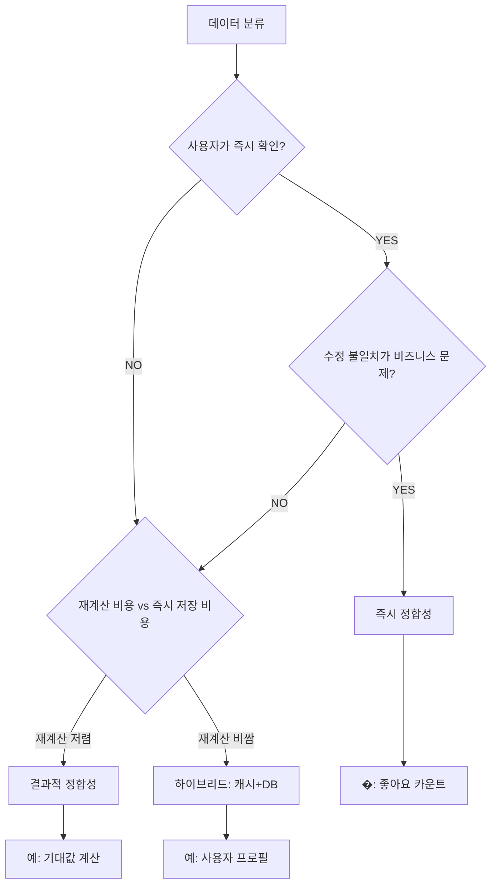

# 4장. 트랜잭션과 정합성

> "일관성은 선택이지, 우연이 아니다." - 데이터 정합성 철학

## 목차

1. [정합성의 스펙트럼](#정합성의-스펙트럼)
2. [데이터 분류와 정합성 요구사항](#데이터-분류와-정합성-요구사항)
3. [즉시 정합성 메커니즘](#즉시-정합성-메커니즘)
4. [결과적 정합성 메커니즘](#결과적-정합성-메커니즘)
5. [장애 시나리오 분석](#장애-시나리오-분석)
6. [핵심 불변식](#핵심-불변식)
7. [트레이드오프와 실전 적용](#트레이드오프와-실전-적용)

---

## 정합성의 스펙트럼

backend 시스템에서 정합성(Consistency)은 이분법적 선택이 아닌 스펙트럼입니다. CAP 정리에서 말하는 "Consistency"는 분산 시스템의 이론적 모델이지만, 실제 애플리케이션에서는 **비즈니스 요구사항에 따라 데이터별로 다른 정합성 수준**을 선택해야 합니다.

### 정합성의 종류

| 정합성 수준 | 정의 | 특징 | 전형적인 사용 사례 |
|-----------|------|------|-------------------|
| **Strong (즉시)** | 모든 클라이언트가 동일 시점에 동일 데이터 조회 | ACID 트랜잭션, 락 | 재고, 결제, 좋아요 |
| **Eventual (결과적)** | 데이터 변경 후 일정 시간 내에 일관성 달성 | 베이스 탐색, 캐시 | 기대값 계산, 장비 데이터 |
| **Causal (인과적)** | 인과 관계가 있는 연산의 순서 보장 | 벡터 클럭, CRDT | 협업 편집, 댓글 |
| **Read Your Writes** | 자신이 쓴 데이터를 즉시 읽기 가능 | 세션 고정 캐시 | 사용자 프로필 수정 |
| **Monotonic Reads** | 과거 데이터를 다시 읽지 않음 | 버전 번버링 | 타임라인 피드 |

### probabilistic-valuation-engine의 정합성 전략

```
┌─────────────────────────────────────────────────────────────────┐
│                  정합성 선택 트리                              │
│                                                                 │
│   데이터 ──> 절대 유실 불가?                                   │
│                │                                               │
│                ├── YES ──> 즉시 정합성 (Strong)                │
│                │         - 좋아요 카운트                       │
│                │         - 좋아요 토글                         │
│                │         - DB Trigger로 원자성 보장            │
│                │                                               │
│                └── NO ──> 재계산 가능?                         │
│                          │                                     │
│                          ├── YES ──> 결과적 정합성 (Eventual)   │
│                          │         - 기대값 계산 결과          │
│                          │         - 캐시 (L1/L2)              │
│                          │         - 장비 데이터               │
│                          │                                     │
│                          └── NO ──> 설계 재검토                │
└─────────────────────────────────────────────────────────────────┘
```

**핵심 원칙:** "모든 데이터를 강한 정합성으로 만들려 하지 말고, **손실 가능한 데이터를 식별**하여 결과적 정합성을 적용하라."

---

## 데이터 분류와 정합성 요구사항

시스템의 모든 데이터를 정합성 요구사항에 따라 분류합니다. 이 분류는 설계 결정의 기준이 됩니다.

### 정합성 분류 테이블

| 데이터 | 정합성 수준 | 선택 이유 | 손실 허용 여부 | 복구 방법 |
|--------|------------|----------|---------------|----------|
| **기대값 계산 결과** | Eventual | 캐시 미스 시 재계산 가능 | **YES** | 재계산으로 복구 |
| **캐시 (L1/L2)** | Eventual | 캐시는 성능 최적화 도구 | **YES** | 원본에서 재생성 |
| **좋아요 카운트** | Immediate | 사용자 신뢰 직결, 표시 불일치는 혼란 초래 | **NO** | DB Trigger로 원자성 보장 |
| **좋아요 토글** | Immediate | 중복/자가좋아요 방지 필수 | **NO** | Fingerprint 기반 멱등성 |
| **장비 데이터 (Nexon)** | Eventual | 외부 API에서 언제든 재조회 | **YES** | API 재호출로 복구 |
| **사용자 세션** | Stateless | JWT 기반, 서버 상태 없음 | N/A | 서버에 상태 없음 |
| **계산 이벤트 (Outbox)** | Immediate | 이벤트 유실 시 도메인 로직 불일치 | **NO** | Outbox Pattern + 트랜잭션 |
| **PGMQ 메시지** | At-least-once | 메시지 중복 허용, 멱등성 처리 | **NO** | PostgreSQL 영속 + 재처리 |

### 분류 기준 결정 트리



### 실전 적용: 좋아요 시스템의 정합성 선택

**문제:** 좋아요(QPS 5-20) 시스템의 정합성 수준을 어떻게 선택할까?

**분석 과정:**

1. **사용자 경험 분석**
   - 사용자가 좋아요 후 카운트가 즉시 반영되지 않으면 → 혼란
   - 같은 사용자가 중복 좋아요 → 데이터 오염
   - 자기 자신을 좋아요 → 사회적 문제

2. **기술적 제약**
   - QPS 5-20은 DB가 충분히 처리 가능 (Indexed read/write = ~10ms)
   - Redis Buffer는 복잡도 증가, Scale-out 차단
   - In-Memory 상태는 장애 시 유실

3. **결정:** Direct DB Transaction (ADR-344)
   - 즉시 정합성: `@Transactional` 내에서 INSERT + UPDATE count
   - 멱등성: UNIQUE constraint `uk_target_liker`
   - 자가좋아요 방지: `isMyCharacter()` 검증

**코드:**

```kotlin
@Transactional("transactionManager")
fun toggleLike(targetOcid: String, userOcid: String): LikeToggleResult {
    // Self-like 방지 (즉시 검증)
    if (authenticatedUser.isMyCharacter(targetOcid)) {
        throw SelfLikeNotAllowedException()
    }

    // 멱등성 보장 (UNIQUE constraint)
    val existing = characterLikeRepository.findByTargetAndLiker(targetOcid, userOcid)
    
    return if (existing == null) {
        // 좋아요 생성 + 카운트 증가 (동일 트랜잭션)
        characterLikeRepository.save(CharacterLikeEntity(targetOcid, userOcid))
        gameCharacterRepository.incrementLikeCount(targetOcid)
        LikeToggleResult.LIKED
    } else {
        // 좋아요 취소 + 카운트 감소 (동일 트랜잭션)
        characterLikeRepository.delete(existing)
        gameCharacterRepository.decrementLikeCount(targetOcid)
        LikeToggleResult.UNLIKED
    }
}
```

---

## 즉시 정합성 메커니즘

즉시 정합성(Strong Consistency)은 **ACID 트랜잭션, 락, 제약조건**으로 보장합니다.

### 1. 좋아요 토글 (DB Trigger)

**ADR-344: Like Direct DB Approach**에서 채택한 방식입니다.

#### 문제: 카운트 불일치

```
┌─────────────────────────────────────────────────────────────────┐
│                  좋아요 카운트 불일치 시나리오                    │
│                                                                 │
│  시간 T1: User A가 좋아요                                       │
│    → character_like 테이블에 INSERT                             │
│    → like_count = 1                                             │
│                                                                 │
│  시간 T2: User B가 좋아요                                       │
│    → character_like 테이블에 INSERT                             │
│    → like_count = 2 (애플리케이션 로직)                         │
│                                                                 │
│  시간 T3: User A가 좋아요 취소                                  │
│    → character_like 테이블에서 DELETE                           │
│    → like_count = 1 (애플리케이션 로직)                         │
│                                                                 │
│  ⚠️ 문제: 애플리케이션 레벨 계산은 경합 상황에서 불일치 발생     │
│    - Race condition: 두 요청이 동시에 like_count을 읽으면       │
│      1 + 1 = 2가 아닌, 1 + 1 = 1이 될 수 있음                  │
└─────────────────────────────────────────────────────────────────┘
```

#### 해결: DB Trigger

```sql
-- PostgreSQL Trigger: like_count 원자성 보장
CREATE TRIGGER update_like_count_after_insert
AFTER INSERT ON character_like
FOR EACH ROW
EXECUTE FUNCTION increment_like_count();

CREATE TRIGGER update_like_count_after_delete
AFTER DELETE ON character_like
FOR EACH ROW
EXECUTE FUNCTION decrement_like_count();

CREATE OR REPLACE FUNCTION increment_like_count()
RETURNS TRIGGER AS $$
BEGIN
    UPDATE game_characters
    SET like_count = like_count + 1
    WHERE ocid = NEW.target_ocid;
    RETURN NEW;
END;
$$ LANGUAGE plpgsql;
```

**장점:**
- DB가 원자성 보장 (Race condition 불가)
- 애플리케이션 로직 단순화
- 트랜잭션 롤백 시 카운트도 롤백

**단점:**
- DB 부하 증가 (모든 INSERT/DELETE에 UPDATE 추가)
- 쿼리 최적화 필요 (Index: `game_characters(ocid)`)

#### Fingerprint 기반 멱등성

**문제:** 네트워크 재시도로 중복 좋아요 요청이 도착하면?

```kotlin
// 해결: Fingerprint (해시)로 동일 사용자 식별
data class CharacterLikeEntity(
    val targetOcid: String,
    val likerFingerprint: String,  // SHA256(userOcid + salt)
    val createdAt: Instant
)

@Table(uniqueConstraints = [
    UniqueConstraint(name = "uk_target_liker", columnNames = ["target_ocid", "liker_fingerprint"])
])
class CharacterLikeJpaEntity(
    @Column(name = "target_ocid")
    val targetOcid: String,
    
    @Column(name = "liker_fingerprint")
    val likerFingerprint: String
)
```

- `uk_target_liker` UNIQUE constraint로 DB 레벨 중복 방지
- Fingerprint는 `SHA256(ocid + salt)`로 해싱 (개인정보 보호)
- 중복 요청 시 `DuplicateKeyException` → 멱등성 보장

#### 캐시 불일치 문제 (Issue #665)

**Cache Coherence Failure:**

```
┌─────────────────────────────────────────────────────────────────┐
│                  Split-Brain 문제                              │
│                                                                 │
│  Instance A: 좋아요 생성 → DB INSERT → L1 캐시 업데이트         │
│    → liked = true, likeCount = 1                               │
│                                                                 │
│  Instance B: 동시에 좋아요 생성 → DB INSERT → L1 캐시 업데이트   │
│    → liked = true, likeCount = 1 (DB 트리거로 2가 되었음)       │
│                                                                 │
│  ⚠️ 결과: Instance A의 L1 캐시는 likeCount=1 (stale)            │
│    DB는 likeCount=2 (정확)                                      │
│    → 사용자에게 잘못된 카운트 표시                              │
└─────────────────────────────────────────────────────────────────┘
```

**해결 방안 (미구현):**
1. **캐시 제거:** 좋아요는 항상 DB 조회 (QPS 5-20이므로 허용 가능)
2. **NOTIFY 무효화:** 좋아요 변경 시 `NOTIFY 'like_update'` 발행
3. **Short TTL:** L1 캐시를 30초 TTL로 제한

**현재 상태:** Issue #665로 open, 성능 영향이 적어 "캐시 제거" 쪽으로 기울어짐

### 2. DB 트랜잭션 경계

**ADR-388: Inline View Write**에서 채택한 패턴입니다.

#### 원칙: 관련 작업은 동일 트랜잭션 내에서

```kotlin
@Transactional("transactionManager")
fun doCalculateExpectation(userIgn: String, request: CalculationRequestV4): CalculationResult {
    // 1. 계산 로직
    val result = expectationCalculator.calculate(request)
    
    // 2. 결과 저장 (Write Model)
    persistenceService.saveResults(userIgn, result)
    
    // 3. View 테이블에 upsert (Read Model)
    syncToViewTable(userIgn, result)  // ← 동일 트랜잭션 내
    
    return result
}
```

**장점:**
- 계산 실패 시 view 테이블도 롤백 (불일치 방지)
- 별도 Event Publisher 불필요
- PGMQ payload 크기 문제 해결 (95KB → 전송 안 함)

**단점:**
- Write Model이 Read Model을 직접 참조 (결합도 증가)
- 비동기 확장 포인트 없음 (Kafka fan-out 불가)

#### 명시적 Transaction Manager 지정 (ADR-334)

**문제:** Multi-DataSource 환경에서 `@Transactional` 애매모호함

```kotlin
// Bad: Multiple TransactionManager가 있으면 에러
@Transactional
fun save(data: Data) { ... }

// Error: NoUniqueBeanDefinitionException
```

**해결:** 명시적 qualifier

```kotlin
@Repository
@Transactional("transactionManager")  // ← Class-level
open class GameCharacterRepositoryImpl(
    private val jpaRepo: GameCharacterJpaRepository,
) : DomainGameCharacterRepository {
    // 모든 메서드가 "transactionManager" 사용
}

// Method-level override
@Transactional("transactionManager", propagation = Propagation.REQUIRES_NEW)
fun upsertExpectationSummary(...) { ... }
```

**이점:**
- Future-proof: MongoDB 추가 시 코드 변경 불필요
- 명시적 의도: 어떤 datasource 사용하는지 명확
- ArchUnit Test로 강제 가능

### 3. Advisory Lock (분산 락)

**ADR-318: PostgreSQL Advisory Lock**을 사용한 중복 계산 방지.

#### 왜 PostgreSQL Advisory Lock인가?

| 방식 | 장점 | 단점 | 비고 |
|------|------|------|------|
| **Redisson RLock** | 검증됨, ~1ms | Redis 인프라 필요, 락 누수 위험 | P0 Blocker |
| **PostgreSQL Advisory Lock** | DB 네이티브, 연결 종료 시 자동 해제 | ~2-3ms 지연 | ✅ 채택 |
| **SELECT FOR UPDATE** | 명시적 Row Lock | 테이블 필요, Deadlock 위험 | 과도함 |

#### 핵심 구현: FNV-1a 64-bit Hashing

```kotlin
/**
 * 문자열 키를 64bit 정수로 변환 (FNV-1a 해시)
 *
 * 충돌 확률: 2^-64 ≈ 5.42 × 10^-20 (무시할 수준)
 */
private fun toAdvisoryLockId(key: String): Long {
    val FNV_64_OFFSET_BASIS = -0x3c2d2f0705b7b401L
    val FNV_64_PRIME = 0x100000001b3L

    var hash = FNV_64_OFFSET_BASIS
    for (byte in key.toByteArray()) {
        hash = hash xor (byte.toLong() and 0xFF)
        hash *= FNV_64_PRIME
    }
    return hash
}
```

#### Leader/Follower 패턴

```
┌─────────────────────────────────────────────────────────────────┐
│              Advisory Lock + SingleFlight                       │
│                                                                 │
│  Request 1 (Leader):                                            │
│    1. pg_try_advisory_xact_lock(key) → true (락 획득)          │
│    2. 계산 수행                                                  │
│    3. L2 캐시에 저장                                            │
│    4. NOTIFY 'cache_update' 발행                                 │
│    5. 트랜잭션 커밋 (락 자동 해제)                              │
│                                                                 │
│  Request 2 (Follower):                                          │
│    1. pg_try_advisory_xact_lock(key) → false (락 실패)          │
│    2. L2 캐시 폴링 (최대 5초)                                   │
│    3. Leader가 저장한 데이터 반환                                │
│                                                                 │
│  ⚠️ 주의: 세션 스코프 락(pg_advisory_lock) 사용 금지            │
│    → HikariCP에서 연결 반환 시 락 해제 안 됨                     │
└─────────────────────────────────────────────────────────────────┘
```

#### Lock Key = Cache Key = NOTIFY Payload (핵심 불변식)

```kotlin
// 일관된 키 생성 로직
fun buildCacheKey(ocid: String, presetNo: Int): String {
    return "$ocid:$presetNo"
}

fun buildLockKey(ocid: String, presetNo: Int): String {
    return buildCacheKey(ocid, presetNo)  // ← 동일 로직
}

fun buildNotifyPayload(ocid: String, presetNo: Int): String {
    return buildCacheKey(ocid, presetNo)  // ← 동일 로직
}
```

**이유:** Lock을 획득한 키와 캐시 무효화 키가 다르면 Split-Brain 발생

#### Deadlock 방지: 순서 기반 락 획득

```kotlin
/**
 * 현재 스레드가 획득한 락 관리 (ThreadLocal)
 */
private val acquiredLocks: ThreadLocal<MutableMap<Long, Long>> =
    ThreadLocal.withInitial { ConcurrentHashMap() }

/**
 * Deadlock 방지: 락 획득 순서 검증
 *
 * 좋은 예 (오름차순): lock(A) → lock(B) → lock(C)
 * 나쁜 예 (내림차순): lock(C) → lock(B) → lock(A)  ← Deadlock 위험
 */
private fun validateLockOrder(advisoryLockId: Long) {
    val locks = acquiredLocks.get()
    if (locks.isNotEmpty()) {
        val maxAcquired = locks.keys.max()
        if (advisoryLockId < maxAcquired) {
            throw LockOrderViolationException(
                "Lock order violation: attempting to acquire lock $advisoryLockId " +
                "while holding lock $maxAcquired. " +
                "Locks must be acquired in ascending order."
            )
        }
    }
}
```

---

## 결과적 정합성 메커니즘

결과적 정합성(Eventual Consistency)은 **캐시, 비동기 처리, 복제**로 구현합니다. 핵심은 "손실 가능한 데이터만 결과적 정합성 허용"입니다.

### 1. TieredCache (L1 + L2)

#### 구조

```
┌─────────────────────────────────────────────────────────────────┐
│                     TieredCache 구조                           │
│                                                                 │
│  L1 (Caffeine):                                                 │
│    - 로컬 인스턴스 메모리                                       │
│    - 5min TTL                                                   │
│    - 히트 시 <5ms                                               │
│    - 크기: 10,000 entries                                       │
│                                                                 │
│  L2 (PostgreSQL UNLOGGED):                                      │
│    - 분산 캐시 (모든 인스턴스 공유)                             │
│    - 10min TTL                                                  │
│    - 히트 시 <20ms                                              │
│    - 영속성: UNLOGGED (크래시 시 손실 허용)                     │
│                                                                 │
│  조회 흐름:                                                      │
│    1. L1 확인 → HIT → 반환 (<5ms)                               │
│    2. L1 MISS → L2 확인 → HIT → L1 백필 → 반환 (<20ms)          │
│    3. L2 MISS → DB 조회 → L1+L2 저장 → 반환 (~50-100ms)         │
└─────────────────────────────────────────────────────────────────┘
```

#### L1/L2 불일치 해결

**문제 (Issue #636):** L2 실패 시 L1 스킵 → 캐시 불일치 가능

```kotlin
// Bad: L2 실패 시 DB만 조회
fun get(key: String): Data? {
    val l1Data = l1Cache.get(key)
    if (l1Data != null) return l1Data
    
    val l2Data = l2Cache.get(key)
    if (l2Data != null) {
        l1Cache.put(key, l2Data)  // Backfill
        return l2Data
    }
    
    return dbLoader.load(key)  // L2 실패 시 DB 직접 조회
}
```

**해결:** L2 실패 시 L1도 스킵 (불일치 수용)

```kotlin
// Good: L2 실패 시 L1도 업데이트 안 함
fun get(key: String): Data? {
    val l1Data = l1Cache.get(key)
    if (l1Data != null) return l1Data
    
    return try {
        val l2Data = l2Cache.get(key)
        if (l2Data != null) {
            l1Cache.put(key, l2Data)
            l2Data
        } else {
            dbLoader.load(key).also { data ->
                if (data != null) {
                    l1Cache.put(key, data)
                    l2Cache.put(key, data)
                }
            }
        }
    } catch (e: Exception) {
        // L2 실패 시 L1도 업데이트 안 함 (불일치 허용)
        log.warn("L2 cache failure, skipping cache update", e)
        dbLoader.load(key)
    }
}
```

**수용 근거:**
- L2 실패는 드문 상황 (PostgreSQL 안정적)
- TTL 5-10min 내에 자연 해소
- 데이터는 언제든 재계산 가능

#### L2 Cache LIKE Full Table Scan (Issue #645)

**문제:** `LIKE '%pattern%'` 쿼리가 Index를 타지 않음

```sql
-- Bad: Full Table Scan
SELECT * FROM cache_entries WHERE key LIKE '%expectation%';
```

**해결:** GIN Index 추가

```sql
CREATE INDEX idx_cache_entries_key_gin ON cache_entries USING gin (key gin_trgm_ops);
```

### 2. Cache Invalidation (LISTEN/NOTIFY)

**ADR-323: PostgreSQL LISTEN/NOTIFY**를 사용한 다중 인스턴스 캐시 무효화.

#### 기본 동작

```sql
-- 발행 (NOTIFY)
NOTIFY 'cache_evict_equipment_expectation', 'ABC123';

-- 구독 (LISTEN)
LISTEN 'cache_evict_equipment_expectation';
```

#### 트랜잭션 내 원자성

```kotlin
@Transactional("transactionManager")
fun updateAndInvalidate(ocid: String, data: Data) {
    // 1. 데이터 업데이트
    repository.save(data)
    
    // 2. 캐시 무효화 (NOTIFY)
    pubSubContainer.publish("cache_evict_equipment_expectation", ocid)
    
    // 3. 트랜잭션 커밋
    // → NOTIFY는 커밋 후에만 발행됨 (원자성 보장)
}
```

**핵심:** NOTIFY는 트랜잭션 커밋 후에만 발행됨

- 롤백 시 NOTIFY도 함께 롤백
- 다른 인스턴스는 커밋된 데이터만 볼 수 있음
- Split-Brain 방지

#### Channel 명명 규칙

| 작업 | Channel Format | Payload |
|------|---------------|---------|
| Evict | `cache_evict_{cacheName}` | `{key}` |
| Clear All | `cache_clear_{cacheName}` | `*` |
| Data Change | `data_change_{entity}` | `{id}` |

#### 8KB 페이로드 제한 대응

PostgreSQL NOTIFY는 8KB 페이로드 제한이 있음.

```kotlin
fun publish(channel: String, payload: String) {
    val safePayload = if (payload.toByteArray().size > MAX_PAYLOAD_BYTES) {
        log.warn("Payload exceeds 8KB, truncating: channel={}, size={}", channel, payload.size)
        payload.take(MAX_PAYLOAD_BYTES / 2)  // 안전하게 자름
    } else {
        payload
    }
    
    val stmt = connection.createStatement()
    val escapedPayload = safePayload.replace("'", "''")
    stmt.execute("NOTIFY \"$channel\", '$escapedPayload'")
}
```

**해결:** 페이로드에 참조 ID만 포함, 상세 데이터는 DB 조회

### 3. Write-Behind Buffer

비동기 버퍼링으로 응답 시간 단축.

#### 패턴

```
┌─────────────────────────────────────────────────────────────────┐
│                  Write-Behind Buffer                            │
│                                                                 │
│  Request:                                                       │
│    1. 사용자 요청 수신                                          │
│    2. 메모리 버퍼에 적재                                        │
│    3. 즉시 응답 (200 OK)                                       │
│                                                                 │
│  Background Worker:                                             │
│    4. 주기적(또는 크기 도달 시) DB에 일괄 저장                 │
│    5. 버퍼 flush                                                │
│                                                                 │
│  Failure Scenario:                                              │
│    - 서버 크래시 시 마지막 N초간의 쓰기 손실                    │
│    → 재계산으로 복구 가능한 데이터만 버퍼링                     │
└─────────────────────────────────────────────────────────────────┘
```

#### Invariant: 버퍼에 있는 데이터는 언제든 재계산 가능

**적용 가능:**
- 기대값 계산 결과 (DB에 이미 원본 있음)
- 캐시 업데이트 (원본에서 재생성)

**적용 불가:**
- 좋아요 (절대 유실 금지)
- 결제 (금전적 데이터)

#### Loss Bound: 서버 크래시 시 손실 범위

| 데이터 | 손실 여부 | 복구 방법 |
|--------|----------|----------|
| L1 캐시 | 전체 손실 | L2에서 복구 (TTL 내) |
| L2 캐시 | 손실 없음 | PostgreSQL 영속 (UNLOGGED이지만 캐시라서 허용) |
| Write-Behind 버퍼 | 최근 N초 손실 | 재계산으로 복구 |
| PGMQ 메시지 | 손실 없음 | PostgreSQL 영속 |
| 좋아요 카운트 | 손실 없음 | DB 영속 |

#### Graceful Shutdown (ADR-008)

서버 종료 시 버퍼 flush 보장.

```kotlin
@PreDestroy
fun shutdown() {
    log.info("Graceful shutdown initiated")
    
    // 1. 새로운 요청 거부
    server.stop()
    
    // 2. 진행 중인 작업 완료 대기 (Phaser)
    phaser.awaitAdvanceInterruptibly(phaser.phase, 30, TimeUnit.SECONDS)
    
    // 3. 버퍼 flush
    writeBehindBuffer.flush()
    
    log.info("Graceful shutdown completed")
}
```

### 4. PGMQ (Message Queue)

**ADR-316: PGMQ Integration**으로 메시지 영속성 보장.

#### At-Least-Once Delivery

```kotlin
// Producer: 메시지 발행
fun publish(event: DomainEvent) {
    pgmq.send("character-sync", event.toPayload())
}

// Consumer: 멱등성 처리로 중복 방지
fun consume(message: Message) {
    val eventId = message.headers["idempotency-key"]
    
    if (idempotencyChecker.isProcessed(eventId)) {
        return  // 중복 메시지 스킵
    }
    
    processEvent(message.payload)
    idempotencyChecker.markAsProcessed(eventId)
}
```

#### Redis Stream Idempotency Fix (ADR-081)

**문제:** Redis Stream에서 중복 메시지 처리 실패

**해결:** 멱등성 키를 DB에 영속

```sql
CREATE TABLE processed_messages (
    id BIGSERIAL PRIMARY KEY,
    message_id VARCHAR(255) UNIQUE NOT NULL,
    processed_at TIMESTAMP DEFAULT NOW()
);
```

---

## 장애 시나리오 분석

모든 시스템은 장애가 발생합니다. 중요한 것은 **장애 시 무엇이 손실되고 어떻게 복구하는지** 아는 것입니다.

### 1. 서버 크래시 시

| 데이터 | 손실 여부 | 복구 방법 | 복구 시간 |
|--------|----------|----------|----------|
| **L1 캐시** | 전체 손실 | L2에서 복구 (TTL 내) | 즉시 |
| **L2 캐시** | 손실 없음 | PostgreSQL 영속 | N/A |
| **Write-Behind 버퍼** | 최근 N초 손실 | 재계산으로 복구 | 재계산 시간 |
| **PGMQ 메시지** | 손실 없음 | PostgreSQL 영속 | N/A |
| **좋아요 카운트** | 손실 없음 | DB 영속 | N/A |
| **계산 결과** | 버퍼 내 미저장분만 | 재계산으로 복구 | 재계산 시간 |

**핵심:** "손실 가능한 데이터만 버퍼링" 원칙 준수

### 2. DB 장애 시

| 데이터 | 영향 | 복구 |
|--------|------|------|
| **캐시 조회** | L1만 가능 (TTL까지) | DB 복구 후 L2 복원 |
| **좋아요** | 불가 | DB 복구 후 재개 |
| **계산** | 불가 | DB 복구 후 큐 재처리 |

**대응:**
- Circuit Breaker로 DB 장애 감지
- Fallback: 캐시된 결과만 반환 (TTL까지)
- Alert: DB 복구 대기

### 3. Nexon API 장애 시

| 데이터 | 영향 | 복구 |
|--------|------|------|
| **캐시된 결과** | 정상 | TTL까지 서비스 유지 |
| **신규 계산** | 불가 | Circuit Breaker OPEN → Fallback |
| **장비 데이터** | DB에 있으면 사용 | 없으면 502 반환 |

**Circuit Breaker 상태:**

```
CLOSED → OPEN (장애 감지) → HALF_OPEN (복구 시도) → CLOSED
```

### 4. 네트워크 분리 (Split-Brain)

**시나리오:** 두 인스턴스가 서로 통신 불가

```
┌─────────────────┐                    ┌─────────────────┐
│   Instance A    │                    │   Instance B    │
│                 │                    │                 │
│  L1: Data v1    │  통신 단절          │  L1: Data v2    │
│  L2: Data v1    │  ←←←←××××→→→→     │  L2: Data v2    │
│                 │                    │                 │
│  → DB에 v1 저장 │                    │  → DB에 v2 저장 │
└─────────────────┘                    └─────────────────┘
```

**문제:** 두 인스턴스가 다른 버전을 쓰면?

**해결:**
1. **Advisory Lock:** DB 락으로 직렬화 보장
2. **NOTIFY:** 캐시 무효화로 불일치 최소화
3. **Last-Write-Wins:** timestamp 기반 충돌 해결

---

## 핵심 불변식

시스템의 정합성을 보장하는 불변식(Invariants)입니다.

### 1. 좋아요 카운트 절대 유실 금지

```kotlin
// ✅ Good: DB Trigger로 원자성 보장
@Transactional
fun toggleLike(targetOcid: String, userOcid: String) {
    // 트리거가 자동으로 like_count를 업데이트
    characterLikeRepository.save(CharacterLikeEntity(targetOcid, userOcid))
}

// ❌ Bad: 애플리케이션 레벨 계산
@Transactional
fun toggleLike(targetOcid: String, userOcid: String) {
    characterLikeRepository.save(CharacterLikeEntity(targetOcid, userOcid))
    gameCharacterRepository.incrementLikeCount(targetOcid)  // Race condition 위험
}
```

### 2. Lock Key = Cache Key = NOTIFY Payload

```kotlin
// ✅ Good: 일관된 키 생성
fun buildKey(ocid: String, presetNo: Int): String {
    return "$ocid:$presetNo"
}

val lockKey = buildKey(ocid, presetNo)
val cacheKey = buildKey(ocid, presetNo)
val notifyPayload = buildKey(ocid, presetNo)

// ❌ Bad: 불일치
val lockKey = "$ocid-$presetNo"
val cacheKey = "$presetNo-$ocid"  // 순서 다름
```

### 3. NOTIFY는 커밋 후에만 발행

```sql
-- PostgreSQL 보장
BEGIN;
UPDATE data SET value = 1 WHERE id = 1;
NOTIFY 'data_update', '1';  -- 커밋 후에만 발행
COMMIT;
```

**의미:** 롤백 시 NOTIFY도 함께 롤백

### 4. 캐시된 데이터는 언제든 재계산 가능

```kotlin
// ✅ Good: 캐시 미스 시 재계산
fun getExpectation(ocid: String): Expectation? {
    return cache.get(ocid) ?: calculateAndCache(ocid)
}

// ❌ Bad: 캐시만 의존
fun getExpectation(ocid: String): Expectation? {
    return cache.get(ocid) ?: throw CacheMissException()  // 재계산 안 함
}
```

**의미:** 캐시 손실 = 성능 저하, not 데이터 유실

### 5. Write-Behind 손실은 재계산 가능한 데이터만

```kotlin
// ✅ Good: 기대값 결과만 버퍼링
writeBehindBuffer.add(expectationResult)  // 재계산 가능

// ❌ Bad: 좋아요 버퍼링
writeBehindBuffer.add(likeEvent)  // 절대 유실 금지
```

### 6. 좋아요는 절대 Write-Behind 사용 안 함

```kotlin
// ✅ Good: 직접 DB Write
@Transactional
fun toggleLike(...) {
    characterLikeRepository.save(...)
}

// ❌ Bad: Write-Behind
fun toggleLike(...) {
    writeBehindBuffer.add(...)  // 크래시 시 유실
}
```

---

## 트레이드오프와 실전 적용

정합성 선택은 비용 vs 이익의 트레이드오프입니다.

### 성능 vs 정합성 매트릭스

| 패턴 | 지연 시간 | 처리량 | 정합성 | 복잡도 | 사용 사례 |
|------|----------|--------|--------|--------|----------|
| **Direct DB** | ~10-20ms | 낮음 | Strong | 낮음 | 좋아요 (QPS < 100) |
| **Write-Behind** | ~1-5ms | 높음 | Eventual | 높음 | 기대값 계산 |
| **CQRS (Event)** | ~50-100ms | 높음 | Eventual | 매우 높음 | 대규모 이벤트 |
| **TieredCache** | ~5-20ms | 중간 | Eventual | 중간 | 일반 조회 |

### QPS 기준 선택 가이드

```
┌─────────────────────────────────────────────────────────────────┐
│                  QPS에 따른 정합성 선택                         │
│                                                                 │
│  QPS < 100:                                                     │
│    → Direct DB Transaction (Strong Consistency)                 │
│    - 지연 시간: ~10-20ms                                        │
│    - 복잡도: 낮음                                               │
│    - 예: 좋아요, 댓글                                           │
│                                                                 │
│  QPS 100-1000:                                                  │
│    → TieredCache + Write-Behind (Eventual Consistency)          │
│    - 지연 시간: ~1-5ms                                          │
│    - 복잡도: 중간                                               │
│    - 예: 기대값 계산, 조회수                                     │
│                                                                 │
│  QPS > 1000:                                                    │
│    → CQRS + Event Sourcing (Eventual Consistency)               │
│    - 지연 시간: ~50-100ms                                       │
│    - 복잡도: 높음                                               │
│    - 예: 실시간 피드, 알림                                      │
└─────────────────────────────────────────────────────────────────┘
```

### 실전 사례: 좋아요 시스템의 QPS 대응

**현재:** QPS 5-20 (Direct DB)

**QPS 100 도달 시:** Write-Behind 도입 검토
- Buffer 크기: 1000개
- Flush 간격: 1초
- 손실 허용: 최대 1초분 (재계산 가능)

**QPS 1000 도달 시:** CQRS 도입
- Write: DB Direct (Strong)
- Read: Materialized View (Eventual)
- Event: Kafka

### 정합성 테스트 전략

**단위 테스트:**
```kotlin
@Test
fun `좋아요 카운트는 동시 요청에서도 정확해야 한다`() {
    val ocid = "test-ocid"
    val userOcids = (1..100).map { "user-$it" }
    
    // 100개의 동시 요청
    val futures = userOcids.map { userOcid ->
        executor.submit { likeService.toggleLike(ocid, userOcid) }
    }
    
    futures.forEach { it.get() }
    
    // 검증
    val character = gameCharacterRepository.findByOcid(ocid)
    assertThat(character.likeCount).isEqualTo(100)
}
```

**통합 테스트 (Multi-Instance):**
```kotlin
@Test
fun `다중 인스턴스에서 캐시 무효화가 일관적이어야 한다`() {
    // Instance A: 데이터 업데이트
    instanceA.updateData(ocid, newData)
    
    // Instance B: 즉시 조회 (L1 캐시 무효화되어야 함)
    val data = instanceB.getData(ocid)
    assertThat(data).isEqualTo(newData)  // NOTIFY로 무효화됨
}
```

**카오스 테스트:**
```kotlin
@Test
fun `서버 크래시 후 데이터 복구가 가능해야 한다`() {
    // 데이터 계산
    service.calculateExpectation(ocid)
    
    // 서버 크래시 시뮬레이션
    server.crash()
    server.restart()
    
    // 복구 검증
    val data = service.getExpectation(ocid)
    assertThat(data).isNotNull()  // 재계산으로 복구
}
```

---

## 요약

### 핵심 takeaways

1. **정합성은 스펙트럼:** 모든 데이터를 강한 정합성으로 만들지 말고, 비즈니스 요구사항에 따라 선택하라

2. **손실 가능한 데이터 식별:** 재계산 가능한 데이터만 결과적 정합성 허용

3. **불변식 준수:** 좋아요 카운트 절대 유실 금지, Lock Key = Cache Key = NOTIFY Payload

4. **장애 대비:** 서버 크래시, DB 장애, 네트워크 분리 시나리오 분석

5. **QPS 기준 선택:** QPS < 100 (Direct DB), QPS 100-1000 (Write-Behind), QPS > 1000 (CQRS)

### 면접 준비 체크리스트

- [ ] 즉시 정합성 vs 결과적 정합성 차이 설명 가능
- [ ] 좋아요 시스템에서 왜 Direct DB를 선택했는지 설명 가능
- [ ] DB Trigger로 어떤 문제를 해결했는지 설명 가능
- [ ] Advisory Lock이 무엇이고 왜 필요한지 설명 가능
- [ ] TieredCache에서 L1/L2 불일치를 어떻게 해결하는지 설명 가능
- [ ] WRITE-Behind 버퍼에서 손실 가능한 데이터가 무엇인지 설명 가능
- [ ] 서버 크래시 시 어떤 데이터가 손실되고 복구하는지 설명 가능
- [ ] NOTIFY가 트랜잭션 내에서 어떻게 동작하는지 설명 가능

---

## 참고 문헌

- [ADR-318: PostgreSQL Advisory Lock](../../01_ADR/ADR-318-postgresql-advisory-lock.md)
- [ADR-323: PostgreSQL LISTEN/NOTIFY](../../01_ADR/ADR-323-postgresql-listen-notify.md)
- [ADR-334: Multi-DataSource Transaction Strategy](../../01_ADR/ADR-334-multi-datasource-transaction-strategy.md)
- [ADR-338: Adaptive Micro-Batching](../../01_ADR/ADR-338-adaptive-micro-batching.md)
- [ADR-344: Like Direct DB Approach](../../01_ADR/ADR-344-like-direct-db-approach.md)
- [ADR-388: Inline View Write](../../01_ADR/ADR-388-inline-view-write-precomputed-read-model.md)
- [Issue #665: Cache Coherence Failure](https://github.com/zbnerd/probabilistic-valuation-engine/issues/665)
- [PostgreSQL Advisory Locks](https://www.postgresql.org/docs/current/explicit-locking.html#ADVISORY-LOCKS)
- [PostgreSQL LISTEN/NOTIFY](https://www.postgresql.org/docs/current/sql-notify.html)
