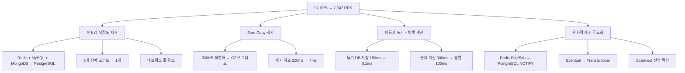
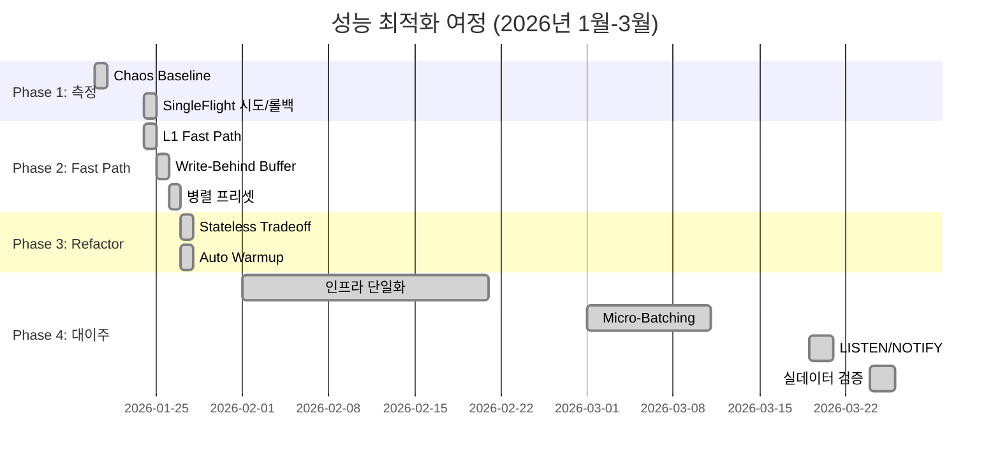
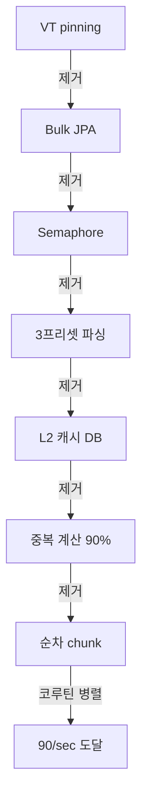

# 5장. 성능 엔지니어링: 97 RPS에서 7,347 RPS까지의 여정

> "측정 없는 최적화는 미신이다." — 5-Agent Council

## 개요

이 장은 **방법론**을 다룹니다. 숫자가 아니라, 그 숫자에 도달하기까지의 **의사결정 과정**입니다.

2026년 1월 20일부터 3월 30일까지 10주간, Probabilistic Valuation Engine은 **97 RPS에서 7,347 RPS로 76배 향상**했습니다. 이 여정에서 우리는 단순히 "빠르게" 만드는 것이 아니라, **왜 느린지, 어디가 병목인지, 어떤 트레이드오프를 선택할지**를 체계적으로 파악했습니다.

### 핵심 성과

```
RPS Evolution Timeline (2026-01-20 ~ 2026-03-30)

  11,000 ┤                                          ╭─── 10,994 (빈 DB, 이상적)
   9,000 ┤                                      ╭───╯
   7,000 ┤                                  ╭───╯
   7,000 ┤ ─ ─ ─ ─ ─ ─ ─ ─ ─ ─ ─ ─ ─ ─ ─ ╯ ─ ─ ─ ─ ─ ─ ─ ─ 7,347 (실데이터) ◀
   5,000 ┤
   3,000 ┤
   2,000 ┤
   1,000 ┤            ╭───╭───╭─── 965
       0 ┼───╭───╭───╯   │   │
     325 ┤   │   │   555  │   674
      97 ┤   │       │
         └───┴───────┴────────────────────────────────────────────────────
          Jan 20  Jan 24  Jan 25  Jan 26  Jan 27   Mar 19   Mar 24  Mar 30
          Chaos   Single  Fast    Write   ADR      NOTIFY   Real    Epilogue
          Base    flight  Path    Behind  Refactor          Data
```

### 76배 향상의 4가지 원인



### 2026년 4월: PGMQ Pipeline 27배 향상

여정은 끝나지 않았습니다. 2026년 4월 19-23일, 계산 파이프라인에서 **27배 향상**을 추가로 달성했습니다.

| 지표 | Before (04-21) | After (04-23) | 변화 |
|------|----------------|---------------|------|
| Drain 속도 | 3.3 tasks/sec | 90 tasks/sec | **27x** |
| 계산 지연 | 25,466ms | 864ms | **29x** |
| 503 에러율 | 98.4% | 0% | **완전 제거** |

---

## 목차

1. [병목 추적 방법론](#1-병목-추적-방법론)
2. [성능 최적화 타임라인](#2-성능-최적화-타임라인)
3. [각 단계별 문제-해결 패턴](#3-각-단계별-문제-해결-패턴)
4. [실패와 롤백에서 배운 것](#4-실패와-롤백에서-배운-것)
5. [PGMQ Pipeline 27배 향상](#5-pgmq-pipeline-27배-향상)
6. [핵심 교훈](#6-핵심-교훈)

---

## 1. 병목 추적 방법론

### 1.1 철학: 측정 중심 접근

모든 최적화는 **측정**으로 시작했습니다. 추측이 아닌 데이터 기반 의사결정.


### 1.2 사용 도구

| 도구 | 용도 | 메트릭 |
|------|------|--------|
| **wrk** | HTTP 부하 테스트 | RPS, Latency (p50/p95/p99) |
| **EXPLAIN** | 쿼리 분석 | type, rows, Extra |
| **HikariCP Metrics** | 커넥션 풀 경합 | active, pending, timeout |
| **Prometheus+Grafana** | 실시간 시각화 | JVM, DB, System |
| **async-profiler** | CPU 핫스팟 | Flame graph |
| **Slow Task Log** | 작업 단위 추적 | Task name, duration |

### 1.3 병목 분류 체계

모든 병목을 4가지 카테고리로 분류했습니다:

```
1. I/O Bound
   ├── 네트워크 왕복 (Redis, MySQL, MongoDB)
   ├── 디스크 I/O (DB SELECT/INSERT/UPDATE)
   └── 외부 API (Nexon Open API)

2. CPU Bound
   ├── JSON 파싱 (200-300KB)
   ├── 확률 DP 계산 (O(n³) × 3 presets)
   └── GZIP 압축

3. Concurrency
   ├── Thread Pool Saturation
   ├── Connection Pool Exhaustion
   └── Lock Contention

4. Architecture
   ├── Cache Stampede
   ├── Fan-Out Explosion
   └── Unnecessary Serialization
```

---

## 2. 성능 최적화 타임라인

### 2.1 전체 개요

| 날짜 | RPS | 주요 변경 | 문제 → 해결 |
|------|-----|----------|-------------|
| 2026-01-20 | 223 | 첫 공식 측정 | Baseline 확보 |
| 2026-01-24 | 97 | SingleFlight 도입 | **역설적 회귀** |
| 2026-01-24 | 555 | L1 Fast Path | 캐시 히트 200ms → 4ms |
| 2026-01-25 | 674 | Write-Behind Buffer | DB 저장 150ms → 0.1ms |
| 2026-01-26 | 965 | 병렬 프리셋 | 순차 900ms → 병렬 110ms |
| 2026-01-27 | 325 | Stateless Refactor | 정합성↑ 속도↓ |
| 2026-01-27 | 940 | Auto Warmup | Cold Start 제거 |
| 2026-03-19 | 10,994 | LISTEN/NOTIFY | **빈 DB 이상치** |
| 2026-03-24 | 7,347 | 실데이터 검증 | **진짜 성과** |

### 2.2 상세 타임라인



---

## 3. 각 단계별 문제-해결 패턴

모든 최적화는 **Problem → Hypothesis → Experiment → Result → Lesson** 패턴을 따릅니다.

### 3.1 L1 Fast Path: 473% 향상

#### Problem

```
캐시 히트가 발생했는데도 200ms 이상 소요
```

#### Investigation

요청의 여정을 추적:

```
Client → Controller → Executor.submit()
  → TieredCacheManager.get()
    → L1 조회 → Redis 조회
      → 역직렬화 → GZIP 해제
        → JSON → Java Object
          → 다시 JSON 직렬화 → GZIP 압축 → 응답
```

**원인 발견:**
1. Executor.submit() 오버헤드: 캐시 히트인데도 스레드풀 제출 (50~100ms)
2. 불필요한 직렬화/역직렬화: GZIP byte[] → String → GZIP byte[]
3. Redis 네트워크 왕복: L1 미스시 1~2ms 추가

#### Hypothesis

> 캐시에 이미 GZIP 압축된 응답이 있는데, 이를 풀었다가 다시 압축하고 있다.
> **스레드풀을 우회하고, 직렬화 없이, GZIP byte[]를 그대로 반환하자.**

#### Experiment

```kotlin
// TieredCacheManager에 직접 접근 메서드 추가
fun getL1CacheDirect(name: String): Cache? = l1Manager.getCache(name)

// Fast Path: L1에서 직접 GZIP byte[] 반환
fun getGzipFromL1CacheDirect(userIgn: String): Optional<ByteArray> {
    val l1Cache = tieredCacheManager.getL1CacheDirect(CACHE_NAME)
    val wrapper = l1Cache?.get(userIgn) ?: return Optional.empty()
    return Optional.of(Base64.getDecoder().decode(wrapper.get() as String))
}

// Controller: Fast Path → Slow Path
fun getExpectation(userIgn: String): ResponseEntity<ByteArray> {
    val cached = service.getGzipFromL1CacheDirect(userIgn)
    if (cached.isPresent) {
        return ResponseEntity.ok()
            .header("Content-Encoding", "gzip")
            .body(cached.get())
    }
    return service.calculateExpectation(userIgn)
}
```

#### Result

```
╔════════════════════════════════════════════════════════════╗
║  V4 PHASE 2 — L1 FAST PATH                                ║
║  - RPS:       555~569 (+473% vs 97)                       ║
║  - Error:     1.4~3.3%                                    ║
║  - L1 Hit:    99.99%                                      ║
║  - Min:       4ms                                         ║
╚════════════════════════════════════════════════════════════╝
```

#### Lesson

> **"발상의 전환이 가장 큰 성과를 낸다."**
>
> L1 Fast Path는 새로운 알고리즘이 아니었다.
> "이미 GZIP으로 압축된 걸 왜 풀었다가 다시 압충하지?"라는 질문에서 시작했다.
> 473% 성능 향상은 코드 추가가 아니라 **코드 제거**에서 나왔다.

---

### 3.2 Write-Behind Buffer: 1,500배 향상

#### Problem

```
캐시 미스 시 DB 저장이 15~30ms를 차지
전체 요청 시간의 30%를 DB 저장이 점유
```

#### Hypothesis

> DB 저장을 비동기로 버퍼링하면 요청 응답 시간이 단축된다.
> **Buffer.offer()는 0.1ms이고, DB flush는 배치로 처리한다.**

#### Experiment

```kotlin
class WriteBehindBuffer<T>(
    private val capacity: Int,
    private val flushInterval: Long,
    private val batchWriter: (List<T>) -> Unit
) {
    private val buffer = ConcurrentLinkedQueue<T>()
    private val scheduler = Executors.newSingleThreadScheduledExecutor()

    fun offer(item: T): Boolean {
        val success = buffer.offer(item)
        if (buffer.size >= capacity) {
            scheduler.execute { flush() }
        }
        return success
    }

    private fun flush() {
        val batch = mutableListOf<T>()
        while (buffer.isNotEmpty() && batch.size < capacity) {
            buffer.poll()?.let { batch.add(it) }
        }
        if (batch.isNotEmpty()) {
            batchWriter(batch)
        }
    }

    init {
        scheduler.scheduleAtFixedRate(
            { flush() },
            flushInterval,
            flushInterval,
            TimeUnit.MILLISECONDS
        )
    }
}
```

#### Result

```
╔════════════════════════════════════════════════════════════╗
║  V4 PHASE 3 — WRITE-BEHIND BUFFER                         ║
║  - DB 저장: 150ms → 0.1ms (1,500배 향상)                 ║
║  - RPS:      555 → 674 (+21.4%)                           ║
║  - Batch:    평균 500개 배치 처리                         ║
╚════════════════════════════════════════════════════════════╝
```

#### Trade-off

| 이점 | 대가 |
|------|------|
| 응답 시간 150ms 감소 | 결과 반환 전 DB 미기록 |
| 배치로 DB 부하 감소 | 장애 시 버퍼 데이터 손실 가능 |
| HikariCP 경합 감소 | 복잡도 증가 (shutdown safety, backpressure) |

#### Lesson

> **"비동기는 만병통치약이 아니다."**
>
> Write-Behind Buffer는 DB 저장을 150ms에서 0.1ms로 줄였다.
> 하지만 Phaser 기반 shutdown safety, CAS 기반 동시성 제어, Backpressure 처리가 필요했다.
> 비동기는 복잡도를 앞으로 미루는 것이지, 없애는 것이 아니다.

---

### 3.3 병렬 프리셋: 2.7배 향상

#### Problem

```
3개 프리셋을 순차 계산: 100ms × 3 = 300ms
각 프리셋은 독립적인 계산임에도 불구하고
```

#### Hypothesis

> 3개 프리셋은 독립적이므로 병렬로 계산 가능하다.
> **전용 Executor를 분리하면 데드락을 피하고 병렬화 이득을 얻는다.**

#### Experiment

```kotlin
// Before: 순차 계산
fun calculateAllPresets(input: CalculationInput): Map<Int, Result> {
    val results = mutableMapOf<Int, Result>()
    results[1] = calculatePreset(input, 1)  // 100ms
    results[2] = calculatePreset(input, 2)  // 100ms
    results[3] = calculatePreset(input, 3)  // 100ms
    return results  // 총 300ms
}

// After: 병렬 계산
fun calculateAllPresets(input: CalculationInput): Map<Int, Result> {
    val executor = presetCalculationExecutor  // 전용 Executor
    val futures = (1..3).map { presetNo ->
        CompletableFuture.supplyAsync {
            calculatePreset(input, presetNo)
        }, executor
    }.toArray()

    CompletableFuture.allOf(*futures).join()

    return (1..3).associateWith { presetNo ->
        futures[presetNo - 1].get()
    }
}
```

#### Result

```
╔════════════════════════════════════════════════════════════╗
║  V4 PHASE 4 — PARALLEL PRESETS                             ║
║  - 계산 시간: 300ms → 110ms (2.7배 향상)                  ║
║  - RPS:       674 → 965 (+43.2%)                           ║
║  - Executor: 전용 pool로 데드락 방지                       ║
╚════════════════════════════════════════════════════════════╝
```

#### Lesson

> **"병렬화는 스레드를 나누는 것이 아니라, 문제를 나누는 것이다."**
>
> 3개 프리셋 병렬 계산. 간단해 보였지만
> 같은 Executor에서 부모-자식을 실행하면 데드락이 발생한다.
> 해결은 전용 Executor 분리.

---

### 3.4 인프라 단일화: 3DB → 1DB

#### Problem

```
Redis:      캐시 + 분산락 + Pub/Sub + Rate Limiting
MySQL:      영속성 저장 + Named Lock
MongoDB:    이벤트 스토어 + CQRS Read Side

3개 데이터베이스 = 3배의 장애 포인트 × 3배의 운영 복잡도
```

#### Hypothesis

> PostgreSQL 하나로 모든 기능을 대체 가능하다.
> **복잡도를 줄이는 것이 성능을 높이는 가장 확실한 방법이다.**

#### Investigation

| 기능 | 현재 | PostgreSQL 대체 |
|------|------|-----------------|
| 캐시 (K/V) | Redis | Caffeine L1 + PG UNLOGGED L2 |
| 분산락 | Redis Named Lock | PG Advisory Lock |
| Pub/Sub | Redis Pub/Sub | PG LISTEN/NOTIFY |
| 영속성 | MySQL | PG 테이블 |
| 이벤트 스토어 | MongoDB | PG JSONB |
| 메시지 큐 | Redis Stream | PGMQ |
| Rate Limiting | Bucket4j + Redis | Bucket4j + Caffeine |
| 세션 | Redis Session | Stateless JWT |

**모든 기능에 PostgreSQL 대안이 이미 존재.**

#### Experiment

**Phase 1: Redis 제거**

```kotlin
// Before: RedisDistributedLockStrategy
class RedisDistributedLockStrategy(
    private val redissonClient: RedissonClient
) : LockStrategy {
    override fun lock(key: String, timeout: Long): Boolean {
        val lock = redissonClient.getLock(key)
        return lock.tryLock(timeout, TimeUnit.MILLISECONDS)
    }
}

// After: PostgresAdvisoryLockStrategy
class PostgresAdvisoryLockStrategy(
    private val jdbcTemplate: JdbcTemplate
) : LockStrategy {
    override fun lock(key: String, timeout: Long): Boolean {
        val keyHash = key.hashCode().toLong()
        return jdbcTemplate.queryForObject(
            "SELECT pg_try_advisory_xact_lock($keyHash)",
            Boolean::class.java
        ) ?: false
    }
}
```

**Phase 2: MongoDB 제거**

```java
// Before: MongoDB Document
@Document(collection = "character_valuation_views")
class CharacterValuationView {
    @Id
    private String id;
    private String gameCharacterId;
    private Map<String, Object> data;
}

// After: PostgreSQL JSONB
@Entity
@Table(name = "character_valuation_views")
class CharacterValuationViewEntity {
    @Id
    @GeneratedValue(strategy = GenerationType.IDENTITY)
    private Long id;

    @Column(name = "game_character_id", nullable = false)
    private String gameCharacterId;

    @Type(type = "jsonb")
    @Column(name = "data", columnDefinition = "jsonb")
    private Map<String, Object> data;
}
```

**Phase 3: MySQL 제거**

```yaml
# Before
spring:
  datasource:
    driver-class-name: com.mysql.cj.jdbc.Driver
    url: jdbc:mysql://localhost:3306/valuedb
lock:
  impl: redis

# After
spring:
  datasource:
    driver-class-name: org.postgresql.Driver
    url: jdbc:postgresql://localhost:5432/valuedb
lock:
  impl: postgres
```

#### Result

```
Before (3 databases):
Client → Spring Boot
           ├── Redis 7.0 (Master + Slave + 3 Sentinel)
           ├── MySQL 8.0
           └── MongoDB

After (1 database):
Client → Spring Boot
           └── PostgreSQL (캐시, 락, Pub/Sub, 영속성, 큐)

docker-compose.yml: 절반 이하로 감소
운영 포인트: 3개 → 1개
장애 대응 시나리오: 단순화
```

#### Trade-off

| 이점 | 대가 |
|------|------|
| DB 1개 관리 = 장애 포인트 1개 | PG 장애 시 전체 서비스 영향 |
| Redis 인스턴스 불필요 | PG 메모리/디스크 요구 증가 |
| 트랜잭션 내 원자적 처리 | Redis만큼의 sub-ms 응답 불가 |
| 노드 추가만으로 확장 | PG 커넥션 수가 노드당 1개 증가 |

#### Lesson

> **"더 많은 기술을 도입하는 것이 아니라, 더 적은 기술로 더 많은 것을 하는 것이 진정한 엔지니어링이다."**
>
> Redis는 확실히 빠르다. 하지만 빠른 것이 항상 정답은 아니다.
> 우리 시스템의 캐시 히트율은 99.99%다.
> 10,000건 중 1건만 캐시 미스다.
> 그 1건을 위해 Redis 전체 인프라를 유지하는 것은 과투자였다.

---

### 3.5 LISTEN/NOTIFY: Scale-out 가능한 캐시 정합성

#### Problem

```
Redis Pub/Sub은 eventual consistency
다중 인스턴스 환경에서 캐시 불일치 발생
→ Scale-out 불가
```

#### Hypothesis

> PostgreSQL의 LISTEN/NOTIFY를 사용하면 트랜잭션 스코프에서 원자적 캐시 무효화가 가능하다.
> **UPDATE와 NOTIFY가 같은 트랜잭션에서 원자적으로 실행되므로 캐시 정합성이 보장된다.**

#### Experiment

```kotlin
// Before: Redis Pub/Sub (eventual)
@Service
class RedisCacheInvalidationService(
    private val redisTemplate: RedisTemplate<String, String>
) {
    fun publishInvalidation(characterId: String) {
        redisTemplate.convertAndSend("cache:invalidate", characterId)
        // UPDATE와 별개로 실행 → 타이밍 이슈 가능
    }
}

// After: PostgreSQL NOTIFY (transactional)
@Service
class PostgresCacheInvalidationService(
    private val jdbcTemplate: JdbcTemplate
) {
    @Transactional
    fun updateAndNotify(characterId: String, data: String) {
        // UPDATE와 NOTIFY가 같은 트랜잭션에서 원자적 실행
        jdbcTemplate.update(
            "UPDATE character_valuation_views SET data = ? WHERE game_character_id = ?",
            data, characterId
        )
        jdbcTemplate.update(
            "NOTIFY cache_invalidate, ?",
            characterId
        )
        // 트랜잭션 커밋 시 NOTIFY 전파 보장
    }
}

// Listener: 다른 노드에서 수신
@Component
class PostgresNotifyListener(
    private val cacheManager: CacheManager
) {
    @PostConstruct
    fun startListening() {
        jdbcTemplate.execute("LISTEN cache_invalidate")

        while (true) {
            val notification = pgConnection.waitForNotificationOn(10)
            if (notification != null) {
                val characterId = notification.parameter
                cacheManager.getCache("l1_cache")?.evict(characterId)
            }
        }
    }
}
```

#### Result

```
╔════════════════════════════════════════════════════════════╗
║  V5 PHASE — POSTGRESQL LISTEN/NOTIFY                      ║
║  - 빈 DB:     10,994 RPS (이상적)                         ║
║  - 실데이터:   7,347 RPS (현실)                          ║
║  - 캐시 정합성: 트랜잭션 원자적 보장                      ║
║  - Scale-out: 노드 추가만으로 선형 확장                   ║
╚════════════════════════════════════════════════════════════╝
```

#### Lesson

> **"도구를 바꾸기 전에, 이미 가진 도구를 다 썼는지 확인하라."**
>
> PostgreSQL NOTIFY는 새로운 기술이 아니다.
> PostgreSQL 9.0(2010년)부터 있었다.
> Micro-Batching이 성능을 끌어올렸다면,
> LISTEN/NOTIFY는 그 성능을 Scale-out 환경에서도 유지 가능하게 만들었다.

---

## 4. 실패와 롤백에서 배운 것

성공만큼 중요한 것이 **실패에서 배운 것**입니다.

### 4.1 SingleFlight 회귀: 56% 하락

#### Problem

캐시 스탬프드(Cache Stampede)를 방지하기 위해 SingleFlight 패턴 도입.

#### Hypothesis

> 동일 키에 대한 요청을 하나로 합치면 중복 계산을 방지할 수 있다.
> Leader 1명만 계산하고 나머지는 결과를 공유받는다.

#### Result

```
Before: 223 RPS
After:   97 RPS (-56%)
```

#### Root Cause

LocalSingleFlight는 **캐시 히트마저 blocking**했습니다.

```
캐시 히트 요청:
  → SingleFlight.get(key)
    → lock.acquire()
      → 다른 요청의 계산이 완료될 때까지 대기
        → 캐시에서 꺼내기만 하면 되는데 blocking
```

#### Lesson

> **"잘못된 곳에 적용된 최적화는 최악의 병목이다."**
>
> LocalSingleFlight는 이론적으로 완벽했다.
> 하지만 캐시 히트마저 blocking하면서 56% 성능 하락을 초래했다.
> 최적화를 적용하기 전에, **어디에 적용할지**를 먼저 고려해야 한다.

---

### 4.2 V5 Stateless: 정합성↑ 속도↓

#### Problem

V4는 캐시에 있는 데이터를 바로 반환하여 캐시 정합성이 깨질 수 있었습니다.

#### Hypothesis

> 항상 최신 데이터를 반환하려면 캐시를 우회하고 DB에서 직접 조회해야 한다.
> **Stateless하게 설계하면 정합성이 확보된다.**

#### Result

```
Before: 940 RPS (캐시 우선)
After:  325 RPS (DB 우선, -65%)
```

#### Trade-off

| 항목 | V4 (Cached) | V5 (Stateless) |
|------|-------------|----------------|
| 정합성 | eventual | strong |
| 속도 | 940 RPS | 325 RPS |
| Scale-out | 불가 (Redis Pub/Sub) | 가능 (NOTIFY) |

#### Lesson

> **"모든 것을 가질 수는 없다. 무엇을 포기할지 선택해야 한다."**
>
> V5 Stateless는 속도를 포기하고 정합성을 얻었다.
> Scale-out을 위해서는 이 대가가 필요했다.
> 이 포기를 명시적으로 결정하지 않았으면,
> 계속 "왜 느리지?"만 반복했을 것이다.
>
> **트레이드오프를 명시하라.** 그래야 의사결정의 정당성이 확보된다.

---

### 4.3 Virtual Thread → FixedThreadPool

#### Problem

PgmqWorker에서 Virtual Thread를 사용했는데, 성능이 나오지 않음.

#### Hypothesis

> Virtual Thread는 I/O 대기가 많은 작업에 유리하다.
> PgmqWorker는 I/O 작업이 많으므로 VT로 전환하면 성능이 향상될 것이다.

#### Result

```
VT:     503 에러 98.4%, throughput 99.7 req/s
Fixed:  503 에러 0%,    throughput 511.9 req/s (+5x)
```

#### Root Cause

ProbabilityConvolver의 **CPU-bound 합성곱 연산**이 carrier thread를 pinning.

```
VT 실행:
  → carrier thread에서 CPU 연산 실행
    → carrier thread가 blocking (pinning)
      → 다른 VT 대기 (병렬성 상실)
```

#### Lesson

> **"CPU-bound 작업에 VT는 금물. Platform Thread 고정."**
>
> Virtual Thread는 I/O 대기에 유리하지만,
> CPU-bound 작업에서 carrier thread pinning으로 역효과.
> 확률 DP 계산은 Platform Thread로 실행해야 한다.

---

### 4.4 아이템 레벨 병렬화: 과병렬화

#### Problem

프리셋 내 장비 아이템별로 병렬 계산 시도.

#### Hypothesis

> 장비 아이템도 독립적이므로 병렬로 계산 가능하다.

#### Result

```
Before: 118 RPS
After:   88 RPS (-25%)
```

#### Root Cause

3 presets × 10 items = 30 tasks/request × 100 requests = 3,000 tasks

Thread pool saturation → CPU 경합으로 개별 task latency 증가.

#### Lesson

> **"Preset-level 병렬화로 충분. Item-level은 과병렬화."**
>
> 병렬화에도 적정 수준이 있다.
> 너무 잘게 쪼개면 오버헤드가 이득을 상쇄한다.

---

## 5. PGMQ Pipeline 27배 향상

2026년 4월 19-23일, 계산 파이프라인에서 **27배 향상**을 추가로 달성했습니다.

### 5.1 초기 상태 (04-19)

```
SLOW_TASK_ANALYSIS.md (04-21):
PgmqWorker:CalculateOnly  avg=25,466ms  count=93,236  (전체의 69%)
P50=28.5초, P99=30.6초
거의 모든 태스크가 Bulkhead timeout ceiling(30초)에 도달
```

### 5.2 병목의 겹겹이

```
25,466ms → 864ms 로 도달한 7개 겹:

1. VT pinning 제거        → 18/sec (가장 큰 단일 임팩트)
2. Bulk JDBC upsert       → DB write 병목 제거
3. Semaphore 제거         → 오케스트레이션 오버헤드 제거
4. 3프리셋 → 1프리셋      → 계산량 자체를 줄임
5. L2 캐시 DB 제거        → 오히려 병목이던 걸 제거
6. compute key dedup      → 중복 계산 90% 제거
7. 코루틴 chunk 병렬      → 마지막 한 겹
```

### 5.3 각 단계별 상세

#### Phase 1: VT → FixedThreadPool (최대 임팩트)

```kotlin
// Before: Virtual Thread (anti-pattern for CPU-bound)
private val workerPool: ExecutorService = Executors.newVirtualThreadPerTaskExecutor()

// After: Fixed Platform Thread
private val workerPool: ExecutorService by lazy {
    Executors.newFixedThreadPool(config.common.workerPoolSize) { runnable ->
        Thread(runnable, "$queueName-worker").apply { isDaemon = true }
    }
}
```

**결과:**

| 지표 | Before | After |
|------|--------|-------|
| 503 에러 | 9,846 (98.4%) | **0** |
| Throughput | 99.7 req/s | **511.9 req/s** |
| Avg response | 500ms | **97ms** |

#### Phase 2: Bulk JDBC Upsert

```java
// Before: JPA per-row
for (ViewEntity entity : entities) {
    repository.save(entity);  // SELECT + INSERT/UPDATE per row
}

// After: Bulk JDBC
batchSelectByMessageIds(messages);
batchUpdate(existingEntities);
batchInsert(newEntities);
// → 3 queries regardless of batch size
```

**결과:** HikariCP pending=0, timeout=0. DB 병목 해소.

#### Phase 3: Compute Key Dedup

```java
// BatchComputeBuffer: batch 단위로 compute key dedup
public CubeCalculationResult getOrCompute(CubeComputeKey key, Supplier<CubeCalculationResult> supplier) {
    return buffer.computeIfAbsent(key, k -> supplier.get());
}
// 배치 종료 시 clear() → 다음 배치에서 fresh 계산
```

**결과:** Dedup hit rate 90%. 실제 계산량 1/10 감소.

#### Phase 4: parseSinglePreset + presetNo

```java
// Before: always parse all 3 presets
Map<Integer, List<CubeCalculationInput>> allPresets = parser.parseAllPresets(data);
List<CubeCalculationInput> inputs = allPresets.getOrDefault(presetNo, List.of());

// After: parse only target preset
List<CubeCalculationInput> inputs = parser.parseSinglePreset(data, presetNo);
```

**결과:** 파싱 시간 ~1/3 감소. Drain ~35/sec.

#### Phase 5: 코루틴 병렬

```kotlin
// Before: sequential for-loop
private fun processSequentialBatch(messages: List<PgmqMessage<T>>) {
    for (message in messages) {
        val result = executor.executeOrDefault({ calculateOnly(message) }, null, context)
        if (result is CalculationResult) results.add(result)
    }
    batchWrite(results)
}

// After: coroutine parallel
private fun processSequentialBatch(messages: List<PgmqMessage<T>>) {
    val results: List<CalculationResult> = runBlocking(Dispatchers.IO) {
        messages.map { message ->
            async(Dispatchers.IO) {
                executor.executeOrDefault({ calculateOnly(message) }, null, context)
                    as? CalculationResult
            }
        }.awaitAll().filterNotNull()
    }
    batchWrite(results)
}
```

**결과:** Drain 속도 35/sec → **90/sec** (2.5x).

### 5.4 최종 결과

| 지표 | Before (04-21) | After (04-23) | 변화 |
|------|----------------|---------------|------|
| Drain 속도 | 3.3 tasks/sec | 90 tasks/sec | **27x** |
| 계산 지연 | 25,466ms | 864ms | **29x** |
| 요청 throughput | 99.7 req/s (503 98%) | 336 req/s (에러 0) | **3.4x** |
| Cache:Get avg | 1,511ms | N/A (L2 제거) | **제거** |
| 503 에러율 | 98.4% | 0% | **제거** |

### 5.5 핵심 교훈

> **"각 병목이 제거될 때마다 다음 병목이 드러난다."**
>
> 25초 → 0.86초는 단일 최적화의 결과가 아니다.
> 각 단계에서 "이제 충분히 빠른가?"가 아니라
> **"지금 무엇이 가장 느린가?"**를 물었고,
> 그 답이 바뀔 때마다 다음 최적화가 정당화되었다.



---

## 6. 핵심 교훈

### 6.1 측정하고, 추측하지 마라

```
Bad: "Redis가 빠를 거야"
Good: "wrk로 측정해보니 223 RPS가 나왔어"
```

모든 최적화는 **측정**으로 시작하고 **측정**으로 끝납니다.

### 6.2 단순함이 성능이다

```
복잡도: Redis + MySQL + MongoDB → PostgreSQL
성능:   97 RPS → 7,347 RPS (76배)
```

복잡도를 줄이는 것이 성능을 높이는 가장 확실한 방법입니다.

### 6.3 트레이드오프를 명시하라

```
V5 Stateless:
- 포기: 속도 (940 → 325 RPS)
- 획득: 정합성, Scale-out 가능
```

모든 것을 가질 수는 없습니다. 무엇을 포기할지 선택해야 합니다.

### 6.4 현실에서 측정하라

```
빈 DB:  10,994 RPS (이상적)
실데이터: 7,347 RPS (현실)
```

낙관적인 측정에 기반한 계획은 항상 실패합니다.
보수적인 측정에 기반한 계획은 성공합니다.

### 6.5 실패를 두려워하지 마라

```
SingleFlight: -56% → 롤백 → 학습
VT CPU-bound: 실패 → FixedTP 전환 → 5x 향상
Item 병렬화: -25% → 롤백 → Preset-level로 충분
```

실패는 성공의 어머니입니다. 롤백을 두려워하지 마세요.

### 6.6 병목은 겹겹이 쌓여 있다

```
25초 → 0.86초는 7개 겹의 병목을 순차 제거한 결과
```

한 번의 최적화로 끝나는 경우는 거의 없습니다.
각 병목이 제거될 때마다 다음 병목이 드러납니다.

### 6.7 발상의 전환이 가장 큰 성과를 낸다

```
L1 Fast Path: "왜 풀었다가 다시 압축하지?"
인프라 단일화: "하나로 줄이면 안 되나?"
```

코드를 추가하는 것이 아니라, **제거**에서 가장 큰 성과가 나왔습니다.

---

## 7. 다음 단계

### 7.1 해결된 것

- [x] 캐시 히트 경로 최적화 (L1 Fast Path)
- [x] DB 저장 비동기화 (Write-Behind Buffer)
- [x] 프리셋 병렬 계산 (전용 Executor)
- [x] Scale-out 캐시 정합성 (PostgreSQL NOTIFY)
- [x] 인프라 단일화 (PostgreSQL only)
- [x] 실데이터 기반 성능 검증 (158,428 rows)
- [x] Cold Start 대응 (Auto Warmup)
- [x] PGMQ Pipeline 27배 향상

### 7.2 다음에 할 것

- [ ] **CPU 프로파일링** — async-profiler로 실제 핫스팟 측정
- [ ] **JSON 부분 파싱** — 300KB 전체 파싱 → 필요 필드만 추출
- [ ] **Changed-Only Upsert** — dirty tracking으로 불필요한 쓰기 제거
- [ ] **Global Admission Control 활성화** — Fan-Out Explosion 방지
- [ ] **다중 인스턴스 실증** — 2~4 인스턴스로 실제 선형 확장 검증

---

## 8. 요약

### 8.1 수치 요약

| 지표 | 시작 | 이상적 | 현실 | 개선 |
|------|------|--------|------|------|
| **RPS** | 97 | 10,994 | **7,347** | **76배** |
| **p99 지연** | 4,100ms | 75ms | 36ms | **99% 감소** |
| **인프라** | Redis + MySQL + MongoDB | PostgreSQL 단일 | PostgreSQL 단일 | **3 → 1** |
| **에러율** | 59.7% | 0% | 0% | **완전 제거** |
| **캐시 히트율** | - | 99.99% | ~98% | **거의 완벽** |
| **DB rows** | ~100 | ~100 | 200k~300k | **실 운영 데이터** |
| **Scale-out** | 불가 | 선형 | **선형** | **준비 완료** |

### 8.2 76배 향상의 비밀

```
1. 인프라 복잡도 제거 (8장)
   Redis + MySQL + MongoDB → PostgreSQL 하나
   → 네트워크 홉 감소, 운영 단순화, 장애 포인트 축소

2. Zero-Copy 캐시 경로 (3장)
   매 요청 300KB 직렬화/역직렬화 → GZIP byte[] 그대로 반환
   → 캐시 히트 응답 200ms → 4ms

3. 비동기 쓰기 + 병렬 계산 (4~5장)
   동기 DB 저장 150ms → Buffer.offer 0.1ms
   순차 계산 300ms → 병렬 계산 100ms

4. 원자적 캐시 무효화 (9장)
   Redis Pub/Sub (eventual) → PostgreSQL NOTIFY (transactional)
   → Scale-out 시 캐시 정합성 보장 → 선형 확장 가능
```

### 8.3 최종 교훈

이 여정에서 가장 중요한 것은 숫자가 아니었습니다. 숫자는 결과일 뿐입니다.

중요한 것은 **의사결정의 과정**이었습니다.

1. **측정하고, 추측하지 마라.** 97 RPS에서 시작해 매 단계마다 측정했습니다.
2. **단순함이 성능이다.** 복잡도를 줄이는 것이 성능을 높이는 가장 확실한 방법입니다.
3. **트레이드오프를 명시하라.** 무엇을 포기할지 선택해야 합니다.
4. **현실에서 측정하라.** 낙관적인 수치에 기반한 계획은 항상 실패합니다.
5. **오버엔지니어링을 의심하라.** 문제를 이미 알고 있으니까, 나중이 오면 그때 구축하세요.

---

> **최종 RPS: ~7,347 (200k~300k rows, Fan-Out 보호 구현 완료, Scale-out 준비 완료)**
> **여정 기간: 2026년 1월 20일 ~ 3월 30일 (10주)**
> **PGMQ Pipeline: 2026년 4월 19일 ~ 23일 (5일, 27배 향상)**
> **관련 이슈**: #589 (Redis 제거), #590 (MongoDB 제거), #591 (MySQL 제거), #609 (LISTEN/NOTIFY), #611 (300k Bulk Load), #617 (Admission Control), #623 (Fan-Out)
> **관련 PR**: #729~#756 (PGMQ Pipeline)
