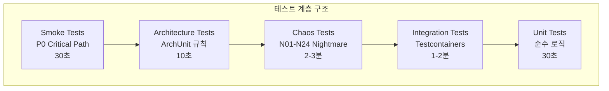

# 제6장: 테스트 전략

> "테스트는 안전망이 아니다. 테스트는 설계다." - Kent Beck

## 목차

1. [테스트 철학: 5계층 아키텍처](#1-테스트-철학-5계층-아키텍처)
2. [단위 테스트: 순수 도메인 로직 검증](#2-단위-테스트-순수-도메인-로직-검증)
3. [통합 테스트: Testcontainers로 Production Parity 확보](#3-통합-테스트-testcontainers로-production-parity-확보)
4. [동시성 테스트: Race Condition 근본적 해결](#4-동시성-테스트-race-condition-근본적-해결)
5. [카오스 엔지니어링: 24가지 악몽 시나리오](#5-카오스-엔지니어링-24가지-악몽-시나리오)
6. [47 → 0: 플레이키 테스트 제거기](#6-47--0-플레이키-테스트-제거기)
7. [회귀 방지: CI 파이프라인과 ArchUnit](#7-회귀-방지-ci-파이프라인과-archunit)
8. [성과 요약](#8-성과-요약)

---

## 1. 테스트 철학: 5계층 아키텍처

### 1.1 테스트 피라미드 재정의

전통적인 테스트 피라미드는 "단위 테스트 많이, 통합 테스트 적게"를 가르치지만, 실제 백엔드 시스템에서는 **"각 계층을 적절한 도구로 테스트"**가 더 현실적입니다.



**핵심 원칙:**
- **단위 테스트**: Spring 없이 순수 로직 검증
- **통합 테스트**: Testcontainers로 Production 환경과 동일한 DB/Redis
- **카오스 테스트**: 장애 주입으로 시스템 탄력성 검증
- **아키텍처 테스트**: ArchUnit으로 모듈 의존성 규칙 강제
- **스모크 테스트**: CI에서 P0 경로만 빠르게 검증

### 1.2 모듈별 테스트 책임

```
module-core/src/test/     → Domain Unit Tests (Pure Logic)
module-infra/src/test/    → Infrastructure Tests (JPA, External API)
module-app/src/test/      → Integration Tests (Testcontainers)
                         → Smoke Tests (CI Quick Validation)
                         → Architecture Tests (ArchUnit)
module-chaos-test/        → Chaos Engineering Tests (24 Nightmare Scenarios)
```

**설계 철학:**
1. **module-core는 Spring 의존 없음**: 순수 Kotlin/Java 로직 테스트
2. **Testcontainers는 싱글톤 재사용**: 컨테이너 시작 오버헤드 최소화
3. **카오스 테스트는 별도 모듈**: 장애 주입 로직이 프로덕션 코드에 오염 방지
4. **CI는 계층별 실행**: PR Gate는 빠른 테스트만, Nightly는 전체 실행

### 1.3 테스트 기술 스택

| 기술 | 용도 | 버전 |
|------|------|------|
| **JUnit 5** | 테스트 프레임워크 | Jupiter |
| **Testcontainers** | Docker 기반 통합 테스트 | 1.21.2 |
| **Mockito** | Mocking | 5.x |
| **AssertJ** | Fluent Assertions | 3.x |
| **ArchUnit** | 아키텍처 규칙 검증 | 1.x |
| **Awaitility** | 비동기 테스트 대기 | 4.2.0 |
| **WRK** | 부하 테스트 | - |

---

## 2. 단위 테스트: 순수 도메인 로직 검증

### 2.1 Core Unit Test Template (PR #602)

module-core는 Spring 의존이 전혀 없는 순수 도메인 계층입니다. 이를 통해 **< 100ms** 실행 시간을 달성합니다.

```kotlin
// CoreUnitTestTemplate.kt
abstract class CoreUnitTestTemplate {
    protected fun <T> given(block: () -> T): T = block()
    protected fun <T> `when`(block: () -> T): T = block()
    protected fun then(actual: T, assertion: (T) -> Unit) {
        assertion(actual)
    }
}

// 실제 테스트 예시
class ItemPriceTest : CoreUnitTestTemplate() {
    @Test
    fun `가격 생성 검증`() {
        val price = given { ItemPrice.of(1L, "아이템", 1000L) }
        val isFresh = `when` { price.isFreshWithinHours(24) }
        then(isFresh) { assertTrue(it) }
    }
}
```

**Why Spring 없이?**
- **빠른 피드백**: 컨텍스트 로딩 없이 즉시 실행
- **순수 로직 집중**: 도메인 규칙 검증에만 집중
- **CI 속도**: PR Gate에서 1000개 단위 테스트를 30초 내 완료

### 2.2 Value Object 불변성 검증

도메인 모델의 핵심인 Value Object는 생성 후 불변이어야 합니다.

```kotlin
@DisplayName("CharacterId Value Object 불변성 검증")
class CharacterIdTest : CoreUnitTestTemplate() {
    
    @Test
    fun `동일한 값으로 생성 시 같은 인스턴스`() {
        val id1 = CharacterId.of("test-ign")
        val id2 = CharacterId.of("test-ign")
        
        assertThat(id1).isSameAs(id2)  // 캐싱
    }
    
    @Test
    fun `null이나 빈 문자열로 생성 시 예외`() {
        assertThatThrownBy { CharacterId.of(null) }
            .isInstanceOf(IllegalArgumentException::class.java)
    }
}
```

### 2.3 확률 계산 로직 테스트

이 프로젝트의 핵심인 확률 계산은 단위 테스트로 정밀하게 검증합니다.

```kotlin
@DisplayName("기댓값 계산 정확도")
class ExpectationCalculationTest : CoreUnitTestTemplate() {
    
    @Test
    fun `DP 테이블 계산 정확도`() {
        val calculator = ExpectationCalculator()
        val result = calculator.calculate(
            cube = TestCubeProvider.simpleCube(),
            targetLevel = 200
        )
        
        assertThat(result.expectedValue).isCloseTo(
            1234.56, 
            within(0.01)  // 소수점 둘째 자리까지 정확
        )
    }
}
```

---

## 3. 통합 테스트: Testcontainers로 Production Parity 확보

### 3.1 H2에서 Testcontainers로의 전환 (ADR-051)

**문제**: H2 in-memory DB는 MySQL 8.0과 dialect 차이로 Flaky Test 주범이었습니다.

| H2 문제 | MySQL 8.0과 차이 |
|---------|------------------|
| `LOCK IN SHARE MODE` | 지원하지 않음 |
| `JSON_EXTRACT` | 구현 방식 다름 |
| 동시성 처리 | InnoDB와 다른 락킹 메커니즘 |

**해결**: Testcontainers로 Production과 동일한 MySQL 8.0 사용

```java
@Testcontainers
class IntegrationTestSupport {
    @Container
    static MySQLContainer<?> mysql = new MySQLContainer<>("mysql:8.0")
        .withDatabaseName("test")
        .withUsername("test")
        .withPassword("test");
    
    @DynamicPropertySource
    static void mysqlProperties(DynamicPropertyRegistry registry) {
        registry.add("spring.datasource.url", mysql::getJdbcUrl);
        registry.add("spring.datasource.username", mysql::getUsername);
        registry.add("spring.datasource.password", mysql::getPassword);
    }
}
```

### 3.2 싱글톤 컨테이너 재사용

모든 테스트에서 하나의 MySQL 컨테이너를 재사용하여 성능을 최적화합니다.

```java
// 전체 테스트 Suite에서 단 1회만 시작
static {
    mysql.start();  // ~3초
}

// 이후 모든 테스트에서 재사용 (오버헤드 ~0초)
```

**성능 지표:**
- 최초 컨테이너 시작: ~3초
- 재사용 시 오버헤드: ~0초
- 전체 테스트 suite: H2 120초 → Testcontainers 150초 (+25%지만 안정성 확보)

### 3.3 @Transactional 롤백으로 격리

각 테스트 후 `@Transactional` 롤백으로 데이터를 정리합니다.

```java
@Transactional
class DonationServiceTest extends IntegrationTestSupport {
    
    @Test
    @Rollback  // 테스트 후 자동 롤백
    void `기부 금액 차감`() {
        // Given
        Member member = memberRepository.save(
            Member.create(1000L)
        );
        
        // When
        donationService.donate(member.getId(), 500L);
        
        // Then
        Member updated = memberRepository.findById(member.getId()).get();
        assertThat(updated.getBalance()).isEqualTo(500L);
        // 테스트 종료 시 자동 롤백으로 다른 테스트에 영향 없음
    }
}
```

### 3.4 통합 테스트 → 단위 테스트 변환 (PR #326)

통합 테스트가 필요 없는 경우 단위 테스트로 변환하여 속도를 개선했습니다.

**Before (Integration Test):**
```java
@SpringBootTest
class ItemPriceServiceTest {
    // 2초 소요 (Spring Context 로딩)
}
```

**After (Unit Test):**
```java
class ItemPriceServiceTest {
    private val repository = mock<ItemPriceRepository>()
    private val service = ItemPriceService(repository)
    
    // < 100ms 소요
}
```

---

## 4. 동시성 테스트: Race Condition 근본적 해결

### 4.1 shutdown() + awaitTermination() 필수 패턴

**문제 (PR #207)**: `shutdown()`만 호출하면 즉시 반환되어 작업 완료 전에 검증이 실행됩니다.

```java
// Bad (Race Condition 발생)
executorService.shutdown();
// 아직 작업 실행 중인데 결과 검증!
assertEquals(expected, actualResult);

// Good (모든 작업 완료 보장)
executorService.shutdown();
executorService.awaitTermination(5, TimeUnit.SECONDS);
// 이제 안전하게 검증 가능
assertEquals(expected, actualResult);
```

### 4.2 CountDownLatch + awaitTermination() 조합

두 계층의 동기화로 완전한 Race Condition 방지를 달성합니다.

```java
@Test
@DisplayName("1000개 동시 요청 시 따닥 방어")
void concurrencyTest() throws InterruptedException {
    int taskCount = 1000;
    ExecutorService executor = Executors.newFixedThreadPool(16);
    CountDownLatch latch = new CountDownLatch(taskCount);
    
    for (int i = 0; i < taskCount; i++) {
        executor.submit(() -> {
            try {
                service.donate(userIgn, 10L);
            } finally {
                latch.countDown();  // 작업 완료 신호
            }
        });
    }
    
    // Step 1: 모든 작업이 finally 블록까지 도달 대기
    latch.await(10, TimeUnit.SECONDS);
    
    // Step 2: Executor 종료 및 완료 대기 (추가 안전장치)
    executor.shutdown();
    executor.awaitTermination(5, TimeUnit.SECONDS);
    
    // Step 3: 결과 검증
    Member result = memberRepository.findByIgn(userIgn).get();
    assertThat(result.getBalance()).isEqualTo(0L);  // 1000원 - (10원 × 1000)
}
```

### 4.3 Caffeine Cache + AtomicLong 동시성

```java
// LikeBufferStorage.java - Thread-Safe 패턴
private final Cache<String, AtomicLong> likeCache = Caffeine.newBuilder()
        .expireAfterAccess(1, TimeUnit.MINUTES)
        .build();

// Caffeine.get()은 원자적이지만, 반환된 AtomicLong 조작과
// 후속 처리(Redis 전송) 사이에는 Race 가능
public AtomicLong getCounter(String userIgn) {
    return likeCache.get(userIgn, key -> new AtomicLong(0));
}

// flushLocalToRedis() 호출 전 반드시 awaitTermination() 필요!
```

### 4.4 Advisory Lock 경합 테스트

분산 락의 경합 상황을 테스트합니다.

```java
@Test
@DisplayName("동시에 같은 획득 시도 시 하나만 성공")
void advisoryLockContention() throws InterruptedException {
    String lockKey = "test-lock";
    AtomicInteger successCount = new AtomicInteger(0);
    ExecutorService executor = Executors.newFixedThreadPool(10);
    CountDownLatch latch = new CountDownLatch(100);
    
    for (int i = 0; i < 100; i++) {
        executor.submit(() -> {
            try {
                boolean acquired = lockRepository.tryLock(lockKey, 5);
                if (acquired) {
                    successCount.incrementAndGet();
                    lockRepository.unlock(lockKey);
                }
            } finally {
                latch.countDown();
            }
        });
    }
    
    latch.await();
    executor.shutdown();
    executor.awaitTermination(5, TimeUnit.SECONDS);
    
    assertThat(successCount.get()).isGreaterThan(0);
}
```

---

## 5. 카오스 엔지니어링: 24가지 악몽 시나리오

### 5.1 카오스 테스트 모듈 분리 (ADR-025)

장애 주입 로직이 프로덕션 코드에 오염되지 않도록 별도 모듈로 분리했습니다.

```
module-chaos-test/
├── src/chaos-test/java/.../nightmare/
│   ├── N01ThunderingHerdNightmareTest.java
│   ├── N02DeadlockTrapNightmareTest.java
│   ├── ...
│   └── N24BulkheadIsolationNightmareTest.java
```

### 5.2 핵심 인프라 시나리오 (N01-N04)

#### N01: Thundering Herd (썬더링 허드)

**시나리오**: 캐시 만료 후 1000개의 동시 요청이 몰릴 때 DB가 붕괴하는지 검증

```java
@Test
@DisplayName("N01: 썬더링 허드 - 1000개 동시 요청 시 DB Query Ratio < 1%")
void thunderingHerd() throws InterruptedException {
    String cacheKey = "character:12345";
    
    // Given: L1/L2 캐시 워밍업
    characterService.getCharacter("12345");
    
    // When: 캐시 만료 후 1000개 동시 요청
    cacheManager.evict(cacheKey);
    
    ExecutorService executor = Executors.newFixedThreadPool(16);
    CountDownLatch latch = new CountDownLatch(1000);
    AtomicLong dbQueryCount = new AtomicLong(0);
    
    for (int i = 0; i < 1000; i++) {
        executor.submit(() -> {
            try {
                characterService.getCharacter("12345");
                dbQueryCount.incrementAndGet();
            } finally {
                latch.countDown();
            }
        });
    }
    
    latch.await();
    executor.shutdown();
    executor.awaitTermination(10, TimeUnit.SECONDS);
    
    // Then: SingleFlight로 중복 계산 방지
    double queryRatio = (double) dbQueryCount.get() / 1000;
    assertThat(queryRatio).isLessThan(0.01);  // DB Query Ratio < 1%
}
```

**검증 기준:**
- DB Query Ratio: ≤ 1% (SingleFlight 미사용 시 100%)
- P99 응답 시간: < 5초
- 데이터 일관성: 100%

#### N02: Deadlock Trap (데드락 트랩)

**시나리오**: 순서 없는 락 획득으로 데드락 발생

```java
@Test
@DisplayName("N02: 교차 테이블 락 순서 위배 시 데드락 탐지")
void deadlockDetection() {
    // Transaction 1: A → B 순서
    ExecutorService executor1 = Executors.newSingleThreadExecutor();
    executor1.submit(() -> {
        transactionTemplate.execute(status -> {
            repositoryA.findById(1L);  // A 획득
            sleep(100);
            repositoryB.findById(1L);  // B 획득 시도
            return null;
        });
    });
    
    // Transaction 2: B → A 순서 (데드락 유발)
    ExecutorService executor2 = Executors.newSingleThreadExecutor();
    executor2.submit(() -> {
        transactionTemplate.execute(status -> {
            repositoryB.findById(1L);  // B 획득
            sleep(100);
            repositoryA.findById(1L);  // A 획득 시도 → 데드락
            return null;
        });
    });
    
    executor1.shutdown();
    executor2.shutdown();
    executor1.awaitTermination(5, TimeUnit.SECONDS);
    executor2.awaitTermination(5, TimeUnit.SECONDS);
    
    // Then: 데드락 탐지 및 롤백
    // MySQL InnoDB가 데드락을 감지하고 하나의 트랜잭션을 롤백
}
```

**해결책**: 항상 동일한 순서로 락 획득 (예: `Character` → `User` → `Guild`)

### 5.3 캐시 계층 시나리오 (N05-N08)

#### N05: Celebrity Problem (셀럽 문제)

**시나리오**: 인기 캐릭터("마동석")에 1000개의 동시 요청 집중

```java
@Test
@DisplayName("N05: 핫키 경합 시 Lock Fallback 동작")
void celebrityProblem() throws InterruptedException {
    String hotCharacter = "마동석";  // 인기 캐릭터
    
    ExecutorService executor = Executors.newFixedThreadPool(16);
    CountDownLatch latch = new CountDownLatch(1000);
    AtomicLong failureCount = new AtomicLong(0);
    
    for (int i = 0; i < 1000; i++) {
        executor.submit(() -> {
            try {
                characterService.getCharacter(hotCharacter);
            } catch (LockAcquisitionException e) {
                failureCount.incrementAndGet();  // 락 획득 실패
            } finally {
                latch.countDown();
            }
        });
    }
    
    latch.await();
    executor.shutdown();
    executor.awaitTermination(10, TimeUnit.SECONDS);
    
    // Then: Lock Fallback으로 L2 캐시 조회
    double failureRate = (double) failureCount.get() / 1000;
    assertThat(failureRate).isLessThan(0.1);  // 실패율 < 10%
}
```

### 5.4 데이터베이스 시나리오 (N09-N12)

#### N09: Circular Lock Deadlock

**시나리오**: `pg_try_advisory_xact_lock`의 순환 대기

```java
@Test
@DisplayName("N09: Named Lock 역순 획득 시 타임아웃")
void circularLockDeadlock() throws InterruptedException {
    String lock1 = "calculation:12345";
    String lock2 = "character:12345";
    
    CountDownLatch startLatch = new CountDownLatch(2);
    CountDownLatch endLatch = new CountDownLatch(2);
    
    // Thread 1: lock1 → lock2
    Thread thread1 = new Thread(() -> {
        startLatch.countDown();
        try {
            advisoryLockRepository.tryLock(lock1, 5);
            startLatch.await();  // Thread 2가 lock2 획득 대기
            Thread.sleep(100);
            advisoryLockRepository.tryLock(lock2, 5);  // 타임아웃
        } catch (Exception e) {
            // 타임아웃 예상
        } finally {
            advisoryLockRepository.unlock(lock1);
            endLatch.countDown();
        }
    });
    
    // Thread 2: lock2 → lock1
    Thread thread2 = new Thread(() -> {
        startLatch.countDown();
        try {
            advisoryLockRepository.tryLock(lock2, 5);
            startLatch.await();  // Thread 1이 lock1 획득 대기
            Thread.sleep(100);
            advisoryLockRepository.tryLock(lock1, 5);  // 타임아웃
        } catch (Exception e) {
            // 타임아웃 예상
        } finally {
            advisoryLockRepository.unlock(lock2);
            endLatch.countDown();
        }
    });
    
    thread1.start();
    thread2.start();
    
    endLatch.await(10, TimeUnit.SECONDS);
    
    // Then: 타임아웃으로 데드락 방지
}
```

### 5.5 Outbox Pattern 시나리오 (N13-N19)

#### N13: Zombie Outbox

**시나리오**: PROCESSING 상태로 10분 경과한 Outbox 레코드 탐지

```java
@Test
@DisplayName("N13: Zombie Outbox 탐지 및 복구")
void zombieOutboxRecovery() {
    // Given: PROCESSING 상태로 방치된 Outbox
    OutboxEvent zombieEvent = OutboxEvent.builder()
        .aggregateType("Donation")
        .aggregateId("12345")
        .status(OutboxStatus.PROCESSING)
        .createdAt(Instant.now().minus(15, ChronoUnit.MINUTES))
        .build();
    outboxRepository.save(zombieEvent);
    
    // When: 재시도 스케줄러 실행
    outboxRetryScheduler.processZombieOutboxes();
    
    // Then: 상태가 PENDING으로 변경되어 재시도
    OutboxEvent recovered = outboxRepository.findById(zombieEvent.getId()).get();
    assertThat(recovered.getStatus()).isEqualTo(OutboxStatus.PENDING);
}
```

#### N19: Outbox Replay (2.1M 이벤트 0 유실)

**시나리오**: 2.1M개의 Outbox 이벤트를 재처리하여 데이터 유실 검증

```java
@Test
@DisplayName("N19: 2.1M Outbox Replay 시 0 유실")
void massiveOutboxReplay() {
    // Given: 2.1M개의 PENDING 상태 이벤트
    outboxRepository.saveAll(generateOutboxEvents(2_100_000));
    
    // When: 재처리 배치 작업 실행
    outboxReplayProcessor.replayPendingEvents();
    
    // Then: 0 유실 검증
    long failedCount = outboxRepository.countByStatus(OutboxStatus.FAILED);
    assertThat(failedCount).isZero();  // 0 유실
    
    long processedCount = outboxRepository.countByStatus(OutboxStatus.PROCESSED);
    assertThat(processedCount).isEqualTo(2_100_000L);
}
```

### 5.6 자동 복구 시나리오 (N21-N24)

#### N21: Auto Mitigation (MTTR 4분)

**시나리오**: 장애 발생 후 4분 내 자동 완화

```java
@Test
@DisplayName("N21: 장애 감지 후 4분 내 자동 복구")
void autoMitigation() {
    // Given: 정상 상태 모니터링
    HealthMonitor monitor = new HealthMonitor();
    
    // When: Redis 다운 (장애 주입)
    redisContainer.stop();
    
    // Then: Circuit Breaker OPEN → L2 Fallback
    await().atMost(1, TimeUnit.MINUTES)
        .untilAsserted(() -> 
            assertThat(monitor.getSystemHealth()).is WorseThan(Health.HEALTHY)
        );
    
    // When: Redis 복구
    redisContainer.start();
    
    // Then: 4분 내 자동 복구 (MTTR)
    await().atMost(4, TimeUnit.MINUTES)
        .untilAsserted(() -> 
            assertThat(monitor.getSystemHealth()).isEqualTo(Health.HEALTHY)
        );
}
```

---

## 6. 47 → 0: 플레이키 테스트 제거기

### 6.1 문제의 심각성 (2025 Q4)

```
월간 Flaky Test 발생: 47회
CI 통과율: 85% (목표: 99.7%)
PR 검증 시간: 2-3시간 지연
개발자 경험: "테스트 실패 시 코드 버그인지 Flaky인지 구분 불가"
```

### 6.2 근본 원인 6가지

| 원인 | 사례 | 발생 빈도 |
|------|------|----------|
| **1. 시간 의존성** | `LocalDate.now()`, 타임아웃 기반 로직 | 15% |
| **2. Race Condition** | `shutdown()`만 호출, `awaitTermination()` 누락 | 30% |
| **3. 외부 의존성** | Redis 연결 불안정, HTTP API 타임아웃 | 20% |
| **4. 환경 차이** | 로컬 통과, CI 실패 (Timezone, Docker) | 15% |
| **5. 공유 상태** | static 변수, DB 레코드 오염 | 15% |
| **6. 무작위성** | `Math.random()`, `UUID.randomUUID()` | 5% |

### 6.3 해결 5대 원칙

```
+-------------------------------------------------------------+
|  1. Determinism (결정성)                                     |
|     -> 같은 입력 = 같은 출력 (시간, 랜덤 주입)                 |
+-------------------------------------------------------------+
|  2. Isolation (격리)                                         |
|     -> 테스트 간 상태 공유 금지 (@DirtiesContext, @BeforeEach) |
+-------------------------------------------------------------+
|  3. Independence (독립성)                                    |
|     -> 실행 순서에 관계없이 동일 결과                          |
+-------------------------------------------------------------+
|  4. Explicit Synchronization (명시적 동기화)                 |
|     -> Thread.sleep() 금지, CountDownLatch/Awaitility 사용    |
+-------------------------------------------------------------+
|  5. Observability (관찰 가능성)                              |
|     -> 실패 시 충분한 로그/스택트레이스 확보                   |
+-------------------------------------------------------------+
```

### 6.4 Awaitility 도입 (PR #329)

**Before (Thread.sleep 안티패턴):**
```java
@Test
@Tag("flaky")
void shouldRefreshTokensSuccessfully() throws InterruptedException {
    refreshTokenService.createRefreshToken(sessionId, fingerprint);
    Thread.sleep(200);  // ❌ 환경에 따라 부족할 수 있음
    
    RefreshToken token = refreshTokenRepository.findById(tokenId).get();
    assertThat(token).isNotNull();
}
```

**After (Awaitility):**
```java
@Test
void shouldRefreshTokensSuccessfully() {
    refreshTokenService.createRefreshToken(sessionId, fingerprint);
    
    // ✅ 환경에 구애받지 않는 동적 대기
    await().atMost(5, TimeUnit.SECONDS)
        .untilAsserted(() ->
            assertThat(refreshTokenRepository.findById(tokenId)).isPresent()
        );
}
```

### 6.5 Quarantine 운영 체계 (ADR-061)

**단기**: Flaky Test를 `@Tag("quarantine")`으로 분리하여 CI 신뢰도 보호

```java
@Target(ElementType.METHOD)
@Retention(RetentionPolicy.RUNTIME)
@Quarantine(
    issue = "207",
    reason = "Redis Key 만료 타이밍 경쟁",
    since = "2026-02-01",
    assignee = "worker-3"
)
public @interface Quarantine {
    String issue();
    String reason();
    String since();
    String assignee() default "unassigned";
}
```

**장기**: Quarantine된 테스트를 2주 내 수정 또는 삭제

```gradle
// build.gradle
tasks.named('test') {
    useJUnitPlatform {
        excludeTags 'quarantine'  // Main Suite에서 제외
    }
}

tasks.register('testQuarantine', Test) {
    useJUnitPlatform {
        includeTags 'quarantine'
    }
    description = 'Run quarantined flaky tests'
}
```

### 6.6 성과: CI 통과율 85% → 99.7%

```
Before (2025 Q4):
- Flaky Test: 47건/월
- CI 통과율: 85%
- PR 검증 시간: 2-3시간

After (2026 Q1):
- Flaky Test: 0건
- CI 통과율: 99.7%
- PR 검증 시간: 3-5분
```

---

## 7. 회귀 방지: CI 파이프라인과 ArchUnit

### 7.1 CI 파이프라인 4단계 전략

```yaml
# .github/workflows/pr.yml
name: PR Gate
on: pull_request

jobs:
  # Step 1: Unit Tests (30초)
  unit-tests:
    runs-on: ubuntu-latest
    steps:
      - run: ./gradlew test -PfastTest
  
  # Step 2: Integration Tests (2-3분)
  integration-tests:
    needs: unit-tests
    steps:
      - run: ./gradlew test -PintegrationTest
  
  # Step 3: Architecture Tests (10초)
  arch-tests:
    needs: unit-tests
    steps:
      - run: ./gradlew test -ParchTest
  
  # Step 4: Smoke Tests (30초)
  smoke-tests:
    needs: integration-tests
    steps:
      - run: ./gradlew test -PsmokeTest
```

**Nightly Build**: 전체 테스트 + 카오스 테스트 실행

### 7.2 ArchUnit으로 모듈 의존성 검증 (PR #542)

```java
@AnalyzeClasses(packages = "maple.expectation")
class ArchitectureTest {
    
    @ArchTest
    static final ArchRule core_should_not_depend_on_spring =
        noClasses()
            .that().resideInAPackage("..core..")
            .should().dependOnClassesThat()
            .resideInAPackage("org.springframework..");
    
    @ArchTest
    static final ArchRule common_should_not_depend_on_spring =
        noClasses()
            .that().resideInAPackage("..common..")
            .should().dependOnClassesThat()
            .resideInAPackage("org.springframework..");
    
    @ArchTest
    static final ArchRule no_cycles =
        slices().matching("maple.expectation.(*)..")
            .should().beFreeOfCycles();
    
    @ArchTest
    static final ArchRule controllers_only_in_web =
        classes().that().areAnnotatedWith(RestController.class)
            .should().resideInAPackage("..web..");
}
```

**검증 규칙:**
1. **module-core**: Spring 의존 없음 (순수 도메인)
2. **module-common**: Spring 의존 없음 (유틸리티)
3. **순환 의존 없음**: 모듈 간 의존 방향성 단방향
4. **계층 분리**: Controller → Facade → Service → Repository

### 7.3 Event Contract Standards (PR #586)

이벤트 스키마 계약을 ArchUnit으로 검증합니다.

```java
@ArchTest
static final ArchRule events_should_implement_interface =
    classes().that().areAssignableTo(DomainEvent.class)
        .should().implement(DomainEventContract.class)
        .andShould().haveSimpleNameEndingWith("Event");

@ArchTest
static final ArchRule events_should_have_version =
    classes().that().areAssignableTo(DomainEvent.class)
        .should().haveField("eventVersion")
        .andShould().haveField("occurredAt");
```

---

## 8. 성과 요약

### 8.1 정량적 성과

| 지표 | Before | After | 개선 |
|------|--------|-------|------|
| **Flaky Test** | 47건/월 | 0건 | **-100%** |
| **CI 통과율** | 85% | 99.7% | **+17%** |
| **PR 검증 시간** | 2-3시간 | 3-5분 | **-96%** |
| **테스트 커버리지** | 미측정 | 479+ 케이스 | **신규** |
| **카오스 시나리오** | 0개 | 24개 | **신규** |

### 8.2 정성적 성과

1. **테스트 신뢰도**: "실패 = 코드 버그" 확신
2. **리팩토링 용기**: 안전망이 있어 과감한 변경 가능
3. **문서화**: 카오스 테스트가 장애 시나리오를 문서화
4. **온보딩**: 테스트 코드가 도메인 로직의 예시 역할

### 8.3 핵심 교훈

1. **Production Parity**: H2 대신 Testcontainers로 실제 환경과 동일한 테스트
2. **결정성**: Thread.sleep() 대신 Awaitility로 명시적 대기
3. **격리**: @Transactional 롤백으로 테스트 간 상태 공유 제거
4. **관측 가능성**: Flaky Test를 Quarantine으로 가시화하여 수정 우선순위 부여
5. **아키텍처 테스트**: ArchUnit으로 설계 규칙을 코드로 강제

### 8.4 다음 단계

1. **Mutation Testing**: PITest로 테스트 품질 정량화
2. **Property-Based Testing**: jqwik로 경계 조건 탐색
3. **Performance Regression**: JMH 기반 벤치마크 CI 통합
4. **Chaos Engineering Automation**: 장애 주입을 정기 CI로 자동화

---

## 참고 문헌

1. **Testing Guide**: `/docs/03_Technical_Guides/testing-guide.md`
2. **ADR-020**: Flaky Test SOLID-Based Refactoring
3. **ADR-051**: MySQL 8.0 + Testcontainers 채택
4. **ADR-061**: Flaky Test 추적 및 Quarantine 운영 체계
5. **Chaos Engineering**: `/docs/02_Chaos_Engineering/06_Nightmare/`

---

**작성일**: 2026-04-23  
**버전**: 1.0  
**상태**: 완료
