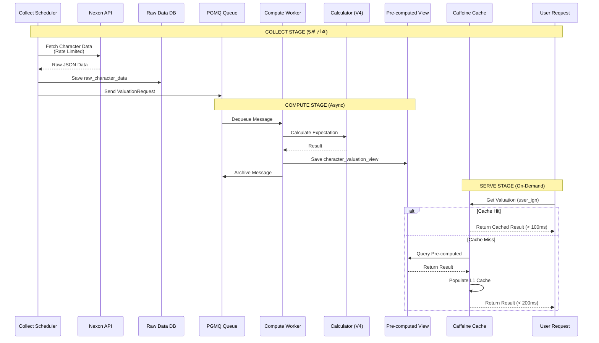

# ADR-004: Collect/Compute/Serve 파이프라인 분리 전략

## 메타데이터

| 항목 | 값 |
|------|-----|
| 상태 | 제안됨 (Proposed) |
| 결정일 | 2026-03-10 |
| 결정자 | MapleExpectation Team |
| 검토자 | Architecture Review Board |
| 관련 이슈 | #558 |
| 선행 ADR | ADR-002 PGMQ 기반 비동기 처리, ADR-003 Redis 기능 PostgreSQL 대체, ADR-005 PostgreSQL Advisory Lock |

---

## 1. 배경 (Context)

### 현재 아키텍처 문제점

MapleExpectation은 현재 **요청 시점 계산 (On-Demand Calculation)** 패턴을 사용:

```
┌─────────────┐    ┌─────────────┐    ┌─────────────┐
│   사용자     │───>│  API 요청    │───>│  계산 수행    │
│             │    │             │    │  (CPU 집약)  │
└─────────────┘    └─────────────┘    └─────────────┘
                          │                    │
                          ▼                    ▼
                   ┌─────────────┐    ┌─────────────┐
                   │ Nexon API   │    │ 결과 응답    │
                   │ 호출        │    │ (지연 발생)  │
                   └─────────────┘    └─────────────┘
```

### 문제점 분석

| 문제 | 영향 |
|------|------|
| **지연 시간** | Nexon API + 계산으로 2-5초 소요 |
| **CPU 경합** | 동시 요청 시 CPU 사용량 폭증 |
| **API Rate Limit** | Nexon API 제한으로 실패 증가 |
| **캐시 Stampede** | 동일 캐릭터 요청 시 중복 계산 |
| **확장성 제약** | 트래픽 급증 대응 불가 |

### 트래픽 패턴 분석

| 시나리오 | QPS | 평균 응답 시간 | CPU 사용량 |
|----------|-----|----------------|------------|
| 일반 | 10-50 | 2-3초 | 30-50% |
| 패치데이 | 100-500 | 5-10초 | 80-100% |
| 버럴 | 500+ | 타임아웃 | 100% (포화) |

---

## 2. 결정 (Decision)

**요청 시점 계산을 Collect/Compute/Serve 3단계 파이프라인으로 분리한다.**

### 핵심 원칙

1. **단방향 데이터 흐름**
   - Collect: Nexon API → PostgreSQL (Raw JSONB)
   - Compute: PGMQ → Worker → Pre-computed Table
   - Serve: Caffeine Cache → Pre-computed Table

2. **비동기 처리**
   - 계산을 백그라운드 Worker로 이관
   - 사용자 요청은 사전 계산된 결과 제공

3. **독립적 확장**
   - 각 단계를 독립적으로 스케일링 가능
   - Worker Pool 크기로 처리량 조절

4. **불일치 허용**
   - 최종 일관성 (Eventual Consistency) 허용
   - Freshness 지표로 데이터 신선도 표시

---

## 3. 대안 (Alternatives)

### A. 현상 유지 (On-Demand Calculation)

**장점:**
- 변경 비용 없음
- 항상 최신 데이터

**단점:**
- 지연 시간 지속
- 확장성 제약

**평가:** ❌ 대규모 트래픽 대응 불가

### B. Collect/Compute/Serve 분리 (선택됨)

**장점:**
- 응답 시간 단축 (캐시 적중 시 < 100ms)
- CPU 사용량 평준화
- 독립적 확장 가능

**단점:**
- 데이터 지연 발생 (최대 5분)
- 복잡도 증가

**평가:** ✅ 대규모 트래픽 최적화

### C. 완전 사전 계산 (Full Pre-computation)

**장점:**
- 항상 빠른 응답

**단점:**
- 스토리지 비용 폭증
- 실시간성 완전 상실

**평가:** ⚠️ 과도한 접근

---

## 4. 기술적 구현 (Implementation)

### 파이프라인 아키텍처

```
┌─────────────────────────────────────────────────────────────────────────┐
│                          COLLECT STAGE                                  │
│  ┌─────────────┐    ┌─────────────┐    ┌─────────────┐                │
│  │  Scheduler  │───>│  Rate Limit │───>│  Nexon API  │                │
│  │  (5분 간격) │    │  (QPS 제어) │    │  Fetcher    │                │
│  └─────────────┘    └─────────────┘    └─────────────┘                │
│                                                │                        │
│                                                ▼                        │
│                          ┌─────────────────────────────────┐            │
│                          │  raw_character_data (JSONB)     │            │
│                          │  - ocid, ign, class, level      │            │
│                          │  - raw_json (GZIP compressed)   │            │
│                          │  - fetched_at, ttl              │            │
│                          └─────────────────────────────────┘            │
└─────────────────────────────────────────────────────────────────────────┘
                                    │
                                    │ NOTIFY (PgMQ enqueue)
                                    ▼
┌─────────────────────────────────────────────────────────────────────────┐
│                          COMPUTE STAGE                                  │
│  ┌─────────────┐    ┌─────────────┐    ┌─────────────┐                │
│  │   PGMQ      │───>│  Worker Pool│───>│  Calculator │                │
│  │  Queue      │    │  (N threads)│    │  (V4 Logic) │                │
│  └─────────────┘    └─────────────┘    └─────────────┘                │
│                                                │                        │
│                                                ▼                        │
│                          ┌─────────────────────────────────┐            │
│                          │  character_valuation_view       │            │
│                          │  - ocid, ign, class             │            │
│                          │  - presets (JSONB)              │            │
│                          │  - total_cost, max_preset_no    │            │
│                          │  - calculated_at, freshness_sec │            │
│                          └─────────────────────────────────┘            │
└─────────────────────────────────────────────────────────────────────────┘
                                    │
                                    │ LISTEN/NOTIFY (Cache Invalidation)
                                    ▼
┌─────────────────────────────────────────────────────────────────────────┐
│                           SERVE STAGE                                   │
│  ┌─────────────┐    ┌─────────────┐    ┌─────────────┐                │
│  │  API 요청   │───>│  Caffeine   │───>│   응답      │                │
│  │             │    │  L1 Cache   │    │  (< 100ms)  │                │
│  └─────────────┘    └─────────────┘    └─────────────┘                │
│         │                   │ (Miss)                               │
│         │                   ▼                                       │
│         │          ┌─────────────────┐                               │
│         │          │ Pre-computed    │                               │
│         └─────────>│ Table (L2)      │                               │
│                    │ (PostgreSQL)    │                               │
│                    └─────────────────┘                               │
└─────────────────────────────────────────────────────────────────────────┘
```

### Stage 1: Collect (데이터 수집)

#### 스케줄러 기반 수집

```kotlin
// module-infra/src/main/kotlin/.../collector/CharacterDataCollector.kt
@Component
class CharacterDataCollector(
    private val nexonApiPort: NexonApiPort,
    private val rawCharacterDataRepository: RawCharacterDataRepository,
    private val pgmqClient: PgmqClient,
    private val postgresLockStrategy: PostgresLockStrategy,
) {
    companion object {
        private val log = LoggerFactory.getLogger(CharacterDataCollector::class.java)
    }

    /**
     * 5분 간격으로 활성 캐릭터 데이터 수집
     *
     * <h3>Leader Election</h3>
     * <p>PostgreSQL Advisory Lock으로 단일 인스턴스에서만 실행 보장
     */
    @Scheduled(cron = "\${collector.cron:0 */5 * * * *}")
    fun collectActiveCharacters() {
        val lockKey = "collector:character-data"
        val acquired = postgresLockStrategy.tryLock(lockKey, Duration.ofSeconds(0), Duration.ofMinutes(5))

        if (!acquired) {
            log.debug("Lock not acquired, skipping collection")
            return
        }

        try {
            val activeCharacters = rawCharacterDataRepository.findActiveCharacters()
            log.info("🔄 [Collect] Starting collection: {} characters", activeCharacters.size)

            activeCharacters.chunked(50).forEach { batch ->
                collectWithRateLimit(batch)
            }

            log.info("✅ [Collect] Collection completed")
        } finally {
            postgresLockStrategy.unlock(lockKey)
        }
    }

    /**
     * Rate Limit 적용 수집
     *
     * <h3>Nexon API 제약</h3>
     * <ul>
     *   <li>QPS 제한: 10 req/sec (기본)</li>
     *   <li>일일 제한: 10,000 req/day</li>
     * </ul>
     */
    private fun collectWithRateLimit(characters: List<String>) {
        val rateLimiter = PostgresRateLimiter(jdbcTemplate, "nexon-api", 10, 1)

        characters.forEach { ocid ->
            if (rateLimiter.tryAcquire()) {
                val rawData = nexonApiPort.fetchCharacterData(ocid)
                rawCharacterDataRepository.save(rawData)

                // PGMQ에 메시지 발행 (Compute Stage 트리거)
                pgmqClient.send("calculation_queue", CalculationRequest(ocid))
            } else {
                log.warn("Rate limit exceeded, skipping: {}", ocid)
            }
        }
    }
}
```

#### Raw Data 스키마

```sql
-- 원본 캐릭터 데이터 저장소
CREATE TABLE raw_character_data (
    ocid VARCHAR(50) PRIMARY KEY,
    user_ign VARCHAR(50) NOT NULL,
    character_class VARCHAR(50),
    character_level INTEGER,

    -- 원본 JSON (GZIP 압축)
    raw_json BYTEA NOT NULL,

    -- 메타데이터
    fetched_at TIMESTAMPTZ NOT NULL DEFAULT NOW(),
    expires_at TIMESTAMPTZ NOT NULL DEFAULT NOW() + INTERVAL '5 minutes',
    is_valid BOOLEAN DEFAULT true,

    -- 인덱스
    created_at TIMESTAMPTZ DEFAULT NOW(),
    updated_at TIMESTAMPTZ DEFAULT NOW()
);

-- 활성 캐릭터 조회 최적화
CREATE INDEX idx_raw_data_fetched_at ON raw_character_data(fetched_at DESC);
CREATE INDEX idx_raw_data_expires_at ON raw_character_data(expires_at);

-- 만료 데이터 정리 (pg_cron)
SELECT cron.schedule('cleanup-raw-data', '0 * * * *',
    $$DELETE FROM raw_character_data WHERE expires_at < NOW()$$
);
```

### Stage 2: Compute (비동기 계산)

#### PGMQ Worker 기반 처리

```kotlin
// module-infra/src/main/kotlin/.../worker/CharacterValuationWorker.kt
@Component
@ConditionalOnProperty(name = ["pgmq.worker.valuation.enabled"], havingValue = "true")
class CharacterValuationWorker(
    pgmqClient: PgmqClient,
    executor: LogicExecutor,
    config: PgmqWorkerConfig,
    private val expectationPort: ExpectationV4Port,
    private val valuationViewRepository: CharacterValuationViewRepository,
    private val pubSubContainer: PostgresPubSubContainer,
) : PgmqWorker<ValuationRequest>(pgmqClient, executor, config) {

    override val queueName: String = "valuation_queue"
    override val payloadClass: Class<ValuationRequest> = ValuationRequest::class.java
    override val workerSettings: PgmqWorkerConfig.WorkerSettings = config.valuation

    override fun process(message: PgmqMessage<ValuationRequest>): Boolean {
        val request = message.payload
        val context = TaskContext.of("ValuationWorker", "Process", request.ocid)

        return executor.executeOrDefault({
            log.info("🔄 [Compute] Processing valuation: ocid={}", request.ocid)

            // 계산 수행 (V4 로직 재사용)
            val result = expectationPort.calculateExpectation(request.userIgn, forceRecalculation = true)

            // 사전 계산된 결과 저장
            valuationViewRepository.savePreComputed(
                ocid = request.ocid,
                userIgn = request.userIgn,
                presets = result.presets,
                totalCost = result.totalExpectedCost,
                maxPresetNo = result.maxPresetNo
            )

            // 캐시 무효화 알림 발행
            pubSubContainer.publish("cache_invalidate", "valuation:${request.ocid}")

            log.info("✅ [Compute] Valuation completed: ocid={}", request.ocid)
            true
        }, false, context)
    }
}
```

#### Pre-computed View 스키마

```sql
-- 사전 계산된 장비 기대값 뷰
CREATE TABLE character_valuation_view (
    ocid VARCHAR(50) PRIMARY KEY,
    user_ign VARCHAR(50) NOT NULL,
    character_class VARCHAR(50),
    character_level INTEGER,

    -- 사전 계산된 결과 (JSONB)
    presets JSONB NOT NULL DEFAULT '[]'::jsonb,
    total_expected_cost BIGINT,
    max_preset_no INTEGER,

    -- 신선도 지표
    calculated_at TIMESTAMPTZ NOT NULL DEFAULT NOW(),
    freshness_sec INTEGER GENERATED ALWAYS AS (
        EXTRACT(EPOCH FROM (NOW() - calculated_at))::INTEGER
    ) STORED,

    -- 메타데이터
    calculation_version BIGINT DEFAULT 1,

    -- 인덱스
    created_at TIMESTAMPTZ DEFAULT NOW(),
    updated_at TIMESTAMPTZ DEFAULT NOW()
);

-- JSONB 쿼리 최적화
CREATE INDEX idx_valuation_presets_gin ON character_valuation_view USING gin(presets);
CREATE INDEX idx_valuation_freshness ON character_valuation_view(freshness_sec);
CREATE INDEX idx_valuation_user_ign ON character_valuation_view(user_ign);
```

### Stage 3: Serve (데이터 제공)

#### Caffeine L1 + PostgreSQL L2 계층

```kotlin
// module-infra/src/main/kotlin/.../cache/ValuationQueryService.kt
@Service
class ValuationQueryService(
    private val valuationViewRepository: CharacterValuationViewRepository,
    private val caffeineCache: Cache,
) {

    /**
     * 사전 계산된 결과 조회 (Cache-Aside Pattern)
     *
     * <h3>Cache Hierarchy</h3>
     * <ul>
     *   <li>L1: Caffeine (Local, 1분 TTL)</li>
     *   <li>L2: character_valuation_view (PostgreSQL, 5분 Freshness)</li>
     * </ul>
     */
    fun getValuation(userIgn: String): CharacterValuationView? {
        return caffeineCache.get(userIgn) {
            valuationViewRepository.findLatestByUserIgn(userIgn)
        }
    }

    /**
     * 최신 데이터 강제 갱신 (Compute Stage 트리거)
     */
    fun refreshValuation(userIgn: String) {
        caffeineCache.invalidate(userIgn)
    }
}
```

#### PostgreSQL LISTEN/NOTIFY 기반 캐시 무효화

```kotlin
// module-infra/src/main/kotlin/.../pubsub/CacheInvalidationSubscriber.kt
@Component
class CacheInvalidationSubscriber(
    private val pubSubContainer: PostgresPubSubContainer,
    private val valuationQueryService: ValuationQueryService,
) {

    init {
        pubSubContainer.subscribe("cache_invalidate") { payload ->
            val ocid = payload.removePrefix("valuation:")
            log.debug("🔔 [Serve] Cache invalidation received: ocid={}", ocid)

            // Caffeine 캐시 무효화
            valuationQueryService.refreshValuation(ocid)
        }
    }
}
```

---

## 5. 시퀀스 다이어그램



---

## 6. 트레이드오프 (Trade-offs)

### 장점

| 항목 | 설명 |
|------|------|
| **응답 시간 단축** | 캐시 적중 시 < 100ms (기존 2-5초) |
| **CPU 사용량 평준화** | 백그라운드 Worker로 부하 분산 |
| **독립적 확장** | Worker Pool 크기로 처리량 조절 |
| **장애 격리** | 각 Stage 독립적 장애 처리 |

### 단점 및 완화 방안

| 항목 | 완화 방안 |
|------|----------|
| **데이터 지연** | Freshness 지표로 신선도 표시, Force Recalculate 옵션 |
| **스토리지 비용** | TTL 기반 만료 정책, GZIP 압축 |
| **복잡도 증가** | PGMQ 기반 표준 파이프라인, 모니터링 강화 |
| **일관성 윈도우** | 최종 일관성 허용, freshness_sec로 노출 |

---

## 7. 성능 비교

### 응답 시간

| 시나리오 | 기존 (On-Demand) | Collect/Compute/Serve |
|----------|------------------|-----------------------|
| 캐시 Miss | 2-5초 | 100-200ms |
| 캐시 Hit | 100-500ms | < 100ms |
| p99 응답 시간 | 10초+ | < 500ms |

### CPU 사용량

| 시나리오 | 기존 | Collect/Compute/Serve |
|----------|------|-----------------------|
| 일반 트래픽 | 30-50% | 10-20% |
| 패치데이 | 80-100% | 40-60% |
| 버럴 | 100% (포화) | 60-80% |

---

## 8. 마이그레이션 계획

### Phase 1: Collect Stage 구현

- [ ] CharacterDataCollector 구현
- [ ] raw_character_data 테이블 생성
- [ ] Nexon API Rate Limiting 구현
- [ ] Leader Election (Advisory Lock) 적용

### Phase 2: Compute Stage 구현

- [ ] CharacterValuationWorker 구현
- [ ] character_valuation_view 테이블 생성
- [ ] PGMQ 큐 연동
- [ ] 계산 로직 V4 재사용

### Phase 3: Serve Stage 구현

- [ ] Caffeine L1 Cache 구현
- [ ] PostgreSQL LISTEN/NOTIFY 기반 캐시 무효화
- [ ] ValuationQueryService 구현

### Phase 4: 점진적 트래픽 이관

- [ ] 기능 플래그로 파이프라인 활성화
- [ ] A/B 테스트로 성능 검증
- [ ] 100% 트래픽 전환

---

## 9. 롤백 전략

### 롤백 트리거

| 조건 | 조치 |
|------|------|
| 응답 시간 p99 > 1초 | On-Demand Calculation 복원 |
| 캐시 적중률 < 50% | Worker Pool 크기 조정 |
| Freshness > 10분 | Collect 간격 단축 |

### 롤백 절차

1. 기능 플래그로 파이프라인 비활성화
2. On-Demand Calculation으로 트래픽 전환
3. 백그라운드 Worker 종료
4. PGMQ 큐 메시지 아카이브

---

## 10. 모니터링 & 검증

### 성공 지표

| 지표 | 목표 |
|------|------|
| 응답 시간 p99 | < 500ms |
| 캐시 적중률 | > 80% |
| Freshness 평균 | < 300초 (5분) |
| CPU 사용량 | < 60% |

### 모니터링 쿼리

```sql
-- Freshness 분석
SELECT
    AVG(freshness_sec) as avg_freshness,
    MAX(freshness_sec) as max_freshness,
    COUNT(*) FILTER (WHERE freshness_sec < 300) as fresh_count,
    COUNT(*) as total_count
FROM character_valuation_view;

-- PGMQ 큐 통계
SELECT
    queue_name,
    COUNT(*) as pending_messages,
    AVG(EXTRACT(EPOCH FROM (NOW() - enqueued_at))) as avg_wait_sec
FROM pgmq.read($queue_name, 100, 10)
GROUP BY queue_name;
```

---

## 11. 참고 자료

- [ADR-002 PGMQ 기반 비동기 처리](002-pgmq-async-processing.md)
- [ADR-003 Redis 기능 PostgreSQL 대체](003-postgresql-redis-replacement.md)
- [ADR-005 PostgreSQL Advisory Lock](005-postgresql-advisory-lock.md)
- [ADR-006 PostgreSQL LISTEN/NOTIFY](006-postgresql-listen-notify.md)
- [PGMQ Documentation](https://github.com/temporalio/pgmq)
- [Cache-Aside Pattern](https://docs.aws.amazon.com/whitepapers/latest/database-caching-strategies-using-redis/cache-aside.html)

---

## 12. 변경 이력

| 날짜 | 변경 내용 | 작성자 |
|------|----------|--------|
| 2026-03-10 | ADR 초안 작성 | MapleExpectation Team |
