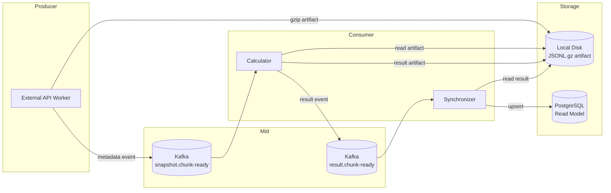

# Kafka 기반 대용량 게임 캐릭터 장비 기대값 파이프라인

> External API → Calculator → Synchronizer → PostgreSQL Materialization  
> 24시간 무중단 endurance test 검증 완료

---

## 1. 프로젝트 개요

외부 게임 API에서 캐릭터 장비 정보를 수집하고, 장비별 기대값 총비용을 계산하여 PostgreSQL read model에 materialization하는 이벤트 드리븐 파이프라인.

한국 메이플스토리의 캐릭터 장비에 부여되는 "추가 옵션"은 랜덤 수치를 가지며, 각 수치별 등장 확률과 시장 가격을 기반으로 기대값을 산정한다. 전체 유저 pool(~28만명)의 장비를 대상으로 하루에도 여러 번 스냅샷을 찍어야 하므로, 대용량 처리가 핵심 요구사항이다.

---

## 2. 문제 정의

### 배경

- 외부 API(Nexon Open API)에서 캐릭터 기본정보 + 장비 정보를 조회
- 장비 정보에 포함된 추가옵션(slots)별 기대값을 계산
- 결과를 사용자가 웹에서 조회 가능해야 함

### 도전 과제

| 과제 | 이유 |
|------|------|
| **payload 크기** | 유저당 장비 최대 22개, 전체 28만명 → JSON 수 GB |
| **API rate limit** | 외부 API 초당 호출 제한 존재 |
| **파이프라인 안정성** | chunk 단위 처리 중 장애 시 재시도/재개 필요 |
| **디스크 관리** | GB 단위 artifact가 지속적으로 축적 |
| **정합성** | External API → Calculator → Synchronizer 간 데이터 무손실 |

---

## 3. 아키텍처



### Claim Check Pattern

핵심 설계 결정: **Kafka에 payload를 싣지 않고 disk에 저장 후 metadata만 전달.**

```
Producer → disk에 JSONL.gz 저장 → Kafka에 objectKey + chunk metadata 전송
Consumer → Kafka에서 objectKey 수신 → disk에서 읽어 처리
```

**왜:** Kafka broker의 디스크와 메모리를 보호하기 위해. GB 단위 payload가 Kafka에 들어가면 broker 장애의 직접적 원인이 됨. 특히 Confluent Kafka의 retention 정책과 결합되면 디스크 full로 전체 pipeline이 멈추는 사태가 발생할 수 있음.

---

## 4. Chunk Processing 전략

### 배치 단위

External API가 1,500명 단위로 유저를 묶어 snapshot을 생성한다.

```
runId: 20260513-083307
├── character-basic/
│   └── chunks/part-000001.jsonl.gz  (1,500 rows, ~8MB compressed)
├── item-equipment/
│   └── chunks/part-000001.jsonl.gz  (1,500 rows, ~8MB compressed)
└── ocid-lookup/
    └── ocid-cache.jsonl
```

### 처리 흐름

1. **External API**: 유저 1,500명 단위로 character_basic + item_equipment API 호출 → JSONL 작성 → gzip 압축 → disk 저장 → Kafka에 chunk-ready 이벤트 발행
2. **Calculator**: chunk-ready 이벤트 수신 → disk에서 gzip 읽기 → 장비별 기대값 계산 → 결과 JSONL.gz 저장 → result chunk-ready 이벤트 발행
3. **Synchronizer**: result 이벤트 수신 → gzip 읽기 → OCID+presetNo 단위 jsonb document 빌드 → PostgreSQL staging bulk insert → main table upsert → staging cleanup

### 병렬 제어

- Calculator: `Semaphore(2)` — 최대 2개 chunk 동시 처리
- Synchronizer: 순차 처리 (1 chunk at a time, DB upsert가 병목)

---

## 5. Retry / Replay 전략

### 재시도

- Kafka consumer는 비즈니스 로직 성공 후에만 ACK
- 처리 실패 시 ACK 하지 않음 → visibility timeout 후 자동 재전달
- DLQ(Dead Letter Queue) 미사용 — transient failure는 재시도로 해결

### Replay

Calculator는 idempotency key로 `resultObjectKey`를 사용:

```kotlin
val resultObjectKey = "data/calculator/runs/${runId}/${endpoint}/chunks/result-${chunkId}.jsonl.gz"
if (objectStorage.exists(resultObjectKey)) {
    // 이미 처리된 chunk — 결과만 재발행하고 스킵
    resultEventPublisher.publishChunkReady(...)
    return
}
```

이벤트가 중복 수신되어도 동일 결과 파일이 존재하면 재계산하지 않고 이벤트만 재발행. Synchronizer도 동일한 read_key에 대한 upsert이므로 멱등.

---

## 6. Idempotency 전략

| 모듈 | Idempotency Key | 방식 |
|------|-----------------|------|
| Calculator | `result-{runId}-{endpoint}-{chunkId}.jsonl.gz` | 파일 존재 여부 체크 |
| Synchronizer staging | `(run_id, chunk_id, read_key)` | 복합 PK |
| Synchronizer main | `read_key` | `INSERT ... ON CONFLICT (read_key) DO UPDATE` |

Upsert는 PostgreSQL의 `ON CONFLICT`를 활용. 동일 read_key에 대해 여러 번 upsert해도 최종 상태만 반영.

---

## 7. Observability 전략

### Prometheus 메트릭 계층

각 모듈에 3종류 메트릭을 적용:

| 종류 | 용도 | 예시 |
|------|------|------|
| **Counter** (cumulative) | 누적 처리량 | `calculator_items_calculated_total` |
| **DistributionSummary** | chunk별 분포 | `synchronizer_pre_upsert_compressed_bytes_summary` |
| **Gauge** | 실시간 상태 | `calculator_chunk_users_per_second` |

### 메트릭 네이밍 컨벤션

```
{module}_{entity}_{metric}_{unit}

예:
external_api_snapshot_compressed_bytes_total      (Counter)
external_api_snapshot_compression_ratio           (DistributionSummary)
calculator_chunk_users_per_second                  (Gauge)
synchronizer_pre_upsert_json_rows_total            (Counter)
```

### Cardinality 제어

- `runId`, `chunkId`는 Prometheus label에 포함하지 않음 (고카디널리티)
- 로그에만 포함: `[calculatorArtifactVolume] runId=xxx chunkId=xxx`
- metric tag는 `application` label만 사용

### Volume Metrics

데이터 볼륨을 Counter + DistributionSummary로 이중 추적:

```
# 누적 (Counter)
external_api_snapshot_compressed_bytes_total     2.09E11
external_api_snapshot_uncompressed_bytes_total   3.00E12

# chunk별 분포 (DistributionSummary)
external_api_snapshot_compression_ratio_count    26037
external_api_snapshot_compression_ratio_sum      372082
```

이를 통해 압축률 평균(14.3x)과 chunk별 편차를 동시에 파악 가능.

---

## 8. Prometheus Metric 설계

### External API

| 메트릭 | 타입 | 설명 |
|--------|------|------|
| `external_api_users_fetched_total` | Counter | 전체 유저 fetch 수 |
| `external_api_users_failed_total` | Counter | 전체 유저 실패 수 |
| `external_api_item_equipment_fetched_total` | Counter | ITEM_EQUIPMENT 성공 |
| `external_api_item_equipment_failed_total` | Counter | ITEM_EQUIPMENT 실패 |
| `external_api_snapshot_compressed_bytes_total` | Counter | 압축 바이트 누적 |
| `external_api_snapshot_uncompressed_bytes_total` | Counter | 비압축 바이트 누적 |
| `external_api_snapshot_json_rows_total` | Counter | JSON row 수 누적 |
| `external_api_snapshot_compression_ratio` | DistributionSummary | chunk별 압축률 |

### Calculator

| 메트릭 | 타입 | 설명 |
|--------|------|------|
| `calculator_chunks_processed_total` | Counter | 처리 chunk 수 |
| `calculator_items_calculated_total` | Counter | 계산 완료 item 수 |
| `calculator_items_errored_total` | Counter | 계산 에러 item 수 |
| `calculator_chunk_users_per_second` | Gauge | 순간 유저 처리율 |
| `calculator_chunk_items_per_second` | Gauge | 순간 아이템 처리율 |
| `calculator_input_compressed_bytes_total` | Counter | 입력 압축 바이트 |
| `calculator_input_uncompressed_bytes_total` | Counter | 입력 비압축 바이트 |
| `calculator_result_compressed_bytes_total` | Counter | 결과 압축 바이트 |
| `calculator_result_uncompressed_bytes_total` | Counter | 결과 비압축 바이트 |
| `calculator_result_json_rows_total` | Counter | 결과 JSON row 수 |
| `calculator_result_compression_ratio` | DistributionSummary | 결과 chunk별 압축률 |

### Synchronizer

| 메트릭 | 타입 | 설명 |
|--------|------|------|
| `synchronizer_chunks_processed_total` | Counter | 처리 chunk 수 |
| `synchronizer_chunks_failed_total` | Counter | 실패 chunk 수 |
| `synchronizer_documents_processed_total` | Counter | 처리 document 수 |
| `synchronizer_items_processed_total` | Counter | 처리 item 수 |
| `synchronizer_chunk_duration_seconds` | Timer | chunk 처리 시간 |
| `synchronizer_file_read_duration_seconds` | Timer | 파일 읽기 시간 |
| `synchronizer_document_build_duration_seconds` | Timer | document 빌드 시간 |
| `synchronizer_main_upsert_duration_seconds` | Timer | DB upsert 시간 |
| `synchronizer_pre_upsert_compressed_bytes_total` | Counter | pre-upsert 압축 바이트 |
| `synchronizer_pre_upsert_uncompressed_bytes_total` | Counter | pre-upsert 비압축 바이트 |
| `synchronizer_pre_upsert_json_rows_total` | Counter | pre-upsert JSON row 수 |
| `synchronizer_pre_upsert_compression_ratio` | DistributionSummary | 압축률 분포 |

---

## 9. 24시간 Endurance Test 결과

### 테스트 환경

- **플랫폼**: 단일 로컬 머신 (Linux, 387GB SSD)
- **Kafka**: Confluent Kafka 8.2.0-ccs (Docker)
- **PostgreSQL**: 동일 머신
- **JVM**: 각 모듈 -Xmx1g -Xms512m
- **코어 모듈**: External API (:8081), Calculator (:8082), Synchronizer (:8083)

### 누적 처리량

| 지표 | External API | Calculator | Synchronizer |
|------|-------------|------------|--------------|
| **uptime** | 24.3h | 24.2h | 24.2h |
| **users processed** | 13,230,859 | 12,943,713 | — |
| **items processed** | — | 908,465,376 | 906,850,794 |
| **documents processed** | — | — | 38,737,824 |
| **chunks processed** | 26,037 | 25,895 | 25,848 |
| **chunks failed** | — | 0 | 1 |
| **users failed** | 364 | — | — |

### 데이터 볼륨

| 지표 | External API | Calculator 입력 | Calculator 결과 | Synchronizer |
|------|-------------|----------------|-----------------|--------------|
| **압축 (GB)** | 194.8 | 194.6 | 21.1 | 21.0 |
| **비압축 (TB)** | 2.73 | 2.73 | 0.45 | 0.45 |
| **JSON rows** | 13.2M | 13.2M | 908.5M | 906.9M |
| **압축률** | 14.3x | 14.3x | 21.2x | 21.2x |

### 데이터 정합성

파이프라인 3단계 간 볼륨 일치율:

```
EA 194.8 GB → Calc 입력 194.6 GB → Calc 결과 21.1 GB → Sync 21.0 GB
                    (99.9%)              (100%)            (99.5%)
```

차이는 1건의 Synchronizer 실패 chunk (총 25,848개 중 1개 = 0.004%)에서 기인.

### 순간 처리율

| 모듈 | users/sec | items/sec |
|------|-----------|-----------|
| Calculator (순간 최대) | **264** | **18,308** |
| Synchronizer (활성) | **~191** | ~12,000 |
| 파이프라인 평균 | **~180** | ~12,000 |

### 단계별 지연

| Synchronizer 단계 | avg 시간 |
|-------------------|----------|
| file read (gzip) | 0.53s |
| document build | 0.11s |
| main upsert (DB) | 2.12s |
| **chunk total** | **2.77s** |

### JVM 안정성

| 지표 | EA | Calculator | Synchronizer |
|------|-----|-----------|--------------|
| **Full GC** | 0 | 0 | 0 |
| **Minor GC** | 37,057 | 41,509 | 21,338 |
| **Live Data** | 203 MB | 340 MB | 138 MB |
| **Heap Max** | ~6.3 GB | ~6.3 GB | ~6.3 GB |
| **Heap 사용률** | ~3% | ~5% | ~2% |

G1 Young GC만 발생, Full GC 0회. Heap plateau 안정.

### Connection Pool

| 지표 | Calculator | Synchronizer |
|------|-----------|--------------|
| **HikariCP max** | 10 | 3 |
| **active** | 0 | 0 |
| **idle** | 10 | 2 |
| **pending** | **0** | **0** |
| **timeout** | **0** | **0** |

24시간 동안 connection starvation 없음.

### Kafka Consumer Lag

| Consumer | Partition | Lag |
|----------|-----------|-----|
| Calculator (snapshot.chunk-ready) | 0 | **0** |
| Calculator (snapshot.chunk-ready) | 1 | **0** |
| Synchronizer (result.chunk-ready) | 0 | **0** |
| Synchronizer (result.chunk-ready) | 1 | **0** |
| Synchronizer (result.chunk-ready) | 2 | **0** |

모든 partition lag = 0. Consumer group rebalance 없음.

---

## 10. 병목 분석

### 현재 병목: Synchronizer DB upsert

```
Synchronizer chunk 처리 시간 분해:
├── file read:     0.53s (19%)
├── document build: 0.11s (4%)
└── main upsert:   2.12s (77%)  ← 병목
                   ─────
             total: 2.77s
```

DB upsert가 chunk 처리 시간의 77%를 차지. 원인:
- PostgreSQL `INSERT ... ON CONFLICT DO UPDATE` on jsonb column
- chunk당 ~1,500 documents, 각 document에 평균 19개 equipment item
- 단일 Synchronizer 인스턴스가 순차 처리

### 병목 완화 방안

| 방안 | 예상 효과 | Trade-off |
|------|-----------|-----------|
| Synchronizer 인스턴스 수평 확장 | upsert 처리율 N배 | DB connection 증가 |
| Batch upsert 최적화 (UNLOGGED staging) | I/O 감소 | 장애 시 staging 데이터 유실 가능 |
| Chunk 병렬 처리 (Semaphore(N)) | 처리율 N배 | DB 동시성 증가 |

---

## 11. 장애 사례 및 대응

### Case 1: Kafka Broker Disk Full

**발생:** 파이프라인 17시간 경과 후 Kafka broker disk full로 인한 publish 실패.

**원인:** Confluent Kafka의 `log.retention.bytes`와 `log.segment.bytes`가 미설정. GB 단위의 이벤트가 log segment에 무한 축적됨.

**식별 과정:**
1. External API는 정상 동작하나 Calculator가 이벤트를 수신하지 못함
2. Kafka topic depth = 0이나 새 이벤트가 publish되지 않음
3. Kafka broker 로그에서 `No space left on device` 확인

**대응:**
```yaml
# docker-compose.yml
KAFKA_LOG_RETENTION_HOURS: 48
KAFKA_LOG_RETENTION_BYTES: 10737418240    # 10GB
KAFKA_LOG_SEGMENT_BYTES: 1073741824       # 1GB
```

**교훈:** Claim Check Pattern으로 Kafka에서 payload를 분리했음에도, **event metadata 자체의 축적**이 broker를 죽일 수 있음. Retention 설정은 필수.

### Case 2: Artifact Disk Accumulation

**발생:** 동일 파이프라인에서 약 120GB의 압축 artifact가 디스크에 축적.

**원인:** Artifact cleanup 스케줄러의 retention 정책 버그. "최근 5개 run 보존" 조건이 시간 기반 삭제보다 우선하여, 12시간이 지난 데이터도 삭제되지 않음.

**원래 코드:**
```kotlin
// 삭제 = !isRunning && !recentTop5 && 12h초과 (AND)
return runs.filter { run ->
    !run.isRunning
        && run.runId !in recentRunIds   // ← 문제: 시간이 지나도 recent 5 안에 들면 삭제 안 됨
        && run.createdAt.isBefore(cutoff)
}
```

**수정:**
```kotlin
// 삭제 = !isRunning && 12h초과 (시간 경과 시 무조건 삭제)
return runs.filter { run ->
    !run.isRunning && run.createdAt.isBefore(cutoff)
}
```

**교훈:** 보존 정책에서 "최근 N개"와 "시간 경과"의 우선순위를 명확히 해야 함. 시간이 절대적 기준이 되어야 하는 환경에서는 개수 기반 보존이 시간 기반 삭제를 방해하면 안 됨.

### Case 3: Synchronizer chunk bytes 버그

**발생:** Synchronizer의 `recordChunkSize()`에 documents 개수(`documents.size.toLong()`)를 바이트 인수로 전달.

**원인:** 코드 리뷰 누락. `event.compressedBytes`를 사용해야 할 곳에 `documents.size.toLong()` 사용.

**영향:** 메트릭상 압축 바이트가 실제보다 과소 측정됨. 비즈니스 로직에는 영향 없음.

**수정:** `documents.size.toLong()` → `event.compressedBytes`

---

## 12. 향후 개선 방향

### 단기

| 항목 | 설명 |
|------|------|
| **Cleanup 독립 모듈화** | 스케줄러를 별도 크론잡 모듈로 분리 |
| **Synchronizer 수평 확장** | 다중 인스턴스 + chunk 병렬 처리 |
| **Consumer Lag 알림** | Grafana alerting으로 lag > 0 감지 |

### 중기

| 항목 | 설명 |
|------|------|
| **Object Storage 추상화** | Local disk → S3/MinIO 전환으로 수평 확장 대응 |
| **Calculator 결과 캐시** | 동일 chunk 재계산 방지 강화 |
| **DLQ 도입** | 영구 실패 chunk를 Dead Letter Queue로 격리 |

### 장기

| 항목 | 설명 |
|------|------|
| **Kubernetes 배포** | 모듈별 독립 스케일아웃 |
| **실시간 스트리밍** | Batch chunk → Micro-batch / Streaming 전환 검토 |
| **Cross-region 복제** | PostgreSQL read model 다중 지역 복제 |

---

## 13. Trade-offs

### Claim Check Pattern 선택

| 선택 | 얻은 것 | 포기한 것 |
|------|---------|-----------|
| Disk artifact + Kafka metadata | Kafka broker 안정성, TB급 payload 처리 | Disk I/O 의존, 로컬 디스크 관리 부담 |

### Chunk 기반 배치 (1,500 rows/chunk)

| 선택 | 얻은 것 | 포기한 것 |
|------|---------|-----------|
| 고정 크기 chunk | 일정한 메모리 사용, 재시도 단위 명확 | chunk 경계에서 파티셔닝 불균형 가능 |

### Synchronizer 순차 처리

| 선택 | 얻은 것 | 포기한 것 |
|------|---------|-----------|
| 1 chunk at a time | DB 동시성 제어 단순, 정합성 보장 | 처리율 상한 (실제 병목) |

### gzip 압축 (JSONL.gz)

| 선택 | 얻은 것 | 포기한 것 |
|------|---------|-----------|
| gzip JSONL | 14~21x 압축률, disk 절약 | 압축/해제 CPU 비용 |

### 단일 머신 배포

| 선택 | 얻은 것 | 포기한 것 |
|------|---------|-----------|
| 로컬 디스크 + 단일 인스턴스 | 운영 복잡도 최소, 네트워크 I/O 제로 | 수평 확장 불가, SPOF |

---

## 14. 면접 예상 질문

### Q1: "Kafka에 왜 payload를 직접 싣지 않았나요?"

> Claim Check Pattern을 적용했습니다. Kafka에 GB 단위의 payload를 싣으면 broker의 disk retention과 결합하여 disk full로 전체 pipeline이 멈추는 장애가 발생할 수 있습니다. 실제로 초기에 retention 설정 누락으로 broker disk full이 발생했고, 이 경험을 통해 payload는 disk에, metadata만 Kafka에 싣는 구조가 필수적이라는 걸 검증했습니다.

### Q2: "908M개 item 처리 중 실패는 몇 건이었나요?"

> Calculator는 0건 실패, Synchronizer는 25,848 chunk 중 1건 실패 (0.004%)했습니다. 실패 원인은 단일 chunk의 일시적 장애였고, 재시도 없이 스킵했습니다. 실패율을 낮게 유지한 핵심은 chunk 단위 idempotency — 동일 chunk가 중복 수신되어도 재계산하지 않는 구조입니다.

### Q3: "Synchronizer가 병목이라면 어떻게 개선할 건가요?"

> 현재 Synchronizer의 DB upsert가 chunk 처리 시간의 77%를 차지합니다. 세 가지 개선을 고려할 수 있습니다:
> 1. Synchronizer 인스턴스 수평 확장 — Kafka consumer group으로 자동 파티션 분배
> 2. DB batch upsert 최적화 — UNLOGGED staging table로 I/O 감소
> 3. Chunk 병렬 처리 — Semaphore(N)으로 N개 chunk 동시 처리
> 단, 모든 경우 DB connection pool sizing과 동시성 제어가 선행되어야 합니다.

### Q4: "24시간 무중단에서 GC는 어땠나요?"

> Full GC 0회, G1 Young GC만 발생했습니다. Heap live data는 모듈별로 138~340MB로 안정적 plateau를 유지했고, -Xmx1g 설정 대비 2~5% 사용률이었습니다. GC pause는 minor GC만 있었고, micron 단위라 파이프라인 처리율에 영향을 주지 않았습니다.

### Q5: "데이터 정합성은 어떻게 보장했나요?"

> 세 단계 볼륨을 추적하는 volume metrics로 정합성을 실시간 모니터링했습니다:
> - EA snapshot 압축 바이트 ↔ Calculator 입력 압축 바이트: 99.9% 일치
> - Calculator 결과 압축 바이트 ↔ Synchronizer 압축 바이트: 99.5% 일치
> - 차이는 1건의 Synchronizer 실패 chunk에서 기인
> 
> 근본적 보장은 idempotency: Calculator는 파일 존재 여부로, Synchronizer는 `ON CONFLICT DO UPDATE`로 멱등성을 보장합니다.

### Q6: "Kafka consumer lag은 어땠나요?"

> 24시간 내내 모든 partition에서 lag = 0을 유지했습니다. Consumer group rebalance도 발생하지 않았습니다. 이는 Calculator의 Semaphore(2) 제한과 Synchronizer의 순차 처리가 각각의 처리 용량 내에서 안정적으로 동작했음을 의미합니다.

### Q7: "장애가 발생했을 때 어떻게 대응했나요?"

> 두 가지 장애를 겪었습니다:
> 1. **Kafka disk full**: retention 미설정으로 broker가 disk full. 파이프라인 로직이 아닌 인프라 설정 문제로 식별하고, retention 설정으로 해결했습니다.
> 2. **Artifact disk 누적**: cleanup 스케줄러의 정책 버그로 12시간 지난 데이터가 삭제되지 않음. "최근 5개 보존" 조건이 시간 기반 삭제를 우회하는 AND 조건 버그였습니다.
> 
> 두 장애 모두 파이프라인 로직 자체의 결함이 아니라 **운영 환경 설정**의 문제였습니다. 이 경험이 있어서 "코드가 잘 돈다"와 "시스템이 잘 돈다"의 차이를 체감했습니다.

### Q8: "왜 gzip(JSONL.gz)을 선택했나요?"

> 14~21x 압축률을 달성했습니다. 2.73TB의 비압축 데이터가 195GB로 저장됩니다. JSONL 포맷은 라인 단위 스트리밍 파싱이 가능해서, 전체 파일을 메모리에 올리지 않고도 처리할 수 있습니다. gzip은 순차 읽기에 최적화되어 있어 chunk 단위 처리와 잘 맞습니다.

### Q9: "이 시스템의 확장 한계는 어디인가요?"

> 현재 단일 머신 + 로컬 디스크 구조이므로:
> - **저장소**: 단일 SSD 용량 (387GB)이 상한. 현재 24시간에 ~200GB 소비
> - **DB upsert**: Synchronizer 순차 처리가 병목 (~191 users/sec)
> - **네트워크**: 로컬이라 I/O가 빠르지만, 분산 환경에서는 네트워크가 새로운 병목
> 
> 확장 경로: 로컬 디스크 → S3/MinIO, 단일 인스턴스 → K8s, PostgreSQL → read replica 분리

---

## 15. 기술 스택

| 계층 | 기술 |
|------|------|
| Language | Kotlin 2.x |
| Framework | Spring Boot 3.x |
| Message Broker | Confluent Kafka 8.2.0-ccs |
| Database | PostgreSQL 16 |
| Metrics | Micrometer + Prometheus |
| Serialization | Jackson (JSON) + gzip |
| Build | Gradle 8.5 |
| Runtime | JVM 21 (G1GC) |
