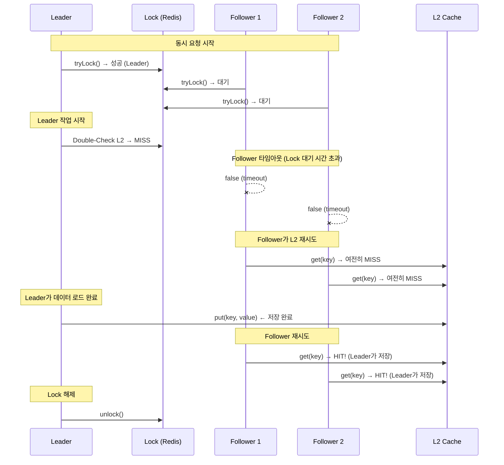

# Double-Check Pattern for Distributed Cache

## DON'T (안티패턴)

### 1. Lock 획득 후 Double-Check 생략

```java
// Bad: Lock 획득 후 바로 로드
public <T> T getWithLock(String key, Callable<T> loader) {
    if (lock.tryLock(30, TimeUnit.SECONDS)) {
        try {
            // Double-Check 없음: Follower가 이미 저장했을 수도 있음
            T value = loader.call();
            l2Cache.put(key, value);
            return value;
        } finally {
            lock.unlock();
        }
    }
    // Fallback...
}
```

**문제점:**
- Leader가 Lock 획득하는 동안, Follower가 이미 값을 저장했을 수 있음
- 불필요한 DB/API 호출 발생
- Race condition: Leader1 Lock 획득 → Leader2 Lock 대기 → Leader1 저장 → Leader2 중복 저장

### 2. Lock 내부에서만 L2 확인

```java
// Bad: Double-Check를 Lock 내부에서만 수행
public <T> T get(String key, Callable<T> loader) {
    // Lock 외부에서 체크 안 함
    if (lock.tryLock(30, TimeUnit.SECONDS)) {
        try {
            // 여기서만 L2 확인
            T cached = l2Cache.get(key);
            if (cached != null) return cached;

            T value = loader.call();
            l2Cache.put(key, value);
            return value;
        } finally {
            lock.unlock();
        }
    }
    return l2Cache.get(key);  // 늦은 확인
}
```

## DO (베스트 프랙티스)

### 1. Triple-Check Pattern (Lock 전/후 + Loader 내)

```java
// Good: Triple-Check Pattern
public <T> T getWithLock(String key, Callable<T> loader) {
    // Check 1: Lock 외부 (Fast Path)
    T cached = getCachedValue(key);
    if (cached != null) {
        recordCacheHit("L1/L2");
        return cached;
    }

    // Check 2: Lock 획득 후 Double-Check
    if (lock.tryLock(30, TimeUnit.SECONDS)) {
        try {
            // Double-Check L2: Follower가 저장했을 수 있음
            T doubleChecked = l2Cache.get(key);
            if (doubleChecked != null) {
                l1Cache.put(key, doubleChecked);  // L1 Backfill
                recordCacheHit("L2-DoubleCheck");
                return doubleChecked;
            }

            // Check 3: Loader 실행 (실제 소스에서 로드)
            T value = executor.execute(loader::call, context);

            // Write Order: L2 → L1
            l2Cache.put(key, value);
            l1Cache.put(key, value);

            recordCacheMiss("Loaded");
            return value;
        } finally {
            unlockSafely(lock);
        }
    }

    // Follower: Lock 획득 실패 시 L2 재시도 (Leader가 저장 완료되었을 수 있음)
    T followerValue = l2Cache.get(key);
    if (followerValue != null) {
        l1Cache.put(key, followerValue);
        recordCacheHit("L2-Follower");
    }
    return followerValue;
}
```

### 2. Double-Check 타이밍 다이어그램



### 3. Double-Check 메트릭

```java
// Good: Double-Check 효과 측정
private final Counter doubleCheckHitCounter = Counter.builder("cache.doublecheck.hit")
    .tag("layer", "L2")
    .description("Double-check hit count (saved redundant load)")
    .register(meterRegistry);

private final Counter redundantLoadCounter = Counter.builder("cache.redundant.load")
    .description("Redundant load (double-check missed)")
    .register(meterRegistry);

// 사용 예시
if (lock.tryLock(30, TimeUnit.SECONDS)) {
    try {
        T doubleChecked = l2Cache.get(key);
        if (doubleChecked != null) {
            doubleCheckHitCounter.increment();  // Double-Check HIT
            return doubleChecked;
        }
        T value = loader.call();
        // ...
    } finally {
        lock.unlock();
    }
}
```

## Before/After 성능

| 시나리오 | Without Double-Check | With Double-Check | 개선 |
|---------|---------------------|-------------------|------|
| **Leader 경합** | Leader1 로드 → Leader2 중복 로드 | Leader1 로드 → Leader2 Double-Check HIT | **-50% 로드** |
| **Follower 타임아웃** | Follower 전원 로드 실패 | Follower L2 재시도 후 HIT | **+0% ~ +100% 복구** |
| **100 concurrent 요청** | 1회 로드 + 99회 Double-Check MISS | 1회 로드 + 99회 Double-Check HIT | **DB 부하 -99%** |

**계산:**
- Without Double-Check: 5 Leaders가 Lock을 획득하면 5회 DB/API 호출
- With Double-Check: 첫 번째 Leader만 로드, 나머지 4명은 Double-Check HIT

## Double-Check 효과 시나리오

### 시나리오 1: Fast Follower (Leader 저장 전 타임아웃)

```
Timeline:
0ms:   Leader1 Lock 획득, Follower1-5 Lock 대기 시작
50ms:  Follower1-5 타임아웃 (Lock 대기 30초 설정이었으나 빠름)
60ms:  Follower1-5 L2 재시도 → MISS (Leader1 아직 저장 안 함)
100ms: Leader1 로드 완료, L2 저장
110ms:  Follower 재시도 → HIT (2차 재시도)
```

→ **Double-Check 미효과** (Follower가 빠르게 타임아웃한 경우)

### 시나리오 2: Slow Leader (Leader 저장 후 Follower 타임아웃)

```
Timeline:
0ms:   Leader1 Lock 획득, 로드 시작
50ms:  Follower1-5 Lock 대기 중
100ms: Leader1 로드 완료, L2 저장
150ms: Leader1 Lock 해제
200ms: Follower1-5 타임아웃 (Lock 대기 시간 초과)
210ms: Follower1-5 L2 재시도 → HIT (Leader1가 저장 완료)
```

→ **Double-Check 효과** (Follower가 Leader 저장 후 재시도)

### 시나리오 3: Leader Switch (Leader1 Lock 해제 후 Leader2 Lock 획득)

```
Timeline:
0ms:   Leader1 Lock 획득
100ms: Leader1 저장 완료, Lock 해제
110ms: Leader2 Lock 획득
120ms: Leader2 Double-Check → HIT (Leader1가 저장)
```

→ **Double-Check 최대 효과** (Leader 교체 시 중복 로드 방지)

## 모니터링 쿼리

```promql
# Double-Check HIT률 (높을수록 좋음)
rate(cache_doublecheck_hit_total[5m]) /
(rate(cache_doublecheck_hit_total[5m]) + rate(cache_miss_total[5m]))

# 목표: > 80% (Leader 교체가 빈번한 경우)

# Redundant Load 발생률 (낮을수록 좋음)
rate(cache_redundant_load_total[5m])
# 목표: < 1/sec (High traffic 시)
```

## Follower Retry Strategy

```java
// Good: Follower retry with exponential backoff
public <T> T getAsFollower(String key, int maxRetries) {
    for (int i = 0; i < maxRetries; i++) {
        T value = l2Cache.get(key);
        if (value != null) {
            recordFollowerRecovery(i);
            return value;
        }

        // Exponential backoff: 10ms, 20ms, 40ms...
        try {
            Thread.sleep(10 * (1 << i));
        } catch (InterruptedException e) {
            Thread.currentThread().interrupt();
            return null;
        }
    }

    // 최종 실패: Fallback to null or throw
    recordFollowerFailure(maxRetries);
    return null;
}
```

| Retry Strategy | 장점 | 단점 | 사용 사례 |
|---------------|------|------|-----------|
| **No Retry** | 단순함 | Leader 저장 전 모두 실패 | Lock 대기 시간이 긴 경우 |
| **Fixed Delay** | 예측 가능 | 불필요한 대기 | Leader가 빠르게 저장할 것으로 예상 |
| **Exponential Backoff** | 효율적 | 복잡함 | **권장 (기본)** |

## 검증 명령어

```bash
# Double-Check HIT률 확인
curl -s http://localhost:8080/actuator/metrics/cache.doublecheck.hit | jq '.measurements'

# Redundant Load 발생 횟수
curl -s http://localhost:8080/actuator/metrics/cache.redundant.load | jq '.measurements'

# Lock 대기 시간 분포
histogram_quantile(0.99, rate(cache_lock_wait_seconds_bucket[5m]))
```

## 출처

- [cache-sequence.md](../../../04_Sequence_Diagrams/cache-sequence.md) - Double-Check 시나리오
- ADR-003: TieredCache & SingleFlight Pattern
- SingleFlightExecutor 구현: `src/main/java/maple/expectation/global/cache/SingleFlightExecutor.java`
