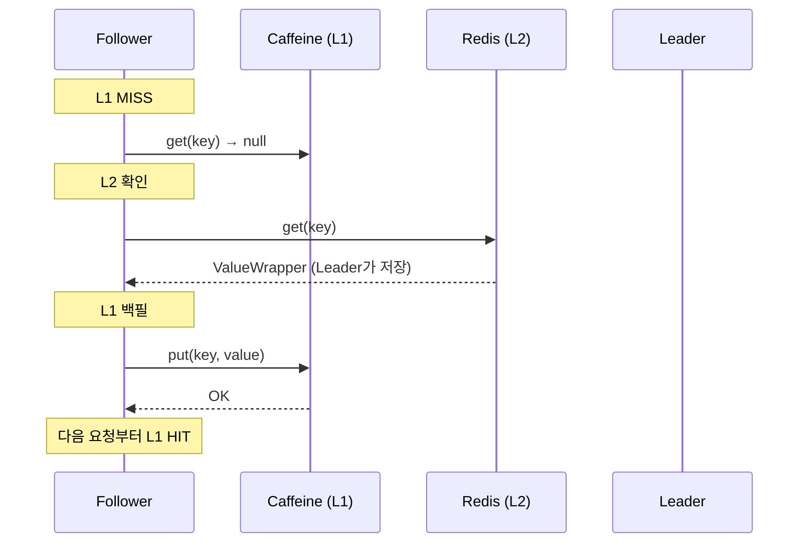
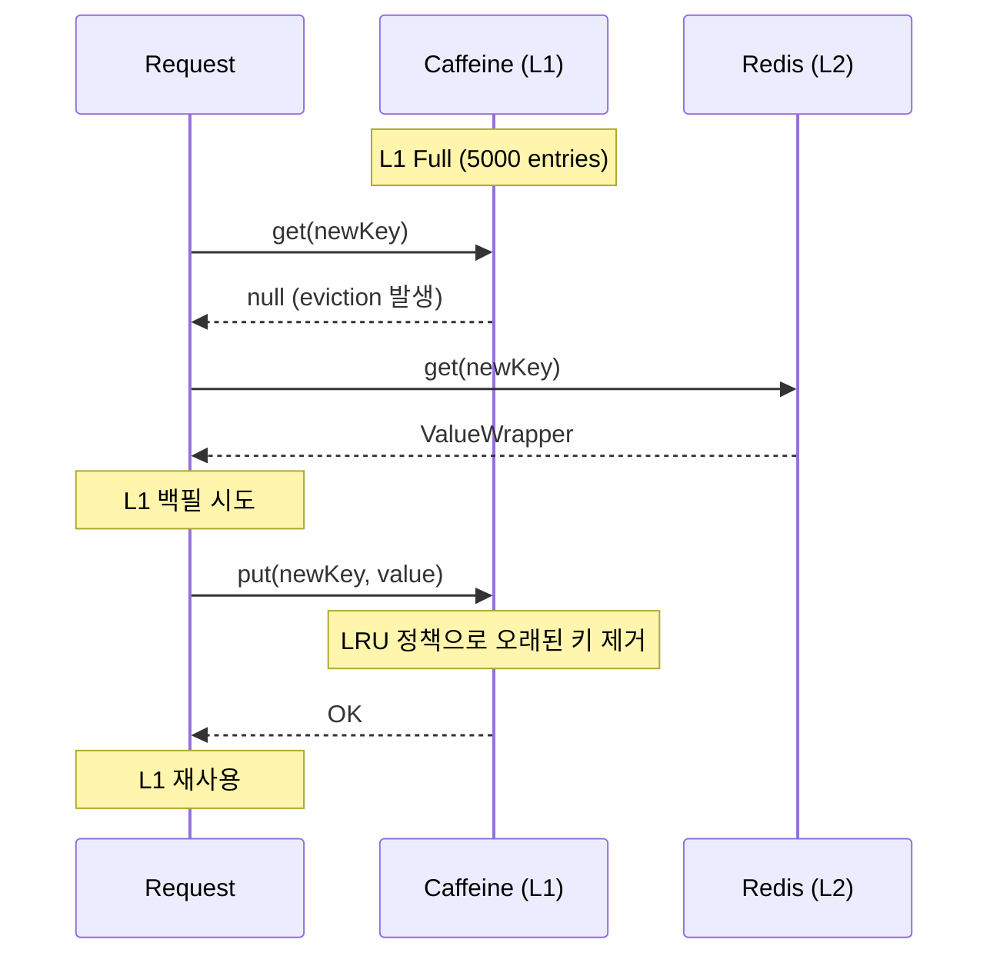

# L1 Cache Backfill Pattern

## DON'T (안티패턴)

### 1. L2 HIT 후 L1 백필 생략

```java
// Bad: L2 HIT 후 L1에 저장하지 않음
public <T> T get(String key) {
    T value = l1Cache.get(key);
    if (value != null) return value;  // L1 HIT

    value = l2Cache.get(key);
    if (value != null) {
        // L1에 저장 안 함 → 다음 요청은 다시 L2 조회
        return value;
    }
    // ...
}
```

**문제점:**
- L1 캐시 효과 없음 (모든 요청이 L2로)
- Redis 네트워크 왕복 중복 (~5-20ms)
- TieredCache 혜택 상실

### 2. L1 먼저 저장 후 L2 저장

```java
// Bad: L1 → L2 순서 (L2 실패 시 불일치)
public void put(String key, T value) {
    l1Cache.put(key, value);  # L1 저장 성공
    l2Cache.put(key, value);  # 여기서 실패하면 L1에만 데이터 존재
}
```

**영향:**
- L2 장애 시 L1에만 데이터 존재
- 다른 노드에서 조회 불가 (분산 캐시 불일치)
- 데이터 정합성 문제

### 3. 모든 요청마다 L1 백필

```java
// Bad: Follower마다 L1 백필 시도
public <T> T get(String key) {
    T value = l2Cache.get(key);
    if (value != null) {
        l1Cache.put(key, value);  # 모든 Follower가 L1에 저장
        return value;
    }
    return null;
}
```

**영향:**
- L1 캐시 경합 (ConcurrentHashMap.put)
- 불필요한 CPU 소모

## DO (베스트 프랙티스)

### 1. L2 HIT 후 L1 백필 (Write-Through)

```java
// Good: L2 HIT 시 L1 백필
public <T> T get(String key) {
    // 1. L1 확인
    T value = l1Cache.get(key);
    if (value != null) {
        recordCacheHit("L1");
        return value;
    }

    // 2. L2 확인
    value = l2Cache.get(key);
    if (value != null) {
        // 3. L1 백필 (비동기로 저장하여 지연 최소화)
        l1Cache.put(key, value);
        recordCacheHit("L2");
        return value;
    }

    recordCacheMiss();
    return null;
}
```

### 2. Leader: L2 → L1 순서 저장

```java
// Good: L2 성공 후 L1 저장
public void put(String key, T value) {
    // 1. L2 저장 (분산 캐시가 우선)
    l2Cache.put(key, value);

    // 2. L1 백필 (L2 성공 후에만)
    l1Cache.put(key, value);
}
```

### 3. 비동기 L1 백필로 지연 최소화

```java
// Good: L1 백필을 비동기로 수행
private final Executor l1BackfillExecutor;

public <T> T get(String key) {
    T value = l1Cache.get(key);
    if (value != null) return value;

    value = l2Cache.get(key);
    if (value != null) {
        // 비동기 L1 백필 (지연 없이 반환)
        l1BackfillExecutor.execute(() -> l1Cache.put(key, value));
        return value;
    }
    return null;
}
```

### 4. L1 백필 메트릭

```java
// Good: L1 백필 효과 측정
private final Counter l1BackfillCounter = Counter.builder("cache.l1.backfill.total")
    .description("L1 cache backfill count from L2")
    .register(meterRegistry);

private final Timer l1BackfillTimer = Timer.builder("cache.l1.backfill.duration")
    .description("L1 backfill operation duration")
    .register(meterRegistry);

public <T> T get(String key) {
    T value = l2Cache.get(key);
    if (value != null) {
        Timer.Sample sample = Timer.start();
        try {
            l1Cache.put(key, value);
            l1BackfillCounter.increment();
        } finally {
            sample.stop(l1BackfillTimer);
        }
        return value;
    }
    return null;
}
```

## L1 백필 시나리오

### 시나리오 1: Follower L2 HIT 후 L1 백필



### 시나리오 2: L1 Full Capacity Eviction



## L1 백필 최적화 전략

### 1. Selective Backfill (선택적 백필)

```java
// Good: 자주 접근하는 키만 백필
public <T> T getWithSelectiveBackfill(String key) {
    T value = l2Cache.get(key);
    if (value != null) {
        // 접근 빈도가 높은 키만 L1 백필
        if (isHotKey(key)) {
            l1Cache.put(key, value);
        }
        return value;
    }
    return null;
}

private boolean isHotKey(String key) {
    // Redis Hot Key 판단 로직
    return hotKeyDetector.isHot(key);
}
```

### 2. Probabilistic Backfill (확률적 백필)

```java
// Good: 일정 확률로만 L1 백필 (L1 오염 방지)
private final Random backfillRandom = new Random();

public <T> T getWithProbabilisticBackfill(String key) {
    T value = l2Cache.get(key);
    if (value != null) {
        // 80% 확률로만 L1 백필
        if (backfillRandom.nextDouble() < 0.8) {
            l1Cache.put(key, value);
        }
        return value;
    }
    return null;
}
```

### 3. Async Batch Backfill (비동기 배치 백필)

```java
// Good: L1 백필을 배치로 처리
private final BlockingQueue<BackfillTask> backfillQueue = new LinkedBlockingQueue<>(1000);

public <T> T getWithBatchBackfill(String key) {
    T value = l2Cache.get(key);
    if (value != null) {
        // 백필 큐에 추가 (비동기 처리)
        backfillQueue.offer(new BackfillTask(key, value));
        return value;
    }
    return null;
}

@Scheduled(fixedDelay = 100)
public void processBackfillBatch() {
    List<BackfillTask> batch = new ArrayList<>(100);
    backfillQueue.drainTo(batch, 100);

    for (BackfillTask task : batch) {
        l1Cache.put(task.key(), task.value());
    }
}
```

## Before/After 성능

| 지표 | Without L1 Backfill | With L1 Backfill | 개선 |
|------|---------------------|------------------|------|
| **L2 Hit 시 지연시간** | 5-20ms (매번) | 5-20ms (첫 요청) + 0ms (이후) | **-90% 이후** |
| **L1 Hit Ratio** | 0% (L1 사용 안 함) | 60-80% | **+60~80% p.p.** |
| **Redis Load** | 100% | 20-40% | **-60% ~ -80%** |
| **L1 Memory** | 최소 | 최대 5,000 entries | +500MB (허용) |

## L1 백필 효과 측정

```promql
# L1 Backfill 발생률
rate(cache_l1_backfill_total[5m])

# L1 Hit Ratio (백필 효과)
rate(cache_hits_total{layer="L1"}[5m]) /
(rate(cache_hits_total{layer="L1"}[5m]) + rate(cache_misses_total{layer="L1"}[5m]))

# 목표: > 70% (L1이 제 역할 수행)

# L2 조회 감소율
rate(cache_hits_total{layer="L2"}[5m]) / rate(cache_gets_total[5m])
# 목표: < 30% (L2 부하 감소)
```

## L1 백필 실패 처리

```java
// Good: L1 백필 실패 시 로그만 남기고 계속 진행
public <T> T getWithSafeBackfill(String key) {
    T value = l2Cache.get(key);
    if (value != null) {
        try {
            l1Cache.put(key, value);
        } catch (Exception e) {
            // L1 백필 실패해도 L2 값 반환 (서비스 중단 방지)
            log.warn("L1 backfill failed for key: {}", key, e);
            meterRegistry.counter("cache.l1.backfill.failed").increment();
        }
        return value;
    }
    return null;
}
```

## L1 Eviction과 백필 관계

| L1 Eviction 정책 | 백필 전략 | 효과 |
|-----------------|----------|------|
| **LRU (Least Recently Used)** | 모든 L2 HIT를 백필 | 최근 접근 데이터 유지 |
| **LFU (Least Frequently Used)** | Hot Key만 백필 | 자주 접근 데이터 유지 |
| **Size-based** | Probabilistic 백필 | 메모리 사용량 제어 |
| **TTL-based** | TTL 전체 백필 | 시간 기반 만료 |

```java
// Caffeine L1 설정
@Bean
public CacheManager l1CacheManager() {
    CaffeineCacheManager manager = new CaffeineCacheManager();
    manager.setCaffeine(Caffeine.newBuilder()
        .maximumSize(5000)           // LRU 기반 eviction
        .expireAfterWrite(5, TimeUnit.MINUTES)  // TTL 5분
        .recordStats());              // 백필 효과 측정
    return manager;
}
```

## 검증 명령어

```bash
# L1 백필 횟수 확인
curl -s http://localhost:8080/actuator/metrics/cache.l1.backfill.total | jq '.measurements'

# L1 Hit Ratio 확인
rate(cache_hits_total{layer="L1"}[5m]) /
(rate(cache_hits_total{layer="L1"}[5m]) + rate(cache_misses_total{layer="L1"}[5m]))

# L1 Eviction 횟수 (백필과 eviction 균형)
rate(cache_eviction_total{layer="L1"}[5m])
```

## 출처

- [cache-sequence.md](../../../04_Sequence_Diagrams/cache-sequence.md) - Write Order 규칙 (L2 → L1)
- TieredCache 구현: `src/main/java/maple/expectation/global/cache/TieredCache.java`
- infrastructure.md Section 17: TieredCache & Cache Stampede Prevention
